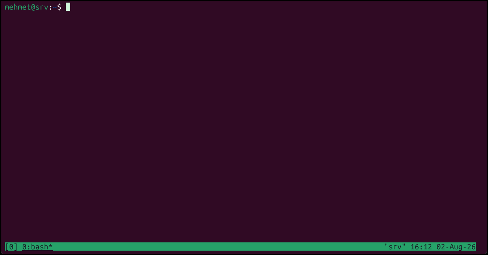

# [مشاهده کتاب در GitBook](https://mehmetlotfi.gitbook.io/aamwzsh-ty-maks-bh-zban-farsy)

### **[بخش 03: سرفصل‌های کتاب](03-سرفصل‌های_کتاب.md)**

### شما لازم دارید به...

برای استفاده از tmux، به کامپیوتری نیاز دارید که مک اواس ایکس یا یکی از نسخه‌های یونیکس یا لینوکس روی آن نصب باشد. متأسفانه، tmux روی ویندوز به صورت مستقیم اجرا نمی‌شود، اما می‌توانید ماشین مجازی لینوکس، WSL مایکروسافت یا یک سرور اجاره‌ای لینوکس استفاده کنید، پروژه‌هایی مثل ```psmux``` هم شبیه‌ساز tmux برای اجرای مستقیم روی سیستم‌عامل ویندوز هستند، می‌توانید از آن‌ها هم استفاده کنید.


## نصب tmux به روش‌های مختلف
شما می‌توانید به روش‌های زیادی tmux را روی سیستم خود نصب کنید، دو راه مرسوم داریم:

### 1 - استفاده از پکیج‌منیجر سیستم‌عامل‌تان
معمولا اکثر سیستم‌عامل‌های مرسوم در مخازن (```Repository```)های خود برنامه tmux را دارند‌، می‌توانید با یک خط دستور آن را نصب کنید:

(توجه کنید که این‌کار (نصب برنامه) به دسترسی ```superuser``` ریشه (```root```) دارد.)

الف) مثلا اگر لینوکس‌تان از توزیع‌‌های مبتنی بر دبیان است دستور زیر را وارد کنید:

```bash
$ apt-get install tmux
````

ب) در توزیع‌های redhat مثل فدورا، رد‌هت و ...:
```bash
$ dnf install tmux
````

پ) در سیستم‌های مبتنی بر ARCH:

```bash
$ pacman -S tmux
````
ت) در MacOS:
```bash
$ brew install tmux
````
و ...

### 2 - کامپایل از سورس و نصب:

در این روش سورس tmux را دانلود می‌کنیم، از روی کد منبع طبق دستورالعمل کامپایل (Makefile)، آنرا کامپایل می‌کنیم و فایل کامپایل شده را به یکی از ```PATH```های سیستم‌مان اضافه می‌کنیم.
برای اینکار مراحل زیر را پیش بروید.

برای دانلود سورس tmux به ریپوی tmux موجود در گیتهاب پروژه به آدرس ```https://github.com/tmux/tmux``` می‌رویم و دستور زیر را برای clone (کپی فایل‌های ریپو به کامپیوتر ما) وارد می‌کنیم:

یا کد را از طریق مروگرتان دانلود و به سیستم‌تان انتقال دهید یا با استفاده از برنامه ```git``` آن را clone کنید.

```bash
$ ls -ltrh
total 0
$ git clone https://github.com/tmux/tmux.git
Cloning into 'tmux'...
remote: Enumerating objects: 57568, done.
remote: Counting objects: 100% (450/450), done.
remote: Compressing objects: 100% (216/216), done.
remote: Total 57568 (delta 344), reused 252 (delta 234), pack-reused 57118 (from 3)
Receiving objects: 100% (57568/57568), 21.78 MiB | 62.00 KiB/s, done.
Resolving deltas: 100% (43965/43965), done.
$ ls -ltrh
total 4.0K
drwxr-xr-x 10 mehmet mehmet 4.0K Aug  2 00:12 tmux
````

وارد پوشه شوید: 

```bash
$ cd tmux
````

طبق گفته‌های tmux این برنامه به کامپایل پیشنیاز‌های زیر را نیاز دارد:

```
tmux depends on libevent 2.x, It also depends on ncurses.
To build tmux, a C compiler (for example gcc or clang), make, pkg-config and a suitable yacc (yacc or bison) are needed.
```

پس قبل از شروع فرایند کامپایل، پیشنیاز‌های آنرا نصب می‌کنیم: داریم:
```bash
$ apt-get install libevent-2.1 libncurses* build-essential autoconf libtool make pkg-config bison
```
### توجه:
 ```
 پیشنیاز‌هایی که tmux گفته را من می‌دانم در سیستمی مبتنی بر دبیان در پکیج‌های فوق وجود دارد، اگر سیستم‌تان فرق می‌کند بگردید ببینید پیشنیاز‌هایی که tmux گفته را با چه پکیج‌هایی می‌توان نصب کرد.
 ```

با دستور زیر چک می‌کنیم که آیا تمامی پیشنیاز‌ها نصب شده‌اند یا خیر:

```bash
$ sh autogen.sh
configure.ac:45: installing 'etc/compile'
configure.ac:10: installing 'etc/config.guess'
configure.ac:10: installing 'etc/config.sub'
configure.ac:8: installing 'etc/install-sh'
configure.ac:8: installing 'etc/missing'
Makefile.am: installing 'etc/depcomp'
configure.ac: installing 'etc/ylwrap'
```

بعد از نصب پیشنیازها و چک کردن آنها دستورالعمل کامپایل (Makefile) را با دستور زیر بسازید:

```bash
$ ./configure
checking for a BSD-compatible install... /usr/bin/install -c
checking whether sleep supports fractional seconds... yes
checking filesystem timestamp resolution... 0.01
checking whether build environment is sane... yes
checking for a race-free mkdir -p... /usr/bin/mkdir -p
checking for gawk... gawk
checking whether make sets $(MAKE)... yes
checking whether make supports nested variables... yes
checking xargs -n works... yes
checking whether UID '1000' is supported by ustar format... yes
checking whether GID '1000' is supported by ustar format... yes
checking how to create a ustar tar archive... gnutar
checking build system type... x86_64-pc-linux-gnu
checking host system type... x86_64-pc-linux-gnu
checking for gcc... gcc
checking whether the C compiler works... yes
checking for C compiler default output file name... a.out
checking for suffix of executables...
checking whether we are cross compiling... no
checking for suffix of object files... o
checking whether the compiler supports GNU C... yes
checking whether gcc accepts -g... yes
checking for gcc option to enable C11 features... none needed
checking whether gcc understands -c and -o together... yes
checking whether make supports the include directive... yes (GNU style)
checking dependency style of gcc... gcc3
checking for gcc... (cached) gcc
checking whether the compiler supports GNU C... (cached) yes
checking whether gcc accepts -g... (cached) yes
checking for gcc option to enable C11 features... (cached) none needed
checking whether gcc understands -c and -o together... (cached) yes
checking dependency style of gcc... (cached) gcc3
checking how to run the C preprocessor... gcc -E
checking for grep that handles long lines and -e... /usr/bin/grep
checking for egrep... /usr/bin/grep -E
checking for bison... bison -y
checking for pkg-config... /usr/bin/pkg-config
checking pkg-config is at least version 0.9.0... yes
checking for stdio.h... yes
checking for stdlib.h... yes
checking for string.h... yes
checking for inttypes.h... yes
checking for stdint.h... yes
checking for strings.h... yes
checking for sys/stat.h... yes
checking for sys/types.h... yes
checking for unistd.h... yes
checking for wchar.h... yes
checking for minix/config.h... no
checking whether it is safe to define __EXTENSIONS__... yes
checking whether _XOPEN_SOURCE should be defined... no
checking for egrep -e... (cached) /usr/bin/grep -E
checking for bitstring.h... no
checking for dirent.h... yes
checking for fcntl.h... yes
checking for inttypes.h... (cached) yes
checking for libproc.h... no
checking for libutil.h... no
checking for ndir.h... no
checking for paths.h... yes
checking for pty.h... yes
checking for stdint.h... (cached) yes
checking for sys/dir.h... yes
checking for sys/ndir.h... no
checking for sys/tree.h... no
checking for ucred.h... no
checking for util.h... no
checking for library containing sys_signame... no
checking for fmod in -lm... yes
checking for library containing flock... none required
checking for dirfd... yes
checking for flock... yes
checking for prctl... yes
checking for proc_pidinfo... no
checking for getpeerucred... no
checking for sysconf... yes
checking for asprintf... yes
checking for cfmakeraw... yes
checking for clock_gettime... yes
checking for closefrom... yes
checking for explicit_bzero... yes
checking for freezero... no
checking for getdtablecount... no
checking for getdtablesize... yes
checking for getpeereid... no
checking for getline... yes
checking for getprogname... no
checking for htonll... no
checking for memmem... yes
checking for ntohll... no
checking for setenv... yes
checking for setproctitle... no
checking for strcasestr... yes
checking for strlcat... yes
checking for strlcpy... yes
checking for strndup... yes
checking for strsep... yes
checking for working strnlen... yes
checking for working strtonum... no
checking for working reallocarray... yes
checking for working recallocarray... no
checking for library containing clock_gettime... none required
checking for libevent_core >= 2... yes
checking for event2/event.h... yes
checking for bison... yes
checking for tinfow... no
checking for tinfo... yes
checking for tiparm... yes
checking for tiparm_s... yes
checking for b64_ntop... no
checking for b64_ntop with -lresolv... yes
checking for library containing inet_ntoa... none required
checking for library containing socket... none required
checking for socket in -lxnet... no
checking if free doesn't work very well... yes
checking for CMSG_DATA... yes
checking for err... yes
checking for errx... yes
checking for warn... yes
checking for warnx... yes
checking for err.h... yes
checking for library containing imsg_add... no
checking for daemon... yes
checking for gcc options needed to detect all undeclared functions... none needed
checking whether daemon is declared... yes
checking for stravis... no
checking for library containing fdforkpty... no
checking for library containing forkpty... none required
checking for library containing kinfo_getfile... no
checking whether TAILQ_CONCAT is declared... yes
checking whether TAILQ_PREV is declared... yes
checking whether TAILQ_REPLACE is declared... no
checking for __progname... yes
checking for program_invocation_short_name... yes
checking whether PR_SET_NAME is declared... yes
checking whether SO_PEERCRED is declared... yes
checking whether F_CLOSEM is declared... no
checking for /proc/$$... yes
checking TERM... tmux-256color
checking platform... linux
checking for vlock... no
checking lock-command... lock -np
configure:
configure: ASAN: off
configure: SIXEL: off
configure: debug: on
configure: jemalloc: off
configure: libevent: 2.1.12-stable
configure: ncurses: 6.6.20251231
configure: systemd: off
configure: utempter: off
configure: utf8proc: off
configure:
checking that generated files are newer than configure... done
configure: creating ./config.status
config.status: creating Makefile
config.status: executing depfiles commands
```

با دستور زیر برنامه را کامپایل می‌کنیم

```bash
$ make
depbase=`echo alerts.o | sed 's|[^/]*$|.deps/&|;s|\.o$||'`;\
gcc -DPACKAGE_NAME=\"tmux\" -DPACKAGE_TARNAME=\"tmux\" -DPACKAGE_VERSION=\"next-3.8\" -DPACKAGE_STRING=\"tmux\ next-3.8\" -DPACKAGE_BUGREPORT=\"\" -DPACKAGE_URL=\"\" -DPACKAGE=\"tmux\" -DVERSION=\"next-3.8\" -DHAVE_STDIO_H=1 -DHAVE_STDLIB_H=1 -DHAVE_STRING_H=1 -DHAVE_INTTYPES_H=1 -DHAVE_STDINT_H=1 -DHAVE_STRINGS_H=1 -DHAVE_SYS_STAT_H=1 -DHAVE_SYS_TYPES_H=1 -DHAVE_UNISTD_H=1 -DHAVE_WCHAR_H=1 -DSTDC_HEADERS=1 -D_ALL_SOURCE=1 -D_DARWIN_C_SOURCE=1 -D_GNU_SOURCE=1 -D_HPUX_ALT_XOPEN_SOCKET_API=1 -D_NETBSD_SOURCE=1 -D_OPENBSD_SOURCE=1 -D_POSIX_PTHREAD_SEMANTICS=1 -D__STDC_WANT_IEC_60559_ATTRIBS_EXT__=1 -D__STDC_WANT_IEC_60559_BFP_EXT__=1 -D__STDC_WANT_IEC_60559_DFP_EXT__=1 -D__STDC_WANT_IEC_60559_EXT__=1 -D__STDC_WANT_IEC_60559_FUNCS_EXT__=1 -D__STDC_WANT_IEC_60559_TYPES_EXT__=1 -D__STDC_WANT_LIB_EXT2__=1 -D__STDC_WANT_MATH_SPEC_FUNCS__=1 -D_TANDEM_SOURCE=1 -D__EXTENSIONS__=1 -DHAVE_DIRENT_H=1 -DHAVE_FCNTL_H=1 -DHAVE_INTTYPES_H=1 -DHAVE_PATHS_H=1 -DHAVE_PTY_H=1 -DHAVE_STDINT_H=1 -DHAVE_SYS_DIR_H=1 -DHAVE_LIBM=1 -DHAVE_DIRFD=1 -DHAVE_FLOCK=1 -DHAVE_PRCTL=1 -DHAVE_SYSCONF=1 -DHAVE_ASPRINTF=1 -DHAVE_CFMAKERAW=1 -DHAVE_CLOCK_GETTIME=1 -DHAVE_CLOSEFROM=1 -DHAVE_EXPLICIT_BZERO=1 -DHAVE_GETDTABLESIZE=1 -DHAVE_GETLINE=1 -DHAVE_MEMMEM=1 -DHAVE_SETENV=1 -DHAVE_STRCASESTR=1 -DHAVE_STRLCAT=1 -DHAVE_STRLCPY=1 -DHAVE_STRNDUP=1 -DHAVE_STRSEP=1 -DHAVE_EVENT2_EVENT_H=1 -DHAVE_NCURSES_H=1 -DHAVE_TIPARM=1 -DHAVE_TIPARM_S=1 -DHAVE_B64_NTOP=1 -DHAVE_MALLOC_TRIM=1 -DHAVE_DAEMON=1 -DHAVE_FORKPTY=1 -DHAVE___PROGNAME=1 -DHAVE_PROGRAM_INVOCATION_SHORT_NAME=1 -DHAVE_PR_SET_NAME=1 -DHAVE_SO_PEERCRED=1 -DHAVE_PROC_PID=1 -I.  -D_DEFAULT_SOURCE -D_XOPEN_SOURCE=600 -DTMUX_VERSION='"next-3.8"' -DTMUX_CONF='"/etc/tmux.conf:~/.tmux.conf:$XDG_CONFIG_HOME/tmux/tmux.conf:~/.config/tmux/tmux.conf"' -DTMUX_LOCK_CMD='"lock -np"' -DTMUX_TERM='"tmux-256color"' -DTMUX_MOUSE=1 -DDEBUG -iquote.         -std=gnu99 -O2  -g3 -ggdb -Wno-long-long -Wall -W -Wformat=2 -Wno-use-after-free -Wmissing-prototypes -Wstrict-prototypes -Wmissing-declarations -Wwrite-strings -Wshadow -Wpointer-arith -Wsign-compare -Wundef -Wbad-function-cast -Winline -Wno-cast-align -Wdeclaration-after-statement -Wno-pointer-sign -Wno-attributes -Wno-unused-result -Wno-format-y2k -Wno-unknown-warning-option -Wno-maybe-uninitialized     -MT alerts.o -MD -MP -MF $depbase.Tpo -c -o alerts.o alerts.c &&\
mv -f $depbase.Tpo $depbase.Po
depbase=`echo arguments.o | sed 's|[^/]*$|.deps/&|;s|\.o$||'`;\
gcc -DPACKAGE_NAME=\"tmux\" -DPACKAGE_TARNAME=\"tmux\" -DPACKAGE_VERSION=\"next-3.8\" -DPACKAGE_STRING=\"tmux\ next-3.8\" -DPACKAGE_BUGREPORT=\"\" -DPACKAGE_URL=\"\" -DPACKAGE=\"tmux\" -DVERSION=\"next-3.8\" -DHAVE_STDIO_H=1 -DHAVE_STDLIB_H=1 -DHAVE_STRING_H=1 -DHAVE_INTTYPES_H=1 -DHAVE_STDINT_H=1 -DHAVE_STRINGS_H=1 -DHAVE_SYS_STAT_H=1 -DHAVE_SYS_TYPES_H=1 -DHAVE_UNISTD_H=1 -DHAVE_WCHAR_H=1 -DSTDC_HEADERS=1 -D_ALL_SOURCE=1 -D_DARWIN_C_SOURCE=1 -D_GNU_SOURCE=1 -D_HPUX_ALT_XOPEN_SOCKET_API=1 -D_NETBSD_SOURCE=1 -D_OPENBSD_SOURCE=1 -D_POSIX_PTHREAD_SEMANTICS=1 -D__STDC_WANT_IEC_60559_ATTRIBS_EXT__=1 -D__STDC_WANT_IEC_60559_BFP_EXT__=1 -D__STDC_WANT_IEC_60559_DFP_EXT__=1 -D__STDC_WANT_IEC_60559_EXT__=1 -D__STDC_WANT_IEC_60559_FUNCS_EXT__=1 -D__STDC_WANT_IEC_60559_TYPES_EXT__=1 -D__STDC_WANT_LIB_EXT2__=1 -D__STDC_WANT_MATH_SPEC_FUNCS__=1 -D_TANDEM_SOURCE=1 -D__EXTENSIONS__=1 -DHAVE_DIRENT_H=1 -DHAVE_FCNTL_H=1 -DHAVE_INTTYPES_H=1 -DHAVE_PATHS_H=1 -DHAVE_PTY_H=1 -DHAVE_STDINT_H=1 -DHAVE_SYS_DIR_H=1 -DHAVE_LIBM=1 -DHAVE_DIRFD=1 -DHAVE_FLOCK=1 -DHAVE_PRCTL=1 -DHAVE_SYSCONF=1 -DHAVE_ASPRINTF=1 -DHAVE_CFMAKERAW=1 -DHAVE_CLOCK_GETTIME=1 -DHAVE_CLOSEFROM=1 -DHAVE_EXPLICIT_BZERO=1 -DHAVE_GETDTABLESIZE=1 -DHAVE_GETLINE=1 -DHAVE_MEMMEM=1 -DHAVE_SETENV=1 -DHAVE_STRCASESTR=1 -DHAVE_STRLCAT=1 -DHAVE_STRLCPY=1 -DHAVE_STRNDUP=1 -DHAVE_STRSEP=1 -DHAVE_EVENT2_EVENT_H=1 -DHAVE_NCURSES_H=1 -DHAVE_TIPARM=1 -DHAVE_TIPARM_S=1 -DHAVE_B64_NTOP=1 -DHAVE_MALLOC_TRIM=1 -DHAVE_DAEMON=1 -DHAVE_FORKPTY=1 -DHAVE___PROGNAME=1 -DHAVE_PROGRAM_INVOCATION_SHORT_NAME=1 -DHAVE_PR_SET_NAME=1 -DHAVE_SO_PEERCRED=1 -DHAVE_PROC_PID=1 -I.  -D_DEFAULT_SOURCE -D_XOPEN_SOURCE=600 -DTMUX_VERSION='"next-3.8"' -DTMUX_CONF='"/etc/tmux.conf:~/.tmux.conf:$XDG_CONFIG_HOME/tmux/tmux.conf:~/.config/tmux/tmux.conf"' -DTMUX_LOCK_CMD='"lock -np"' -DTMUX_TERM='"tmux-256color"' -DTMUX_MOUSE=1 -DDEBUG -iquote.         -std=gnu99 -O2  -g3 -ggdb -Wno-long-long -Wall -W -Wformat=2 -Wno-use-after-free -Wmissing-prototypes -Wstrict-prototypes -Wmissing-declarations -Wwrite-strings -Wshadow -Wpointer-arith -Wsign-compare -Wundef -Wbad-function-cast -Winline -Wno-cast-align -Wdeclaration-after-statement -Wno-pointer-sign -Wno-attributes -Wno-unused-result -Wno-format-y2k -Wno-unknown-warning-option -Wno-maybe-uninitialized     -MT arguments.o -MD -MP -MF $depbase.Tpo -c -o arguments.o arguments.c &&\
mv -f $depbase.Tpo $depbase.Po
depbase=`echo attributes.o | sed 's|[^/]*$|.deps/&|;s|\.o$||'`;\
gcc -DPACKAGE_NAME=\"tmux\" -DPACKAGE_TARNAME=\"tmux\" -DPACKAGE_VERSION=\"next-3.8\" -DPACKAGE_STRING=\"tmux\ next-3.8\" -DPACKAGE_BUGREPORT=\"\" -DPACKAGE_URL=\"\" -DPACKAGE=\"tmux\" -DVERSION=\"next-3.8\" -DHAVE_STDIO_H=1 -DHAVE_STDLIB_H=1 -DHAVE_STRING_H=1 -DHAVE_INTTYPES_H=1 -DHAVE_STDINT_H=1 -DHAVE_STRINGS_H=1 -DHAVE_SYS_STAT_H=1 -DHAVE_SYS_TYPES_H=1 -DHAVE_UNISTD_H=1 -DHAVE_WCHAR_H=1 -DSTDC_HEADERS=1 -D_ALL_SOURCE=1 -D_DARWIN_C_SOURCE=1 -D_GNU_SOURCE=1 -D_HPUX_ALT_XOPEN_SOCKET_API=1 -D_NETBSD_SOURCE=1 -D_OPENBSD_SOURCE=1 -D_POSIX_PTHREAD_SEMANTICS=1 -D__STDC_WANT_IEC_60559_ATTRIBS_EXT__=1 -D__STDC_WANT_IEC_60559_BFP_EXT__=1 -D__STDC_WANT_IEC_60559_DFP_EXT__=1 -D__STDC_WANT_IEC_60559_EXT__=1 -D__STDC_WANT_IEC_60559_FUNCS_EXT__=1 -D__STDC_WANT_IEC_60559_TYPES_EXT__=1 -D__STDC_WANT_LIB_EXT2__=1 -D__STDC_WANT_MATH_SPEC_FUNCS__=1 -D_TANDEM_SOURCE=1 -D__EXTENSIONS__=1 -DHAVE_DIRENT_H=1 -DHAVE_FCNTL_H=1 -DHAVE_INTTYPES_H=1 -DHAVE_PATHS_H=1 -DHAVE_PTY_H=1 -DHAVE_STDINT_H=1 -DHAVE_SYS_DIR_H=1 -DHAVE_LIBM=1 -DHAVE_DIRFD=1 -DHAVE_FLOCK=1 -DHAVE_PRCTL=1 -DHAVE_SYSCONF=1 -DHAVE_ASPRINTF=1 -DHAVE_CFMAKERAW=1 -DHAVE_CLOCK_GETTIME=1 -DHAVE_CLOSEFROM=1 -DHAVE_EXPLICIT_BZERO=1 -DHAVE_GETDTABLESIZE=1 -DHAVE_GETLINE=1 -DHAVE_MEMMEM=1 -DHAVE_SETENV=1 -DHAVE_STRCASESTR=1 -DHAVE_STRLCAT=1 -DHAVE_STRLCPY=1 -DHAVE_STRNDUP=1 -DHAVE_STRSEP=1 -DHAVE_EVENT2_EVENT_H=1 -DHAVE_NCURSES_H=1 -DHAVE_TIPARM=1 -DHAVE_TIPARM_S=1 -DHAVE_B64_NTOP=1 -DHAVE_MALLOC_TRIM=1 -DHAVE_DAEMON=1 -DHAVE_FORKPTY=1 -DHAVE___PROGNAME=1 -DHAVE_PROGRAM_INVOCATION_SHORT_NAME=1 -DHAVE_PR_SET_NAME=1 -DHAVE_SO_PEERCRED=1 -DHAVE_PROC_PID=1 -I.  -D_DEFAULT_SOURCE -D_XOPEN_SOURCE=600 -DTMUX_VERSION='"next-3.8"' -DTMUX_CONF='"/etc/tmux.conf:~/.tmux.conf:$XDG_CONFIG_HOME/tmux/tmux.conf:~/.config/tmux/tmux.conf"' -DTMUX_LOCK_CMD='"lock -np"' -DTMUX_TERM='"tmux-256color"' -DTMUX_MOUSE=1 -DDEBUG -iquote.         -std=gnu99 -O2  -g3 -ggdb -Wno-long-long -Wall -W -Wformat=2 -Wno-use-after-free -Wmissing-prototypes -Wstrict-prototypes -Wmissing-declarations -Wwrite-strings -Wshadow -Wpointer-arith -Wsign-compare -Wundef -Wbad-function-cast -Winline -Wno-cast-align -Wdeclaration-after-statement -Wno-pointer-sign -Wno-attributes -Wno-unused-result -Wno-format-y2k -Wno-unknown-warning-option -Wno-maybe-uninitialized     -MT attributes.o -MD -MP -MF $depbase.Tpo -c -o attributes.o attributes.c &&\
mv -f $depbase.Tpo $depbase.Po
depbase=`echo cfg.o | sed 's|[^/]*$|.deps/&|;s|\.o$||'`;\
gcc -DPACKAGE_NAME=\"tmux\" -DPACKAGE_TARNAME=\"tmux\" -DPACKAGE_VERSION=\"next-3.8\" -DPACKAGE_STRING=\"tmux\ next-3.8\" -DPACKAGE_BUGREPORT=\"\" -DPACKAGE_URL=\"\" -DPACKAGE=\"tmux\" -DVERSION=\"next-3.8\" -DHAVE_STDIO_H=1 -DHAVE_STDLIB_H=1 -DHAVE_STRING_H=1 -DHAVE_INTTYPES_H=1 -DHAVE_STDINT_H=1 -DHAVE_STRINGS_H=1 -DHAVE_SYS_STAT_H=1 -DHAVE_SYS_TYPES_H=1 -DHAVE_UNISTD_H=1 -DHAVE_WCHAR_H=1 -DSTDC_HEADERS=1 -D_ALL_SOURCE=1 -D_DARWIN_C_SOURCE=1 -D_GNU_SOURCE=1 -D_HPUX_ALT_XOPEN_SOCKET_API=1 -D_NETBSD_SOURCE=1 -D_OPENBSD_SOURCE=1 -D_POSIX_PTHREAD_SEMANTICS=1 -D__STDC_WANT_IEC_60559_ATTRIBS_EXT__=1 -D__STDC_WANT_IEC_60559_BFP_EXT__=1 -D__STDC_WANT_IEC_60559_DFP_EXT__=1 -D__STDC_WANT_IEC_60559_EXT__=1 -D__STDC_WANT_IEC_60559_FUNCS_EXT__=1 -D__STDC_WANT_IEC_60559_TYPES_EXT__=1 -D__STDC_WANT_LIB_EXT2__=1 -D__STDC_WANT_MATH_SPEC_FUNCS__=1 -D_TANDEM_SOURCE=1 -D__EXTENSIONS__=1 -DHAVE_DIRENT_H=1 -DHAVE_FCNTL_H=1 -DHAVE_INTTYPES_H=1 -DHAVE_PATHS_H=1 -DHAVE_PTY_H=1 -DHAVE_STDINT_H=1 -DHAVE_SYS_DIR_H=1 -DHAVE_LIBM=1 -DHAVE_DIRFD=1 -DHAVE_FLOCK=1 -DHAVE_PRCTL=1 -DHAVE_SYSCONF=1 -DHAVE_ASPRINTF=1 -DHAVE_CFMAKERAW=1 -DHAVE_CLOCK_GETTIME=1 -DHAVE_CLOSEFROM=1 -DHAVE_EXPLICIT_BZERO=1 -DHAVE_GETDTABLESIZE=1 -DHAVE_GETLINE=1 -DHAVE_MEMMEM=1 -DHAVE_SETENV=1 -DHAVE_STRCASESTR=1 -DHAVE_STRLCAT=1 -DHAVE_STRLCPY=1 -DHAVE_STRNDUP=1 -DHAVE_STRSEP=1 -DHAVE_EVENT2_EVENT_H=1 -DHAVE_NCURSES_H=1 -DHAVE_TIPARM=1 -DHAVE_TIPARM_S=1 -DHAVE_B64_NTOP=1 -DHAVE_MALLOC_TRIM=1 -DHAVE_DAEMON=1 -DHAVE_FORKPTY=1 -DHAVE___PROGNAME=1 -DHAVE_PROGRAM_INVOCATION_SHORT_NAME=1 -DHAVE_PR_SET_NAME=1 -DHAVE_SO_PEERCRED=1 -DHAVE_PROC_PID=1 -I.  -D_DEFAULT_SOURCE -D_XOPEN_SOURCE=600 -DTMUX_VERSION='"next-3.8"' -DTMUX_CONF='"/etc/tmux.conf:~/.tmux.conf:$XDG_CONFIG_HOME/tmux/tmux.conf:~/.config/tmux/tmux.conf"' -DTMUX_LOCK_CMD='"lock -np"' -DTMUX_TERM='"tmux-256color"' -DTMUX_MOUSE=1 -DDEBUG -iquote.         -std=gnu99 -O2  -g3 -ggdb -Wno-long-long -Wall -W -Wformat=2 -Wno-use-after-free -Wmissing-prototypes -Wstrict-prototypes -Wmissing-declarations -Wwrite-strings -Wshadow -Wpointer-arith -Wsign-compare -Wundef -Wbad-function-cast -Winline -Wno-cast-align -Wdeclaration-after-statement -Wno-pointer-sign -Wno-attributes -Wno-unused-result -Wno-format-y2k -Wno-unknown-warning-option -Wno-maybe-uninitialized     -MT cfg.o -MD -MP -MF $depbase.Tpo -c -o cfg.o cfg.c &&\
mv -f $depbase.Tpo $depbase.Po
depbase=`echo client.o | sed 's|[^/]*$|.deps/&|;s|\.o$||'`;\
gcc -DPACKAGE_NAME=\"tmux\" -DPACKAGE_TARNAME=\"tmux\" -DPACKAGE_VERSION=\"next-3.8\" -DPACKAGE_STRING=\"tmux\ next-3.8\" -DPACKAGE_BUGREPORT=\"\" -DPACKAGE_URL=\"\" -DPACKAGE=\"tmux\" -DVERSION=\"next-3.8\" -DHAVE_STDIO_H=1 -DHAVE_STDLIB_H=1 -DHAVE_STRING_H=1 -DHAVE_INTTYPES_H=1 -DHAVE_STDINT_H=1 -DHAVE_STRINGS_H=1 -DHAVE_SYS_STAT_H=1 -DHAVE_SYS_TYPES_H=1 -DHAVE_UNISTD_H=1 -DHAVE_WCHAR_H=1 -DSTDC_HEADERS=1 -D_ALL_SOURCE=1 -D_DARWIN_C_SOURCE=1 -D_GNU_SOURCE=1 -D_HPUX_ALT_XOPEN_SOCKET_API=1 -D_NETBSD_SOURCE=1 -D_OPENBSD_SOURCE=1 -D_POSIX_PTHREAD_SEMANTICS=1 -D__STDC_WANT_IEC_60559_ATTRIBS_EXT__=1 -D__STDC_WANT_IEC_60559_BFP_EXT__=1 -D__STDC_WANT_IEC_60559_DFP_EXT__=1 -D__STDC_WANT_IEC_60559_EXT__=1 -D__STDC_WANT_IEC_60559_FUNCS_EXT__=1 -D__STDC_WANT_IEC_60559_TYPES_EXT__=1 -D__STDC_WANT_LIB_EXT2__=1 -D__STDC_WANT_MATH_SPEC_FUNCS__=1 -D_TANDEM_SOURCE=1 -D__EXTENSIONS__=1 -DHAVE_DIRENT_H=1 -DHAVE_FCNTL_H=1 -DHAVE_INTTYPES_H=1 -DHAVE_PATHS_H=1 -DHAVE_PTY_H=1 -DHAVE_STDINT_H=1 -DHAVE_SYS_DIR_H=1 -DHAVE_LIBM=1 -DHAVE_DIRFD=1 -DHAVE_FLOCK=1 -DHAVE_PRCTL=1 -DHAVE_SYSCONF=1 -DHAVE_ASPRINTF=1 -DHAVE_CFMAKERAW=1 -DHAVE_CLOCK_GETTIME=1 -DHAVE_CLOSEFROM=1 -DHAVE_EXPLICIT_BZERO=1 -DHAVE_GETDTABLESIZE=1 -DHAVE_GETLINE=1 -DHAVE_MEMMEM=1 -DHAVE_SETENV=1 -DHAVE_STRCASESTR=1 -DHAVE_STRLCAT=1 -DHAVE_STRLCPY=1 -DHAVE_STRNDUP=1 -DHAVE_STRSEP=1 -DHAVE_EVENT2_EVENT_H=1 -DHAVE_NCURSES_H=1 -DHAVE_TIPARM=1 -DHAVE_TIPARM_S=1 -DHAVE_B64_NTOP=1 -DHAVE_MALLOC_TRIM=1 -DHAVE_DAEMON=1 -DHAVE_FORKPTY=1 -DHAVE___PROGNAME=1 -DHAVE_PROGRAM_INVOCATION_SHORT_NAME=1 -DHAVE_PR_SET_NAME=1 -DHAVE_SO_PEERCRED=1 -DHAVE_PROC_PID=1 -I.  -D_DEFAULT_SOURCE -D_XOPEN_SOURCE=600 -DTMUX_VERSION='"next-3.8"' -DTMUX_CONF='"/etc/tmux.conf:~/.tmux.conf:$XDG_CONFIG_HOME/tmux/tmux.conf:~/.config/tmux/tmux.conf"' -DTMUX_LOCK_CMD='"lock -np"' -DTMUX_TERM='"tmux-256color"' -DTMUX_MOUSE=1 -DDEBUG -iquote.         -std=gnu99 -O2  -g3 -ggdb -Wno-long-long -Wall -W -Wformat=2 -Wno-use-after-free -Wmissing-prototypes -Wstrict-prototypes -Wmissing-declarations -Wwrite-strings -Wshadow -Wpointer-arith -Wsign-compare -Wundef -Wbad-function-cast -Winline -Wno-cast-align -Wdeclaration-after-statement -Wno-pointer-sign -Wno-attributes -Wno-unused-result -Wno-format-y2k -Wno-unknown-warning-option -Wno-maybe-uninitialized     -MT client.o -MD -MP -MF $depbase.Tpo -c -o client.o client.c &&\
mv -f $depbase.Tpo $depbase.Po
depbase=`echo cmd-attach-session.o | sed 's|[^/]*$|.deps/&|;s|\.o$||'`;\
gcc -DPACKAGE_NAME=\"tmux\" -DPACKAGE_TARNAME=\"tmux\" -DPACKAGE_VERSION=\"next-3.8\" -DPACKAGE_STRING=\"tmux\ next-3.8\" -DPACKAGE_BUGREPORT=\"\" -DPACKAGE_URL=\"\" -DPACKAGE=\"tmux\" -DVERSION=\"next-3.8\" -DHAVE_STDIO_H=1 -DHAVE_STDLIB_H=1 -DHAVE_STRING_H=1 -DHAVE_INTTYPES_H=1 -DHAVE_STDINT_H=1 -DHAVE_STRINGS_H=1 -DHAVE_SYS_STAT_H=1 -DHAVE_SYS_TYPES_H=1 -DHAVE_UNISTD_H=1 -DHAVE_WCHAR_H=1 -DSTDC_HEADERS=1 -D_ALL_SOURCE=1 -D_DARWIN_C_SOURCE=1 -D_GNU_SOURCE=1 -D_HPUX_ALT_XOPEN_SOCKET_API=1 -D_NETBSD_SOURCE=1 -D_OPENBSD_SOURCE=1 -D_POSIX_PTHREAD_SEMANTICS=1 -D__STDC_WANT_IEC_60559_ATTRIBS_EXT__=1 -D__STDC_WANT_IEC_60559_BFP_EXT__=1 -D__STDC_WANT_IEC_60559_DFP_EXT__=1 -D__STDC_WANT_IEC_60559_EXT__=1 -D__STDC_WANT_IEC_60559_FUNCS_EXT__=1 -D__STDC_WANT_IEC_60559_TYPES_EXT__=1 -D__STDC_WANT_LIB_EXT2__=1 -D__STDC_WANT_MATH_SPEC_FUNCS__=1 -D_TANDEM_SOURCE=1 -D__EXTENSIONS__=1 -DHAVE_DIRENT_H=1 -DHAVE_FCNTL_H=1 -DHAVE_INTTYPES_H=1 -DHAVE_PATHS_H=1 -DHAVE_PTY_H=1 -DHAVE_STDINT_H=1 -DHAVE_SYS_DIR_H=1 -DHAVE_LIBM=1 -DHAVE_DIRFD=1 -DHAVE_FLOCK=1 -DHAVE_PRCTL=1 -DHAVE_SYSCONF=1 -DHAVE_ASPRINTF=1 -DHAVE_CFMAKERAW=1 -DHAVE_CLOCK_GETTIME=1 -DHAVE_CLOSEFROM=1 -DHAVE_EXPLICIT_BZERO=1 -DHAVE_GETDTABLESIZE=1 -DHAVE_GETLINE=1 -DHAVE_MEMMEM=1 -DHAVE_SETENV=1 -DHAVE_STRCASESTR=1 -DHAVE_STRLCAT=1 -DHAVE_STRLCPY=1 -DHAVE_STRNDUP=1 -DHAVE_STRSEP=1 -DHAVE_EVENT2_EVENT_H=1 -DHAVE_NCURSES_H=1 -DHAVE_TIPARM=1 -DHAVE_TIPARM_S=1 -DHAVE_B64_NTOP=1 -DHAVE_MALLOC_TRIM=1 -DHAVE_DAEMON=1 -DHAVE_FORKPTY=1 -DHAVE___PROGNAME=1 -DHAVE_PROGRAM_INVOCATION_SHORT_NAME=1 -DHAVE_PR_SET_NAME=1 -DHAVE_SO_PEERCRED=1 -DHAVE_PROC_PID=1 -I.  -D_DEFAULT_SOURCE -D_XOPEN_SOURCE=600 -DTMUX_VERSION='"next-3.8"' -DTMUX_CONF='"/etc/tmux.conf:~/.tmux.conf:$XDG_CONFIG_HOME/tmux/tmux.conf:~/.config/tmux/tmux.conf"' -DTMUX_LOCK_CMD='"lock -np"' -DTMUX_TERM='"tmux-256color"' -DTMUX_MOUSE=1 -DDEBUG -iquote.         -std=gnu99 -O2  -g3 -ggdb -Wno-long-long -Wall -W -Wformat=2 -Wno-use-after-free -Wmissing-prototypes -Wstrict-prototypes -Wmissing-declarations -Wwrite-strings -Wshadow -Wpointer-arith -Wsign-compare -Wundef -Wbad-function-cast -Winline -Wno-cast-align -Wdeclaration-after-statement -Wno-pointer-sign -Wno-attributes -Wno-unused-result -Wno-format-y2k -Wno-unknown-warning-option -Wno-maybe-uninitialized     -MT cmd-attach-session.o -MD -MP -MF $depbase.Tpo -c -o cmd-attach-session.o cmd-attach-session.c &&\
mv -f $depbase.Tpo $depbase.Po
depbase=`echo cmd-bind-key.o | sed 's|[^/]*$|.deps/&|;s|\.o$||'`;\
gcc -DPACKAGE_NAME=\"tmux\" -DPACKAGE_TARNAME=\"tmux\" -DPACKAGE_VERSION=\"next-3.8\" -DPACKAGE_STRING=\"tmux\ next-3.8\" -DPACKAGE_BUGREPORT=\"\" -DPACKAGE_URL=\"\" -DPACKAGE=\"tmux\" -DVERSION=\"next-3.8\" -DHAVE_STDIO_H=1 -DHAVE_STDLIB_H=1 -DHAVE_STRING_H=1 -DHAVE_INTTYPES_H=1 -DHAVE_STDINT_H=1 -DHAVE_STRINGS_H=1 -DHAVE_SYS_STAT_H=1 -DHAVE_SYS_TYPES_H=1 -DHAVE_UNISTD_H=1 -DHAVE_WCHAR_H=1 -DSTDC_HEADERS=1 -D_ALL_SOURCE=1 -D_DARWIN_C_SOURCE=1 -D_GNU_SOURCE=1 -D_HPUX_ALT_XOPEN_SOCKET_API=1 -D_NETBSD_SOURCE=1 -D_OPENBSD_SOURCE=1 -D_POSIX_PTHREAD_SEMANTICS=1 -D__STDC_WANT_IEC_60559_ATTRIBS_EXT__=1 -D__STDC_WANT_IEC_60559_BFP_EXT__=1 -D__STDC_WANT_IEC_60559_DFP_EXT__=1 -D__STDC_WANT_IEC_60559_EXT__=1 -D__STDC_WANT_IEC_60559_FUNCS_EXT__=1 -D__STDC_WANT_IEC_60559_TYPES_EXT__=1 -D__STDC_WANT_LIB_EXT2__=1 -D__STDC_WANT_MATH_SPEC_FUNCS__=1 -D_TANDEM_SOURCE=1 -D__EXTENSIONS__=1 -DHAVE_DIRENT_H=1 -DHAVE_FCNTL_H=1 -DHAVE_INTTYPES_H=1 -DHAVE_PATHS_H=1 -DHAVE_PTY_H=1 -DHAVE_STDINT_H=1 -DHAVE_SYS_DIR_H=1 -DHAVE_LIBM=1 -DHAVE_DIRFD=1 -DHAVE_FLOCK=1 -DHAVE_PRCTL=1 -DHAVE_SYSCONF=1 -DHAVE_ASPRINTF=1 -DHAVE_CFMAKERAW=1 -DHAVE_CLOCK_GETTIME=1 -DHAVE_CLOSEFROM=1 -DHAVE_EXPLICIT_BZERO=1 -DHAVE_GETDTABLESIZE=1 -DHAVE_GETLINE=1 -DHAVE_MEMMEM=1 -DHAVE_SETENV=1 -DHAVE_STRCASESTR=1 -DHAVE_STRLCAT=1 -DHAVE_STRLCPY=1 -DHAVE_STRNDUP=1 -DHAVE_STRSEP=1 -DHAVE_EVENT2_EVENT_H=1 -DHAVE_NCURSES_H=1 -DHAVE_TIPARM=1 -DHAVE_TIPARM_S=1 -DHAVE_B64_NTOP=1 -DHAVE_MALLOC_TRIM=1 -DHAVE_DAEMON=1 -DHAVE_FORKPTY=1 -DHAVE___PROGNAME=1 -DHAVE_PROGRAM_INVOCATION_SHORT_NAME=1 -DHAVE_PR_SET_NAME=1 -DHAVE_SO_PEERCRED=1 -DHAVE_PROC_PID=1 -I.  -D_DEFAULT_SOURCE -D_XOPEN_SOURCE=600 -DTMUX_VERSION='"next-3.8"' -DTMUX_CONF='"/etc/tmux.conf:~/.tmux.conf:$XDG_CONFIG_HOME/tmux/tmux.conf:~/.config/tmux/tmux.conf"' -DTMUX_LOCK_CMD='"lock -np"' -DTMUX_TERM='"tmux-256color"' -DTMUX_MOUSE=1 -DDEBUG -iquote.         -std=gnu99 -O2  -g3 -ggdb -Wno-long-long -Wall -W -Wformat=2 -Wno-use-after-free -Wmissing-prototypes -Wstrict-prototypes -Wmissing-declarations -Wwrite-strings -Wshadow -Wpointer-arith -Wsign-compare -Wundef -Wbad-function-cast -Winline -Wno-cast-align -Wdeclaration-after-statement -Wno-pointer-sign -Wno-attributes -Wno-unused-result -Wno-format-y2k -Wno-unknown-warning-option -Wno-maybe-uninitialized     -MT cmd-bind-key.o -MD -MP -MF $depbase.Tpo -c -o cmd-bind-key.o cmd-bind-key.c &&\
mv -f $depbase.Tpo $depbase.Po
depbase=`echo cmd-break-pane.o | sed 's|[^/]*$|.deps/&|;s|\.o$||'`;\
gcc -DPACKAGE_NAME=\"tmux\" -DPACKAGE_TARNAME=\"tmux\" -DPACKAGE_VERSION=\"next-3.8\" -DPACKAGE_STRING=\"tmux\ next-3.8\" -DPACKAGE_BUGREPORT=\"\" -DPACKAGE_URL=\"\" -DPACKAGE=\"tmux\" -DVERSION=\"next-3.8\" -DHAVE_STDIO_H=1 -DHAVE_STDLIB_H=1 -DHAVE_STRING_H=1 -DHAVE_INTTYPES_H=1 -DHAVE_STDINT_H=1 -DHAVE_STRINGS_H=1 -DHAVE_SYS_STAT_H=1 -DHAVE_SYS_TYPES_H=1 -DHAVE_UNISTD_H=1 -DHAVE_WCHAR_H=1 -DSTDC_HEADERS=1 -D_ALL_SOURCE=1 -D_DARWIN_C_SOURCE=1 -D_GNU_SOURCE=1 -D_HPUX_ALT_XOPEN_SOCKET_API=1 -D_NETBSD_SOURCE=1 -D_OPENBSD_SOURCE=1 -D_POSIX_PTHREAD_SEMANTICS=1 -D__STDC_WANT_IEC_60559_ATTRIBS_EXT__=1 -D__STDC_WANT_IEC_60559_BFP_EXT__=1 -D__STDC_WANT_IEC_60559_DFP_EXT__=1 -D__STDC_WANT_IEC_60559_EXT__=1 -D__STDC_WANT_IEC_60559_FUNCS_EXT__=1 -D__STDC_WANT_IEC_60559_TYPES_EXT__=1 -D__STDC_WANT_LIB_EXT2__=1 -D__STDC_WANT_MATH_SPEC_FUNCS__=1 -D_TANDEM_SOURCE=1 -D__EXTENSIONS__=1 -DHAVE_DIRENT_H=1 -DHAVE_FCNTL_H=1 -DHAVE_INTTYPES_H=1 -DHAVE_PATHS_H=1 -DHAVE_PTY_H=1 -DHAVE_STDINT_H=1 -DHAVE_SYS_DIR_H=1 -DHAVE_LIBM=1 -DHAVE_DIRFD=1 -DHAVE_FLOCK=1 -DHAVE_PRCTL=1 -DHAVE_SYSCONF=1 -DHAVE_ASPRINTF=1 -DHAVE_CFMAKERAW=1 -DHAVE_CLOCK_GETTIME=1 -DHAVE_CLOSEFROM=1 -DHAVE_EXPLICIT_BZERO=1 -DHAVE_GETDTABLESIZE=1 -DHAVE_GETLINE=1 -DHAVE_MEMMEM=1 -DHAVE_SETENV=1 -DHAVE_STRCASESTR=1 -DHAVE_STRLCAT=1 -DHAVE_STRLCPY=1 -DHAVE_STRNDUP=1 -DHAVE_STRSEP=1 -DHAVE_EVENT2_EVENT_H=1 -DHAVE_NCURSES_H=1 -DHAVE_TIPARM=1 -DHAVE_TIPARM_S=1 -DHAVE_B64_NTOP=1 -DHAVE_MALLOC_TRIM=1 -DHAVE_DAEMON=1 -DHAVE_FORKPTY=1 -DHAVE___PROGNAME=1 -DHAVE_PROGRAM_INVOCATION_SHORT_NAME=1 -DHAVE_PR_SET_NAME=1 -DHAVE_SO_PEERCRED=1 -DHAVE_PROC_PID=1 -I.  -D_DEFAULT_SOURCE -D_XOPEN_SOURCE=600 -DTMUX_VERSION='"next-3.8"' -DTMUX_CONF='"/etc/tmux.conf:~/.tmux.conf:$XDG_CONFIG_HOME/tmux/tmux.conf:~/.config/tmux/tmux.conf"' -DTMUX_LOCK_CMD='"lock -np"' -DTMUX_TERM='"tmux-256color"' -DTMUX_MOUSE=1 -DDEBUG -iquote.         -std=gnu99 -O2  -g3 -ggdb -Wno-long-long -Wall -W -Wformat=2 -Wno-use-after-free -Wmissing-prototypes -Wstrict-prototypes -Wmissing-declarations -Wwrite-strings -Wshadow -Wpointer-arith -Wsign-compare -Wundef -Wbad-function-cast -Winline -Wno-cast-align -Wdeclaration-after-statement -Wno-pointer-sign -Wno-attributes -Wno-unused-result -Wno-format-y2k -Wno-unknown-warning-option -Wno-maybe-uninitialized     -MT cmd-break-pane.o -MD -MP -MF $depbase.Tpo -c -o cmd-break-pane.o cmd-break-pane.c &&\
mv -f $depbase.Tpo $depbase.Po
depbase=`echo cmd-capture-pane.o | sed 's|[^/]*$|.deps/&|;s|\.o$||'`;\
gcc -DPACKAGE_NAME=\"tmux\" -DPACKAGE_TARNAME=\"tmux\" -DPACKAGE_VERSION=\"next-3.8\" -DPACKAGE_STRING=\"tmux\ next-3.8\" -DPACKAGE_BUGREPORT=\"\" -DPACKAGE_URL=\"\" -DPACKAGE=\"tmux\" -DVERSION=\"next-3.8\" -DHAVE_STDIO_H=1 -DHAVE_STDLIB_H=1 -DHAVE_STRING_H=1 -DHAVE_INTTYPES_H=1 -DHAVE_STDINT_H=1 -DHAVE_STRINGS_H=1 -DHAVE_SYS_STAT_H=1 -DHAVE_SYS_TYPES_H=1 -DHAVE_UNISTD_H=1 -DHAVE_WCHAR_H=1 -DSTDC_HEADERS=1 -D_ALL_SOURCE=1 -D_DARWIN_C_SOURCE=1 -D_GNU_SOURCE=1 -D_HPUX_ALT_XOPEN_SOCKET_API=1 -D_NETBSD_SOURCE=1 -D_OPENBSD_SOURCE=1 -D_POSIX_PTHREAD_SEMANTICS=1 -D__STDC_WANT_IEC_60559_ATTRIBS_EXT__=1 -D__STDC_WANT_IEC_60559_BFP_EXT__=1 -D__STDC_WANT_IEC_60559_DFP_EXT__=1 -D__STDC_WANT_IEC_60559_EXT__=1 -D__STDC_WANT_IEC_60559_FUNCS_EXT__=1 -D__STDC_WANT_IEC_60559_TYPES_EXT__=1 -D__STDC_WANT_LIB_EXT2__=1 -D__STDC_WANT_MATH_SPEC_FUNCS__=1 -D_TANDEM_SOURCE=1 -D__EXTENSIONS__=1 -DHAVE_DIRENT_H=1 -DHAVE_FCNTL_H=1 -DHAVE_INTTYPES_H=1 -DHAVE_PATHS_H=1 -DHAVE_PTY_H=1 -DHAVE_STDINT_H=1 -DHAVE_SYS_DIR_H=1 -DHAVE_LIBM=1 -DHAVE_DIRFD=1 -DHAVE_FLOCK=1 -DHAVE_PRCTL=1 -DHAVE_SYSCONF=1 -DHAVE_ASPRINTF=1 -DHAVE_CFMAKERAW=1 -DHAVE_CLOCK_GETTIME=1 -DHAVE_CLOSEFROM=1 -DHAVE_EXPLICIT_BZERO=1 -DHAVE_GETDTABLESIZE=1 -DHAVE_GETLINE=1 -DHAVE_MEMMEM=1 -DHAVE_SETENV=1 -DHAVE_STRCASESTR=1 -DHAVE_STRLCAT=1 -DHAVE_STRLCPY=1 -DHAVE_STRNDUP=1 -DHAVE_STRSEP=1 -DHAVE_EVENT2_EVENT_H=1 -DHAVE_NCURSES_H=1 -DHAVE_TIPARM=1 -DHAVE_TIPARM_S=1 -DHAVE_B64_NTOP=1 -DHAVE_MALLOC_TRIM=1 -DHAVE_DAEMON=1 -DHAVE_FORKPTY=1 -DHAVE___PROGNAME=1 -DHAVE_PROGRAM_INVOCATION_SHORT_NAME=1 -DHAVE_PR_SET_NAME=1 -DHAVE_SO_PEERCRED=1 -DHAVE_PROC_PID=1 -I.  -D_DEFAULT_SOURCE -D_XOPEN_SOURCE=600 -DTMUX_VERSION='"next-3.8"' -DTMUX_CONF='"/etc/tmux.conf:~/.tmux.conf:$XDG_CONFIG_HOME/tmux/tmux.conf:~/.config/tmux/tmux.conf"' -DTMUX_LOCK_CMD='"lock -np"' -DTMUX_TERM='"tmux-256color"' -DTMUX_MOUSE=1 -DDEBUG -iquote.         -std=gnu99 -O2  -g3 -ggdb -Wno-long-long -Wall -W -Wformat=2 -Wno-use-after-free -Wmissing-prototypes -Wstrict-prototypes -Wmissing-declarations -Wwrite-strings -Wshadow -Wpointer-arith -Wsign-compare -Wundef -Wbad-function-cast -Winline -Wno-cast-align -Wdeclaration-after-statement -Wno-pointer-sign -Wno-attributes -Wno-unused-result -Wno-format-y2k -Wno-unknown-warning-option -Wno-maybe-uninitialized     -MT cmd-capture-pane.o -MD -MP -MF $depbase.Tpo -c -o cmd-capture-pane.o cmd-capture-pane.c &&\
mv -f $depbase.Tpo $depbase.Po
depbase=`echo cmd-choose-tree.o | sed 's|[^/]*$|.deps/&|;s|\.o$||'`;\
gcc -DPACKAGE_NAME=\"tmux\" -DPACKAGE_TARNAME=\"tmux\" -DPACKAGE_VERSION=\"next-3.8\" -DPACKAGE_STRING=\"tmux\ next-3.8\" -DPACKAGE_BUGREPORT=\"\" -DPACKAGE_URL=\"\" -DPACKAGE=\"tmux\" -DVERSION=\"next-3.8\" -DHAVE_STDIO_H=1 -DHAVE_STDLIB_H=1 -DHAVE_STRING_H=1 -DHAVE_INTTYPES_H=1 -DHAVE_STDINT_H=1 -DHAVE_STRINGS_H=1 -DHAVE_SYS_STAT_H=1 -DHAVE_SYS_TYPES_H=1 -DHAVE_UNISTD_H=1 -DHAVE_WCHAR_H=1 -DSTDC_HEADERS=1 -D_ALL_SOURCE=1 -D_DARWIN_C_SOURCE=1 -D_GNU_SOURCE=1 -D_HPUX_ALT_XOPEN_SOCKET_API=1 -D_NETBSD_SOURCE=1 -D_OPENBSD_SOURCE=1 -D_POSIX_PTHREAD_SEMANTICS=1 -D__STDC_WANT_IEC_60559_ATTRIBS_EXT__=1 -D__STDC_WANT_IEC_60559_BFP_EXT__=1 -D__STDC_WANT_IEC_60559_DFP_EXT__=1 -D__STDC_WANT_IEC_60559_EXT__=1 -D__STDC_WANT_IEC_60559_FUNCS_EXT__=1 -D__STDC_WANT_IEC_60559_TYPES_EXT__=1 -D__STDC_WANT_LIB_EXT2__=1 -D__STDC_WANT_MATH_SPEC_FUNCS__=1 -D_TANDEM_SOURCE=1 -D__EXTENSIONS__=1 -DHAVE_DIRENT_H=1 -DHAVE_FCNTL_H=1 -DHAVE_INTTYPES_H=1 -DHAVE_PATHS_H=1 -DHAVE_PTY_H=1 -DHAVE_STDINT_H=1 -DHAVE_SYS_DIR_H=1 -DHAVE_LIBM=1 -DHAVE_DIRFD=1 -DHAVE_FLOCK=1 -DHAVE_PRCTL=1 -DHAVE_SYSCONF=1 -DHAVE_ASPRINTF=1 -DHAVE_CFMAKERAW=1 -DHAVE_CLOCK_GETTIME=1 -DHAVE_CLOSEFROM=1 -DHAVE_EXPLICIT_BZERO=1 -DHAVE_GETDTABLESIZE=1 -DHAVE_GETLINE=1 -DHAVE_MEMMEM=1 -DHAVE_SETENV=1 -DHAVE_STRCASESTR=1 -DHAVE_STRLCAT=1 -DHAVE_STRLCPY=1 -DHAVE_STRNDUP=1 -DHAVE_STRSEP=1 -DHAVE_EVENT2_EVENT_H=1 -DHAVE_NCURSES_H=1 -DHAVE_TIPARM=1 -DHAVE_TIPARM_S=1 -DHAVE_B64_NTOP=1 -DHAVE_MALLOC_TRIM=1 -DHAVE_DAEMON=1 -DHAVE_FORKPTY=1 -DHAVE___PROGNAME=1 -DHAVE_PROGRAM_INVOCATION_SHORT_NAME=1 -DHAVE_PR_SET_NAME=1 -DHAVE_SO_PEERCRED=1 -DHAVE_PROC_PID=1 -I.  -D_DEFAULT_SOURCE -D_XOPEN_SOURCE=600 -DTMUX_VERSION='"next-3.8"' -DTMUX_CONF='"/etc/tmux.conf:~/.tmux.conf:$XDG_CONFIG_HOME/tmux/tmux.conf:~/.config/tmux/tmux.conf"' -DTMUX_LOCK_CMD='"lock -np"' -DTMUX_TERM='"tmux-256color"' -DTMUX_MOUSE=1 -DDEBUG -iquote.         -std=gnu99 -O2  -g3 -ggdb -Wno-long-long -Wall -W -Wformat=2 -Wno-use-after-free -Wmissing-prototypes -Wstrict-prototypes -Wmissing-declarations -Wwrite-strings -Wshadow -Wpointer-arith -Wsign-compare -Wundef -Wbad-function-cast -Winline -Wno-cast-align -Wdeclaration-after-statement -Wno-pointer-sign -Wno-attributes -Wno-unused-result -Wno-format-y2k -Wno-unknown-warning-option -Wno-maybe-uninitialized     -MT cmd-choose-tree.o -MD -MP -MF $depbase.Tpo -c -o cmd-choose-tree.o cmd-choose-tree.c &&\
mv -f $depbase.Tpo $depbase.Po
depbase=`echo cmd-command-prompt.o | sed 's|[^/]*$|.deps/&|;s|\.o$||'`;\
gcc -DPACKAGE_NAME=\"tmux\" -DPACKAGE_TARNAME=\"tmux\" -DPACKAGE_VERSION=\"next-3.8\" -DPACKAGE_STRING=\"tmux\ next-3.8\" -DPACKAGE_BUGREPORT=\"\" -DPACKAGE_URL=\"\" -DPACKAGE=\"tmux\" -DVERSION=\"next-3.8\" -DHAVE_STDIO_H=1 -DHAVE_STDLIB_H=1 -DHAVE_STRING_H=1 -DHAVE_INTTYPES_H=1 -DHAVE_STDINT_H=1 -DHAVE_STRINGS_H=1 -DHAVE_SYS_STAT_H=1 -DHAVE_SYS_TYPES_H=1 -DHAVE_UNISTD_H=1 -DHAVE_WCHAR_H=1 -DSTDC_HEADERS=1 -D_ALL_SOURCE=1 -D_DARWIN_C_SOURCE=1 -D_GNU_SOURCE=1 -D_HPUX_ALT_XOPEN_SOCKET_API=1 -D_NETBSD_SOURCE=1 -D_OPENBSD_SOURCE=1 -D_POSIX_PTHREAD_SEMANTICS=1 -D__STDC_WANT_IEC_60559_ATTRIBS_EXT__=1 -D__STDC_WANT_IEC_60559_BFP_EXT__=1 -D__STDC_WANT_IEC_60559_DFP_EXT__=1 -D__STDC_WANT_IEC_60559_EXT__=1 -D__STDC_WANT_IEC_60559_FUNCS_EXT__=1 -D__STDC_WANT_IEC_60559_TYPES_EXT__=1 -D__STDC_WANT_LIB_EXT2__=1 -D__STDC_WANT_MATH_SPEC_FUNCS__=1 -D_TANDEM_SOURCE=1 -D__EXTENSIONS__=1 -DHAVE_DIRENT_H=1 -DHAVE_FCNTL_H=1 -DHAVE_INTTYPES_H=1 -DHAVE_PATHS_H=1 -DHAVE_PTY_H=1 -DHAVE_STDINT_H=1 -DHAVE_SYS_DIR_H=1 -DHAVE_LIBM=1 -DHAVE_DIRFD=1 -DHAVE_FLOCK=1 -DHAVE_PRCTL=1 -DHAVE_SYSCONF=1 -DHAVE_ASPRINTF=1 -DHAVE_CFMAKERAW=1 -DHAVE_CLOCK_GETTIME=1 -DHAVE_CLOSEFROM=1 -DHAVE_EXPLICIT_BZERO=1 -DHAVE_GETDTABLESIZE=1 -DHAVE_GETLINE=1 -DHAVE_MEMMEM=1 -DHAVE_SETENV=1 -DHAVE_STRCASESTR=1 -DHAVE_STRLCAT=1 -DHAVE_STRLCPY=1 -DHAVE_STRNDUP=1 -DHAVE_STRSEP=1 -DHAVE_EVENT2_EVENT_H=1 -DHAVE_NCURSES_H=1 -DHAVE_TIPARM=1 -DHAVE_TIPARM_S=1 -DHAVE_B64_NTOP=1 -DHAVE_MALLOC_TRIM=1 -DHAVE_DAEMON=1 -DHAVE_FORKPTY=1 -DHAVE___PROGNAME=1 -DHAVE_PROGRAM_INVOCATION_SHORT_NAME=1 -DHAVE_PR_SET_NAME=1 -DHAVE_SO_PEERCRED=1 -DHAVE_PROC_PID=1 -I.  -D_DEFAULT_SOURCE -D_XOPEN_SOURCE=600 -DTMUX_VERSION='"next-3.8"' -DTMUX_CONF='"/etc/tmux.conf:~/.tmux.conf:$XDG_CONFIG_HOME/tmux/tmux.conf:~/.config/tmux/tmux.conf"' -DTMUX_LOCK_CMD='"lock -np"' -DTMUX_TERM='"tmux-256color"' -DTMUX_MOUSE=1 -DDEBUG -iquote.         -std=gnu99 -O2  -g3 -ggdb -Wno-long-long -Wall -W -Wformat=2 -Wno-use-after-free -Wmissing-prototypes -Wstrict-prototypes -Wmissing-declarations -Wwrite-strings -Wshadow -Wpointer-arith -Wsign-compare -Wundef -Wbad-function-cast -Winline -Wno-cast-align -Wdeclaration-after-statement -Wno-pointer-sign -Wno-attributes -Wno-unused-result -Wno-format-y2k -Wno-unknown-warning-option -Wno-maybe-uninitialized     -MT cmd-command-prompt.o -MD -MP -MF $depbase.Tpo -c -o cmd-command-prompt.o cmd-command-prompt.c &&\
mv -f $depbase.Tpo $depbase.Po
depbase=`echo cmd-confirm-before.o | sed 's|[^/]*$|.deps/&|;s|\.o$||'`;\
gcc -DPACKAGE_NAME=\"tmux\" -DPACKAGE_TARNAME=\"tmux\" -DPACKAGE_VERSION=\"next-3.8\" -DPACKAGE_STRING=\"tmux\ next-3.8\" -DPACKAGE_BUGREPORT=\"\" -DPACKAGE_URL=\"\" -DPACKAGE=\"tmux\" -DVERSION=\"next-3.8\" -DHAVE_STDIO_H=1 -DHAVE_STDLIB_H=1 -DHAVE_STRING_H=1 -DHAVE_INTTYPES_H=1 -DHAVE_STDINT_H=1 -DHAVE_STRINGS_H=1 -DHAVE_SYS_STAT_H=1 -DHAVE_SYS_TYPES_H=1 -DHAVE_UNISTD_H=1 -DHAVE_WCHAR_H=1 -DSTDC_HEADERS=1 -D_ALL_SOURCE=1 -D_DARWIN_C_SOURCE=1 -D_GNU_SOURCE=1 -D_HPUX_ALT_XOPEN_SOCKET_API=1 -D_NETBSD_SOURCE=1 -D_OPENBSD_SOURCE=1 -D_POSIX_PTHREAD_SEMANTICS=1 -D__STDC_WANT_IEC_60559_ATTRIBS_EXT__=1 -D__STDC_WANT_IEC_60559_BFP_EXT__=1 -D__STDC_WANT_IEC_60559_DFP_EXT__=1 -D__STDC_WANT_IEC_60559_EXT__=1 -D__STDC_WANT_IEC_60559_FUNCS_EXT__=1 -D__STDC_WANT_IEC_60559_TYPES_EXT__=1 -D__STDC_WANT_LIB_EXT2__=1 -D__STDC_WANT_MATH_SPEC_FUNCS__=1 -D_TANDEM_SOURCE=1 -D__EXTENSIONS__=1 -DHAVE_DIRENT_H=1 -DHAVE_FCNTL_H=1 -DHAVE_INTTYPES_H=1 -DHAVE_PATHS_H=1 -DHAVE_PTY_H=1 -DHAVE_STDINT_H=1 -DHAVE_SYS_DIR_H=1 -DHAVE_LIBM=1 -DHAVE_DIRFD=1 -DHAVE_FLOCK=1 -DHAVE_PRCTL=1 -DHAVE_SYSCONF=1 -DHAVE_ASPRINTF=1 -DHAVE_CFMAKERAW=1 -DHAVE_CLOCK_GETTIME=1 -DHAVE_CLOSEFROM=1 -DHAVE_EXPLICIT_BZERO=1 -DHAVE_GETDTABLESIZE=1 -DHAVE_GETLINE=1 -DHAVE_MEMMEM=1 -DHAVE_SETENV=1 -DHAVE_STRCASESTR=1 -DHAVE_STRLCAT=1 -DHAVE_STRLCPY=1 -DHAVE_STRNDUP=1 -DHAVE_STRSEP=1 -DHAVE_EVENT2_EVENT_H=1 -DHAVE_NCURSES_H=1 -DHAVE_TIPARM=1 -DHAVE_TIPARM_S=1 -DHAVE_B64_NTOP=1 -DHAVE_MALLOC_TRIM=1 -DHAVE_DAEMON=1 -DHAVE_FORKPTY=1 -DHAVE___PROGNAME=1 -DHAVE_PROGRAM_INVOCATION_SHORT_NAME=1 -DHAVE_PR_SET_NAME=1 -DHAVE_SO_PEERCRED=1 -DHAVE_PROC_PID=1 -I.  -D_DEFAULT_SOURCE -D_XOPEN_SOURCE=600 -DTMUX_VERSION='"next-3.8"' -DTMUX_CONF='"/etc/tmux.conf:~/.tmux.conf:$XDG_CONFIG_HOME/tmux/tmux.conf:~/.config/tmux/tmux.conf"' -DTMUX_LOCK_CMD='"lock -np"' -DTMUX_TERM='"tmux-256color"' -DTMUX_MOUSE=1 -DDEBUG -iquote.         -std=gnu99 -O2  -g3 -ggdb -Wno-long-long -Wall -W -Wformat=2 -Wno-use-after-free -Wmissing-prototypes -Wstrict-prototypes -Wmissing-declarations -Wwrite-strings -Wshadow -Wpointer-arith -Wsign-compare -Wundef -Wbad-function-cast -Winline -Wno-cast-align -Wdeclaration-after-statement -Wno-pointer-sign -Wno-attributes -Wno-unused-result -Wno-format-y2k -Wno-unknown-warning-option -Wno-maybe-uninitialized     -MT cmd-confirm-before.o -MD -MP -MF $depbase.Tpo -c -o cmd-confirm-before.o cmd-confirm-before.c &&\
mv -f $depbase.Tpo $depbase.Po
depbase=`echo cmd-copy-mode.o | sed 's|[^/]*$|.deps/&|;s|\.o$||'`;\
gcc -DPACKAGE_NAME=\"tmux\" -DPACKAGE_TARNAME=\"tmux\" -DPACKAGE_VERSION=\"next-3.8\" -DPACKAGE_STRING=\"tmux\ next-3.8\" -DPACKAGE_BUGREPORT=\"\" -DPACKAGE_URL=\"\" -DPACKAGE=\"tmux\" -DVERSION=\"next-3.8\" -DHAVE_STDIO_H=1 -DHAVE_STDLIB_H=1 -DHAVE_STRING_H=1 -DHAVE_INTTYPES_H=1 -DHAVE_STDINT_H=1 -DHAVE_STRINGS_H=1 -DHAVE_SYS_STAT_H=1 -DHAVE_SYS_TYPES_H=1 -DHAVE_UNISTD_H=1 -DHAVE_WCHAR_H=1 -DSTDC_HEADERS=1 -D_ALL_SOURCE=1 -D_DARWIN_C_SOURCE=1 -D_GNU_SOURCE=1 -D_HPUX_ALT_XOPEN_SOCKET_API=1 -D_NETBSD_SOURCE=1 -D_OPENBSD_SOURCE=1 -D_POSIX_PTHREAD_SEMANTICS=1 -D__STDC_WANT_IEC_60559_ATTRIBS_EXT__=1 -D__STDC_WANT_IEC_60559_BFP_EXT__=1 -D__STDC_WANT_IEC_60559_DFP_EXT__=1 -D__STDC_WANT_IEC_60559_EXT__=1 -D__STDC_WANT_IEC_60559_FUNCS_EXT__=1 -D__STDC_WANT_IEC_60559_TYPES_EXT__=1 -D__STDC_WANT_LIB_EXT2__=1 -D__STDC_WANT_MATH_SPEC_FUNCS__=1 -D_TANDEM_SOURCE=1 -D__EXTENSIONS__=1 -DHAVE_DIRENT_H=1 -DHAVE_FCNTL_H=1 -DHAVE_INTTYPES_H=1 -DHAVE_PATHS_H=1 -DHAVE_PTY_H=1 -DHAVE_STDINT_H=1 -DHAVE_SYS_DIR_H=1 -DHAVE_LIBM=1 -DHAVE_DIRFD=1 -DHAVE_FLOCK=1 -DHAVE_PRCTL=1 -DHAVE_SYSCONF=1 -DHAVE_ASPRINTF=1 -DHAVE_CFMAKERAW=1 -DHAVE_CLOCK_GETTIME=1 -DHAVE_CLOSEFROM=1 -DHAVE_EXPLICIT_BZERO=1 -DHAVE_GETDTABLESIZE=1 -DHAVE_GETLINE=1 -DHAVE_MEMMEM=1 -DHAVE_SETENV=1 -DHAVE_STRCASESTR=1 -DHAVE_STRLCAT=1 -DHAVE_STRLCPY=1 -DHAVE_STRNDUP=1 -DHAVE_STRSEP=1 -DHAVE_EVENT2_EVENT_H=1 -DHAVE_NCURSES_H=1 -DHAVE_TIPARM=1 -DHAVE_TIPARM_S=1 -DHAVE_B64_NTOP=1 -DHAVE_MALLOC_TRIM=1 -DHAVE_DAEMON=1 -DHAVE_FORKPTY=1 -DHAVE___PROGNAME=1 -DHAVE_PROGRAM_INVOCATION_SHORT_NAME=1 -DHAVE_PR_SET_NAME=1 -DHAVE_SO_PEERCRED=1 -DHAVE_PROC_PID=1 -I.  -D_DEFAULT_SOURCE -D_XOPEN_SOURCE=600 -DTMUX_VERSION='"next-3.8"' -DTMUX_CONF='"/etc/tmux.conf:~/.tmux.conf:$XDG_CONFIG_HOME/tmux/tmux.conf:~/.config/tmux/tmux.conf"' -DTMUX_LOCK_CMD='"lock -np"' -DTMUX_TERM='"tmux-256color"' -DTMUX_MOUSE=1 -DDEBUG -iquote.         -std=gnu99 -O2  -g3 -ggdb -Wno-long-long -Wall -W -Wformat=2 -Wno-use-after-free -Wmissing-prototypes -Wstrict-prototypes -Wmissing-declarations -Wwrite-strings -Wshadow -Wpointer-arith -Wsign-compare -Wundef -Wbad-function-cast -Winline -Wno-cast-align -Wdeclaration-after-statement -Wno-pointer-sign -Wno-attributes -Wno-unused-result -Wno-format-y2k -Wno-unknown-warning-option -Wno-maybe-uninitialized     -MT cmd-copy-mode.o -MD -MP -MF $depbase.Tpo -c -o cmd-copy-mode.o cmd-copy-mode.c &&\
mv -f $depbase.Tpo $depbase.Po
depbase=`echo cmd-detach-client.o | sed 's|[^/]*$|.deps/&|;s|\.o$||'`;\
gcc -DPACKAGE_NAME=\"tmux\" -DPACKAGE_TARNAME=\"tmux\" -DPACKAGE_VERSION=\"next-3.8\" -DPACKAGE_STRING=\"tmux\ next-3.8\" -DPACKAGE_BUGREPORT=\"\" -DPACKAGE_URL=\"\" -DPACKAGE=\"tmux\" -DVERSION=\"next-3.8\" -DHAVE_STDIO_H=1 -DHAVE_STDLIB_H=1 -DHAVE_STRING_H=1 -DHAVE_INTTYPES_H=1 -DHAVE_STDINT_H=1 -DHAVE_STRINGS_H=1 -DHAVE_SYS_STAT_H=1 -DHAVE_SYS_TYPES_H=1 -DHAVE_UNISTD_H=1 -DHAVE_WCHAR_H=1 -DSTDC_HEADERS=1 -D_ALL_SOURCE=1 -D_DARWIN_C_SOURCE=1 -D_GNU_SOURCE=1 -D_HPUX_ALT_XOPEN_SOCKET_API=1 -D_NETBSD_SOURCE=1 -D_OPENBSD_SOURCE=1 -D_POSIX_PTHREAD_SEMANTICS=1 -D__STDC_WANT_IEC_60559_ATTRIBS_EXT__=1 -D__STDC_WANT_IEC_60559_BFP_EXT__=1 -D__STDC_WANT_IEC_60559_DFP_EXT__=1 -D__STDC_WANT_IEC_60559_EXT__=1 -D__STDC_WANT_IEC_60559_FUNCS_EXT__=1 -D__STDC_WANT_IEC_60559_TYPES_EXT__=1 -D__STDC_WANT_LIB_EXT2__=1 -D__STDC_WANT_MATH_SPEC_FUNCS__=1 -D_TANDEM_SOURCE=1 -D__EXTENSIONS__=1 -DHAVE_DIRENT_H=1 -DHAVE_FCNTL_H=1 -DHAVE_INTTYPES_H=1 -DHAVE_PATHS_H=1 -DHAVE_PTY_H=1 -DHAVE_STDINT_H=1 -DHAVE_SYS_DIR_H=1 -DHAVE_LIBM=1 -DHAVE_DIRFD=1 -DHAVE_FLOCK=1 -DHAVE_PRCTL=1 -DHAVE_SYSCONF=1 -DHAVE_ASPRINTF=1 -DHAVE_CFMAKERAW=1 -DHAVE_CLOCK_GETTIME=1 -DHAVE_CLOSEFROM=1 -DHAVE_EXPLICIT_BZERO=1 -DHAVE_GETDTABLESIZE=1 -DHAVE_GETLINE=1 -DHAVE_MEMMEM=1 -DHAVE_SETENV=1 -DHAVE_STRCASESTR=1 -DHAVE_STRLCAT=1 -DHAVE_STRLCPY=1 -DHAVE_STRNDUP=1 -DHAVE_STRSEP=1 -DHAVE_EVENT2_EVENT_H=1 -DHAVE_NCURSES_H=1 -DHAVE_TIPARM=1 -DHAVE_TIPARM_S=1 -DHAVE_B64_NTOP=1 -DHAVE_MALLOC_TRIM=1 -DHAVE_DAEMON=1 -DHAVE_FORKPTY=1 -DHAVE___PROGNAME=1 -DHAVE_PROGRAM_INVOCATION_SHORT_NAME=1 -DHAVE_PR_SET_NAME=1 -DHAVE_SO_PEERCRED=1 -DHAVE_PROC_PID=1 -I.  -D_DEFAULT_SOURCE -D_XOPEN_SOURCE=600 -DTMUX_VERSION='"next-3.8"' -DTMUX_CONF='"/etc/tmux.conf:~/.tmux.conf:$XDG_CONFIG_HOME/tmux/tmux.conf:~/.config/tmux/tmux.conf"' -DTMUX_LOCK_CMD='"lock -np"' -DTMUX_TERM='"tmux-256color"' -DTMUX_MOUSE=1 -DDEBUG -iquote.         -std=gnu99 -O2  -g3 -ggdb -Wno-long-long -Wall -W -Wformat=2 -Wno-use-after-free -Wmissing-prototypes -Wstrict-prototypes -Wmissing-declarations -Wwrite-strings -Wshadow -Wpointer-arith -Wsign-compare -Wundef -Wbad-function-cast -Winline -Wno-cast-align -Wdeclaration-after-statement -Wno-pointer-sign -Wno-attributes -Wno-unused-result -Wno-format-y2k -Wno-unknown-warning-option -Wno-maybe-uninitialized     -MT cmd-detach-client.o -MD -MP -MF $depbase.Tpo -c -o cmd-detach-client.o cmd-detach-client.c &&\
mv -f $depbase.Tpo $depbase.Po
depbase=`echo cmd-display-menu.o | sed 's|[^/]*$|.deps/&|;s|\.o$||'`;\
gcc -DPACKAGE_NAME=\"tmux\" -DPACKAGE_TARNAME=\"tmux\" -DPACKAGE_VERSION=\"next-3.8\" -DPACKAGE_STRING=\"tmux\ next-3.8\" -DPACKAGE_BUGREPORT=\"\" -DPACKAGE_URL=\"\" -DPACKAGE=\"tmux\" -DVERSION=\"next-3.8\" -DHAVE_STDIO_H=1 -DHAVE_STDLIB_H=1 -DHAVE_STRING_H=1 -DHAVE_INTTYPES_H=1 -DHAVE_STDINT_H=1 -DHAVE_STRINGS_H=1 -DHAVE_SYS_STAT_H=1 -DHAVE_SYS_TYPES_H=1 -DHAVE_UNISTD_H=1 -DHAVE_WCHAR_H=1 -DSTDC_HEADERS=1 -D_ALL_SOURCE=1 -D_DARWIN_C_SOURCE=1 -D_GNU_SOURCE=1 -D_HPUX_ALT_XOPEN_SOCKET_API=1 -D_NETBSD_SOURCE=1 -D_OPENBSD_SOURCE=1 -D_POSIX_PTHREAD_SEMANTICS=1 -D__STDC_WANT_IEC_60559_ATTRIBS_EXT__=1 -D__STDC_WANT_IEC_60559_BFP_EXT__=1 -D__STDC_WANT_IEC_60559_DFP_EXT__=1 -D__STDC_WANT_IEC_60559_EXT__=1 -D__STDC_WANT_IEC_60559_FUNCS_EXT__=1 -D__STDC_WANT_IEC_60559_TYPES_EXT__=1 -D__STDC_WANT_LIB_EXT2__=1 -D__STDC_WANT_MATH_SPEC_FUNCS__=1 -D_TANDEM_SOURCE=1 -D__EXTENSIONS__=1 -DHAVE_DIRENT_H=1 -DHAVE_FCNTL_H=1 -DHAVE_INTTYPES_H=1 -DHAVE_PATHS_H=1 -DHAVE_PTY_H=1 -DHAVE_STDINT_H=1 -DHAVE_SYS_DIR_H=1 -DHAVE_LIBM=1 -DHAVE_DIRFD=1 -DHAVE_FLOCK=1 -DHAVE_PRCTL=1 -DHAVE_SYSCONF=1 -DHAVE_ASPRINTF=1 -DHAVE_CFMAKERAW=1 -DHAVE_CLOCK_GETTIME=1 -DHAVE_CLOSEFROM=1 -DHAVE_EXPLICIT_BZERO=1 -DHAVE_GETDTABLESIZE=1 -DHAVE_GETLINE=1 -DHAVE_MEMMEM=1 -DHAVE_SETENV=1 -DHAVE_STRCASESTR=1 -DHAVE_STRLCAT=1 -DHAVE_STRLCPY=1 -DHAVE_STRNDUP=1 -DHAVE_STRSEP=1 -DHAVE_EVENT2_EVENT_H=1 -DHAVE_NCURSES_H=1 -DHAVE_TIPARM=1 -DHAVE_TIPARM_S=1 -DHAVE_B64_NTOP=1 -DHAVE_MALLOC_TRIM=1 -DHAVE_DAEMON=1 -DHAVE_FORKPTY=1 -DHAVE___PROGNAME=1 -DHAVE_PROGRAM_INVOCATION_SHORT_NAME=1 -DHAVE_PR_SET_NAME=1 -DHAVE_SO_PEERCRED=1 -DHAVE_PROC_PID=1 -I.  -D_DEFAULT_SOURCE -D_XOPEN_SOURCE=600 -DTMUX_VERSION='"next-3.8"' -DTMUX_CONF='"/etc/tmux.conf:~/.tmux.conf:$XDG_CONFIG_HOME/tmux/tmux.conf:~/.config/tmux/tmux.conf"' -DTMUX_LOCK_CMD='"lock -np"' -DTMUX_TERM='"tmux-256color"' -DTMUX_MOUSE=1 -DDEBUG -iquote.         -std=gnu99 -O2  -g3 -ggdb -Wno-long-long -Wall -W -Wformat=2 -Wno-use-after-free -Wmissing-prototypes -Wstrict-prototypes -Wmissing-declarations -Wwrite-strings -Wshadow -Wpointer-arith -Wsign-compare -Wundef -Wbad-function-cast -Winline -Wno-cast-align -Wdeclaration-after-statement -Wno-pointer-sign -Wno-attributes -Wno-unused-result -Wno-format-y2k -Wno-unknown-warning-option -Wno-maybe-uninitialized     -MT cmd-display-menu.o -MD -MP -MF $depbase.Tpo -c -o cmd-display-menu.o cmd-display-menu.c &&\
mv -f $depbase.Tpo $depbase.Po
depbase=`echo cmd-display-message.o | sed 's|[^/]*$|.deps/&|;s|\.o$||'`;\
gcc -DPACKAGE_NAME=\"tmux\" -DPACKAGE_TARNAME=\"tmux\" -DPACKAGE_VERSION=\"next-3.8\" -DPACKAGE_STRING=\"tmux\ next-3.8\" -DPACKAGE_BUGREPORT=\"\" -DPACKAGE_URL=\"\" -DPACKAGE=\"tmux\" -DVERSION=\"next-3.8\" -DHAVE_STDIO_H=1 -DHAVE_STDLIB_H=1 -DHAVE_STRING_H=1 -DHAVE_INTTYPES_H=1 -DHAVE_STDINT_H=1 -DHAVE_STRINGS_H=1 -DHAVE_SYS_STAT_H=1 -DHAVE_SYS_TYPES_H=1 -DHAVE_UNISTD_H=1 -DHAVE_WCHAR_H=1 -DSTDC_HEADERS=1 -D_ALL_SOURCE=1 -D_DARWIN_C_SOURCE=1 -D_GNU_SOURCE=1 -D_HPUX_ALT_XOPEN_SOCKET_API=1 -D_NETBSD_SOURCE=1 -D_OPENBSD_SOURCE=1 -D_POSIX_PTHREAD_SEMANTICS=1 -D__STDC_WANT_IEC_60559_ATTRIBS_EXT__=1 -D__STDC_WANT_IEC_60559_BFP_EXT__=1 -D__STDC_WANT_IEC_60559_DFP_EXT__=1 -D__STDC_WANT_IEC_60559_EXT__=1 -D__STDC_WANT_IEC_60559_FUNCS_EXT__=1 -D__STDC_WANT_IEC_60559_TYPES_EXT__=1 -D__STDC_WANT_LIB_EXT2__=1 -D__STDC_WANT_MATH_SPEC_FUNCS__=1 -D_TANDEM_SOURCE=1 -D__EXTENSIONS__=1 -DHAVE_DIRENT_H=1 -DHAVE_FCNTL_H=1 -DHAVE_INTTYPES_H=1 -DHAVE_PATHS_H=1 -DHAVE_PTY_H=1 -DHAVE_STDINT_H=1 -DHAVE_SYS_DIR_H=1 -DHAVE_LIBM=1 -DHAVE_DIRFD=1 -DHAVE_FLOCK=1 -DHAVE_PRCTL=1 -DHAVE_SYSCONF=1 -DHAVE_ASPRINTF=1 -DHAVE_CFMAKERAW=1 -DHAVE_CLOCK_GETTIME=1 -DHAVE_CLOSEFROM=1 -DHAVE_EXPLICIT_BZERO=1 -DHAVE_GETDTABLESIZE=1 -DHAVE_GETLINE=1 -DHAVE_MEMMEM=1 -DHAVE_SETENV=1 -DHAVE_STRCASESTR=1 -DHAVE_STRLCAT=1 -DHAVE_STRLCPY=1 -DHAVE_STRNDUP=1 -DHAVE_STRSEP=1 -DHAVE_EVENT2_EVENT_H=1 -DHAVE_NCURSES_H=1 -DHAVE_TIPARM=1 -DHAVE_TIPARM_S=1 -DHAVE_B64_NTOP=1 -DHAVE_MALLOC_TRIM=1 -DHAVE_DAEMON=1 -DHAVE_FORKPTY=1 -DHAVE___PROGNAME=1 -DHAVE_PROGRAM_INVOCATION_SHORT_NAME=1 -DHAVE_PR_SET_NAME=1 -DHAVE_SO_PEERCRED=1 -DHAVE_PROC_PID=1 -I.  -D_DEFAULT_SOURCE -D_XOPEN_SOURCE=600 -DTMUX_VERSION='"next-3.8"' -DTMUX_CONF='"/etc/tmux.conf:~/.tmux.conf:$XDG_CONFIG_HOME/tmux/tmux.conf:~/.config/tmux/tmux.conf"' -DTMUX_LOCK_CMD='"lock -np"' -DTMUX_TERM='"tmux-256color"' -DTMUX_MOUSE=1 -DDEBUG -iquote.         -std=gnu99 -O2  -g3 -ggdb -Wno-long-long -Wall -W -Wformat=2 -Wno-use-after-free -Wmissing-prototypes -Wstrict-prototypes -Wmissing-declarations -Wwrite-strings -Wshadow -Wpointer-arith -Wsign-compare -Wundef -Wbad-function-cast -Winline -Wno-cast-align -Wdeclaration-after-statement -Wno-pointer-sign -Wno-attributes -Wno-unused-result -Wno-format-y2k -Wno-unknown-warning-option -Wno-maybe-uninitialized     -MT cmd-display-message.o -MD -MP -MF $depbase.Tpo -c -o cmd-display-message.o cmd-display-message.c &&\
mv -f $depbase.Tpo $depbase.Po
depbase=`echo cmd-find-window.o | sed 's|[^/]*$|.deps/&|;s|\.o$||'`;\
gcc -DPACKAGE_NAME=\"tmux\" -DPACKAGE_TARNAME=\"tmux\" -DPACKAGE_VERSION=\"next-3.8\" -DPACKAGE_STRING=\"tmux\ next-3.8\" -DPACKAGE_BUGREPORT=\"\" -DPACKAGE_URL=\"\" -DPACKAGE=\"tmux\" -DVERSION=\"next-3.8\" -DHAVE_STDIO_H=1 -DHAVE_STDLIB_H=1 -DHAVE_STRING_H=1 -DHAVE_INTTYPES_H=1 -DHAVE_STDINT_H=1 -DHAVE_STRINGS_H=1 -DHAVE_SYS_STAT_H=1 -DHAVE_SYS_TYPES_H=1 -DHAVE_UNISTD_H=1 -DHAVE_WCHAR_H=1 -DSTDC_HEADERS=1 -D_ALL_SOURCE=1 -D_DARWIN_C_SOURCE=1 -D_GNU_SOURCE=1 -D_HPUX_ALT_XOPEN_SOCKET_API=1 -D_NETBSD_SOURCE=1 -D_OPENBSD_SOURCE=1 -D_POSIX_PTHREAD_SEMANTICS=1 -D__STDC_WANT_IEC_60559_ATTRIBS_EXT__=1 -D__STDC_WANT_IEC_60559_BFP_EXT__=1 -D__STDC_WANT_IEC_60559_DFP_EXT__=1 -D__STDC_WANT_IEC_60559_EXT__=1 -D__STDC_WANT_IEC_60559_FUNCS_EXT__=1 -D__STDC_WANT_IEC_60559_TYPES_EXT__=1 -D__STDC_WANT_LIB_EXT2__=1 -D__STDC_WANT_MATH_SPEC_FUNCS__=1 -D_TANDEM_SOURCE=1 -D__EXTENSIONS__=1 -DHAVE_DIRENT_H=1 -DHAVE_FCNTL_H=1 -DHAVE_INTTYPES_H=1 -DHAVE_PATHS_H=1 -DHAVE_PTY_H=1 -DHAVE_STDINT_H=1 -DHAVE_SYS_DIR_H=1 -DHAVE_LIBM=1 -DHAVE_DIRFD=1 -DHAVE_FLOCK=1 -DHAVE_PRCTL=1 -DHAVE_SYSCONF=1 -DHAVE_ASPRINTF=1 -DHAVE_CFMAKERAW=1 -DHAVE_CLOCK_GETTIME=1 -DHAVE_CLOSEFROM=1 -DHAVE_EXPLICIT_BZERO=1 -DHAVE_GETDTABLESIZE=1 -DHAVE_GETLINE=1 -DHAVE_MEMMEM=1 -DHAVE_SETENV=1 -DHAVE_STRCASESTR=1 -DHAVE_STRLCAT=1 -DHAVE_STRLCPY=1 -DHAVE_STRNDUP=1 -DHAVE_STRSEP=1 -DHAVE_EVENT2_EVENT_H=1 -DHAVE_NCURSES_H=1 -DHAVE_TIPARM=1 -DHAVE_TIPARM_S=1 -DHAVE_B64_NTOP=1 -DHAVE_MALLOC_TRIM=1 -DHAVE_DAEMON=1 -DHAVE_FORKPTY=1 -DHAVE___PROGNAME=1 -DHAVE_PROGRAM_INVOCATION_SHORT_NAME=1 -DHAVE_PR_SET_NAME=1 -DHAVE_SO_PEERCRED=1 -DHAVE_PROC_PID=1 -I.  -D_DEFAULT_SOURCE -D_XOPEN_SOURCE=600 -DTMUX_VERSION='"next-3.8"' -DTMUX_CONF='"/etc/tmux.conf:~/.tmux.conf:$XDG_CONFIG_HOME/tmux/tmux.conf:~/.config/tmux/tmux.conf"' -DTMUX_LOCK_CMD='"lock -np"' -DTMUX_TERM='"tmux-256color"' -DTMUX_MOUSE=1 -DDEBUG -iquote.         -std=gnu99 -O2  -g3 -ggdb -Wno-long-long -Wall -W -Wformat=2 -Wno-use-after-free -Wmissing-prototypes -Wstrict-prototypes -Wmissing-declarations -Wwrite-strings -Wshadow -Wpointer-arith -Wsign-compare -Wundef -Wbad-function-cast -Winline -Wno-cast-align -Wdeclaration-after-statement -Wno-pointer-sign -Wno-attributes -Wno-unused-result -Wno-format-y2k -Wno-unknown-warning-option -Wno-maybe-uninitialized     -MT cmd-find-window.o -MD -MP -MF $depbase.Tpo -c -o cmd-find-window.o cmd-find-window.c &&\
mv -f $depbase.Tpo $depbase.Po
depbase=`echo cmd-find.o | sed 's|[^/]*$|.deps/&|;s|\.o$||'`;\
gcc -DPACKAGE_NAME=\"tmux\" -DPACKAGE_TARNAME=\"tmux\" -DPACKAGE_VERSION=\"next-3.8\" -DPACKAGE_STRING=\"tmux\ next-3.8\" -DPACKAGE_BUGREPORT=\"\" -DPACKAGE_URL=\"\" -DPACKAGE=\"tmux\" -DVERSION=\"next-3.8\" -DHAVE_STDIO_H=1 -DHAVE_STDLIB_H=1 -DHAVE_STRING_H=1 -DHAVE_INTTYPES_H=1 -DHAVE_STDINT_H=1 -DHAVE_STRINGS_H=1 -DHAVE_SYS_STAT_H=1 -DHAVE_SYS_TYPES_H=1 -DHAVE_UNISTD_H=1 -DHAVE_WCHAR_H=1 -DSTDC_HEADERS=1 -D_ALL_SOURCE=1 -D_DARWIN_C_SOURCE=1 -D_GNU_SOURCE=1 -D_HPUX_ALT_XOPEN_SOCKET_API=1 -D_NETBSD_SOURCE=1 -D_OPENBSD_SOURCE=1 -D_POSIX_PTHREAD_SEMANTICS=1 -D__STDC_WANT_IEC_60559_ATTRIBS_EXT__=1 -D__STDC_WANT_IEC_60559_BFP_EXT__=1 -D__STDC_WANT_IEC_60559_DFP_EXT__=1 -D__STDC_WANT_IEC_60559_EXT__=1 -D__STDC_WANT_IEC_60559_FUNCS_EXT__=1 -D__STDC_WANT_IEC_60559_TYPES_EXT__=1 -D__STDC_WANT_LIB_EXT2__=1 -D__STDC_WANT_MATH_SPEC_FUNCS__=1 -D_TANDEM_SOURCE=1 -D__EXTENSIONS__=1 -DHAVE_DIRENT_H=1 -DHAVE_FCNTL_H=1 -DHAVE_INTTYPES_H=1 -DHAVE_PATHS_H=1 -DHAVE_PTY_H=1 -DHAVE_STDINT_H=1 -DHAVE_SYS_DIR_H=1 -DHAVE_LIBM=1 -DHAVE_DIRFD=1 -DHAVE_FLOCK=1 -DHAVE_PRCTL=1 -DHAVE_SYSCONF=1 -DHAVE_ASPRINTF=1 -DHAVE_CFMAKERAW=1 -DHAVE_CLOCK_GETTIME=1 -DHAVE_CLOSEFROM=1 -DHAVE_EXPLICIT_BZERO=1 -DHAVE_GETDTABLESIZE=1 -DHAVE_GETLINE=1 -DHAVE_MEMMEM=1 -DHAVE_SETENV=1 -DHAVE_STRCASESTR=1 -DHAVE_STRLCAT=1 -DHAVE_STRLCPY=1 -DHAVE_STRNDUP=1 -DHAVE_STRSEP=1 -DHAVE_EVENT2_EVENT_H=1 -DHAVE_NCURSES_H=1 -DHAVE_TIPARM=1 -DHAVE_TIPARM_S=1 -DHAVE_B64_NTOP=1 -DHAVE_MALLOC_TRIM=1 -DHAVE_DAEMON=1 -DHAVE_FORKPTY=1 -DHAVE___PROGNAME=1 -DHAVE_PROGRAM_INVOCATION_SHORT_NAME=1 -DHAVE_PR_SET_NAME=1 -DHAVE_SO_PEERCRED=1 -DHAVE_PROC_PID=1 -I.  -D_DEFAULT_SOURCE -D_XOPEN_SOURCE=600 -DTMUX_VERSION='"next-3.8"' -DTMUX_CONF='"/etc/tmux.conf:~/.tmux.conf:$XDG_CONFIG_HOME/tmux/tmux.conf:~/.config/tmux/tmux.conf"' -DTMUX_LOCK_CMD='"lock -np"' -DTMUX_TERM='"tmux-256color"' -DTMUX_MOUSE=1 -DDEBUG -iquote.         -std=gnu99 -O2  -g3 -ggdb -Wno-long-long -Wall -W -Wformat=2 -Wno-use-after-free -Wmissing-prototypes -Wstrict-prototypes -Wmissing-declarations -Wwrite-strings -Wshadow -Wpointer-arith -Wsign-compare -Wundef -Wbad-function-cast -Winline -Wno-cast-align -Wdeclaration-after-statement -Wno-pointer-sign -Wno-attributes -Wno-unused-result -Wno-format-y2k -Wno-unknown-warning-option -Wno-maybe-uninitialized     -MT cmd-find.o -MD -MP -MF $depbase.Tpo -c -o cmd-find.o cmd-find.c &&\
mv -f $depbase.Tpo $depbase.Po
depbase=`echo cmd-if-shell.o | sed 's|[^/]*$|.deps/&|;s|\.o$||'`;\
gcc -DPACKAGE_NAME=\"tmux\" -DPACKAGE_TARNAME=\"tmux\" -DPACKAGE_VERSION=\"next-3.8\" -DPACKAGE_STRING=\"tmux\ next-3.8\" -DPACKAGE_BUGREPORT=\"\" -DPACKAGE_URL=\"\" -DPACKAGE=\"tmux\" -DVERSION=\"next-3.8\" -DHAVE_STDIO_H=1 -DHAVE_STDLIB_H=1 -DHAVE_STRING_H=1 -DHAVE_INTTYPES_H=1 -DHAVE_STDINT_H=1 -DHAVE_STRINGS_H=1 -DHAVE_SYS_STAT_H=1 -DHAVE_SYS_TYPES_H=1 -DHAVE_UNISTD_H=1 -DHAVE_WCHAR_H=1 -DSTDC_HEADERS=1 -D_ALL_SOURCE=1 -D_DARWIN_C_SOURCE=1 -D_GNU_SOURCE=1 -D_HPUX_ALT_XOPEN_SOCKET_API=1 -D_NETBSD_SOURCE=1 -D_OPENBSD_SOURCE=1 -D_POSIX_PTHREAD_SEMANTICS=1 -D__STDC_WANT_IEC_60559_ATTRIBS_EXT__=1 -D__STDC_WANT_IEC_60559_BFP_EXT__=1 -D__STDC_WANT_IEC_60559_DFP_EXT__=1 -D__STDC_WANT_IEC_60559_EXT__=1 -D__STDC_WANT_IEC_60559_FUNCS_EXT__=1 -D__STDC_WANT_IEC_60559_TYPES_EXT__=1 -D__STDC_WANT_LIB_EXT2__=1 -D__STDC_WANT_MATH_SPEC_FUNCS__=1 -D_TANDEM_SOURCE=1 -D__EXTENSIONS__=1 -DHAVE_DIRENT_H=1 -DHAVE_FCNTL_H=1 -DHAVE_INTTYPES_H=1 -DHAVE_PATHS_H=1 -DHAVE_PTY_H=1 -DHAVE_STDINT_H=1 -DHAVE_SYS_DIR_H=1 -DHAVE_LIBM=1 -DHAVE_DIRFD=1 -DHAVE_FLOCK=1 -DHAVE_PRCTL=1 -DHAVE_SYSCONF=1 -DHAVE_ASPRINTF=1 -DHAVE_CFMAKERAW=1 -DHAVE_CLOCK_GETTIME=1 -DHAVE_CLOSEFROM=1 -DHAVE_EXPLICIT_BZERO=1 -DHAVE_GETDTABLESIZE=1 -DHAVE_GETLINE=1 -DHAVE_MEMMEM=1 -DHAVE_SETENV=1 -DHAVE_STRCASESTR=1 -DHAVE_STRLCAT=1 -DHAVE_STRLCPY=1 -DHAVE_STRNDUP=1 -DHAVE_STRSEP=1 -DHAVE_EVENT2_EVENT_H=1 -DHAVE_NCURSES_H=1 -DHAVE_TIPARM=1 -DHAVE_TIPARM_S=1 -DHAVE_B64_NTOP=1 -DHAVE_MALLOC_TRIM=1 -DHAVE_DAEMON=1 -DHAVE_FORKPTY=1 -DHAVE___PROGNAME=1 -DHAVE_PROGRAM_INVOCATION_SHORT_NAME=1 -DHAVE_PR_SET_NAME=1 -DHAVE_SO_PEERCRED=1 -DHAVE_PROC_PID=1 -I.  -D_DEFAULT_SOURCE -D_XOPEN_SOURCE=600 -DTMUX_VERSION='"next-3.8"' -DTMUX_CONF='"/etc/tmux.conf:~/.tmux.conf:$XDG_CONFIG_HOME/tmux/tmux.conf:~/.config/tmux/tmux.conf"' -DTMUX_LOCK_CMD='"lock -np"' -DTMUX_TERM='"tmux-256color"' -DTMUX_MOUSE=1 -DDEBUG -iquote.         -std=gnu99 -O2  -g3 -ggdb -Wno-long-long -Wall -W -Wformat=2 -Wno-use-after-free -Wmissing-prototypes -Wstrict-prototypes -Wmissing-declarations -Wwrite-strings -Wshadow -Wpointer-arith -Wsign-compare -Wundef -Wbad-function-cast -Winline -Wno-cast-align -Wdeclaration-after-statement -Wno-pointer-sign -Wno-attributes -Wno-unused-result -Wno-format-y2k -Wno-unknown-warning-option -Wno-maybe-uninitialized     -MT cmd-if-shell.o -MD -MP -MF $depbase.Tpo -c -o cmd-if-shell.o cmd-if-shell.c &&\
mv -f $depbase.Tpo $depbase.Po
depbase=`echo cmd-join-pane.o | sed 's|[^/]*$|.deps/&|;s|\.o$||'`;\
gcc -DPACKAGE_NAME=\"tmux\" -DPACKAGE_TARNAME=\"tmux\" -DPACKAGE_VERSION=\"next-3.8\" -DPACKAGE_STRING=\"tmux\ next-3.8\" -DPACKAGE_BUGREPORT=\"\" -DPACKAGE_URL=\"\" -DPACKAGE=\"tmux\" -DVERSION=\"next-3.8\" -DHAVE_STDIO_H=1 -DHAVE_STDLIB_H=1 -DHAVE_STRING_H=1 -DHAVE_INTTYPES_H=1 -DHAVE_STDINT_H=1 -DHAVE_STRINGS_H=1 -DHAVE_SYS_STAT_H=1 -DHAVE_SYS_TYPES_H=1 -DHAVE_UNISTD_H=1 -DHAVE_WCHAR_H=1 -DSTDC_HEADERS=1 -D_ALL_SOURCE=1 -D_DARWIN_C_SOURCE=1 -D_GNU_SOURCE=1 -D_HPUX_ALT_XOPEN_SOCKET_API=1 -D_NETBSD_SOURCE=1 -D_OPENBSD_SOURCE=1 -D_POSIX_PTHREAD_SEMANTICS=1 -D__STDC_WANT_IEC_60559_ATTRIBS_EXT__=1 -D__STDC_WANT_IEC_60559_BFP_EXT__=1 -D__STDC_WANT_IEC_60559_DFP_EXT__=1 -D__STDC_WANT_IEC_60559_EXT__=1 -D__STDC_WANT_IEC_60559_FUNCS_EXT__=1 -D__STDC_WANT_IEC_60559_TYPES_EXT__=1 -D__STDC_WANT_LIB_EXT2__=1 -D__STDC_WANT_MATH_SPEC_FUNCS__=1 -D_TANDEM_SOURCE=1 -D__EXTENSIONS__=1 -DHAVE_DIRENT_H=1 -DHAVE_FCNTL_H=1 -DHAVE_INTTYPES_H=1 -DHAVE_PATHS_H=1 -DHAVE_PTY_H=1 -DHAVE_STDINT_H=1 -DHAVE_SYS_DIR_H=1 -DHAVE_LIBM=1 -DHAVE_DIRFD=1 -DHAVE_FLOCK=1 -DHAVE_PRCTL=1 -DHAVE_SYSCONF=1 -DHAVE_ASPRINTF=1 -DHAVE_CFMAKERAW=1 -DHAVE_CLOCK_GETTIME=1 -DHAVE_CLOSEFROM=1 -DHAVE_EXPLICIT_BZERO=1 -DHAVE_GETDTABLESIZE=1 -DHAVE_GETLINE=1 -DHAVE_MEMMEM=1 -DHAVE_SETENV=1 -DHAVE_STRCASESTR=1 -DHAVE_STRLCAT=1 -DHAVE_STRLCPY=1 -DHAVE_STRNDUP=1 -DHAVE_STRSEP=1 -DHAVE_EVENT2_EVENT_H=1 -DHAVE_NCURSES_H=1 -DHAVE_TIPARM=1 -DHAVE_TIPARM_S=1 -DHAVE_B64_NTOP=1 -DHAVE_MALLOC_TRIM=1 -DHAVE_DAEMON=1 -DHAVE_FORKPTY=1 -DHAVE___PROGNAME=1 -DHAVE_PROGRAM_INVOCATION_SHORT_NAME=1 -DHAVE_PR_SET_NAME=1 -DHAVE_SO_PEERCRED=1 -DHAVE_PROC_PID=1 -I.  -D_DEFAULT_SOURCE -D_XOPEN_SOURCE=600 -DTMUX_VERSION='"next-3.8"' -DTMUX_CONF='"/etc/tmux.conf:~/.tmux.conf:$XDG_CONFIG_HOME/tmux/tmux.conf:~/.config/tmux/tmux.conf"' -DTMUX_LOCK_CMD='"lock -np"' -DTMUX_TERM='"tmux-256color"' -DTMUX_MOUSE=1 -DDEBUG -iquote.         -std=gnu99 -O2  -g3 -ggdb -Wno-long-long -Wall -W -Wformat=2 -Wno-use-after-free -Wmissing-prototypes -Wstrict-prototypes -Wmissing-declarations -Wwrite-strings -Wshadow -Wpointer-arith -Wsign-compare -Wundef -Wbad-function-cast -Winline -Wno-cast-align -Wdeclaration-after-statement -Wno-pointer-sign -Wno-attributes -Wno-unused-result -Wno-format-y2k -Wno-unknown-warning-option -Wno-maybe-uninitialized     -MT cmd-join-pane.o -MD -MP -MF $depbase.Tpo -c -o cmd-join-pane.o cmd-join-pane.c &&\
mv -f $depbase.Tpo $depbase.Po
depbase=`echo cmd-kill-pane.o | sed 's|[^/]*$|.deps/&|;s|\.o$||'`;\
gcc -DPACKAGE_NAME=\"tmux\" -DPACKAGE_TARNAME=\"tmux\" -DPACKAGE_VERSION=\"next-3.8\" -DPACKAGE_STRING=\"tmux\ next-3.8\" -DPACKAGE_BUGREPORT=\"\" -DPACKAGE_URL=\"\" -DPACKAGE=\"tmux\" -DVERSION=\"next-3.8\" -DHAVE_STDIO_H=1 -DHAVE_STDLIB_H=1 -DHAVE_STRING_H=1 -DHAVE_INTTYPES_H=1 -DHAVE_STDINT_H=1 -DHAVE_STRINGS_H=1 -DHAVE_SYS_STAT_H=1 -DHAVE_SYS_TYPES_H=1 -DHAVE_UNISTD_H=1 -DHAVE_WCHAR_H=1 -DSTDC_HEADERS=1 -D_ALL_SOURCE=1 -D_DARWIN_C_SOURCE=1 -D_GNU_SOURCE=1 -D_HPUX_ALT_XOPEN_SOCKET_API=1 -D_NETBSD_SOURCE=1 -D_OPENBSD_SOURCE=1 -D_POSIX_PTHREAD_SEMANTICS=1 -D__STDC_WANT_IEC_60559_ATTRIBS_EXT__=1 -D__STDC_WANT_IEC_60559_BFP_EXT__=1 -D__STDC_WANT_IEC_60559_DFP_EXT__=1 -D__STDC_WANT_IEC_60559_EXT__=1 -D__STDC_WANT_IEC_60559_FUNCS_EXT__=1 -D__STDC_WANT_IEC_60559_TYPES_EXT__=1 -D__STDC_WANT_LIB_EXT2__=1 -D__STDC_WANT_MATH_SPEC_FUNCS__=1 -D_TANDEM_SOURCE=1 -D__EXTENSIONS__=1 -DHAVE_DIRENT_H=1 -DHAVE_FCNTL_H=1 -DHAVE_INTTYPES_H=1 -DHAVE_PATHS_H=1 -DHAVE_PTY_H=1 -DHAVE_STDINT_H=1 -DHAVE_SYS_DIR_H=1 -DHAVE_LIBM=1 -DHAVE_DIRFD=1 -DHAVE_FLOCK=1 -DHAVE_PRCTL=1 -DHAVE_SYSCONF=1 -DHAVE_ASPRINTF=1 -DHAVE_CFMAKERAW=1 -DHAVE_CLOCK_GETTIME=1 -DHAVE_CLOSEFROM=1 -DHAVE_EXPLICIT_BZERO=1 -DHAVE_GETDTABLESIZE=1 -DHAVE_GETLINE=1 -DHAVE_MEMMEM=1 -DHAVE_SETENV=1 -DHAVE_STRCASESTR=1 -DHAVE_STRLCAT=1 -DHAVE_STRLCPY=1 -DHAVE_STRNDUP=1 -DHAVE_STRSEP=1 -DHAVE_EVENT2_EVENT_H=1 -DHAVE_NCURSES_H=1 -DHAVE_TIPARM=1 -DHAVE_TIPARM_S=1 -DHAVE_B64_NTOP=1 -DHAVE_MALLOC_TRIM=1 -DHAVE_DAEMON=1 -DHAVE_FORKPTY=1 -DHAVE___PROGNAME=1 -DHAVE_PROGRAM_INVOCATION_SHORT_NAME=1 -DHAVE_PR_SET_NAME=1 -DHAVE_SO_PEERCRED=1 -DHAVE_PROC_PID=1 -I.  -D_DEFAULT_SOURCE -D_XOPEN_SOURCE=600 -DTMUX_VERSION='"next-3.8"' -DTMUX_CONF='"/etc/tmux.conf:~/.tmux.conf:$XDG_CONFIG_HOME/tmux/tmux.conf:~/.config/tmux/tmux.conf"' -DTMUX_LOCK_CMD='"lock -np"' -DTMUX_TERM='"tmux-256color"' -DTMUX_MOUSE=1 -DDEBUG -iquote.         -std=gnu99 -O2  -g3 -ggdb -Wno-long-long -Wall -W -Wformat=2 -Wno-use-after-free -Wmissing-prototypes -Wstrict-prototypes -Wmissing-declarations -Wwrite-strings -Wshadow -Wpointer-arith -Wsign-compare -Wundef -Wbad-function-cast -Winline -Wno-cast-align -Wdeclaration-after-statement -Wno-pointer-sign -Wno-attributes -Wno-unused-result -Wno-format-y2k -Wno-unknown-warning-option -Wno-maybe-uninitialized     -MT cmd-kill-pane.o -MD -MP -MF $depbase.Tpo -c -o cmd-kill-pane.o cmd-kill-pane.c &&\
mv -f $depbase.Tpo $depbase.Po
depbase=`echo cmd-kill-server.o | sed 's|[^/]*$|.deps/&|;s|\.o$||'`;\
gcc -DPACKAGE_NAME=\"tmux\" -DPACKAGE_TARNAME=\"tmux\" -DPACKAGE_VERSION=\"next-3.8\" -DPACKAGE_STRING=\"tmux\ next-3.8\" -DPACKAGE_BUGREPORT=\"\" -DPACKAGE_URL=\"\" -DPACKAGE=\"tmux\" -DVERSION=\"next-3.8\" -DHAVE_STDIO_H=1 -DHAVE_STDLIB_H=1 -DHAVE_STRING_H=1 -DHAVE_INTTYPES_H=1 -DHAVE_STDINT_H=1 -DHAVE_STRINGS_H=1 -DHAVE_SYS_STAT_H=1 -DHAVE_SYS_TYPES_H=1 -DHAVE_UNISTD_H=1 -DHAVE_WCHAR_H=1 -DSTDC_HEADERS=1 -D_ALL_SOURCE=1 -D_DARWIN_C_SOURCE=1 -D_GNU_SOURCE=1 -D_HPUX_ALT_XOPEN_SOCKET_API=1 -D_NETBSD_SOURCE=1 -D_OPENBSD_SOURCE=1 -D_POSIX_PTHREAD_SEMANTICS=1 -D__STDC_WANT_IEC_60559_ATTRIBS_EXT__=1 -D__STDC_WANT_IEC_60559_BFP_EXT__=1 -D__STDC_WANT_IEC_60559_DFP_EXT__=1 -D__STDC_WANT_IEC_60559_EXT__=1 -D__STDC_WANT_IEC_60559_FUNCS_EXT__=1 -D__STDC_WANT_IEC_60559_TYPES_EXT__=1 -D__STDC_WANT_LIB_EXT2__=1 -D__STDC_WANT_MATH_SPEC_FUNCS__=1 -D_TANDEM_SOURCE=1 -D__EXTENSIONS__=1 -DHAVE_DIRENT_H=1 -DHAVE_FCNTL_H=1 -DHAVE_INTTYPES_H=1 -DHAVE_PATHS_H=1 -DHAVE_PTY_H=1 -DHAVE_STDINT_H=1 -DHAVE_SYS_DIR_H=1 -DHAVE_LIBM=1 -DHAVE_DIRFD=1 -DHAVE_FLOCK=1 -DHAVE_PRCTL=1 -DHAVE_SYSCONF=1 -DHAVE_ASPRINTF=1 -DHAVE_CFMAKERAW=1 -DHAVE_CLOCK_GETTIME=1 -DHAVE_CLOSEFROM=1 -DHAVE_EXPLICIT_BZERO=1 -DHAVE_GETDTABLESIZE=1 -DHAVE_GETLINE=1 -DHAVE_MEMMEM=1 -DHAVE_SETENV=1 -DHAVE_STRCASESTR=1 -DHAVE_STRLCAT=1 -DHAVE_STRLCPY=1 -DHAVE_STRNDUP=1 -DHAVE_STRSEP=1 -DHAVE_EVENT2_EVENT_H=1 -DHAVE_NCURSES_H=1 -DHAVE_TIPARM=1 -DHAVE_TIPARM_S=1 -DHAVE_B64_NTOP=1 -DHAVE_MALLOC_TRIM=1 -DHAVE_DAEMON=1 -DHAVE_FORKPTY=1 -DHAVE___PROGNAME=1 -DHAVE_PROGRAM_INVOCATION_SHORT_NAME=1 -DHAVE_PR_SET_NAME=1 -DHAVE_SO_PEERCRED=1 -DHAVE_PROC_PID=1 -I.  -D_DEFAULT_SOURCE -D_XOPEN_SOURCE=600 -DTMUX_VERSION='"next-3.8"' -DTMUX_CONF='"/etc/tmux.conf:~/.tmux.conf:$XDG_CONFIG_HOME/tmux/tmux.conf:~/.config/tmux/tmux.conf"' -DTMUX_LOCK_CMD='"lock -np"' -DTMUX_TERM='"tmux-256color"' -DTMUX_MOUSE=1 -DDEBUG -iquote.         -std=gnu99 -O2  -g3 -ggdb -Wno-long-long -Wall -W -Wformat=2 -Wno-use-after-free -Wmissing-prototypes -Wstrict-prototypes -Wmissing-declarations -Wwrite-strings -Wshadow -Wpointer-arith -Wsign-compare -Wundef -Wbad-function-cast -Winline -Wno-cast-align -Wdeclaration-after-statement -Wno-pointer-sign -Wno-attributes -Wno-unused-result -Wno-format-y2k -Wno-unknown-warning-option -Wno-maybe-uninitialized     -MT cmd-kill-server.o -MD -MP -MF $depbase.Tpo -c -o cmd-kill-server.o cmd-kill-server.c &&\
mv -f $depbase.Tpo $depbase.Po
depbase=`echo cmd-kill-session.o | sed 's|[^/]*$|.deps/&|;s|\.o$||'`;\
gcc -DPACKAGE_NAME=\"tmux\" -DPACKAGE_TARNAME=\"tmux\" -DPACKAGE_VERSION=\"next-3.8\" -DPACKAGE_STRING=\"tmux\ next-3.8\" -DPACKAGE_BUGREPORT=\"\" -DPACKAGE_URL=\"\" -DPACKAGE=\"tmux\" -DVERSION=\"next-3.8\" -DHAVE_STDIO_H=1 -DHAVE_STDLIB_H=1 -DHAVE_STRING_H=1 -DHAVE_INTTYPES_H=1 -DHAVE_STDINT_H=1 -DHAVE_STRINGS_H=1 -DHAVE_SYS_STAT_H=1 -DHAVE_SYS_TYPES_H=1 -DHAVE_UNISTD_H=1 -DHAVE_WCHAR_H=1 -DSTDC_HEADERS=1 -D_ALL_SOURCE=1 -D_DARWIN_C_SOURCE=1 -D_GNU_SOURCE=1 -D_HPUX_ALT_XOPEN_SOCKET_API=1 -D_NETBSD_SOURCE=1 -D_OPENBSD_SOURCE=1 -D_POSIX_PTHREAD_SEMANTICS=1 -D__STDC_WANT_IEC_60559_ATTRIBS_EXT__=1 -D__STDC_WANT_IEC_60559_BFP_EXT__=1 -D__STDC_WANT_IEC_60559_DFP_EXT__=1 -D__STDC_WANT_IEC_60559_EXT__=1 -D__STDC_WANT_IEC_60559_FUNCS_EXT__=1 -D__STDC_WANT_IEC_60559_TYPES_EXT__=1 -D__STDC_WANT_LIB_EXT2__=1 -D__STDC_WANT_MATH_SPEC_FUNCS__=1 -D_TANDEM_SOURCE=1 -D__EXTENSIONS__=1 -DHAVE_DIRENT_H=1 -DHAVE_FCNTL_H=1 -DHAVE_INTTYPES_H=1 -DHAVE_PATHS_H=1 -DHAVE_PTY_H=1 -DHAVE_STDINT_H=1 -DHAVE_SYS_DIR_H=1 -DHAVE_LIBM=1 -DHAVE_DIRFD=1 -DHAVE_FLOCK=1 -DHAVE_PRCTL=1 -DHAVE_SYSCONF=1 -DHAVE_ASPRINTF=1 -DHAVE_CFMAKERAW=1 -DHAVE_CLOCK_GETTIME=1 -DHAVE_CLOSEFROM=1 -DHAVE_EXPLICIT_BZERO=1 -DHAVE_GETDTABLESIZE=1 -DHAVE_GETLINE=1 -DHAVE_MEMMEM=1 -DHAVE_SETENV=1 -DHAVE_STRCASESTR=1 -DHAVE_STRLCAT=1 -DHAVE_STRLCPY=1 -DHAVE_STRNDUP=1 -DHAVE_STRSEP=1 -DHAVE_EVENT2_EVENT_H=1 -DHAVE_NCURSES_H=1 -DHAVE_TIPARM=1 -DHAVE_TIPARM_S=1 -DHAVE_B64_NTOP=1 -DHAVE_MALLOC_TRIM=1 -DHAVE_DAEMON=1 -DHAVE_FORKPTY=1 -DHAVE___PROGNAME=1 -DHAVE_PROGRAM_INVOCATION_SHORT_NAME=1 -DHAVE_PR_SET_NAME=1 -DHAVE_SO_PEERCRED=1 -DHAVE_PROC_PID=1 -I.  -D_DEFAULT_SOURCE -D_XOPEN_SOURCE=600 -DTMUX_VERSION='"next-3.8"' -DTMUX_CONF='"/etc/tmux.conf:~/.tmux.conf:$XDG_CONFIG_HOME/tmux/tmux.conf:~/.config/tmux/tmux.conf"' -DTMUX_LOCK_CMD='"lock -np"' -DTMUX_TERM='"tmux-256color"' -DTMUX_MOUSE=1 -DDEBUG -iquote.         -std=gnu99 -O2  -g3 -ggdb -Wno-long-long -Wall -W -Wformat=2 -Wno-use-after-free -Wmissing-prototypes -Wstrict-prototypes -Wmissing-declarations -Wwrite-strings -Wshadow -Wpointer-arith -Wsign-compare -Wundef -Wbad-function-cast -Winline -Wno-cast-align -Wdeclaration-after-statement -Wno-pointer-sign -Wno-attributes -Wno-unused-result -Wno-format-y2k -Wno-unknown-warning-option -Wno-maybe-uninitialized     -MT cmd-kill-session.o -MD -MP -MF $depbase.Tpo -c -o cmd-kill-session.o cmd-kill-session.c &&\
mv -f $depbase.Tpo $depbase.Po
depbase=`echo cmd-kill-window.o | sed 's|[^/]*$|.deps/&|;s|\.o$||'`;\
gcc -DPACKAGE_NAME=\"tmux\" -DPACKAGE_TARNAME=\"tmux\" -DPACKAGE_VERSION=\"next-3.8\" -DPACKAGE_STRING=\"tmux\ next-3.8\" -DPACKAGE_BUGREPORT=\"\" -DPACKAGE_URL=\"\" -DPACKAGE=\"tmux\" -DVERSION=\"next-3.8\" -DHAVE_STDIO_H=1 -DHAVE_STDLIB_H=1 -DHAVE_STRING_H=1 -DHAVE_INTTYPES_H=1 -DHAVE_STDINT_H=1 -DHAVE_STRINGS_H=1 -DHAVE_SYS_STAT_H=1 -DHAVE_SYS_TYPES_H=1 -DHAVE_UNISTD_H=1 -DHAVE_WCHAR_H=1 -DSTDC_HEADERS=1 -D_ALL_SOURCE=1 -D_DARWIN_C_SOURCE=1 -D_GNU_SOURCE=1 -D_HPUX_ALT_XOPEN_SOCKET_API=1 -D_NETBSD_SOURCE=1 -D_OPENBSD_SOURCE=1 -D_POSIX_PTHREAD_SEMANTICS=1 -D__STDC_WANT_IEC_60559_ATTRIBS_EXT__=1 -D__STDC_WANT_IEC_60559_BFP_EXT__=1 -D__STDC_WANT_IEC_60559_DFP_EXT__=1 -D__STDC_WANT_IEC_60559_EXT__=1 -D__STDC_WANT_IEC_60559_FUNCS_EXT__=1 -D__STDC_WANT_IEC_60559_TYPES_EXT__=1 -D__STDC_WANT_LIB_EXT2__=1 -D__STDC_WANT_MATH_SPEC_FUNCS__=1 -D_TANDEM_SOURCE=1 -D__EXTENSIONS__=1 -DHAVE_DIRENT_H=1 -DHAVE_FCNTL_H=1 -DHAVE_INTTYPES_H=1 -DHAVE_PATHS_H=1 -DHAVE_PTY_H=1 -DHAVE_STDINT_H=1 -DHAVE_SYS_DIR_H=1 -DHAVE_LIBM=1 -DHAVE_DIRFD=1 -DHAVE_FLOCK=1 -DHAVE_PRCTL=1 -DHAVE_SYSCONF=1 -DHAVE_ASPRINTF=1 -DHAVE_CFMAKERAW=1 -DHAVE_CLOCK_GETTIME=1 -DHAVE_CLOSEFROM=1 -DHAVE_EXPLICIT_BZERO=1 -DHAVE_GETDTABLESIZE=1 -DHAVE_GETLINE=1 -DHAVE_MEMMEM=1 -DHAVE_SETENV=1 -DHAVE_STRCASESTR=1 -DHAVE_STRLCAT=1 -DHAVE_STRLCPY=1 -DHAVE_STRNDUP=1 -DHAVE_STRSEP=1 -DHAVE_EVENT2_EVENT_H=1 -DHAVE_NCURSES_H=1 -DHAVE_TIPARM=1 -DHAVE_TIPARM_S=1 -DHAVE_B64_NTOP=1 -DHAVE_MALLOC_TRIM=1 -DHAVE_DAEMON=1 -DHAVE_FORKPTY=1 -DHAVE___PROGNAME=1 -DHAVE_PROGRAM_INVOCATION_SHORT_NAME=1 -DHAVE_PR_SET_NAME=1 -DHAVE_SO_PEERCRED=1 -DHAVE_PROC_PID=1 -I.  -D_DEFAULT_SOURCE -D_XOPEN_SOURCE=600 -DTMUX_VERSION='"next-3.8"' -DTMUX_CONF='"/etc/tmux.conf:~/.tmux.conf:$XDG_CONFIG_HOME/tmux/tmux.conf:~/.config/tmux/tmux.conf"' -DTMUX_LOCK_CMD='"lock -np"' -DTMUX_TERM='"tmux-256color"' -DTMUX_MOUSE=1 -DDEBUG -iquote.         -std=gnu99 -O2  -g3 -ggdb -Wno-long-long -Wall -W -Wformat=2 -Wno-use-after-free -Wmissing-prototypes -Wstrict-prototypes -Wmissing-declarations -Wwrite-strings -Wshadow -Wpointer-arith -Wsign-compare -Wundef -Wbad-function-cast -Winline -Wno-cast-align -Wdeclaration-after-statement -Wno-pointer-sign -Wno-attributes -Wno-unused-result -Wno-format-y2k -Wno-unknown-warning-option -Wno-maybe-uninitialized     -MT cmd-kill-window.o -MD -MP -MF $depbase.Tpo -c -o cmd-kill-window.o cmd-kill-window.c &&\
mv -f $depbase.Tpo $depbase.Po
depbase=`echo cmd-list-buffers.o | sed 's|[^/]*$|.deps/&|;s|\.o$||'`;\
gcc -DPACKAGE_NAME=\"tmux\" -DPACKAGE_TARNAME=\"tmux\" -DPACKAGE_VERSION=\"next-3.8\" -DPACKAGE_STRING=\"tmux\ next-3.8\" -DPACKAGE_BUGREPORT=\"\" -DPACKAGE_URL=\"\" -DPACKAGE=\"tmux\" -DVERSION=\"next-3.8\" -DHAVE_STDIO_H=1 -DHAVE_STDLIB_H=1 -DHAVE_STRING_H=1 -DHAVE_INTTYPES_H=1 -DHAVE_STDINT_H=1 -DHAVE_STRINGS_H=1 -DHAVE_SYS_STAT_H=1 -DHAVE_SYS_TYPES_H=1 -DHAVE_UNISTD_H=1 -DHAVE_WCHAR_H=1 -DSTDC_HEADERS=1 -D_ALL_SOURCE=1 -D_DARWIN_C_SOURCE=1 -D_GNU_SOURCE=1 -D_HPUX_ALT_XOPEN_SOCKET_API=1 -D_NETBSD_SOURCE=1 -D_OPENBSD_SOURCE=1 -D_POSIX_PTHREAD_SEMANTICS=1 -D__STDC_WANT_IEC_60559_ATTRIBS_EXT__=1 -D__STDC_WANT_IEC_60559_BFP_EXT__=1 -D__STDC_WANT_IEC_60559_DFP_EXT__=1 -D__STDC_WANT_IEC_60559_EXT__=1 -D__STDC_WANT_IEC_60559_FUNCS_EXT__=1 -D__STDC_WANT_IEC_60559_TYPES_EXT__=1 -D__STDC_WANT_LIB_EXT2__=1 -D__STDC_WANT_MATH_SPEC_FUNCS__=1 -D_TANDEM_SOURCE=1 -D__EXTENSIONS__=1 -DHAVE_DIRENT_H=1 -DHAVE_FCNTL_H=1 -DHAVE_INTTYPES_H=1 -DHAVE_PATHS_H=1 -DHAVE_PTY_H=1 -DHAVE_STDINT_H=1 -DHAVE_SYS_DIR_H=1 -DHAVE_LIBM=1 -DHAVE_DIRFD=1 -DHAVE_FLOCK=1 -DHAVE_PRCTL=1 -DHAVE_SYSCONF=1 -DHAVE_ASPRINTF=1 -DHAVE_CFMAKERAW=1 -DHAVE_CLOCK_GETTIME=1 -DHAVE_CLOSEFROM=1 -DHAVE_EXPLICIT_BZERO=1 -DHAVE_GETDTABLESIZE=1 -DHAVE_GETLINE=1 -DHAVE_MEMMEM=1 -DHAVE_SETENV=1 -DHAVE_STRCASESTR=1 -DHAVE_STRLCAT=1 -DHAVE_STRLCPY=1 -DHAVE_STRNDUP=1 -DHAVE_STRSEP=1 -DHAVE_EVENT2_EVENT_H=1 -DHAVE_NCURSES_H=1 -DHAVE_TIPARM=1 -DHAVE_TIPARM_S=1 -DHAVE_B64_NTOP=1 -DHAVE_MALLOC_TRIM=1 -DHAVE_DAEMON=1 -DHAVE_FORKPTY=1 -DHAVE___PROGNAME=1 -DHAVE_PROGRAM_INVOCATION_SHORT_NAME=1 -DHAVE_PR_SET_NAME=1 -DHAVE_SO_PEERCRED=1 -DHAVE_PROC_PID=1 -I.  -D_DEFAULT_SOURCE -D_XOPEN_SOURCE=600 -DTMUX_VERSION='"next-3.8"' -DTMUX_CONF='"/etc/tmux.conf:~/.tmux.conf:$XDG_CONFIG_HOME/tmux/tmux.conf:~/.config/tmux/tmux.conf"' -DTMUX_LOCK_CMD='"lock -np"' -DTMUX_TERM='"tmux-256color"' -DTMUX_MOUSE=1 -DDEBUG -iquote.         -std=gnu99 -O2  -g3 -ggdb -Wno-long-long -Wall -W -Wformat=2 -Wno-use-after-free -Wmissing-prototypes -Wstrict-prototypes -Wmissing-declarations -Wwrite-strings -Wshadow -Wpointer-arith -Wsign-compare -Wundef -Wbad-function-cast -Winline -Wno-cast-align -Wdeclaration-after-statement -Wno-pointer-sign -Wno-attributes -Wno-unused-result -Wno-format-y2k -Wno-unknown-warning-option -Wno-maybe-uninitialized     -MT cmd-list-buffers.o -MD -MP -MF $depbase.Tpo -c -o cmd-list-buffers.o cmd-list-buffers.c &&\
mv -f $depbase.Tpo $depbase.Po
depbase=`echo cmd-list-clients.o | sed 's|[^/]*$|.deps/&|;s|\.o$||'`;\
gcc -DPACKAGE_NAME=\"tmux\" -DPACKAGE_TARNAME=\"tmux\" -DPACKAGE_VERSION=\"next-3.8\" -DPACKAGE_STRING=\"tmux\ next-3.8\" -DPACKAGE_BUGREPORT=\"\" -DPACKAGE_URL=\"\" -DPACKAGE=\"tmux\" -DVERSION=\"next-3.8\" -DHAVE_STDIO_H=1 -DHAVE_STDLIB_H=1 -DHAVE_STRING_H=1 -DHAVE_INTTYPES_H=1 -DHAVE_STDINT_H=1 -DHAVE_STRINGS_H=1 -DHAVE_SYS_STAT_H=1 -DHAVE_SYS_TYPES_H=1 -DHAVE_UNISTD_H=1 -DHAVE_WCHAR_H=1 -DSTDC_HEADERS=1 -D_ALL_SOURCE=1 -D_DARWIN_C_SOURCE=1 -D_GNU_SOURCE=1 -D_HPUX_ALT_XOPEN_SOCKET_API=1 -D_NETBSD_SOURCE=1 -D_OPENBSD_SOURCE=1 -D_POSIX_PTHREAD_SEMANTICS=1 -D__STDC_WANT_IEC_60559_ATTRIBS_EXT__=1 -D__STDC_WANT_IEC_60559_BFP_EXT__=1 -D__STDC_WANT_IEC_60559_DFP_EXT__=1 -D__STDC_WANT_IEC_60559_EXT__=1 -D__STDC_WANT_IEC_60559_FUNCS_EXT__=1 -D__STDC_WANT_IEC_60559_TYPES_EXT__=1 -D__STDC_WANT_LIB_EXT2__=1 -D__STDC_WANT_MATH_SPEC_FUNCS__=1 -D_TANDEM_SOURCE=1 -D__EXTENSIONS__=1 -DHAVE_DIRENT_H=1 -DHAVE_FCNTL_H=1 -DHAVE_INTTYPES_H=1 -DHAVE_PATHS_H=1 -DHAVE_PTY_H=1 -DHAVE_STDINT_H=1 -DHAVE_SYS_DIR_H=1 -DHAVE_LIBM=1 -DHAVE_DIRFD=1 -DHAVE_FLOCK=1 -DHAVE_PRCTL=1 -DHAVE_SYSCONF=1 -DHAVE_ASPRINTF=1 -DHAVE_CFMAKERAW=1 -DHAVE_CLOCK_GETTIME=1 -DHAVE_CLOSEFROM=1 -DHAVE_EXPLICIT_BZERO=1 -DHAVE_GETDTABLESIZE=1 -DHAVE_GETLINE=1 -DHAVE_MEMMEM=1 -DHAVE_SETENV=1 -DHAVE_STRCASESTR=1 -DHAVE_STRLCAT=1 -DHAVE_STRLCPY=1 -DHAVE_STRNDUP=1 -DHAVE_STRSEP=1 -DHAVE_EVENT2_EVENT_H=1 -DHAVE_NCURSES_H=1 -DHAVE_TIPARM=1 -DHAVE_TIPARM_S=1 -DHAVE_B64_NTOP=1 -DHAVE_MALLOC_TRIM=1 -DHAVE_DAEMON=1 -DHAVE_FORKPTY=1 -DHAVE___PROGNAME=1 -DHAVE_PROGRAM_INVOCATION_SHORT_NAME=1 -DHAVE_PR_SET_NAME=1 -DHAVE_SO_PEERCRED=1 -DHAVE_PROC_PID=1 -I.  -D_DEFAULT_SOURCE -D_XOPEN_SOURCE=600 -DTMUX_VERSION='"next-3.8"' -DTMUX_CONF='"/etc/tmux.conf:~/.tmux.conf:$XDG_CONFIG_HOME/tmux/tmux.conf:~/.config/tmux/tmux.conf"' -DTMUX_LOCK_CMD='"lock -np"' -DTMUX_TERM='"tmux-256color"' -DTMUX_MOUSE=1 -DDEBUG -iquote.         -std=gnu99 -O2  -g3 -ggdb -Wno-long-long -Wall -W -Wformat=2 -Wno-use-after-free -Wmissing-prototypes -Wstrict-prototypes -Wmissing-declarations -Wwrite-strings -Wshadow -Wpointer-arith -Wsign-compare -Wundef -Wbad-function-cast -Winline -Wno-cast-align -Wdeclaration-after-statement -Wno-pointer-sign -Wno-attributes -Wno-unused-result -Wno-format-y2k -Wno-unknown-warning-option -Wno-maybe-uninitialized     -MT cmd-list-clients.o -MD -MP -MF $depbase.Tpo -c -o cmd-list-clients.o cmd-list-clients.c &&\
mv -f $depbase.Tpo $depbase.Po
depbase=`echo cmd-list-commands.o | sed 's|[^/]*$|.deps/&|;s|\.o$||'`;\
gcc -DPACKAGE_NAME=\"tmux\" -DPACKAGE_TARNAME=\"tmux\" -DPACKAGE_VERSION=\"next-3.8\" -DPACKAGE_STRING=\"tmux\ next-3.8\" -DPACKAGE_BUGREPORT=\"\" -DPACKAGE_URL=\"\" -DPACKAGE=\"tmux\" -DVERSION=\"next-3.8\" -DHAVE_STDIO_H=1 -DHAVE_STDLIB_H=1 -DHAVE_STRING_H=1 -DHAVE_INTTYPES_H=1 -DHAVE_STDINT_H=1 -DHAVE_STRINGS_H=1 -DHAVE_SYS_STAT_H=1 -DHAVE_SYS_TYPES_H=1 -DHAVE_UNISTD_H=1 -DHAVE_WCHAR_H=1 -DSTDC_HEADERS=1 -D_ALL_SOURCE=1 -D_DARWIN_C_SOURCE=1 -D_GNU_SOURCE=1 -D_HPUX_ALT_XOPEN_SOCKET_API=1 -D_NETBSD_SOURCE=1 -D_OPENBSD_SOURCE=1 -D_POSIX_PTHREAD_SEMANTICS=1 -D__STDC_WANT_IEC_60559_ATTRIBS_EXT__=1 -D__STDC_WANT_IEC_60559_BFP_EXT__=1 -D__STDC_WANT_IEC_60559_DFP_EXT__=1 -D__STDC_WANT_IEC_60559_EXT__=1 -D__STDC_WANT_IEC_60559_FUNCS_EXT__=1 -D__STDC_WANT_IEC_60559_TYPES_EXT__=1 -D__STDC_WANT_LIB_EXT2__=1 -D__STDC_WANT_MATH_SPEC_FUNCS__=1 -D_TANDEM_SOURCE=1 -D__EXTENSIONS__=1 -DHAVE_DIRENT_H=1 -DHAVE_FCNTL_H=1 -DHAVE_INTTYPES_H=1 -DHAVE_PATHS_H=1 -DHAVE_PTY_H=1 -DHAVE_STDINT_H=1 -DHAVE_SYS_DIR_H=1 -DHAVE_LIBM=1 -DHAVE_DIRFD=1 -DHAVE_FLOCK=1 -DHAVE_PRCTL=1 -DHAVE_SYSCONF=1 -DHAVE_ASPRINTF=1 -DHAVE_CFMAKERAW=1 -DHAVE_CLOCK_GETTIME=1 -DHAVE_CLOSEFROM=1 -DHAVE_EXPLICIT_BZERO=1 -DHAVE_GETDTABLESIZE=1 -DHAVE_GETLINE=1 -DHAVE_MEMMEM=1 -DHAVE_SETENV=1 -DHAVE_STRCASESTR=1 -DHAVE_STRLCAT=1 -DHAVE_STRLCPY=1 -DHAVE_STRNDUP=1 -DHAVE_STRSEP=1 -DHAVE_EVENT2_EVENT_H=1 -DHAVE_NCURSES_H=1 -DHAVE_TIPARM=1 -DHAVE_TIPARM_S=1 -DHAVE_B64_NTOP=1 -DHAVE_MALLOC_TRIM=1 -DHAVE_DAEMON=1 -DHAVE_FORKPTY=1 -DHAVE___PROGNAME=1 -DHAVE_PROGRAM_INVOCATION_SHORT_NAME=1 -DHAVE_PR_SET_NAME=1 -DHAVE_SO_PEERCRED=1 -DHAVE_PROC_PID=1 -I.  -D_DEFAULT_SOURCE -D_XOPEN_SOURCE=600 -DTMUX_VERSION='"next-3.8"' -DTMUX_CONF='"/etc/tmux.conf:~/.tmux.conf:$XDG_CONFIG_HOME/tmux/tmux.conf:~/.config/tmux/tmux.conf"' -DTMUX_LOCK_CMD='"lock -np"' -DTMUX_TERM='"tmux-256color"' -DTMUX_MOUSE=1 -DDEBUG -iquote.         -std=gnu99 -O2  -g3 -ggdb -Wno-long-long -Wall -W -Wformat=2 -Wno-use-after-free -Wmissing-prototypes -Wstrict-prototypes -Wmissing-declarations -Wwrite-strings -Wshadow -Wpointer-arith -Wsign-compare -Wundef -Wbad-function-cast -Winline -Wno-cast-align -Wdeclaration-after-statement -Wno-pointer-sign -Wno-attributes -Wno-unused-result -Wno-format-y2k -Wno-unknown-warning-option -Wno-maybe-uninitialized     -MT cmd-list-commands.o -MD -MP -MF $depbase.Tpo -c -o cmd-list-commands.o cmd-list-commands.c &&\
mv -f $depbase.Tpo $depbase.Po
depbase=`echo cmd-list-keys.o | sed 's|[^/]*$|.deps/&|;s|\.o$||'`;\
gcc -DPACKAGE_NAME=\"tmux\" -DPACKAGE_TARNAME=\"tmux\" -DPACKAGE_VERSION=\"next-3.8\" -DPACKAGE_STRING=\"tmux\ next-3.8\" -DPACKAGE_BUGREPORT=\"\" -DPACKAGE_URL=\"\" -DPACKAGE=\"tmux\" -DVERSION=\"next-3.8\" -DHAVE_STDIO_H=1 -DHAVE_STDLIB_H=1 -DHAVE_STRING_H=1 -DHAVE_INTTYPES_H=1 -DHAVE_STDINT_H=1 -DHAVE_STRINGS_H=1 -DHAVE_SYS_STAT_H=1 -DHAVE_SYS_TYPES_H=1 -DHAVE_UNISTD_H=1 -DHAVE_WCHAR_H=1 -DSTDC_HEADERS=1 -D_ALL_SOURCE=1 -D_DARWIN_C_SOURCE=1 -D_GNU_SOURCE=1 -D_HPUX_ALT_XOPEN_SOCKET_API=1 -D_NETBSD_SOURCE=1 -D_OPENBSD_SOURCE=1 -D_POSIX_PTHREAD_SEMANTICS=1 -D__STDC_WANT_IEC_60559_ATTRIBS_EXT__=1 -D__STDC_WANT_IEC_60559_BFP_EXT__=1 -D__STDC_WANT_IEC_60559_DFP_EXT__=1 -D__STDC_WANT_IEC_60559_EXT__=1 -D__STDC_WANT_IEC_60559_FUNCS_EXT__=1 -D__STDC_WANT_IEC_60559_TYPES_EXT__=1 -D__STDC_WANT_LIB_EXT2__=1 -D__STDC_WANT_MATH_SPEC_FUNCS__=1 -D_TANDEM_SOURCE=1 -D__EXTENSIONS__=1 -DHAVE_DIRENT_H=1 -DHAVE_FCNTL_H=1 -DHAVE_INTTYPES_H=1 -DHAVE_PATHS_H=1 -DHAVE_PTY_H=1 -DHAVE_STDINT_H=1 -DHAVE_SYS_DIR_H=1 -DHAVE_LIBM=1 -DHAVE_DIRFD=1 -DHAVE_FLOCK=1 -DHAVE_PRCTL=1 -DHAVE_SYSCONF=1 -DHAVE_ASPRINTF=1 -DHAVE_CFMAKERAW=1 -DHAVE_CLOCK_GETTIME=1 -DHAVE_CLOSEFROM=1 -DHAVE_EXPLICIT_BZERO=1 -DHAVE_GETDTABLESIZE=1 -DHAVE_GETLINE=1 -DHAVE_MEMMEM=1 -DHAVE_SETENV=1 -DHAVE_STRCASESTR=1 -DHAVE_STRLCAT=1 -DHAVE_STRLCPY=1 -DHAVE_STRNDUP=1 -DHAVE_STRSEP=1 -DHAVE_EVENT2_EVENT_H=1 -DHAVE_NCURSES_H=1 -DHAVE_TIPARM=1 -DHAVE_TIPARM_S=1 -DHAVE_B64_NTOP=1 -DHAVE_MALLOC_TRIM=1 -DHAVE_DAEMON=1 -DHAVE_FORKPTY=1 -DHAVE___PROGNAME=1 -DHAVE_PROGRAM_INVOCATION_SHORT_NAME=1 -DHAVE_PR_SET_NAME=1 -DHAVE_SO_PEERCRED=1 -DHAVE_PROC_PID=1 -I.  -D_DEFAULT_SOURCE -D_XOPEN_SOURCE=600 -DTMUX_VERSION='"next-3.8"' -DTMUX_CONF='"/etc/tmux.conf:~/.tmux.conf:$XDG_CONFIG_HOME/tmux/tmux.conf:~/.config/tmux/tmux.conf"' -DTMUX_LOCK_CMD='"lock -np"' -DTMUX_TERM='"tmux-256color"' -DTMUX_MOUSE=1 -DDEBUG -iquote.         -std=gnu99 -O2  -g3 -ggdb -Wno-long-long -Wall -W -Wformat=2 -Wno-use-after-free -Wmissing-prototypes -Wstrict-prototypes -Wmissing-declarations -Wwrite-strings -Wshadow -Wpointer-arith -Wsign-compare -Wundef -Wbad-function-cast -Winline -Wno-cast-align -Wdeclaration-after-statement -Wno-pointer-sign -Wno-attributes -Wno-unused-result -Wno-format-y2k -Wno-unknown-warning-option -Wno-maybe-uninitialized     -MT cmd-list-keys.o -MD -MP -MF $depbase.Tpo -c -o cmd-list-keys.o cmd-list-keys.c &&\
mv -f $depbase.Tpo $depbase.Po
depbase=`echo cmd-list-panes.o | sed 's|[^/]*$|.deps/&|;s|\.o$||'`;\
gcc -DPACKAGE_NAME=\"tmux\" -DPACKAGE_TARNAME=\"tmux\" -DPACKAGE_VERSION=\"next-3.8\" -DPACKAGE_STRING=\"tmux\ next-3.8\" -DPACKAGE_BUGREPORT=\"\" -DPACKAGE_URL=\"\" -DPACKAGE=\"tmux\" -DVERSION=\"next-3.8\" -DHAVE_STDIO_H=1 -DHAVE_STDLIB_H=1 -DHAVE_STRING_H=1 -DHAVE_INTTYPES_H=1 -DHAVE_STDINT_H=1 -DHAVE_STRINGS_H=1 -DHAVE_SYS_STAT_H=1 -DHAVE_SYS_TYPES_H=1 -DHAVE_UNISTD_H=1 -DHAVE_WCHAR_H=1 -DSTDC_HEADERS=1 -D_ALL_SOURCE=1 -D_DARWIN_C_SOURCE=1 -D_GNU_SOURCE=1 -D_HPUX_ALT_XOPEN_SOCKET_API=1 -D_NETBSD_SOURCE=1 -D_OPENBSD_SOURCE=1 -D_POSIX_PTHREAD_SEMANTICS=1 -D__STDC_WANT_IEC_60559_ATTRIBS_EXT__=1 -D__STDC_WANT_IEC_60559_BFP_EXT__=1 -D__STDC_WANT_IEC_60559_DFP_EXT__=1 -D__STDC_WANT_IEC_60559_EXT__=1 -D__STDC_WANT_IEC_60559_FUNCS_EXT__=1 -D__STDC_WANT_IEC_60559_TYPES_EXT__=1 -D__STDC_WANT_LIB_EXT2__=1 -D__STDC_WANT_MATH_SPEC_FUNCS__=1 -D_TANDEM_SOURCE=1 -D__EXTENSIONS__=1 -DHAVE_DIRENT_H=1 -DHAVE_FCNTL_H=1 -DHAVE_INTTYPES_H=1 -DHAVE_PATHS_H=1 -DHAVE_PTY_H=1 -DHAVE_STDINT_H=1 -DHAVE_SYS_DIR_H=1 -DHAVE_LIBM=1 -DHAVE_DIRFD=1 -DHAVE_FLOCK=1 -DHAVE_PRCTL=1 -DHAVE_SYSCONF=1 -DHAVE_ASPRINTF=1 -DHAVE_CFMAKERAW=1 -DHAVE_CLOCK_GETTIME=1 -DHAVE_CLOSEFROM=1 -DHAVE_EXPLICIT_BZERO=1 -DHAVE_GETDTABLESIZE=1 -DHAVE_GETLINE=1 -DHAVE_MEMMEM=1 -DHAVE_SETENV=1 -DHAVE_STRCASESTR=1 -DHAVE_STRLCAT=1 -DHAVE_STRLCPY=1 -DHAVE_STRNDUP=1 -DHAVE_STRSEP=1 -DHAVE_EVENT2_EVENT_H=1 -DHAVE_NCURSES_H=1 -DHAVE_TIPARM=1 -DHAVE_TIPARM_S=1 -DHAVE_B64_NTOP=1 -DHAVE_MALLOC_TRIM=1 -DHAVE_DAEMON=1 -DHAVE_FORKPTY=1 -DHAVE___PROGNAME=1 -DHAVE_PROGRAM_INVOCATION_SHORT_NAME=1 -DHAVE_PR_SET_NAME=1 -DHAVE_SO_PEERCRED=1 -DHAVE_PROC_PID=1 -I.  -D_DEFAULT_SOURCE -D_XOPEN_SOURCE=600 -DTMUX_VERSION='"next-3.8"' -DTMUX_CONF='"/etc/tmux.conf:~/.tmux.conf:$XDG_CONFIG_HOME/tmux/tmux.conf:~/.config/tmux/tmux.conf"' -DTMUX_LOCK_CMD='"lock -np"' -DTMUX_TERM='"tmux-256color"' -DTMUX_MOUSE=1 -DDEBUG -iquote.         -std=gnu99 -O2  -g3 -ggdb -Wno-long-long -Wall -W -Wformat=2 -Wno-use-after-free -Wmissing-prototypes -Wstrict-prototypes -Wmissing-declarations -Wwrite-strings -Wshadow -Wpointer-arith -Wsign-compare -Wundef -Wbad-function-cast -Winline -Wno-cast-align -Wdeclaration-after-statement -Wno-pointer-sign -Wno-attributes -Wno-unused-result -Wno-format-y2k -Wno-unknown-warning-option -Wno-maybe-uninitialized     -MT cmd-list-panes.o -MD -MP -MF $depbase.Tpo -c -o cmd-list-panes.o cmd-list-panes.c &&\
mv -f $depbase.Tpo $depbase.Po
depbase=`echo cmd-list-sessions.o | sed 's|[^/]*$|.deps/&|;s|\.o$||'`;\
gcc -DPACKAGE_NAME=\"tmux\" -DPACKAGE_TARNAME=\"tmux\" -DPACKAGE_VERSION=\"next-3.8\" -DPACKAGE_STRING=\"tmux\ next-3.8\" -DPACKAGE_BUGREPORT=\"\" -DPACKAGE_URL=\"\" -DPACKAGE=\"tmux\" -DVERSION=\"next-3.8\" -DHAVE_STDIO_H=1 -DHAVE_STDLIB_H=1 -DHAVE_STRING_H=1 -DHAVE_INTTYPES_H=1 -DHAVE_STDINT_H=1 -DHAVE_STRINGS_H=1 -DHAVE_SYS_STAT_H=1 -DHAVE_SYS_TYPES_H=1 -DHAVE_UNISTD_H=1 -DHAVE_WCHAR_H=1 -DSTDC_HEADERS=1 -D_ALL_SOURCE=1 -D_DARWIN_C_SOURCE=1 -D_GNU_SOURCE=1 -D_HPUX_ALT_XOPEN_SOCKET_API=1 -D_NETBSD_SOURCE=1 -D_OPENBSD_SOURCE=1 -D_POSIX_PTHREAD_SEMANTICS=1 -D__STDC_WANT_IEC_60559_ATTRIBS_EXT__=1 -D__STDC_WANT_IEC_60559_BFP_EXT__=1 -D__STDC_WANT_IEC_60559_DFP_EXT__=1 -D__STDC_WANT_IEC_60559_EXT__=1 -D__STDC_WANT_IEC_60559_FUNCS_EXT__=1 -D__STDC_WANT_IEC_60559_TYPES_EXT__=1 -D__STDC_WANT_LIB_EXT2__=1 -D__STDC_WANT_MATH_SPEC_FUNCS__=1 -D_TANDEM_SOURCE=1 -D__EXTENSIONS__=1 -DHAVE_DIRENT_H=1 -DHAVE_FCNTL_H=1 -DHAVE_INTTYPES_H=1 -DHAVE_PATHS_H=1 -DHAVE_PTY_H=1 -DHAVE_STDINT_H=1 -DHAVE_SYS_DIR_H=1 -DHAVE_LIBM=1 -DHAVE_DIRFD=1 -DHAVE_FLOCK=1 -DHAVE_PRCTL=1 -DHAVE_SYSCONF=1 -DHAVE_ASPRINTF=1 -DHAVE_CFMAKERAW=1 -DHAVE_CLOCK_GETTIME=1 -DHAVE_CLOSEFROM=1 -DHAVE_EXPLICIT_BZERO=1 -DHAVE_GETDTABLESIZE=1 -DHAVE_GETLINE=1 -DHAVE_MEMMEM=1 -DHAVE_SETENV=1 -DHAVE_STRCASESTR=1 -DHAVE_STRLCAT=1 -DHAVE_STRLCPY=1 -DHAVE_STRNDUP=1 -DHAVE_STRSEP=1 -DHAVE_EVENT2_EVENT_H=1 -DHAVE_NCURSES_H=1 -DHAVE_TIPARM=1 -DHAVE_TIPARM_S=1 -DHAVE_B64_NTOP=1 -DHAVE_MALLOC_TRIM=1 -DHAVE_DAEMON=1 -DHAVE_FORKPTY=1 -DHAVE___PROGNAME=1 -DHAVE_PROGRAM_INVOCATION_SHORT_NAME=1 -DHAVE_PR_SET_NAME=1 -DHAVE_SO_PEERCRED=1 -DHAVE_PROC_PID=1 -I.  -D_DEFAULT_SOURCE -D_XOPEN_SOURCE=600 -DTMUX_VERSION='"next-3.8"' -DTMUX_CONF='"/etc/tmux.conf:~/.tmux.conf:$XDG_CONFIG_HOME/tmux/tmux.conf:~/.config/tmux/tmux.conf"' -DTMUX_LOCK_CMD='"lock -np"' -DTMUX_TERM='"tmux-256color"' -DTMUX_MOUSE=1 -DDEBUG -iquote.         -std=gnu99 -O2  -g3 -ggdb -Wno-long-long -Wall -W -Wformat=2 -Wno-use-after-free -Wmissing-prototypes -Wstrict-prototypes -Wmissing-declarations -Wwrite-strings -Wshadow -Wpointer-arith -Wsign-compare -Wundef -Wbad-function-cast -Winline -Wno-cast-align -Wdeclaration-after-statement -Wno-pointer-sign -Wno-attributes -Wno-unused-result -Wno-format-y2k -Wno-unknown-warning-option -Wno-maybe-uninitialized     -MT cmd-list-sessions.o -MD -MP -MF $depbase.Tpo -c -o cmd-list-sessions.o cmd-list-sessions.c &&\
mv -f $depbase.Tpo $depbase.Po
depbase=`echo cmd-list-windows.o | sed 's|[^/]*$|.deps/&|;s|\.o$||'`;\
gcc -DPACKAGE_NAME=\"tmux\" -DPACKAGE_TARNAME=\"tmux\" -DPACKAGE_VERSION=\"next-3.8\" -DPACKAGE_STRING=\"tmux\ next-3.8\" -DPACKAGE_BUGREPORT=\"\" -DPACKAGE_URL=\"\" -DPACKAGE=\"tmux\" -DVERSION=\"next-3.8\" -DHAVE_STDIO_H=1 -DHAVE_STDLIB_H=1 -DHAVE_STRING_H=1 -DHAVE_INTTYPES_H=1 -DHAVE_STDINT_H=1 -DHAVE_STRINGS_H=1 -DHAVE_SYS_STAT_H=1 -DHAVE_SYS_TYPES_H=1 -DHAVE_UNISTD_H=1 -DHAVE_WCHAR_H=1 -DSTDC_HEADERS=1 -D_ALL_SOURCE=1 -D_DARWIN_C_SOURCE=1 -D_GNU_SOURCE=1 -D_HPUX_ALT_XOPEN_SOCKET_API=1 -D_NETBSD_SOURCE=1 -D_OPENBSD_SOURCE=1 -D_POSIX_PTHREAD_SEMANTICS=1 -D__STDC_WANT_IEC_60559_ATTRIBS_EXT__=1 -D__STDC_WANT_IEC_60559_BFP_EXT__=1 -D__STDC_WANT_IEC_60559_DFP_EXT__=1 -D__STDC_WANT_IEC_60559_EXT__=1 -D__STDC_WANT_IEC_60559_FUNCS_EXT__=1 -D__STDC_WANT_IEC_60559_TYPES_EXT__=1 -D__STDC_WANT_LIB_EXT2__=1 -D__STDC_WANT_MATH_SPEC_FUNCS__=1 -D_TANDEM_SOURCE=1 -D__EXTENSIONS__=1 -DHAVE_DIRENT_H=1 -DHAVE_FCNTL_H=1 -DHAVE_INTTYPES_H=1 -DHAVE_PATHS_H=1 -DHAVE_PTY_H=1 -DHAVE_STDINT_H=1 -DHAVE_SYS_DIR_H=1 -DHAVE_LIBM=1 -DHAVE_DIRFD=1 -DHAVE_FLOCK=1 -DHAVE_PRCTL=1 -DHAVE_SYSCONF=1 -DHAVE_ASPRINTF=1 -DHAVE_CFMAKERAW=1 -DHAVE_CLOCK_GETTIME=1 -DHAVE_CLOSEFROM=1 -DHAVE_EXPLICIT_BZERO=1 -DHAVE_GETDTABLESIZE=1 -DHAVE_GETLINE=1 -DHAVE_MEMMEM=1 -DHAVE_SETENV=1 -DHAVE_STRCASESTR=1 -DHAVE_STRLCAT=1 -DHAVE_STRLCPY=1 -DHAVE_STRNDUP=1 -DHAVE_STRSEP=1 -DHAVE_EVENT2_EVENT_H=1 -DHAVE_NCURSES_H=1 -DHAVE_TIPARM=1 -DHAVE_TIPARM_S=1 -DHAVE_B64_NTOP=1 -DHAVE_MALLOC_TRIM=1 -DHAVE_DAEMON=1 -DHAVE_FORKPTY=1 -DHAVE___PROGNAME=1 -DHAVE_PROGRAM_INVOCATION_SHORT_NAME=1 -DHAVE_PR_SET_NAME=1 -DHAVE_SO_PEERCRED=1 -DHAVE_PROC_PID=1 -I.  -D_DEFAULT_SOURCE -D_XOPEN_SOURCE=600 -DTMUX_VERSION='"next-3.8"' -DTMUX_CONF='"/etc/tmux.conf:~/.tmux.conf:$XDG_CONFIG_HOME/tmux/tmux.conf:~/.config/tmux/tmux.conf"' -DTMUX_LOCK_CMD='"lock -np"' -DTMUX_TERM='"tmux-256color"' -DTMUX_MOUSE=1 -DDEBUG -iquote.         -std=gnu99 -O2  -g3 -ggdb -Wno-long-long -Wall -W -Wformat=2 -Wno-use-after-free -Wmissing-prototypes -Wstrict-prototypes -Wmissing-declarations -Wwrite-strings -Wshadow -Wpointer-arith -Wsign-compare -Wundef -Wbad-function-cast -Winline -Wno-cast-align -Wdeclaration-after-statement -Wno-pointer-sign -Wno-attributes -Wno-unused-result -Wno-format-y2k -Wno-unknown-warning-option -Wno-maybe-uninitialized     -MT cmd-list-windows.o -MD -MP -MF $depbase.Tpo -c -o cmd-list-windows.o cmd-list-windows.c &&\
mv -f $depbase.Tpo $depbase.Po
depbase=`echo cmd-load-buffer.o | sed 's|[^/]*$|.deps/&|;s|\.o$||'`;\
gcc -DPACKAGE_NAME=\"tmux\" -DPACKAGE_TARNAME=\"tmux\" -DPACKAGE_VERSION=\"next-3.8\" -DPACKAGE_STRING=\"tmux\ next-3.8\" -DPACKAGE_BUGREPORT=\"\" -DPACKAGE_URL=\"\" -DPACKAGE=\"tmux\" -DVERSION=\"next-3.8\" -DHAVE_STDIO_H=1 -DHAVE_STDLIB_H=1 -DHAVE_STRING_H=1 -DHAVE_INTTYPES_H=1 -DHAVE_STDINT_H=1 -DHAVE_STRINGS_H=1 -DHAVE_SYS_STAT_H=1 -DHAVE_SYS_TYPES_H=1 -DHAVE_UNISTD_H=1 -DHAVE_WCHAR_H=1 -DSTDC_HEADERS=1 -D_ALL_SOURCE=1 -D_DARWIN_C_SOURCE=1 -D_GNU_SOURCE=1 -D_HPUX_ALT_XOPEN_SOCKET_API=1 -D_NETBSD_SOURCE=1 -D_OPENBSD_SOURCE=1 -D_POSIX_PTHREAD_SEMANTICS=1 -D__STDC_WANT_IEC_60559_ATTRIBS_EXT__=1 -D__STDC_WANT_IEC_60559_BFP_EXT__=1 -D__STDC_WANT_IEC_60559_DFP_EXT__=1 -D__STDC_WANT_IEC_60559_EXT__=1 -D__STDC_WANT_IEC_60559_FUNCS_EXT__=1 -D__STDC_WANT_IEC_60559_TYPES_EXT__=1 -D__STDC_WANT_LIB_EXT2__=1 -D__STDC_WANT_MATH_SPEC_FUNCS__=1 -D_TANDEM_SOURCE=1 -D__EXTENSIONS__=1 -DHAVE_DIRENT_H=1 -DHAVE_FCNTL_H=1 -DHAVE_INTTYPES_H=1 -DHAVE_PATHS_H=1 -DHAVE_PTY_H=1 -DHAVE_STDINT_H=1 -DHAVE_SYS_DIR_H=1 -DHAVE_LIBM=1 -DHAVE_DIRFD=1 -DHAVE_FLOCK=1 -DHAVE_PRCTL=1 -DHAVE_SYSCONF=1 -DHAVE_ASPRINTF=1 -DHAVE_CFMAKERAW=1 -DHAVE_CLOCK_GETTIME=1 -DHAVE_CLOSEFROM=1 -DHAVE_EXPLICIT_BZERO=1 -DHAVE_GETDTABLESIZE=1 -DHAVE_GETLINE=1 -DHAVE_MEMMEM=1 -DHAVE_SETENV=1 -DHAVE_STRCASESTR=1 -DHAVE_STRLCAT=1 -DHAVE_STRLCPY=1 -DHAVE_STRNDUP=1 -DHAVE_STRSEP=1 -DHAVE_EVENT2_EVENT_H=1 -DHAVE_NCURSES_H=1 -DHAVE_TIPARM=1 -DHAVE_TIPARM_S=1 -DHAVE_B64_NTOP=1 -DHAVE_MALLOC_TRIM=1 -DHAVE_DAEMON=1 -DHAVE_FORKPTY=1 -DHAVE___PROGNAME=1 -DHAVE_PROGRAM_INVOCATION_SHORT_NAME=1 -DHAVE_PR_SET_NAME=1 -DHAVE_SO_PEERCRED=1 -DHAVE_PROC_PID=1 -I.  -D_DEFAULT_SOURCE -D_XOPEN_SOURCE=600 -DTMUX_VERSION='"next-3.8"' -DTMUX_CONF='"/etc/tmux.conf:~/.tmux.conf:$XDG_CONFIG_HOME/tmux/tmux.conf:~/.config/tmux/tmux.conf"' -DTMUX_LOCK_CMD='"lock -np"' -DTMUX_TERM='"tmux-256color"' -DTMUX_MOUSE=1 -DDEBUG -iquote.         -std=gnu99 -O2  -g3 -ggdb -Wno-long-long -Wall -W -Wformat=2 -Wno-use-after-free -Wmissing-prototypes -Wstrict-prototypes -Wmissing-declarations -Wwrite-strings -Wshadow -Wpointer-arith -Wsign-compare -Wundef -Wbad-function-cast -Winline -Wno-cast-align -Wdeclaration-after-statement -Wno-pointer-sign -Wno-attributes -Wno-unused-result -Wno-format-y2k -Wno-unknown-warning-option -Wno-maybe-uninitialized     -MT cmd-load-buffer.o -MD -MP -MF $depbase.Tpo -c -o cmd-load-buffer.o cmd-load-buffer.c &&\
mv -f $depbase.Tpo $depbase.Po
depbase=`echo cmd-lock-server.o | sed 's|[^/]*$|.deps/&|;s|\.o$||'`;\
gcc -DPACKAGE_NAME=\"tmux\" -DPACKAGE_TARNAME=\"tmux\" -DPACKAGE_VERSION=\"next-3.8\" -DPACKAGE_STRING=\"tmux\ next-3.8\" -DPACKAGE_BUGREPORT=\"\" -DPACKAGE_URL=\"\" -DPACKAGE=\"tmux\" -DVERSION=\"next-3.8\" -DHAVE_STDIO_H=1 -DHAVE_STDLIB_H=1 -DHAVE_STRING_H=1 -DHAVE_INTTYPES_H=1 -DHAVE_STDINT_H=1 -DHAVE_STRINGS_H=1 -DHAVE_SYS_STAT_H=1 -DHAVE_SYS_TYPES_H=1 -DHAVE_UNISTD_H=1 -DHAVE_WCHAR_H=1 -DSTDC_HEADERS=1 -D_ALL_SOURCE=1 -D_DARWIN_C_SOURCE=1 -D_GNU_SOURCE=1 -D_HPUX_ALT_XOPEN_SOCKET_API=1 -D_NETBSD_SOURCE=1 -D_OPENBSD_SOURCE=1 -D_POSIX_PTHREAD_SEMANTICS=1 -D__STDC_WANT_IEC_60559_ATTRIBS_EXT__=1 -D__STDC_WANT_IEC_60559_BFP_EXT__=1 -D__STDC_WANT_IEC_60559_DFP_EXT__=1 -D__STDC_WANT_IEC_60559_EXT__=1 -D__STDC_WANT_IEC_60559_FUNCS_EXT__=1 -D__STDC_WANT_IEC_60559_TYPES_EXT__=1 -D__STDC_WANT_LIB_EXT2__=1 -D__STDC_WANT_MATH_SPEC_FUNCS__=1 -D_TANDEM_SOURCE=1 -D__EXTENSIONS__=1 -DHAVE_DIRENT_H=1 -DHAVE_FCNTL_H=1 -DHAVE_INTTYPES_H=1 -DHAVE_PATHS_H=1 -DHAVE_PTY_H=1 -DHAVE_STDINT_H=1 -DHAVE_SYS_DIR_H=1 -DHAVE_LIBM=1 -DHAVE_DIRFD=1 -DHAVE_FLOCK=1 -DHAVE_PRCTL=1 -DHAVE_SYSCONF=1 -DHAVE_ASPRINTF=1 -DHAVE_CFMAKERAW=1 -DHAVE_CLOCK_GETTIME=1 -DHAVE_CLOSEFROM=1 -DHAVE_EXPLICIT_BZERO=1 -DHAVE_GETDTABLESIZE=1 -DHAVE_GETLINE=1 -DHAVE_MEMMEM=1 -DHAVE_SETENV=1 -DHAVE_STRCASESTR=1 -DHAVE_STRLCAT=1 -DHAVE_STRLCPY=1 -DHAVE_STRNDUP=1 -DHAVE_STRSEP=1 -DHAVE_EVENT2_EVENT_H=1 -DHAVE_NCURSES_H=1 -DHAVE_TIPARM=1 -DHAVE_TIPARM_S=1 -DHAVE_B64_NTOP=1 -DHAVE_MALLOC_TRIM=1 -DHAVE_DAEMON=1 -DHAVE_FORKPTY=1 -DHAVE___PROGNAME=1 -DHAVE_PROGRAM_INVOCATION_SHORT_NAME=1 -DHAVE_PR_SET_NAME=1 -DHAVE_SO_PEERCRED=1 -DHAVE_PROC_PID=1 -I.  -D_DEFAULT_SOURCE -D_XOPEN_SOURCE=600 -DTMUX_VERSION='"next-3.8"' -DTMUX_CONF='"/etc/tmux.conf:~/.tmux.conf:$XDG_CONFIG_HOME/tmux/tmux.conf:~/.config/tmux/tmux.conf"' -DTMUX_LOCK_CMD='"lock -np"' -DTMUX_TERM='"tmux-256color"' -DTMUX_MOUSE=1 -DDEBUG -iquote.         -std=gnu99 -O2  -g3 -ggdb -Wno-long-long -Wall -W -Wformat=2 -Wno-use-after-free -Wmissing-prototypes -Wstrict-prototypes -Wmissing-declarations -Wwrite-strings -Wshadow -Wpointer-arith -Wsign-compare -Wundef -Wbad-function-cast -Winline -Wno-cast-align -Wdeclaration-after-statement -Wno-pointer-sign -Wno-attributes -Wno-unused-result -Wno-format-y2k -Wno-unknown-warning-option -Wno-maybe-uninitialized     -MT cmd-lock-server.o -MD -MP -MF $depbase.Tpo -c -o cmd-lock-server.o cmd-lock-server.c &&\
mv -f $depbase.Tpo $depbase.Po
depbase=`echo cmd-move-window.o | sed 's|[^/]*$|.deps/&|;s|\.o$||'`;\
gcc -DPACKAGE_NAME=\"tmux\" -DPACKAGE_TARNAME=\"tmux\" -DPACKAGE_VERSION=\"next-3.8\" -DPACKAGE_STRING=\"tmux\ next-3.8\" -DPACKAGE_BUGREPORT=\"\" -DPACKAGE_URL=\"\" -DPACKAGE=\"tmux\" -DVERSION=\"next-3.8\" -DHAVE_STDIO_H=1 -DHAVE_STDLIB_H=1 -DHAVE_STRING_H=1 -DHAVE_INTTYPES_H=1 -DHAVE_STDINT_H=1 -DHAVE_STRINGS_H=1 -DHAVE_SYS_STAT_H=1 -DHAVE_SYS_TYPES_H=1 -DHAVE_UNISTD_H=1 -DHAVE_WCHAR_H=1 -DSTDC_HEADERS=1 -D_ALL_SOURCE=1 -D_DARWIN_C_SOURCE=1 -D_GNU_SOURCE=1 -D_HPUX_ALT_XOPEN_SOCKET_API=1 -D_NETBSD_SOURCE=1 -D_OPENBSD_SOURCE=1 -D_POSIX_PTHREAD_SEMANTICS=1 -D__STDC_WANT_IEC_60559_ATTRIBS_EXT__=1 -D__STDC_WANT_IEC_60559_BFP_EXT__=1 -D__STDC_WANT_IEC_60559_DFP_EXT__=1 -D__STDC_WANT_IEC_60559_EXT__=1 -D__STDC_WANT_IEC_60559_FUNCS_EXT__=1 -D__STDC_WANT_IEC_60559_TYPES_EXT__=1 -D__STDC_WANT_LIB_EXT2__=1 -D__STDC_WANT_MATH_SPEC_FUNCS__=1 -D_TANDEM_SOURCE=1 -D__EXTENSIONS__=1 -DHAVE_DIRENT_H=1 -DHAVE_FCNTL_H=1 -DHAVE_INTTYPES_H=1 -DHAVE_PATHS_H=1 -DHAVE_PTY_H=1 -DHAVE_STDINT_H=1 -DHAVE_SYS_DIR_H=1 -DHAVE_LIBM=1 -DHAVE_DIRFD=1 -DHAVE_FLOCK=1 -DHAVE_PRCTL=1 -DHAVE_SYSCONF=1 -DHAVE_ASPRINTF=1 -DHAVE_CFMAKERAW=1 -DHAVE_CLOCK_GETTIME=1 -DHAVE_CLOSEFROM=1 -DHAVE_EXPLICIT_BZERO=1 -DHAVE_GETDTABLESIZE=1 -DHAVE_GETLINE=1 -DHAVE_MEMMEM=1 -DHAVE_SETENV=1 -DHAVE_STRCASESTR=1 -DHAVE_STRLCAT=1 -DHAVE_STRLCPY=1 -DHAVE_STRNDUP=1 -DHAVE_STRSEP=1 -DHAVE_EVENT2_EVENT_H=1 -DHAVE_NCURSES_H=1 -DHAVE_TIPARM=1 -DHAVE_TIPARM_S=1 -DHAVE_B64_NTOP=1 -DHAVE_MALLOC_TRIM=1 -DHAVE_DAEMON=1 -DHAVE_FORKPTY=1 -DHAVE___PROGNAME=1 -DHAVE_PROGRAM_INVOCATION_SHORT_NAME=1 -DHAVE_PR_SET_NAME=1 -DHAVE_SO_PEERCRED=1 -DHAVE_PROC_PID=1 -I.  -D_DEFAULT_SOURCE -D_XOPEN_SOURCE=600 -DTMUX_VERSION='"next-3.8"' -DTMUX_CONF='"/etc/tmux.conf:~/.tmux.conf:$XDG_CONFIG_HOME/tmux/tmux.conf:~/.config/tmux/tmux.conf"' -DTMUX_LOCK_CMD='"lock -np"' -DTMUX_TERM='"tmux-256color"' -DTMUX_MOUSE=1 -DDEBUG -iquote.         -std=gnu99 -O2  -g3 -ggdb -Wno-long-long -Wall -W -Wformat=2 -Wno-use-after-free -Wmissing-prototypes -Wstrict-prototypes -Wmissing-declarations -Wwrite-strings -Wshadow -Wpointer-arith -Wsign-compare -Wundef -Wbad-function-cast -Winline -Wno-cast-align -Wdeclaration-after-statement -Wno-pointer-sign -Wno-attributes -Wno-unused-result -Wno-format-y2k -Wno-unknown-warning-option -Wno-maybe-uninitialized     -MT cmd-move-window.o -MD -MP -MF $depbase.Tpo -c -o cmd-move-window.o cmd-move-window.c &&\
mv -f $depbase.Tpo $depbase.Po
depbase=`echo cmd-new-session.o | sed 's|[^/]*$|.deps/&|;s|\.o$||'`;\
gcc -DPACKAGE_NAME=\"tmux\" -DPACKAGE_TARNAME=\"tmux\" -DPACKAGE_VERSION=\"next-3.8\" -DPACKAGE_STRING=\"tmux\ next-3.8\" -DPACKAGE_BUGREPORT=\"\" -DPACKAGE_URL=\"\" -DPACKAGE=\"tmux\" -DVERSION=\"next-3.8\" -DHAVE_STDIO_H=1 -DHAVE_STDLIB_H=1 -DHAVE_STRING_H=1 -DHAVE_INTTYPES_H=1 -DHAVE_STDINT_H=1 -DHAVE_STRINGS_H=1 -DHAVE_SYS_STAT_H=1 -DHAVE_SYS_TYPES_H=1 -DHAVE_UNISTD_H=1 -DHAVE_WCHAR_H=1 -DSTDC_HEADERS=1 -D_ALL_SOURCE=1 -D_DARWIN_C_SOURCE=1 -D_GNU_SOURCE=1 -D_HPUX_ALT_XOPEN_SOCKET_API=1 -D_NETBSD_SOURCE=1 -D_OPENBSD_SOURCE=1 -D_POSIX_PTHREAD_SEMANTICS=1 -D__STDC_WANT_IEC_60559_ATTRIBS_EXT__=1 -D__STDC_WANT_IEC_60559_BFP_EXT__=1 -D__STDC_WANT_IEC_60559_DFP_EXT__=1 -D__STDC_WANT_IEC_60559_EXT__=1 -D__STDC_WANT_IEC_60559_FUNCS_EXT__=1 -D__STDC_WANT_IEC_60559_TYPES_EXT__=1 -D__STDC_WANT_LIB_EXT2__=1 -D__STDC_WANT_MATH_SPEC_FUNCS__=1 -D_TANDEM_SOURCE=1 -D__EXTENSIONS__=1 -DHAVE_DIRENT_H=1 -DHAVE_FCNTL_H=1 -DHAVE_INTTYPES_H=1 -DHAVE_PATHS_H=1 -DHAVE_PTY_H=1 -DHAVE_STDINT_H=1 -DHAVE_SYS_DIR_H=1 -DHAVE_LIBM=1 -DHAVE_DIRFD=1 -DHAVE_FLOCK=1 -DHAVE_PRCTL=1 -DHAVE_SYSCONF=1 -DHAVE_ASPRINTF=1 -DHAVE_CFMAKERAW=1 -DHAVE_CLOCK_GETTIME=1 -DHAVE_CLOSEFROM=1 -DHAVE_EXPLICIT_BZERO=1 -DHAVE_GETDTABLESIZE=1 -DHAVE_GETLINE=1 -DHAVE_MEMMEM=1 -DHAVE_SETENV=1 -DHAVE_STRCASESTR=1 -DHAVE_STRLCAT=1 -DHAVE_STRLCPY=1 -DHAVE_STRNDUP=1 -DHAVE_STRSEP=1 -DHAVE_EVENT2_EVENT_H=1 -DHAVE_NCURSES_H=1 -DHAVE_TIPARM=1 -DHAVE_TIPARM_S=1 -DHAVE_B64_NTOP=1 -DHAVE_MALLOC_TRIM=1 -DHAVE_DAEMON=1 -DHAVE_FORKPTY=1 -DHAVE___PROGNAME=1 -DHAVE_PROGRAM_INVOCATION_SHORT_NAME=1 -DHAVE_PR_SET_NAME=1 -DHAVE_SO_PEERCRED=1 -DHAVE_PROC_PID=1 -I.  -D_DEFAULT_SOURCE -D_XOPEN_SOURCE=600 -DTMUX_VERSION='"next-3.8"' -DTMUX_CONF='"/etc/tmux.conf:~/.tmux.conf:$XDG_CONFIG_HOME/tmux/tmux.conf:~/.config/tmux/tmux.conf"' -DTMUX_LOCK_CMD='"lock -np"' -DTMUX_TERM='"tmux-256color"' -DTMUX_MOUSE=1 -DDEBUG -iquote.         -std=gnu99 -O2  -g3 -ggdb -Wno-long-long -Wall -W -Wformat=2 -Wno-use-after-free -Wmissing-prototypes -Wstrict-prototypes -Wmissing-declarations -Wwrite-strings -Wshadow -Wpointer-arith -Wsign-compare -Wundef -Wbad-function-cast -Winline -Wno-cast-align -Wdeclaration-after-statement -Wno-pointer-sign -Wno-attributes -Wno-unused-result -Wno-format-y2k -Wno-unknown-warning-option -Wno-maybe-uninitialized     -MT cmd-new-session.o -MD -MP -MF $depbase.Tpo -c -o cmd-new-session.o cmd-new-session.c &&\
mv -f $depbase.Tpo $depbase.Po
depbase=`echo cmd-new-window.o | sed 's|[^/]*$|.deps/&|;s|\.o$||'`;\
gcc -DPACKAGE_NAME=\"tmux\" -DPACKAGE_TARNAME=\"tmux\" -DPACKAGE_VERSION=\"next-3.8\" -DPACKAGE_STRING=\"tmux\ next-3.8\" -DPACKAGE_BUGREPORT=\"\" -DPACKAGE_URL=\"\" -DPACKAGE=\"tmux\" -DVERSION=\"next-3.8\" -DHAVE_STDIO_H=1 -DHAVE_STDLIB_H=1 -DHAVE_STRING_H=1 -DHAVE_INTTYPES_H=1 -DHAVE_STDINT_H=1 -DHAVE_STRINGS_H=1 -DHAVE_SYS_STAT_H=1 -DHAVE_SYS_TYPES_H=1 -DHAVE_UNISTD_H=1 -DHAVE_WCHAR_H=1 -DSTDC_HEADERS=1 -D_ALL_SOURCE=1 -D_DARWIN_C_SOURCE=1 -D_GNU_SOURCE=1 -D_HPUX_ALT_XOPEN_SOCKET_API=1 -D_NETBSD_SOURCE=1 -D_OPENBSD_SOURCE=1 -D_POSIX_PTHREAD_SEMANTICS=1 -D__STDC_WANT_IEC_60559_ATTRIBS_EXT__=1 -D__STDC_WANT_IEC_60559_BFP_EXT__=1 -D__STDC_WANT_IEC_60559_DFP_EXT__=1 -D__STDC_WANT_IEC_60559_EXT__=1 -D__STDC_WANT_IEC_60559_FUNCS_EXT__=1 -D__STDC_WANT_IEC_60559_TYPES_EXT__=1 -D__STDC_WANT_LIB_EXT2__=1 -D__STDC_WANT_MATH_SPEC_FUNCS__=1 -D_TANDEM_SOURCE=1 -D__EXTENSIONS__=1 -DHAVE_DIRENT_H=1 -DHAVE_FCNTL_H=1 -DHAVE_INTTYPES_H=1 -DHAVE_PATHS_H=1 -DHAVE_PTY_H=1 -DHAVE_STDINT_H=1 -DHAVE_SYS_DIR_H=1 -DHAVE_LIBM=1 -DHAVE_DIRFD=1 -DHAVE_FLOCK=1 -DHAVE_PRCTL=1 -DHAVE_SYSCONF=1 -DHAVE_ASPRINTF=1 -DHAVE_CFMAKERAW=1 -DHAVE_CLOCK_GETTIME=1 -DHAVE_CLOSEFROM=1 -DHAVE_EXPLICIT_BZERO=1 -DHAVE_GETDTABLESIZE=1 -DHAVE_GETLINE=1 -DHAVE_MEMMEM=1 -DHAVE_SETENV=1 -DHAVE_STRCASESTR=1 -DHAVE_STRLCAT=1 -DHAVE_STRLCPY=1 -DHAVE_STRNDUP=1 -DHAVE_STRSEP=1 -DHAVE_EVENT2_EVENT_H=1 -DHAVE_NCURSES_H=1 -DHAVE_TIPARM=1 -DHAVE_TIPARM_S=1 -DHAVE_B64_NTOP=1 -DHAVE_MALLOC_TRIM=1 -DHAVE_DAEMON=1 -DHAVE_FORKPTY=1 -DHAVE___PROGNAME=1 -DHAVE_PROGRAM_INVOCATION_SHORT_NAME=1 -DHAVE_PR_SET_NAME=1 -DHAVE_SO_PEERCRED=1 -DHAVE_PROC_PID=1 -I.  -D_DEFAULT_SOURCE -D_XOPEN_SOURCE=600 -DTMUX_VERSION='"next-3.8"' -DTMUX_CONF='"/etc/tmux.conf:~/.tmux.conf:$XDG_CONFIG_HOME/tmux/tmux.conf:~/.config/tmux/tmux.conf"' -DTMUX_LOCK_CMD='"lock -np"' -DTMUX_TERM='"tmux-256color"' -DTMUX_MOUSE=1 -DDEBUG -iquote.         -std=gnu99 -O2  -g3 -ggdb -Wno-long-long -Wall -W -Wformat=2 -Wno-use-after-free -Wmissing-prototypes -Wstrict-prototypes -Wmissing-declarations -Wwrite-strings -Wshadow -Wpointer-arith -Wsign-compare -Wundef -Wbad-function-cast -Winline -Wno-cast-align -Wdeclaration-after-statement -Wno-pointer-sign -Wno-attributes -Wno-unused-result -Wno-format-y2k -Wno-unknown-warning-option -Wno-maybe-uninitialized     -MT cmd-new-window.o -MD -MP -MF $depbase.Tpo -c -o cmd-new-window.o cmd-new-window.c &&\
mv -f $depbase.Tpo $depbase.Po
/bin/bash ./etc/ylwrap cmd-parse.y y.tab.c cmd-parse.c y.tab.h `echo cmd-parse.c | sed -e s/cc$/hh/ -e s/cpp$/hpp/ -e s/cxx$/hxx/ -e s/c++$/h++/ -e s/c$/h/` y.output cmd-parse.output -- bison -y
depbase=`echo cmd-parse.o | sed 's|[^/]*$|.deps/&|;s|\.o$||'`;\
gcc -DPACKAGE_NAME=\"tmux\" -DPACKAGE_TARNAME=\"tmux\" -DPACKAGE_VERSION=\"next-3.8\" -DPACKAGE_STRING=\"tmux\ next-3.8\" -DPACKAGE_BUGREPORT=\"\" -DPACKAGE_URL=\"\" -DPACKAGE=\"tmux\" -DVERSION=\"next-3.8\" -DHAVE_STDIO_H=1 -DHAVE_STDLIB_H=1 -DHAVE_STRING_H=1 -DHAVE_INTTYPES_H=1 -DHAVE_STDINT_H=1 -DHAVE_STRINGS_H=1 -DHAVE_SYS_STAT_H=1 -DHAVE_SYS_TYPES_H=1 -DHAVE_UNISTD_H=1 -DHAVE_WCHAR_H=1 -DSTDC_HEADERS=1 -D_ALL_SOURCE=1 -D_DARWIN_C_SOURCE=1 -D_GNU_SOURCE=1 -D_HPUX_ALT_XOPEN_SOCKET_API=1 -D_NETBSD_SOURCE=1 -D_OPENBSD_SOURCE=1 -D_POSIX_PTHREAD_SEMANTICS=1 -D__STDC_WANT_IEC_60559_ATTRIBS_EXT__=1 -D__STDC_WANT_IEC_60559_BFP_EXT__=1 -D__STDC_WANT_IEC_60559_DFP_EXT__=1 -D__STDC_WANT_IEC_60559_EXT__=1 -D__STDC_WANT_IEC_60559_FUNCS_EXT__=1 -D__STDC_WANT_IEC_60559_TYPES_EXT__=1 -D__STDC_WANT_LIB_EXT2__=1 -D__STDC_WANT_MATH_SPEC_FUNCS__=1 -D_TANDEM_SOURCE=1 -D__EXTENSIONS__=1 -DHAVE_DIRENT_H=1 -DHAVE_FCNTL_H=1 -DHAVE_INTTYPES_H=1 -DHAVE_PATHS_H=1 -DHAVE_PTY_H=1 -DHAVE_STDINT_H=1 -DHAVE_SYS_DIR_H=1 -DHAVE_LIBM=1 -DHAVE_DIRFD=1 -DHAVE_FLOCK=1 -DHAVE_PRCTL=1 -DHAVE_SYSCONF=1 -DHAVE_ASPRINTF=1 -DHAVE_CFMAKERAW=1 -DHAVE_CLOCK_GETTIME=1 -DHAVE_CLOSEFROM=1 -DHAVE_EXPLICIT_BZERO=1 -DHAVE_GETDTABLESIZE=1 -DHAVE_GETLINE=1 -DHAVE_MEMMEM=1 -DHAVE_SETENV=1 -DHAVE_STRCASESTR=1 -DHAVE_STRLCAT=1 -DHAVE_STRLCPY=1 -DHAVE_STRNDUP=1 -DHAVE_STRSEP=1 -DHAVE_EVENT2_EVENT_H=1 -DHAVE_NCURSES_H=1 -DHAVE_TIPARM=1 -DHAVE_TIPARM_S=1 -DHAVE_B64_NTOP=1 -DHAVE_MALLOC_TRIM=1 -DHAVE_DAEMON=1 -DHAVE_FORKPTY=1 -DHAVE___PROGNAME=1 -DHAVE_PROGRAM_INVOCATION_SHORT_NAME=1 -DHAVE_PR_SET_NAME=1 -DHAVE_SO_PEERCRED=1 -DHAVE_PROC_PID=1 -I.  -D_DEFAULT_SOURCE -D_XOPEN_SOURCE=600 -DTMUX_VERSION='"next-3.8"' -DTMUX_CONF='"/etc/tmux.conf:~/.tmux.conf:$XDG_CONFIG_HOME/tmux/tmux.conf:~/.config/tmux/tmux.conf"' -DTMUX_LOCK_CMD='"lock -np"' -DTMUX_TERM='"tmux-256color"' -DTMUX_MOUSE=1 -DDEBUG -iquote.         -std=gnu99 -O2  -g3 -ggdb -Wno-long-long -Wall -W -Wformat=2 -Wno-use-after-free -Wmissing-prototypes -Wstrict-prototypes -Wmissing-declarations -Wwrite-strings -Wshadow -Wpointer-arith -Wsign-compare -Wundef -Wbad-function-cast -Winline -Wno-cast-align -Wdeclaration-after-statement -Wno-pointer-sign -Wno-attributes -Wno-unused-result -Wno-format-y2k -Wno-unknown-warning-option -Wno-maybe-uninitialized     -MT cmd-parse.o -MD -MP -MF $depbase.Tpo -c -o cmd-parse.o cmd-parse.c &&\
mv -f $depbase.Tpo $depbase.Po
depbase=`echo cmd-paste-buffer.o | sed 's|[^/]*$|.deps/&|;s|\.o$||'`;\
gcc -DPACKAGE_NAME=\"tmux\" -DPACKAGE_TARNAME=\"tmux\" -DPACKAGE_VERSION=\"next-3.8\" -DPACKAGE_STRING=\"tmux\ next-3.8\" -DPACKAGE_BUGREPORT=\"\" -DPACKAGE_URL=\"\" -DPACKAGE=\"tmux\" -DVERSION=\"next-3.8\" -DHAVE_STDIO_H=1 -DHAVE_STDLIB_H=1 -DHAVE_STRING_H=1 -DHAVE_INTTYPES_H=1 -DHAVE_STDINT_H=1 -DHAVE_STRINGS_H=1 -DHAVE_SYS_STAT_H=1 -DHAVE_SYS_TYPES_H=1 -DHAVE_UNISTD_H=1 -DHAVE_WCHAR_H=1 -DSTDC_HEADERS=1 -D_ALL_SOURCE=1 -D_DARWIN_C_SOURCE=1 -D_GNU_SOURCE=1 -D_HPUX_ALT_XOPEN_SOCKET_API=1 -D_NETBSD_SOURCE=1 -D_OPENBSD_SOURCE=1 -D_POSIX_PTHREAD_SEMANTICS=1 -D__STDC_WANT_IEC_60559_ATTRIBS_EXT__=1 -D__STDC_WANT_IEC_60559_BFP_EXT__=1 -D__STDC_WANT_IEC_60559_DFP_EXT__=1 -D__STDC_WANT_IEC_60559_EXT__=1 -D__STDC_WANT_IEC_60559_FUNCS_EXT__=1 -D__STDC_WANT_IEC_60559_TYPES_EXT__=1 -D__STDC_WANT_LIB_EXT2__=1 -D__STDC_WANT_MATH_SPEC_FUNCS__=1 -D_TANDEM_SOURCE=1 -D__EXTENSIONS__=1 -DHAVE_DIRENT_H=1 -DHAVE_FCNTL_H=1 -DHAVE_INTTYPES_H=1 -DHAVE_PATHS_H=1 -DHAVE_PTY_H=1 -DHAVE_STDINT_H=1 -DHAVE_SYS_DIR_H=1 -DHAVE_LIBM=1 -DHAVE_DIRFD=1 -DHAVE_FLOCK=1 -DHAVE_PRCTL=1 -DHAVE_SYSCONF=1 -DHAVE_ASPRINTF=1 -DHAVE_CFMAKERAW=1 -DHAVE_CLOCK_GETTIME=1 -DHAVE_CLOSEFROM=1 -DHAVE_EXPLICIT_BZERO=1 -DHAVE_GETDTABLESIZE=1 -DHAVE_GETLINE=1 -DHAVE_MEMMEM=1 -DHAVE_SETENV=1 -DHAVE_STRCASESTR=1 -DHAVE_STRLCAT=1 -DHAVE_STRLCPY=1 -DHAVE_STRNDUP=1 -DHAVE_STRSEP=1 -DHAVE_EVENT2_EVENT_H=1 -DHAVE_NCURSES_H=1 -DHAVE_TIPARM=1 -DHAVE_TIPARM_S=1 -DHAVE_B64_NTOP=1 -DHAVE_MALLOC_TRIM=1 -DHAVE_DAEMON=1 -DHAVE_FORKPTY=1 -DHAVE___PROGNAME=1 -DHAVE_PROGRAM_INVOCATION_SHORT_NAME=1 -DHAVE_PR_SET_NAME=1 -DHAVE_SO_PEERCRED=1 -DHAVE_PROC_PID=1 -I.  -D_DEFAULT_SOURCE -D_XOPEN_SOURCE=600 -DTMUX_VERSION='"next-3.8"' -DTMUX_CONF='"/etc/tmux.conf:~/.tmux.conf:$XDG_CONFIG_HOME/tmux/tmux.conf:~/.config/tmux/tmux.conf"' -DTMUX_LOCK_CMD='"lock -np"' -DTMUX_TERM='"tmux-256color"' -DTMUX_MOUSE=1 -DDEBUG -iquote.         -std=gnu99 -O2  -g3 -ggdb -Wno-long-long -Wall -W -Wformat=2 -Wno-use-after-free -Wmissing-prototypes -Wstrict-prototypes -Wmissing-declarations -Wwrite-strings -Wshadow -Wpointer-arith -Wsign-compare -Wundef -Wbad-function-cast -Winline -Wno-cast-align -Wdeclaration-after-statement -Wno-pointer-sign -Wno-attributes -Wno-unused-result -Wno-format-y2k -Wno-unknown-warning-option -Wno-maybe-uninitialized     -MT cmd-paste-buffer.o -MD -MP -MF $depbase.Tpo -c -o cmd-paste-buffer.o cmd-paste-buffer.c &&\
mv -f $depbase.Tpo $depbase.Po
depbase=`echo cmd-pipe-pane.o | sed 's|[^/]*$|.deps/&|;s|\.o$||'`;\
gcc -DPACKAGE_NAME=\"tmux\" -DPACKAGE_TARNAME=\"tmux\" -DPACKAGE_VERSION=\"next-3.8\" -DPACKAGE_STRING=\"tmux\ next-3.8\" -DPACKAGE_BUGREPORT=\"\" -DPACKAGE_URL=\"\" -DPACKAGE=\"tmux\" -DVERSION=\"next-3.8\" -DHAVE_STDIO_H=1 -DHAVE_STDLIB_H=1 -DHAVE_STRING_H=1 -DHAVE_INTTYPES_H=1 -DHAVE_STDINT_H=1 -DHAVE_STRINGS_H=1 -DHAVE_SYS_STAT_H=1 -DHAVE_SYS_TYPES_H=1 -DHAVE_UNISTD_H=1 -DHAVE_WCHAR_H=1 -DSTDC_HEADERS=1 -D_ALL_SOURCE=1 -D_DARWIN_C_SOURCE=1 -D_GNU_SOURCE=1 -D_HPUX_ALT_XOPEN_SOCKET_API=1 -D_NETBSD_SOURCE=1 -D_OPENBSD_SOURCE=1 -D_POSIX_PTHREAD_SEMANTICS=1 -D__STDC_WANT_IEC_60559_ATTRIBS_EXT__=1 -D__STDC_WANT_IEC_60559_BFP_EXT__=1 -D__STDC_WANT_IEC_60559_DFP_EXT__=1 -D__STDC_WANT_IEC_60559_EXT__=1 -D__STDC_WANT_IEC_60559_FUNCS_EXT__=1 -D__STDC_WANT_IEC_60559_TYPES_EXT__=1 -D__STDC_WANT_LIB_EXT2__=1 -D__STDC_WANT_MATH_SPEC_FUNCS__=1 -D_TANDEM_SOURCE=1 -D__EXTENSIONS__=1 -DHAVE_DIRENT_H=1 -DHAVE_FCNTL_H=1 -DHAVE_INTTYPES_H=1 -DHAVE_PATHS_H=1 -DHAVE_PTY_H=1 -DHAVE_STDINT_H=1 -DHAVE_SYS_DIR_H=1 -DHAVE_LIBM=1 -DHAVE_DIRFD=1 -DHAVE_FLOCK=1 -DHAVE_PRCTL=1 -DHAVE_SYSCONF=1 -DHAVE_ASPRINTF=1 -DHAVE_CFMAKERAW=1 -DHAVE_CLOCK_GETTIME=1 -DHAVE_CLOSEFROM=1 -DHAVE_EXPLICIT_BZERO=1 -DHAVE_GETDTABLESIZE=1 -DHAVE_GETLINE=1 -DHAVE_MEMMEM=1 -DHAVE_SETENV=1 -DHAVE_STRCASESTR=1 -DHAVE_STRLCAT=1 -DHAVE_STRLCPY=1 -DHAVE_STRNDUP=1 -DHAVE_STRSEP=1 -DHAVE_EVENT2_EVENT_H=1 -DHAVE_NCURSES_H=1 -DHAVE_TIPARM=1 -DHAVE_TIPARM_S=1 -DHAVE_B64_NTOP=1 -DHAVE_MALLOC_TRIM=1 -DHAVE_DAEMON=1 -DHAVE_FORKPTY=1 -DHAVE___PROGNAME=1 -DHAVE_PROGRAM_INVOCATION_SHORT_NAME=1 -DHAVE_PR_SET_NAME=1 -DHAVE_SO_PEERCRED=1 -DHAVE_PROC_PID=1 -I.  -D_DEFAULT_SOURCE -D_XOPEN_SOURCE=600 -DTMUX_VERSION='"next-3.8"' -DTMUX_CONF='"/etc/tmux.conf:~/.tmux.conf:$XDG_CONFIG_HOME/tmux/tmux.conf:~/.config/tmux/tmux.conf"' -DTMUX_LOCK_CMD='"lock -np"' -DTMUX_TERM='"tmux-256color"' -DTMUX_MOUSE=1 -DDEBUG -iquote.         -std=gnu99 -O2  -g3 -ggdb -Wno-long-long -Wall -W -Wformat=2 -Wno-use-after-free -Wmissing-prototypes -Wstrict-prototypes -Wmissing-declarations -Wwrite-strings -Wshadow -Wpointer-arith -Wsign-compare -Wundef -Wbad-function-cast -Winline -Wno-cast-align -Wdeclaration-after-statement -Wno-pointer-sign -Wno-attributes -Wno-unused-result -Wno-format-y2k -Wno-unknown-warning-option -Wno-maybe-uninitialized     -MT cmd-pipe-pane.o -MD -MP -MF $depbase.Tpo -c -o cmd-pipe-pane.o cmd-pipe-pane.c &&\
mv -f $depbase.Tpo $depbase.Po
depbase=`echo cmd-queue.o | sed 's|[^/]*$|.deps/&|;s|\.o$||'`;\
gcc -DPACKAGE_NAME=\"tmux\" -DPACKAGE_TARNAME=\"tmux\" -DPACKAGE_VERSION=\"next-3.8\" -DPACKAGE_STRING=\"tmux\ next-3.8\" -DPACKAGE_BUGREPORT=\"\" -DPACKAGE_URL=\"\" -DPACKAGE=\"tmux\" -DVERSION=\"next-3.8\" -DHAVE_STDIO_H=1 -DHAVE_STDLIB_H=1 -DHAVE_STRING_H=1 -DHAVE_INTTYPES_H=1 -DHAVE_STDINT_H=1 -DHAVE_STRINGS_H=1 -DHAVE_SYS_STAT_H=1 -DHAVE_SYS_TYPES_H=1 -DHAVE_UNISTD_H=1 -DHAVE_WCHAR_H=1 -DSTDC_HEADERS=1 -D_ALL_SOURCE=1 -D_DARWIN_C_SOURCE=1 -D_GNU_SOURCE=1 -D_HPUX_ALT_XOPEN_SOCKET_API=1 -D_NETBSD_SOURCE=1 -D_OPENBSD_SOURCE=1 -D_POSIX_PTHREAD_SEMANTICS=1 -D__STDC_WANT_IEC_60559_ATTRIBS_EXT__=1 -D__STDC_WANT_IEC_60559_BFP_EXT__=1 -D__STDC_WANT_IEC_60559_DFP_EXT__=1 -D__STDC_WANT_IEC_60559_EXT__=1 -D__STDC_WANT_IEC_60559_FUNCS_EXT__=1 -D__STDC_WANT_IEC_60559_TYPES_EXT__=1 -D__STDC_WANT_LIB_EXT2__=1 -D__STDC_WANT_MATH_SPEC_FUNCS__=1 -D_TANDEM_SOURCE=1 -D__EXTENSIONS__=1 -DHAVE_DIRENT_H=1 -DHAVE_FCNTL_H=1 -DHAVE_INTTYPES_H=1 -DHAVE_PATHS_H=1 -DHAVE_PTY_H=1 -DHAVE_STDINT_H=1 -DHAVE_SYS_DIR_H=1 -DHAVE_LIBM=1 -DHAVE_DIRFD=1 -DHAVE_FLOCK=1 -DHAVE_PRCTL=1 -DHAVE_SYSCONF=1 -DHAVE_ASPRINTF=1 -DHAVE_CFMAKERAW=1 -DHAVE_CLOCK_GETTIME=1 -DHAVE_CLOSEFROM=1 -DHAVE_EXPLICIT_BZERO=1 -DHAVE_GETDTABLESIZE=1 -DHAVE_GETLINE=1 -DHAVE_MEMMEM=1 -DHAVE_SETENV=1 -DHAVE_STRCASESTR=1 -DHAVE_STRLCAT=1 -DHAVE_STRLCPY=1 -DHAVE_STRNDUP=1 -DHAVE_STRSEP=1 -DHAVE_EVENT2_EVENT_H=1 -DHAVE_NCURSES_H=1 -DHAVE_TIPARM=1 -DHAVE_TIPARM_S=1 -DHAVE_B64_NTOP=1 -DHAVE_MALLOC_TRIM=1 -DHAVE_DAEMON=1 -DHAVE_FORKPTY=1 -DHAVE___PROGNAME=1 -DHAVE_PROGRAM_INVOCATION_SHORT_NAME=1 -DHAVE_PR_SET_NAME=1 -DHAVE_SO_PEERCRED=1 -DHAVE_PROC_PID=1 -I.  -D_DEFAULT_SOURCE -D_XOPEN_SOURCE=600 -DTMUX_VERSION='"next-3.8"' -DTMUX_CONF='"/etc/tmux.conf:~/.tmux.conf:$XDG_CONFIG_HOME/tmux/tmux.conf:~/.config/tmux/tmux.conf"' -DTMUX_LOCK_CMD='"lock -np"' -DTMUX_TERM='"tmux-256color"' -DTMUX_MOUSE=1 -DDEBUG -iquote.         -std=gnu99 -O2  -g3 -ggdb -Wno-long-long -Wall -W -Wformat=2 -Wno-use-after-free -Wmissing-prototypes -Wstrict-prototypes -Wmissing-declarations -Wwrite-strings -Wshadow -Wpointer-arith -Wsign-compare -Wundef -Wbad-function-cast -Winline -Wno-cast-align -Wdeclaration-after-statement -Wno-pointer-sign -Wno-attributes -Wno-unused-result -Wno-format-y2k -Wno-unknown-warning-option -Wno-maybe-uninitialized     -MT cmd-queue.o -MD -MP -MF $depbase.Tpo -c -o cmd-queue.o cmd-queue.c &&\
mv -f $depbase.Tpo $depbase.Po
depbase=`echo cmd-refresh-client.o | sed 's|[^/]*$|.deps/&|;s|\.o$||'`;\
gcc -DPACKAGE_NAME=\"tmux\" -DPACKAGE_TARNAME=\"tmux\" -DPACKAGE_VERSION=\"next-3.8\" -DPACKAGE_STRING=\"tmux\ next-3.8\" -DPACKAGE_BUGREPORT=\"\" -DPACKAGE_URL=\"\" -DPACKAGE=\"tmux\" -DVERSION=\"next-3.8\" -DHAVE_STDIO_H=1 -DHAVE_STDLIB_H=1 -DHAVE_STRING_H=1 -DHAVE_INTTYPES_H=1 -DHAVE_STDINT_H=1 -DHAVE_STRINGS_H=1 -DHAVE_SYS_STAT_H=1 -DHAVE_SYS_TYPES_H=1 -DHAVE_UNISTD_H=1 -DHAVE_WCHAR_H=1 -DSTDC_HEADERS=1 -D_ALL_SOURCE=1 -D_DARWIN_C_SOURCE=1 -D_GNU_SOURCE=1 -D_HPUX_ALT_XOPEN_SOCKET_API=1 -D_NETBSD_SOURCE=1 -D_OPENBSD_SOURCE=1 -D_POSIX_PTHREAD_SEMANTICS=1 -D__STDC_WANT_IEC_60559_ATTRIBS_EXT__=1 -D__STDC_WANT_IEC_60559_BFP_EXT__=1 -D__STDC_WANT_IEC_60559_DFP_EXT__=1 -D__STDC_WANT_IEC_60559_EXT__=1 -D__STDC_WANT_IEC_60559_FUNCS_EXT__=1 -D__STDC_WANT_IEC_60559_TYPES_EXT__=1 -D__STDC_WANT_LIB_EXT2__=1 -D__STDC_WANT_MATH_SPEC_FUNCS__=1 -D_TANDEM_SOURCE=1 -D__EXTENSIONS__=1 -DHAVE_DIRENT_H=1 -DHAVE_FCNTL_H=1 -DHAVE_INTTYPES_H=1 -DHAVE_PATHS_H=1 -DHAVE_PTY_H=1 -DHAVE_STDINT_H=1 -DHAVE_SYS_DIR_H=1 -DHAVE_LIBM=1 -DHAVE_DIRFD=1 -DHAVE_FLOCK=1 -DHAVE_PRCTL=1 -DHAVE_SYSCONF=1 -DHAVE_ASPRINTF=1 -DHAVE_CFMAKERAW=1 -DHAVE_CLOCK_GETTIME=1 -DHAVE_CLOSEFROM=1 -DHAVE_EXPLICIT_BZERO=1 -DHAVE_GETDTABLESIZE=1 -DHAVE_GETLINE=1 -DHAVE_MEMMEM=1 -DHAVE_SETENV=1 -DHAVE_STRCASESTR=1 -DHAVE_STRLCAT=1 -DHAVE_STRLCPY=1 -DHAVE_STRNDUP=1 -DHAVE_STRSEP=1 -DHAVE_EVENT2_EVENT_H=1 -DHAVE_NCURSES_H=1 -DHAVE_TIPARM=1 -DHAVE_TIPARM_S=1 -DHAVE_B64_NTOP=1 -DHAVE_MALLOC_TRIM=1 -DHAVE_DAEMON=1 -DHAVE_FORKPTY=1 -DHAVE___PROGNAME=1 -DHAVE_PROGRAM_INVOCATION_SHORT_NAME=1 -DHAVE_PR_SET_NAME=1 -DHAVE_SO_PEERCRED=1 -DHAVE_PROC_PID=1 -I.  -D_DEFAULT_SOURCE -D_XOPEN_SOURCE=600 -DTMUX_VERSION='"next-3.8"' -DTMUX_CONF='"/etc/tmux.conf:~/.tmux.conf:$XDG_CONFIG_HOME/tmux/tmux.conf:~/.config/tmux/tmux.conf"' -DTMUX_LOCK_CMD='"lock -np"' -DTMUX_TERM='"tmux-256color"' -DTMUX_MOUSE=1 -DDEBUG -iquote.         -std=gnu99 -O2  -g3 -ggdb -Wno-long-long -Wall -W -Wformat=2 -Wno-use-after-free -Wmissing-prototypes -Wstrict-prototypes -Wmissing-declarations -Wwrite-strings -Wshadow -Wpointer-arith -Wsign-compare -Wundef -Wbad-function-cast -Winline -Wno-cast-align -Wdeclaration-after-statement -Wno-pointer-sign -Wno-attributes -Wno-unused-result -Wno-format-y2k -Wno-unknown-warning-option -Wno-maybe-uninitialized     -MT cmd-refresh-client.o -MD -MP -MF $depbase.Tpo -c -o cmd-refresh-client.o cmd-refresh-client.c &&\
mv -f $depbase.Tpo $depbase.Po
depbase=`echo cmd-rename-session.o | sed 's|[^/]*$|.deps/&|;s|\.o$||'`;\
gcc -DPACKAGE_NAME=\"tmux\" -DPACKAGE_TARNAME=\"tmux\" -DPACKAGE_VERSION=\"next-3.8\" -DPACKAGE_STRING=\"tmux\ next-3.8\" -DPACKAGE_BUGREPORT=\"\" -DPACKAGE_URL=\"\" -DPACKAGE=\"tmux\" -DVERSION=\"next-3.8\" -DHAVE_STDIO_H=1 -DHAVE_STDLIB_H=1 -DHAVE_STRING_H=1 -DHAVE_INTTYPES_H=1 -DHAVE_STDINT_H=1 -DHAVE_STRINGS_H=1 -DHAVE_SYS_STAT_H=1 -DHAVE_SYS_TYPES_H=1 -DHAVE_UNISTD_H=1 -DHAVE_WCHAR_H=1 -DSTDC_HEADERS=1 -D_ALL_SOURCE=1 -D_DARWIN_C_SOURCE=1 -D_GNU_SOURCE=1 -D_HPUX_ALT_XOPEN_SOCKET_API=1 -D_NETBSD_SOURCE=1 -D_OPENBSD_SOURCE=1 -D_POSIX_PTHREAD_SEMANTICS=1 -D__STDC_WANT_IEC_60559_ATTRIBS_EXT__=1 -D__STDC_WANT_IEC_60559_BFP_EXT__=1 -D__STDC_WANT_IEC_60559_DFP_EXT__=1 -D__STDC_WANT_IEC_60559_EXT__=1 -D__STDC_WANT_IEC_60559_FUNCS_EXT__=1 -D__STDC_WANT_IEC_60559_TYPES_EXT__=1 -D__STDC_WANT_LIB_EXT2__=1 -D__STDC_WANT_MATH_SPEC_FUNCS__=1 -D_TANDEM_SOURCE=1 -D__EXTENSIONS__=1 -DHAVE_DIRENT_H=1 -DHAVE_FCNTL_H=1 -DHAVE_INTTYPES_H=1 -DHAVE_PATHS_H=1 -DHAVE_PTY_H=1 -DHAVE_STDINT_H=1 -DHAVE_SYS_DIR_H=1 -DHAVE_LIBM=1 -DHAVE_DIRFD=1 -DHAVE_FLOCK=1 -DHAVE_PRCTL=1 -DHAVE_SYSCONF=1 -DHAVE_ASPRINTF=1 -DHAVE_CFMAKERAW=1 -DHAVE_CLOCK_GETTIME=1 -DHAVE_CLOSEFROM=1 -DHAVE_EXPLICIT_BZERO=1 -DHAVE_GETDTABLESIZE=1 -DHAVE_GETLINE=1 -DHAVE_MEMMEM=1 -DHAVE_SETENV=1 -DHAVE_STRCASESTR=1 -DHAVE_STRLCAT=1 -DHAVE_STRLCPY=1 -DHAVE_STRNDUP=1 -DHAVE_STRSEP=1 -DHAVE_EVENT2_EVENT_H=1 -DHAVE_NCURSES_H=1 -DHAVE_TIPARM=1 -DHAVE_TIPARM_S=1 -DHAVE_B64_NTOP=1 -DHAVE_MALLOC_TRIM=1 -DHAVE_DAEMON=1 -DHAVE_FORKPTY=1 -DHAVE___PROGNAME=1 -DHAVE_PROGRAM_INVOCATION_SHORT_NAME=1 -DHAVE_PR_SET_NAME=1 -DHAVE_SO_PEERCRED=1 -DHAVE_PROC_PID=1 -I.  -D_DEFAULT_SOURCE -D_XOPEN_SOURCE=600 -DTMUX_VERSION='"next-3.8"' -DTMUX_CONF='"/etc/tmux.conf:~/.tmux.conf:$XDG_CONFIG_HOME/tmux/tmux.conf:~/.config/tmux/tmux.conf"' -DTMUX_LOCK_CMD='"lock -np"' -DTMUX_TERM='"tmux-256color"' -DTMUX_MOUSE=1 -DDEBUG -iquote.         -std=gnu99 -O2  -g3 -ggdb -Wno-long-long -Wall -W -Wformat=2 -Wno-use-after-free -Wmissing-prototypes -Wstrict-prototypes -Wmissing-declarations -Wwrite-strings -Wshadow -Wpointer-arith -Wsign-compare -Wundef -Wbad-function-cast -Winline -Wno-cast-align -Wdeclaration-after-statement -Wno-pointer-sign -Wno-attributes -Wno-unused-result -Wno-format-y2k -Wno-unknown-warning-option -Wno-maybe-uninitialized     -MT cmd-rename-session.o -MD -MP -MF $depbase.Tpo -c -o cmd-rename-session.o cmd-rename-session.c &&\
mv -f $depbase.Tpo $depbase.Po
depbase=`echo cmd-rename-window.o | sed 's|[^/]*$|.deps/&|;s|\.o$||'`;\
gcc -DPACKAGE_NAME=\"tmux\" -DPACKAGE_TARNAME=\"tmux\" -DPACKAGE_VERSION=\"next-3.8\" -DPACKAGE_STRING=\"tmux\ next-3.8\" -DPACKAGE_BUGREPORT=\"\" -DPACKAGE_URL=\"\" -DPACKAGE=\"tmux\" -DVERSION=\"next-3.8\" -DHAVE_STDIO_H=1 -DHAVE_STDLIB_H=1 -DHAVE_STRING_H=1 -DHAVE_INTTYPES_H=1 -DHAVE_STDINT_H=1 -DHAVE_STRINGS_H=1 -DHAVE_SYS_STAT_H=1 -DHAVE_SYS_TYPES_H=1 -DHAVE_UNISTD_H=1 -DHAVE_WCHAR_H=1 -DSTDC_HEADERS=1 -D_ALL_SOURCE=1 -D_DARWIN_C_SOURCE=1 -D_GNU_SOURCE=1 -D_HPUX_ALT_XOPEN_SOCKET_API=1 -D_NETBSD_SOURCE=1 -D_OPENBSD_SOURCE=1 -D_POSIX_PTHREAD_SEMANTICS=1 -D__STDC_WANT_IEC_60559_ATTRIBS_EXT__=1 -D__STDC_WANT_IEC_60559_BFP_EXT__=1 -D__STDC_WANT_IEC_60559_DFP_EXT__=1 -D__STDC_WANT_IEC_60559_EXT__=1 -D__STDC_WANT_IEC_60559_FUNCS_EXT__=1 -D__STDC_WANT_IEC_60559_TYPES_EXT__=1 -D__STDC_WANT_LIB_EXT2__=1 -D__STDC_WANT_MATH_SPEC_FUNCS__=1 -D_TANDEM_SOURCE=1 -D__EXTENSIONS__=1 -DHAVE_DIRENT_H=1 -DHAVE_FCNTL_H=1 -DHAVE_INTTYPES_H=1 -DHAVE_PATHS_H=1 -DHAVE_PTY_H=1 -DHAVE_STDINT_H=1 -DHAVE_SYS_DIR_H=1 -DHAVE_LIBM=1 -DHAVE_DIRFD=1 -DHAVE_FLOCK=1 -DHAVE_PRCTL=1 -DHAVE_SYSCONF=1 -DHAVE_ASPRINTF=1 -DHAVE_CFMAKERAW=1 -DHAVE_CLOCK_GETTIME=1 -DHAVE_CLOSEFROM=1 -DHAVE_EXPLICIT_BZERO=1 -DHAVE_GETDTABLESIZE=1 -DHAVE_GETLINE=1 -DHAVE_MEMMEM=1 -DHAVE_SETENV=1 -DHAVE_STRCASESTR=1 -DHAVE_STRLCAT=1 -DHAVE_STRLCPY=1 -DHAVE_STRNDUP=1 -DHAVE_STRSEP=1 -DHAVE_EVENT2_EVENT_H=1 -DHAVE_NCURSES_H=1 -DHAVE_TIPARM=1 -DHAVE_TIPARM_S=1 -DHAVE_B64_NTOP=1 -DHAVE_MALLOC_TRIM=1 -DHAVE_DAEMON=1 -DHAVE_FORKPTY=1 -DHAVE___PROGNAME=1 -DHAVE_PROGRAM_INVOCATION_SHORT_NAME=1 -DHAVE_PR_SET_NAME=1 -DHAVE_SO_PEERCRED=1 -DHAVE_PROC_PID=1 -I.  -D_DEFAULT_SOURCE -D_XOPEN_SOURCE=600 -DTMUX_VERSION='"next-3.8"' -DTMUX_CONF='"/etc/tmux.conf:~/.tmux.conf:$XDG_CONFIG_HOME/tmux/tmux.conf:~/.config/tmux/tmux.conf"' -DTMUX_LOCK_CMD='"lock -np"' -DTMUX_TERM='"tmux-256color"' -DTMUX_MOUSE=1 -DDEBUG -iquote.         -std=gnu99 -O2  -g3 -ggdb -Wno-long-long -Wall -W -Wformat=2 -Wno-use-after-free -Wmissing-prototypes -Wstrict-prototypes -Wmissing-declarations -Wwrite-strings -Wshadow -Wpointer-arith -Wsign-compare -Wundef -Wbad-function-cast -Winline -Wno-cast-align -Wdeclaration-after-statement -Wno-pointer-sign -Wno-attributes -Wno-unused-result -Wno-format-y2k -Wno-unknown-warning-option -Wno-maybe-uninitialized     -MT cmd-rename-window.o -MD -MP -MF $depbase.Tpo -c -o cmd-rename-window.o cmd-rename-window.c &&\
mv -f $depbase.Tpo $depbase.Po
depbase=`echo cmd-resize-pane.o | sed 's|[^/]*$|.deps/&|;s|\.o$||'`;\
gcc -DPACKAGE_NAME=\"tmux\" -DPACKAGE_TARNAME=\"tmux\" -DPACKAGE_VERSION=\"next-3.8\" -DPACKAGE_STRING=\"tmux\ next-3.8\" -DPACKAGE_BUGREPORT=\"\" -DPACKAGE_URL=\"\" -DPACKAGE=\"tmux\" -DVERSION=\"next-3.8\" -DHAVE_STDIO_H=1 -DHAVE_STDLIB_H=1 -DHAVE_STRING_H=1 -DHAVE_INTTYPES_H=1 -DHAVE_STDINT_H=1 -DHAVE_STRINGS_H=1 -DHAVE_SYS_STAT_H=1 -DHAVE_SYS_TYPES_H=1 -DHAVE_UNISTD_H=1 -DHAVE_WCHAR_H=1 -DSTDC_HEADERS=1 -D_ALL_SOURCE=1 -D_DARWIN_C_SOURCE=1 -D_GNU_SOURCE=1 -D_HPUX_ALT_XOPEN_SOCKET_API=1 -D_NETBSD_SOURCE=1 -D_OPENBSD_SOURCE=1 -D_POSIX_PTHREAD_SEMANTICS=1 -D__STDC_WANT_IEC_60559_ATTRIBS_EXT__=1 -D__STDC_WANT_IEC_60559_BFP_EXT__=1 -D__STDC_WANT_IEC_60559_DFP_EXT__=1 -D__STDC_WANT_IEC_60559_EXT__=1 -D__STDC_WANT_IEC_60559_FUNCS_EXT__=1 -D__STDC_WANT_IEC_60559_TYPES_EXT__=1 -D__STDC_WANT_LIB_EXT2__=1 -D__STDC_WANT_MATH_SPEC_FUNCS__=1 -D_TANDEM_SOURCE=1 -D__EXTENSIONS__=1 -DHAVE_DIRENT_H=1 -DHAVE_FCNTL_H=1 -DHAVE_INTTYPES_H=1 -DHAVE_PATHS_H=1 -DHAVE_PTY_H=1 -DHAVE_STDINT_H=1 -DHAVE_SYS_DIR_H=1 -DHAVE_LIBM=1 -DHAVE_DIRFD=1 -DHAVE_FLOCK=1 -DHAVE_PRCTL=1 -DHAVE_SYSCONF=1 -DHAVE_ASPRINTF=1 -DHAVE_CFMAKERAW=1 -DHAVE_CLOCK_GETTIME=1 -DHAVE_CLOSEFROM=1 -DHAVE_EXPLICIT_BZERO=1 -DHAVE_GETDTABLESIZE=1 -DHAVE_GETLINE=1 -DHAVE_MEMMEM=1 -DHAVE_SETENV=1 -DHAVE_STRCASESTR=1 -DHAVE_STRLCAT=1 -DHAVE_STRLCPY=1 -DHAVE_STRNDUP=1 -DHAVE_STRSEP=1 -DHAVE_EVENT2_EVENT_H=1 -DHAVE_NCURSES_H=1 -DHAVE_TIPARM=1 -DHAVE_TIPARM_S=1 -DHAVE_B64_NTOP=1 -DHAVE_MALLOC_TRIM=1 -DHAVE_DAEMON=1 -DHAVE_FORKPTY=1 -DHAVE___PROGNAME=1 -DHAVE_PROGRAM_INVOCATION_SHORT_NAME=1 -DHAVE_PR_SET_NAME=1 -DHAVE_SO_PEERCRED=1 -DHAVE_PROC_PID=1 -I.  -D_DEFAULT_SOURCE -D_XOPEN_SOURCE=600 -DTMUX_VERSION='"next-3.8"' -DTMUX_CONF='"/etc/tmux.conf:~/.tmux.conf:$XDG_CONFIG_HOME/tmux/tmux.conf:~/.config/tmux/tmux.conf"' -DTMUX_LOCK_CMD='"lock -np"' -DTMUX_TERM='"tmux-256color"' -DTMUX_MOUSE=1 -DDEBUG -iquote.         -std=gnu99 -O2  -g3 -ggdb -Wno-long-long -Wall -W -Wformat=2 -Wno-use-after-free -Wmissing-prototypes -Wstrict-prototypes -Wmissing-declarations -Wwrite-strings -Wshadow -Wpointer-arith -Wsign-compare -Wundef -Wbad-function-cast -Winline -Wno-cast-align -Wdeclaration-after-statement -Wno-pointer-sign -Wno-attributes -Wno-unused-result -Wno-format-y2k -Wno-unknown-warning-option -Wno-maybe-uninitialized     -MT cmd-resize-pane.o -MD -MP -MF $depbase.Tpo -c -o cmd-resize-pane.o cmd-resize-pane.c &&\
mv -f $depbase.Tpo $depbase.Po
depbase=`echo cmd-resize-window.o | sed 's|[^/]*$|.deps/&|;s|\.o$||'`;\
gcc -DPACKAGE_NAME=\"tmux\" -DPACKAGE_TARNAME=\"tmux\" -DPACKAGE_VERSION=\"next-3.8\" -DPACKAGE_STRING=\"tmux\ next-3.8\" -DPACKAGE_BUGREPORT=\"\" -DPACKAGE_URL=\"\" -DPACKAGE=\"tmux\" -DVERSION=\"next-3.8\" -DHAVE_STDIO_H=1 -DHAVE_STDLIB_H=1 -DHAVE_STRING_H=1 -DHAVE_INTTYPES_H=1 -DHAVE_STDINT_H=1 -DHAVE_STRINGS_H=1 -DHAVE_SYS_STAT_H=1 -DHAVE_SYS_TYPES_H=1 -DHAVE_UNISTD_H=1 -DHAVE_WCHAR_H=1 -DSTDC_HEADERS=1 -D_ALL_SOURCE=1 -D_DARWIN_C_SOURCE=1 -D_GNU_SOURCE=1 -D_HPUX_ALT_XOPEN_SOCKET_API=1 -D_NETBSD_SOURCE=1 -D_OPENBSD_SOURCE=1 -D_POSIX_PTHREAD_SEMANTICS=1 -D__STDC_WANT_IEC_60559_ATTRIBS_EXT__=1 -D__STDC_WANT_IEC_60559_BFP_EXT__=1 -D__STDC_WANT_IEC_60559_DFP_EXT__=1 -D__STDC_WANT_IEC_60559_EXT__=1 -D__STDC_WANT_IEC_60559_FUNCS_EXT__=1 -D__STDC_WANT_IEC_60559_TYPES_EXT__=1 -D__STDC_WANT_LIB_EXT2__=1 -D__STDC_WANT_MATH_SPEC_FUNCS__=1 -D_TANDEM_SOURCE=1 -D__EXTENSIONS__=1 -DHAVE_DIRENT_H=1 -DHAVE_FCNTL_H=1 -DHAVE_INTTYPES_H=1 -DHAVE_PATHS_H=1 -DHAVE_PTY_H=1 -DHAVE_STDINT_H=1 -DHAVE_SYS_DIR_H=1 -DHAVE_LIBM=1 -DHAVE_DIRFD=1 -DHAVE_FLOCK=1 -DHAVE_PRCTL=1 -DHAVE_SYSCONF=1 -DHAVE_ASPRINTF=1 -DHAVE_CFMAKERAW=1 -DHAVE_CLOCK_GETTIME=1 -DHAVE_CLOSEFROM=1 -DHAVE_EXPLICIT_BZERO=1 -DHAVE_GETDTABLESIZE=1 -DHAVE_GETLINE=1 -DHAVE_MEMMEM=1 -DHAVE_SETENV=1 -DHAVE_STRCASESTR=1 -DHAVE_STRLCAT=1 -DHAVE_STRLCPY=1 -DHAVE_STRNDUP=1 -DHAVE_STRSEP=1 -DHAVE_EVENT2_EVENT_H=1 -DHAVE_NCURSES_H=1 -DHAVE_TIPARM=1 -DHAVE_TIPARM_S=1 -DHAVE_B64_NTOP=1 -DHAVE_MALLOC_TRIM=1 -DHAVE_DAEMON=1 -DHAVE_FORKPTY=1 -DHAVE___PROGNAME=1 -DHAVE_PROGRAM_INVOCATION_SHORT_NAME=1 -DHAVE_PR_SET_NAME=1 -DHAVE_SO_PEERCRED=1 -DHAVE_PROC_PID=1 -I.  -D_DEFAULT_SOURCE -D_XOPEN_SOURCE=600 -DTMUX_VERSION='"next-3.8"' -DTMUX_CONF='"/etc/tmux.conf:~/.tmux.conf:$XDG_CONFIG_HOME/tmux/tmux.conf:~/.config/tmux/tmux.conf"' -DTMUX_LOCK_CMD='"lock -np"' -DTMUX_TERM='"tmux-256color"' -DTMUX_MOUSE=1 -DDEBUG -iquote.         -std=gnu99 -O2  -g3 -ggdb -Wno-long-long -Wall -W -Wformat=2 -Wno-use-after-free -Wmissing-prototypes -Wstrict-prototypes -Wmissing-declarations -Wwrite-strings -Wshadow -Wpointer-arith -Wsign-compare -Wundef -Wbad-function-cast -Winline -Wno-cast-align -Wdeclaration-after-statement -Wno-pointer-sign -Wno-attributes -Wno-unused-result -Wno-format-y2k -Wno-unknown-warning-option -Wno-maybe-uninitialized     -MT cmd-resize-window.o -MD -MP -MF $depbase.Tpo -c -o cmd-resize-window.o cmd-resize-window.c &&\
mv -f $depbase.Tpo $depbase.Po
depbase=`echo cmd-respawn-pane.o | sed 's|[^/]*$|.deps/&|;s|\.o$||'`;\
gcc -DPACKAGE_NAME=\"tmux\" -DPACKAGE_TARNAME=\"tmux\" -DPACKAGE_VERSION=\"next-3.8\" -DPACKAGE_STRING=\"tmux\ next-3.8\" -DPACKAGE_BUGREPORT=\"\" -DPACKAGE_URL=\"\" -DPACKAGE=\"tmux\" -DVERSION=\"next-3.8\" -DHAVE_STDIO_H=1 -DHAVE_STDLIB_H=1 -DHAVE_STRING_H=1 -DHAVE_INTTYPES_H=1 -DHAVE_STDINT_H=1 -DHAVE_STRINGS_H=1 -DHAVE_SYS_STAT_H=1 -DHAVE_SYS_TYPES_H=1 -DHAVE_UNISTD_H=1 -DHAVE_WCHAR_H=1 -DSTDC_HEADERS=1 -D_ALL_SOURCE=1 -D_DARWIN_C_SOURCE=1 -D_GNU_SOURCE=1 -D_HPUX_ALT_XOPEN_SOCKET_API=1 -D_NETBSD_SOURCE=1 -D_OPENBSD_SOURCE=1 -D_POSIX_PTHREAD_SEMANTICS=1 -D__STDC_WANT_IEC_60559_ATTRIBS_EXT__=1 -D__STDC_WANT_IEC_60559_BFP_EXT__=1 -D__STDC_WANT_IEC_60559_DFP_EXT__=1 -D__STDC_WANT_IEC_60559_EXT__=1 -D__STDC_WANT_IEC_60559_FUNCS_EXT__=1 -D__STDC_WANT_IEC_60559_TYPES_EXT__=1 -D__STDC_WANT_LIB_EXT2__=1 -D__STDC_WANT_MATH_SPEC_FUNCS__=1 -D_TANDEM_SOURCE=1 -D__EXTENSIONS__=1 -DHAVE_DIRENT_H=1 -DHAVE_FCNTL_H=1 -DHAVE_INTTYPES_H=1 -DHAVE_PATHS_H=1 -DHAVE_PTY_H=1 -DHAVE_STDINT_H=1 -DHAVE_SYS_DIR_H=1 -DHAVE_LIBM=1 -DHAVE_DIRFD=1 -DHAVE_FLOCK=1 -DHAVE_PRCTL=1 -DHAVE_SYSCONF=1 -DHAVE_ASPRINTF=1 -DHAVE_CFMAKERAW=1 -DHAVE_CLOCK_GETTIME=1 -DHAVE_CLOSEFROM=1 -DHAVE_EXPLICIT_BZERO=1 -DHAVE_GETDTABLESIZE=1 -DHAVE_GETLINE=1 -DHAVE_MEMMEM=1 -DHAVE_SETENV=1 -DHAVE_STRCASESTR=1 -DHAVE_STRLCAT=1 -DHAVE_STRLCPY=1 -DHAVE_STRNDUP=1 -DHAVE_STRSEP=1 -DHAVE_EVENT2_EVENT_H=1 -DHAVE_NCURSES_H=1 -DHAVE_TIPARM=1 -DHAVE_TIPARM_S=1 -DHAVE_B64_NTOP=1 -DHAVE_MALLOC_TRIM=1 -DHAVE_DAEMON=1 -DHAVE_FORKPTY=1 -DHAVE___PROGNAME=1 -DHAVE_PROGRAM_INVOCATION_SHORT_NAME=1 -DHAVE_PR_SET_NAME=1 -DHAVE_SO_PEERCRED=1 -DHAVE_PROC_PID=1 -I.  -D_DEFAULT_SOURCE -D_XOPEN_SOURCE=600 -DTMUX_VERSION='"next-3.8"' -DTMUX_CONF='"/etc/tmux.conf:~/.tmux.conf:$XDG_CONFIG_HOME/tmux/tmux.conf:~/.config/tmux/tmux.conf"' -DTMUX_LOCK_CMD='"lock -np"' -DTMUX_TERM='"tmux-256color"' -DTMUX_MOUSE=1 -DDEBUG -iquote.         -std=gnu99 -O2  -g3 -ggdb -Wno-long-long -Wall -W -Wformat=2 -Wno-use-after-free -Wmissing-prototypes -Wstrict-prototypes -Wmissing-declarations -Wwrite-strings -Wshadow -Wpointer-arith -Wsign-compare -Wundef -Wbad-function-cast -Winline -Wno-cast-align -Wdeclaration-after-statement -Wno-pointer-sign -Wno-attributes -Wno-unused-result -Wno-format-y2k -Wno-unknown-warning-option -Wno-maybe-uninitialized     -MT cmd-respawn-pane.o -MD -MP -MF $depbase.Tpo -c -o cmd-respawn-pane.o cmd-respawn-pane.c &&\
mv -f $depbase.Tpo $depbase.Po
depbase=`echo cmd-respawn-window.o | sed 's|[^/]*$|.deps/&|;s|\.o$||'`;\
gcc -DPACKAGE_NAME=\"tmux\" -DPACKAGE_TARNAME=\"tmux\" -DPACKAGE_VERSION=\"next-3.8\" -DPACKAGE_STRING=\"tmux\ next-3.8\" -DPACKAGE_BUGREPORT=\"\" -DPACKAGE_URL=\"\" -DPACKAGE=\"tmux\" -DVERSION=\"next-3.8\" -DHAVE_STDIO_H=1 -DHAVE_STDLIB_H=1 -DHAVE_STRING_H=1 -DHAVE_INTTYPES_H=1 -DHAVE_STDINT_H=1 -DHAVE_STRINGS_H=1 -DHAVE_SYS_STAT_H=1 -DHAVE_SYS_TYPES_H=1 -DHAVE_UNISTD_H=1 -DHAVE_WCHAR_H=1 -DSTDC_HEADERS=1 -D_ALL_SOURCE=1 -D_DARWIN_C_SOURCE=1 -D_GNU_SOURCE=1 -D_HPUX_ALT_XOPEN_SOCKET_API=1 -D_NETBSD_SOURCE=1 -D_OPENBSD_SOURCE=1 -D_POSIX_PTHREAD_SEMANTICS=1 -D__STDC_WANT_IEC_60559_ATTRIBS_EXT__=1 -D__STDC_WANT_IEC_60559_BFP_EXT__=1 -D__STDC_WANT_IEC_60559_DFP_EXT__=1 -D__STDC_WANT_IEC_60559_EXT__=1 -D__STDC_WANT_IEC_60559_FUNCS_EXT__=1 -D__STDC_WANT_IEC_60559_TYPES_EXT__=1 -D__STDC_WANT_LIB_EXT2__=1 -D__STDC_WANT_MATH_SPEC_FUNCS__=1 -D_TANDEM_SOURCE=1 -D__EXTENSIONS__=1 -DHAVE_DIRENT_H=1 -DHAVE_FCNTL_H=1 -DHAVE_INTTYPES_H=1 -DHAVE_PATHS_H=1 -DHAVE_PTY_H=1 -DHAVE_STDINT_H=1 -DHAVE_SYS_DIR_H=1 -DHAVE_LIBM=1 -DHAVE_DIRFD=1 -DHAVE_FLOCK=1 -DHAVE_PRCTL=1 -DHAVE_SYSCONF=1 -DHAVE_ASPRINTF=1 -DHAVE_CFMAKERAW=1 -DHAVE_CLOCK_GETTIME=1 -DHAVE_CLOSEFROM=1 -DHAVE_EXPLICIT_BZERO=1 -DHAVE_GETDTABLESIZE=1 -DHAVE_GETLINE=1 -DHAVE_MEMMEM=1 -DHAVE_SETENV=1 -DHAVE_STRCASESTR=1 -DHAVE_STRLCAT=1 -DHAVE_STRLCPY=1 -DHAVE_STRNDUP=1 -DHAVE_STRSEP=1 -DHAVE_EVENT2_EVENT_H=1 -DHAVE_NCURSES_H=1 -DHAVE_TIPARM=1 -DHAVE_TIPARM_S=1 -DHAVE_B64_NTOP=1 -DHAVE_MALLOC_TRIM=1 -DHAVE_DAEMON=1 -DHAVE_FORKPTY=1 -DHAVE___PROGNAME=1 -DHAVE_PROGRAM_INVOCATION_SHORT_NAME=1 -DHAVE_PR_SET_NAME=1 -DHAVE_SO_PEERCRED=1 -DHAVE_PROC_PID=1 -I.  -D_DEFAULT_SOURCE -D_XOPEN_SOURCE=600 -DTMUX_VERSION='"next-3.8"' -DTMUX_CONF='"/etc/tmux.conf:~/.tmux.conf:$XDG_CONFIG_HOME/tmux/tmux.conf:~/.config/tmux/tmux.conf"' -DTMUX_LOCK_CMD='"lock -np"' -DTMUX_TERM='"tmux-256color"' -DTMUX_MOUSE=1 -DDEBUG -iquote.         -std=gnu99 -O2  -g3 -ggdb -Wno-long-long -Wall -W -Wformat=2 -Wno-use-after-free -Wmissing-prototypes -Wstrict-prototypes -Wmissing-declarations -Wwrite-strings -Wshadow -Wpointer-arith -Wsign-compare -Wundef -Wbad-function-cast -Winline -Wno-cast-align -Wdeclaration-after-statement -Wno-pointer-sign -Wno-attributes -Wno-unused-result -Wno-format-y2k -Wno-unknown-warning-option -Wno-maybe-uninitialized     -MT cmd-respawn-window.o -MD -MP -MF $depbase.Tpo -c -o cmd-respawn-window.o cmd-respawn-window.c &&\
mv -f $depbase.Tpo $depbase.Po
depbase=`echo cmd-rotate-window.o | sed 's|[^/]*$|.deps/&|;s|\.o$||'`;\
gcc -DPACKAGE_NAME=\"tmux\" -DPACKAGE_TARNAME=\"tmux\" -DPACKAGE_VERSION=\"next-3.8\" -DPACKAGE_STRING=\"tmux\ next-3.8\" -DPACKAGE_BUGREPORT=\"\" -DPACKAGE_URL=\"\" -DPACKAGE=\"tmux\" -DVERSION=\"next-3.8\" -DHAVE_STDIO_H=1 -DHAVE_STDLIB_H=1 -DHAVE_STRING_H=1 -DHAVE_INTTYPES_H=1 -DHAVE_STDINT_H=1 -DHAVE_STRINGS_H=1 -DHAVE_SYS_STAT_H=1 -DHAVE_SYS_TYPES_H=1 -DHAVE_UNISTD_H=1 -DHAVE_WCHAR_H=1 -DSTDC_HEADERS=1 -D_ALL_SOURCE=1 -D_DARWIN_C_SOURCE=1 -D_GNU_SOURCE=1 -D_HPUX_ALT_XOPEN_SOCKET_API=1 -D_NETBSD_SOURCE=1 -D_OPENBSD_SOURCE=1 -D_POSIX_PTHREAD_SEMANTICS=1 -D__STDC_WANT_IEC_60559_ATTRIBS_EXT__=1 -D__STDC_WANT_IEC_60559_BFP_EXT__=1 -D__STDC_WANT_IEC_60559_DFP_EXT__=1 -D__STDC_WANT_IEC_60559_EXT__=1 -D__STDC_WANT_IEC_60559_FUNCS_EXT__=1 -D__STDC_WANT_IEC_60559_TYPES_EXT__=1 -D__STDC_WANT_LIB_EXT2__=1 -D__STDC_WANT_MATH_SPEC_FUNCS__=1 -D_TANDEM_SOURCE=1 -D__EXTENSIONS__=1 -DHAVE_DIRENT_H=1 -DHAVE_FCNTL_H=1 -DHAVE_INTTYPES_H=1 -DHAVE_PATHS_H=1 -DHAVE_PTY_H=1 -DHAVE_STDINT_H=1 -DHAVE_SYS_DIR_H=1 -DHAVE_LIBM=1 -DHAVE_DIRFD=1 -DHAVE_FLOCK=1 -DHAVE_PRCTL=1 -DHAVE_SYSCONF=1 -DHAVE_ASPRINTF=1 -DHAVE_CFMAKERAW=1 -DHAVE_CLOCK_GETTIME=1 -DHAVE_CLOSEFROM=1 -DHAVE_EXPLICIT_BZERO=1 -DHAVE_GETDTABLESIZE=1 -DHAVE_GETLINE=1 -DHAVE_MEMMEM=1 -DHAVE_SETENV=1 -DHAVE_STRCASESTR=1 -DHAVE_STRLCAT=1 -DHAVE_STRLCPY=1 -DHAVE_STRNDUP=1 -DHAVE_STRSEP=1 -DHAVE_EVENT2_EVENT_H=1 -DHAVE_NCURSES_H=1 -DHAVE_TIPARM=1 -DHAVE_TIPARM_S=1 -DHAVE_B64_NTOP=1 -DHAVE_MALLOC_TRIM=1 -DHAVE_DAEMON=1 -DHAVE_FORKPTY=1 -DHAVE___PROGNAME=1 -DHAVE_PROGRAM_INVOCATION_SHORT_NAME=1 -DHAVE_PR_SET_NAME=1 -DHAVE_SO_PEERCRED=1 -DHAVE_PROC_PID=1 -I.  -D_DEFAULT_SOURCE -D_XOPEN_SOURCE=600 -DTMUX_VERSION='"next-3.8"' -DTMUX_CONF='"/etc/tmux.conf:~/.tmux.conf:$XDG_CONFIG_HOME/tmux/tmux.conf:~/.config/tmux/tmux.conf"' -DTMUX_LOCK_CMD='"lock -np"' -DTMUX_TERM='"tmux-256color"' -DTMUX_MOUSE=1 -DDEBUG -iquote.         -std=gnu99 -O2  -g3 -ggdb -Wno-long-long -Wall -W -Wformat=2 -Wno-use-after-free -Wmissing-prototypes -Wstrict-prototypes -Wmissing-declarations -Wwrite-strings -Wshadow -Wpointer-arith -Wsign-compare -Wundef -Wbad-function-cast -Winline -Wno-cast-align -Wdeclaration-after-statement -Wno-pointer-sign -Wno-attributes -Wno-unused-result -Wno-format-y2k -Wno-unknown-warning-option -Wno-maybe-uninitialized     -MT cmd-rotate-window.o -MD -MP -MF $depbase.Tpo -c -o cmd-rotate-window.o cmd-rotate-window.c &&\
mv -f $depbase.Tpo $depbase.Po
depbase=`echo cmd-run-shell.o | sed 's|[^/]*$|.deps/&|;s|\.o$||'`;\
gcc -DPACKAGE_NAME=\"tmux\" -DPACKAGE_TARNAME=\"tmux\" -DPACKAGE_VERSION=\"next-3.8\" -DPACKAGE_STRING=\"tmux\ next-3.8\" -DPACKAGE_BUGREPORT=\"\" -DPACKAGE_URL=\"\" -DPACKAGE=\"tmux\" -DVERSION=\"next-3.8\" -DHAVE_STDIO_H=1 -DHAVE_STDLIB_H=1 -DHAVE_STRING_H=1 -DHAVE_INTTYPES_H=1 -DHAVE_STDINT_H=1 -DHAVE_STRINGS_H=1 -DHAVE_SYS_STAT_H=1 -DHAVE_SYS_TYPES_H=1 -DHAVE_UNISTD_H=1 -DHAVE_WCHAR_H=1 -DSTDC_HEADERS=1 -D_ALL_SOURCE=1 -D_DARWIN_C_SOURCE=1 -D_GNU_SOURCE=1 -D_HPUX_ALT_XOPEN_SOCKET_API=1 -D_NETBSD_SOURCE=1 -D_OPENBSD_SOURCE=1 -D_POSIX_PTHREAD_SEMANTICS=1 -D__STDC_WANT_IEC_60559_ATTRIBS_EXT__=1 -D__STDC_WANT_IEC_60559_BFP_EXT__=1 -D__STDC_WANT_IEC_60559_DFP_EXT__=1 -D__STDC_WANT_IEC_60559_EXT__=1 -D__STDC_WANT_IEC_60559_FUNCS_EXT__=1 -D__STDC_WANT_IEC_60559_TYPES_EXT__=1 -D__STDC_WANT_LIB_EXT2__=1 -D__STDC_WANT_MATH_SPEC_FUNCS__=1 -D_TANDEM_SOURCE=1 -D__EXTENSIONS__=1 -DHAVE_DIRENT_H=1 -DHAVE_FCNTL_H=1 -DHAVE_INTTYPES_H=1 -DHAVE_PATHS_H=1 -DHAVE_PTY_H=1 -DHAVE_STDINT_H=1 -DHAVE_SYS_DIR_H=1 -DHAVE_LIBM=1 -DHAVE_DIRFD=1 -DHAVE_FLOCK=1 -DHAVE_PRCTL=1 -DHAVE_SYSCONF=1 -DHAVE_ASPRINTF=1 -DHAVE_CFMAKERAW=1 -DHAVE_CLOCK_GETTIME=1 -DHAVE_CLOSEFROM=1 -DHAVE_EXPLICIT_BZERO=1 -DHAVE_GETDTABLESIZE=1 -DHAVE_GETLINE=1 -DHAVE_MEMMEM=1 -DHAVE_SETENV=1 -DHAVE_STRCASESTR=1 -DHAVE_STRLCAT=1 -DHAVE_STRLCPY=1 -DHAVE_STRNDUP=1 -DHAVE_STRSEP=1 -DHAVE_EVENT2_EVENT_H=1 -DHAVE_NCURSES_H=1 -DHAVE_TIPARM=1 -DHAVE_TIPARM_S=1 -DHAVE_B64_NTOP=1 -DHAVE_MALLOC_TRIM=1 -DHAVE_DAEMON=1 -DHAVE_FORKPTY=1 -DHAVE___PROGNAME=1 -DHAVE_PROGRAM_INVOCATION_SHORT_NAME=1 -DHAVE_PR_SET_NAME=1 -DHAVE_SO_PEERCRED=1 -DHAVE_PROC_PID=1 -I.  -D_DEFAULT_SOURCE -D_XOPEN_SOURCE=600 -DTMUX_VERSION='"next-3.8"' -DTMUX_CONF='"/etc/tmux.conf:~/.tmux.conf:$XDG_CONFIG_HOME/tmux/tmux.conf:~/.config/tmux/tmux.conf"' -DTMUX_LOCK_CMD='"lock -np"' -DTMUX_TERM='"tmux-256color"' -DTMUX_MOUSE=1 -DDEBUG -iquote.         -std=gnu99 -O2  -g3 -ggdb -Wno-long-long -Wall -W -Wformat=2 -Wno-use-after-free -Wmissing-prototypes -Wstrict-prototypes -Wmissing-declarations -Wwrite-strings -Wshadow -Wpointer-arith -Wsign-compare -Wundef -Wbad-function-cast -Winline -Wno-cast-align -Wdeclaration-after-statement -Wno-pointer-sign -Wno-attributes -Wno-unused-result -Wno-format-y2k -Wno-unknown-warning-option -Wno-maybe-uninitialized     -MT cmd-run-shell.o -MD -MP -MF $depbase.Tpo -c -o cmd-run-shell.o cmd-run-shell.c &&\
mv -f $depbase.Tpo $depbase.Po
depbase=`echo cmd-save-buffer.o | sed 's|[^/]*$|.deps/&|;s|\.o$||'`;\
gcc -DPACKAGE_NAME=\"tmux\" -DPACKAGE_TARNAME=\"tmux\" -DPACKAGE_VERSION=\"next-3.8\" -DPACKAGE_STRING=\"tmux\ next-3.8\" -DPACKAGE_BUGREPORT=\"\" -DPACKAGE_URL=\"\" -DPACKAGE=\"tmux\" -DVERSION=\"next-3.8\" -DHAVE_STDIO_H=1 -DHAVE_STDLIB_H=1 -DHAVE_STRING_H=1 -DHAVE_INTTYPES_H=1 -DHAVE_STDINT_H=1 -DHAVE_STRINGS_H=1 -DHAVE_SYS_STAT_H=1 -DHAVE_SYS_TYPES_H=1 -DHAVE_UNISTD_H=1 -DHAVE_WCHAR_H=1 -DSTDC_HEADERS=1 -D_ALL_SOURCE=1 -D_DARWIN_C_SOURCE=1 -D_GNU_SOURCE=1 -D_HPUX_ALT_XOPEN_SOCKET_API=1 -D_NETBSD_SOURCE=1 -D_OPENBSD_SOURCE=1 -D_POSIX_PTHREAD_SEMANTICS=1 -D__STDC_WANT_IEC_60559_ATTRIBS_EXT__=1 -D__STDC_WANT_IEC_60559_BFP_EXT__=1 -D__STDC_WANT_IEC_60559_DFP_EXT__=1 -D__STDC_WANT_IEC_60559_EXT__=1 -D__STDC_WANT_IEC_60559_FUNCS_EXT__=1 -D__STDC_WANT_IEC_60559_TYPES_EXT__=1 -D__STDC_WANT_LIB_EXT2__=1 -D__STDC_WANT_MATH_SPEC_FUNCS__=1 -D_TANDEM_SOURCE=1 -D__EXTENSIONS__=1 -DHAVE_DIRENT_H=1 -DHAVE_FCNTL_H=1 -DHAVE_INTTYPES_H=1 -DHAVE_PATHS_H=1 -DHAVE_PTY_H=1 -DHAVE_STDINT_H=1 -DHAVE_SYS_DIR_H=1 -DHAVE_LIBM=1 -DHAVE_DIRFD=1 -DHAVE_FLOCK=1 -DHAVE_PRCTL=1 -DHAVE_SYSCONF=1 -DHAVE_ASPRINTF=1 -DHAVE_CFMAKERAW=1 -DHAVE_CLOCK_GETTIME=1 -DHAVE_CLOSEFROM=1 -DHAVE_EXPLICIT_BZERO=1 -DHAVE_GETDTABLESIZE=1 -DHAVE_GETLINE=1 -DHAVE_MEMMEM=1 -DHAVE_SETENV=1 -DHAVE_STRCASESTR=1 -DHAVE_STRLCAT=1 -DHAVE_STRLCPY=1 -DHAVE_STRNDUP=1 -DHAVE_STRSEP=1 -DHAVE_EVENT2_EVENT_H=1 -DHAVE_NCURSES_H=1 -DHAVE_TIPARM=1 -DHAVE_TIPARM_S=1 -DHAVE_B64_NTOP=1 -DHAVE_MALLOC_TRIM=1 -DHAVE_DAEMON=1 -DHAVE_FORKPTY=1 -DHAVE___PROGNAME=1 -DHAVE_PROGRAM_INVOCATION_SHORT_NAME=1 -DHAVE_PR_SET_NAME=1 -DHAVE_SO_PEERCRED=1 -DHAVE_PROC_PID=1 -I.  -D_DEFAULT_SOURCE -D_XOPEN_SOURCE=600 -DTMUX_VERSION='"next-3.8"' -DTMUX_CONF='"/etc/tmux.conf:~/.tmux.conf:$XDG_CONFIG_HOME/tmux/tmux.conf:~/.config/tmux/tmux.conf"' -DTMUX_LOCK_CMD='"lock -np"' -DTMUX_TERM='"tmux-256color"' -DTMUX_MOUSE=1 -DDEBUG -iquote.         -std=gnu99 -O2  -g3 -ggdb -Wno-long-long -Wall -W -Wformat=2 -Wno-use-after-free -Wmissing-prototypes -Wstrict-prototypes -Wmissing-declarations -Wwrite-strings -Wshadow -Wpointer-arith -Wsign-compare -Wundef -Wbad-function-cast -Winline -Wno-cast-align -Wdeclaration-after-statement -Wno-pointer-sign -Wno-attributes -Wno-unused-result -Wno-format-y2k -Wno-unknown-warning-option -Wno-maybe-uninitialized     -MT cmd-save-buffer.o -MD -MP -MF $depbase.Tpo -c -o cmd-save-buffer.o cmd-save-buffer.c &&\
mv -f $depbase.Tpo $depbase.Po
depbase=`echo cmd-select-layout.o | sed 's|[^/]*$|.deps/&|;s|\.o$||'`;\
gcc -DPACKAGE_NAME=\"tmux\" -DPACKAGE_TARNAME=\"tmux\" -DPACKAGE_VERSION=\"next-3.8\" -DPACKAGE_STRING=\"tmux\ next-3.8\" -DPACKAGE_BUGREPORT=\"\" -DPACKAGE_URL=\"\" -DPACKAGE=\"tmux\" -DVERSION=\"next-3.8\" -DHAVE_STDIO_H=1 -DHAVE_STDLIB_H=1 -DHAVE_STRING_H=1 -DHAVE_INTTYPES_H=1 -DHAVE_STDINT_H=1 -DHAVE_STRINGS_H=1 -DHAVE_SYS_STAT_H=1 -DHAVE_SYS_TYPES_H=1 -DHAVE_UNISTD_H=1 -DHAVE_WCHAR_H=1 -DSTDC_HEADERS=1 -D_ALL_SOURCE=1 -D_DARWIN_C_SOURCE=1 -D_GNU_SOURCE=1 -D_HPUX_ALT_XOPEN_SOCKET_API=1 -D_NETBSD_SOURCE=1 -D_OPENBSD_SOURCE=1 -D_POSIX_PTHREAD_SEMANTICS=1 -D__STDC_WANT_IEC_60559_ATTRIBS_EXT__=1 -D__STDC_WANT_IEC_60559_BFP_EXT__=1 -D__STDC_WANT_IEC_60559_DFP_EXT__=1 -D__STDC_WANT_IEC_60559_EXT__=1 -D__STDC_WANT_IEC_60559_FUNCS_EXT__=1 -D__STDC_WANT_IEC_60559_TYPES_EXT__=1 -D__STDC_WANT_LIB_EXT2__=1 -D__STDC_WANT_MATH_SPEC_FUNCS__=1 -D_TANDEM_SOURCE=1 -D__EXTENSIONS__=1 -DHAVE_DIRENT_H=1 -DHAVE_FCNTL_H=1 -DHAVE_INTTYPES_H=1 -DHAVE_PATHS_H=1 -DHAVE_PTY_H=1 -DHAVE_STDINT_H=1 -DHAVE_SYS_DIR_H=1 -DHAVE_LIBM=1 -DHAVE_DIRFD=1 -DHAVE_FLOCK=1 -DHAVE_PRCTL=1 -DHAVE_SYSCONF=1 -DHAVE_ASPRINTF=1 -DHAVE_CFMAKERAW=1 -DHAVE_CLOCK_GETTIME=1 -DHAVE_CLOSEFROM=1 -DHAVE_EXPLICIT_BZERO=1 -DHAVE_GETDTABLESIZE=1 -DHAVE_GETLINE=1 -DHAVE_MEMMEM=1 -DHAVE_SETENV=1 -DHAVE_STRCASESTR=1 -DHAVE_STRLCAT=1 -DHAVE_STRLCPY=1 -DHAVE_STRNDUP=1 -DHAVE_STRSEP=1 -DHAVE_EVENT2_EVENT_H=1 -DHAVE_NCURSES_H=1 -DHAVE_TIPARM=1 -DHAVE_TIPARM_S=1 -DHAVE_B64_NTOP=1 -DHAVE_MALLOC_TRIM=1 -DHAVE_DAEMON=1 -DHAVE_FORKPTY=1 -DHAVE___PROGNAME=1 -DHAVE_PROGRAM_INVOCATION_SHORT_NAME=1 -DHAVE_PR_SET_NAME=1 -DHAVE_SO_PEERCRED=1 -DHAVE_PROC_PID=1 -I.  -D_DEFAULT_SOURCE -D_XOPEN_SOURCE=600 -DTMUX_VERSION='"next-3.8"' -DTMUX_CONF='"/etc/tmux.conf:~/.tmux.conf:$XDG_CONFIG_HOME/tmux/tmux.conf:~/.config/tmux/tmux.conf"' -DTMUX_LOCK_CMD='"lock -np"' -DTMUX_TERM='"tmux-256color"' -DTMUX_MOUSE=1 -DDEBUG -iquote.         -std=gnu99 -O2  -g3 -ggdb -Wno-long-long -Wall -W -Wformat=2 -Wno-use-after-free -Wmissing-prototypes -Wstrict-prototypes -Wmissing-declarations -Wwrite-strings -Wshadow -Wpointer-arith -Wsign-compare -Wundef -Wbad-function-cast -Winline -Wno-cast-align -Wdeclaration-after-statement -Wno-pointer-sign -Wno-attributes -Wno-unused-result -Wno-format-y2k -Wno-unknown-warning-option -Wno-maybe-uninitialized     -MT cmd-select-layout.o -MD -MP -MF $depbase.Tpo -c -o cmd-select-layout.o cmd-select-layout.c &&\
mv -f $depbase.Tpo $depbase.Po
depbase=`echo cmd-select-pane.o | sed 's|[^/]*$|.deps/&|;s|\.o$||'`;\
gcc -DPACKAGE_NAME=\"tmux\" -DPACKAGE_TARNAME=\"tmux\" -DPACKAGE_VERSION=\"next-3.8\" -DPACKAGE_STRING=\"tmux\ next-3.8\" -DPACKAGE_BUGREPORT=\"\" -DPACKAGE_URL=\"\" -DPACKAGE=\"tmux\" -DVERSION=\"next-3.8\" -DHAVE_STDIO_H=1 -DHAVE_STDLIB_H=1 -DHAVE_STRING_H=1 -DHAVE_INTTYPES_H=1 -DHAVE_STDINT_H=1 -DHAVE_STRINGS_H=1 -DHAVE_SYS_STAT_H=1 -DHAVE_SYS_TYPES_H=1 -DHAVE_UNISTD_H=1 -DHAVE_WCHAR_H=1 -DSTDC_HEADERS=1 -D_ALL_SOURCE=1 -D_DARWIN_C_SOURCE=1 -D_GNU_SOURCE=1 -D_HPUX_ALT_XOPEN_SOCKET_API=1 -D_NETBSD_SOURCE=1 -D_OPENBSD_SOURCE=1 -D_POSIX_PTHREAD_SEMANTICS=1 -D__STDC_WANT_IEC_60559_ATTRIBS_EXT__=1 -D__STDC_WANT_IEC_60559_BFP_EXT__=1 -D__STDC_WANT_IEC_60559_DFP_EXT__=1 -D__STDC_WANT_IEC_60559_EXT__=1 -D__STDC_WANT_IEC_60559_FUNCS_EXT__=1 -D__STDC_WANT_IEC_60559_TYPES_EXT__=1 -D__STDC_WANT_LIB_EXT2__=1 -D__STDC_WANT_MATH_SPEC_FUNCS__=1 -D_TANDEM_SOURCE=1 -D__EXTENSIONS__=1 -DHAVE_DIRENT_H=1 -DHAVE_FCNTL_H=1 -DHAVE_INTTYPES_H=1 -DHAVE_PATHS_H=1 -DHAVE_PTY_H=1 -DHAVE_STDINT_H=1 -DHAVE_SYS_DIR_H=1 -DHAVE_LIBM=1 -DHAVE_DIRFD=1 -DHAVE_FLOCK=1 -DHAVE_PRCTL=1 -DHAVE_SYSCONF=1 -DHAVE_ASPRINTF=1 -DHAVE_CFMAKERAW=1 -DHAVE_CLOCK_GETTIME=1 -DHAVE_CLOSEFROM=1 -DHAVE_EXPLICIT_BZERO=1 -DHAVE_GETDTABLESIZE=1 -DHAVE_GETLINE=1 -DHAVE_MEMMEM=1 -DHAVE_SETENV=1 -DHAVE_STRCASESTR=1 -DHAVE_STRLCAT=1 -DHAVE_STRLCPY=1 -DHAVE_STRNDUP=1 -DHAVE_STRSEP=1 -DHAVE_EVENT2_EVENT_H=1 -DHAVE_NCURSES_H=1 -DHAVE_TIPARM=1 -DHAVE_TIPARM_S=1 -DHAVE_B64_NTOP=1 -DHAVE_MALLOC_TRIM=1 -DHAVE_DAEMON=1 -DHAVE_FORKPTY=1 -DHAVE___PROGNAME=1 -DHAVE_PROGRAM_INVOCATION_SHORT_NAME=1 -DHAVE_PR_SET_NAME=1 -DHAVE_SO_PEERCRED=1 -DHAVE_PROC_PID=1 -I.  -D_DEFAULT_SOURCE -D_XOPEN_SOURCE=600 -DTMUX_VERSION='"next-3.8"' -DTMUX_CONF='"/etc/tmux.conf:~/.tmux.conf:$XDG_CONFIG_HOME/tmux/tmux.conf:~/.config/tmux/tmux.conf"' -DTMUX_LOCK_CMD='"lock -np"' -DTMUX_TERM='"tmux-256color"' -DTMUX_MOUSE=1 -DDEBUG -iquote.         -std=gnu99 -O2  -g3 -ggdb -Wno-long-long -Wall -W -Wformat=2 -Wno-use-after-free -Wmissing-prototypes -Wstrict-prototypes -Wmissing-declarations -Wwrite-strings -Wshadow -Wpointer-arith -Wsign-compare -Wundef -Wbad-function-cast -Winline -Wno-cast-align -Wdeclaration-after-statement -Wno-pointer-sign -Wno-attributes -Wno-unused-result -Wno-format-y2k -Wno-unknown-warning-option -Wno-maybe-uninitialized     -MT cmd-select-pane.o -MD -MP -MF $depbase.Tpo -c -o cmd-select-pane.o cmd-select-pane.c &&\
mv -f $depbase.Tpo $depbase.Po
depbase=`echo cmd-select-window.o | sed 's|[^/]*$|.deps/&|;s|\.o$||'`;\
gcc -DPACKAGE_NAME=\"tmux\" -DPACKAGE_TARNAME=\"tmux\" -DPACKAGE_VERSION=\"next-3.8\" -DPACKAGE_STRING=\"tmux\ next-3.8\" -DPACKAGE_BUGREPORT=\"\" -DPACKAGE_URL=\"\" -DPACKAGE=\"tmux\" -DVERSION=\"next-3.8\" -DHAVE_STDIO_H=1 -DHAVE_STDLIB_H=1 -DHAVE_STRING_H=1 -DHAVE_INTTYPES_H=1 -DHAVE_STDINT_H=1 -DHAVE_STRINGS_H=1 -DHAVE_SYS_STAT_H=1 -DHAVE_SYS_TYPES_H=1 -DHAVE_UNISTD_H=1 -DHAVE_WCHAR_H=1 -DSTDC_HEADERS=1 -D_ALL_SOURCE=1 -D_DARWIN_C_SOURCE=1 -D_GNU_SOURCE=1 -D_HPUX_ALT_XOPEN_SOCKET_API=1 -D_NETBSD_SOURCE=1 -D_OPENBSD_SOURCE=1 -D_POSIX_PTHREAD_SEMANTICS=1 -D__STDC_WANT_IEC_60559_ATTRIBS_EXT__=1 -D__STDC_WANT_IEC_60559_BFP_EXT__=1 -D__STDC_WANT_IEC_60559_DFP_EXT__=1 -D__STDC_WANT_IEC_60559_EXT__=1 -D__STDC_WANT_IEC_60559_FUNCS_EXT__=1 -D__STDC_WANT_IEC_60559_TYPES_EXT__=1 -D__STDC_WANT_LIB_EXT2__=1 -D__STDC_WANT_MATH_SPEC_FUNCS__=1 -D_TANDEM_SOURCE=1 -D__EXTENSIONS__=1 -DHAVE_DIRENT_H=1 -DHAVE_FCNTL_H=1 -DHAVE_INTTYPES_H=1 -DHAVE_PATHS_H=1 -DHAVE_PTY_H=1 -DHAVE_STDINT_H=1 -DHAVE_SYS_DIR_H=1 -DHAVE_LIBM=1 -DHAVE_DIRFD=1 -DHAVE_FLOCK=1 -DHAVE_PRCTL=1 -DHAVE_SYSCONF=1 -DHAVE_ASPRINTF=1 -DHAVE_CFMAKERAW=1 -DHAVE_CLOCK_GETTIME=1 -DHAVE_CLOSEFROM=1 -DHAVE_EXPLICIT_BZERO=1 -DHAVE_GETDTABLESIZE=1 -DHAVE_GETLINE=1 -DHAVE_MEMMEM=1 -DHAVE_SETENV=1 -DHAVE_STRCASESTR=1 -DHAVE_STRLCAT=1 -DHAVE_STRLCPY=1 -DHAVE_STRNDUP=1 -DHAVE_STRSEP=1 -DHAVE_EVENT2_EVENT_H=1 -DHAVE_NCURSES_H=1 -DHAVE_TIPARM=1 -DHAVE_TIPARM_S=1 -DHAVE_B64_NTOP=1 -DHAVE_MALLOC_TRIM=1 -DHAVE_DAEMON=1 -DHAVE_FORKPTY=1 -DHAVE___PROGNAME=1 -DHAVE_PROGRAM_INVOCATION_SHORT_NAME=1 -DHAVE_PR_SET_NAME=1 -DHAVE_SO_PEERCRED=1 -DHAVE_PROC_PID=1 -I.  -D_DEFAULT_SOURCE -D_XOPEN_SOURCE=600 -DTMUX_VERSION='"next-3.8"' -DTMUX_CONF='"/etc/tmux.conf:~/.tmux.conf:$XDG_CONFIG_HOME/tmux/tmux.conf:~/.config/tmux/tmux.conf"' -DTMUX_LOCK_CMD='"lock -np"' -DTMUX_TERM='"tmux-256color"' -DTMUX_MOUSE=1 -DDEBUG -iquote.         -std=gnu99 -O2  -g3 -ggdb -Wno-long-long -Wall -W -Wformat=2 -Wno-use-after-free -Wmissing-prototypes -Wstrict-prototypes -Wmissing-declarations -Wwrite-strings -Wshadow -Wpointer-arith -Wsign-compare -Wundef -Wbad-function-cast -Winline -Wno-cast-align -Wdeclaration-after-statement -Wno-pointer-sign -Wno-attributes -Wno-unused-result -Wno-format-y2k -Wno-unknown-warning-option -Wno-maybe-uninitialized     -MT cmd-select-window.o -MD -MP -MF $depbase.Tpo -c -o cmd-select-window.o cmd-select-window.c &&\
mv -f $depbase.Tpo $depbase.Po
depbase=`echo cmd-send-keys.o | sed 's|[^/]*$|.deps/&|;s|\.o$||'`;\
gcc -DPACKAGE_NAME=\"tmux\" -DPACKAGE_TARNAME=\"tmux\" -DPACKAGE_VERSION=\"next-3.8\" -DPACKAGE_STRING=\"tmux\ next-3.8\" -DPACKAGE_BUGREPORT=\"\" -DPACKAGE_URL=\"\" -DPACKAGE=\"tmux\" -DVERSION=\"next-3.8\" -DHAVE_STDIO_H=1 -DHAVE_STDLIB_H=1 -DHAVE_STRING_H=1 -DHAVE_INTTYPES_H=1 -DHAVE_STDINT_H=1 -DHAVE_STRINGS_H=1 -DHAVE_SYS_STAT_H=1 -DHAVE_SYS_TYPES_H=1 -DHAVE_UNISTD_H=1 -DHAVE_WCHAR_H=1 -DSTDC_HEADERS=1 -D_ALL_SOURCE=1 -D_DARWIN_C_SOURCE=1 -D_GNU_SOURCE=1 -D_HPUX_ALT_XOPEN_SOCKET_API=1 -D_NETBSD_SOURCE=1 -D_OPENBSD_SOURCE=1 -D_POSIX_PTHREAD_SEMANTICS=1 -D__STDC_WANT_IEC_60559_ATTRIBS_EXT__=1 -D__STDC_WANT_IEC_60559_BFP_EXT__=1 -D__STDC_WANT_IEC_60559_DFP_EXT__=1 -D__STDC_WANT_IEC_60559_EXT__=1 -D__STDC_WANT_IEC_60559_FUNCS_EXT__=1 -D__STDC_WANT_IEC_60559_TYPES_EXT__=1 -D__STDC_WANT_LIB_EXT2__=1 -D__STDC_WANT_MATH_SPEC_FUNCS__=1 -D_TANDEM_SOURCE=1 -D__EXTENSIONS__=1 -DHAVE_DIRENT_H=1 -DHAVE_FCNTL_H=1 -DHAVE_INTTYPES_H=1 -DHAVE_PATHS_H=1 -DHAVE_PTY_H=1 -DHAVE_STDINT_H=1 -DHAVE_SYS_DIR_H=1 -DHAVE_LIBM=1 -DHAVE_DIRFD=1 -DHAVE_FLOCK=1 -DHAVE_PRCTL=1 -DHAVE_SYSCONF=1 -DHAVE_ASPRINTF=1 -DHAVE_CFMAKERAW=1 -DHAVE_CLOCK_GETTIME=1 -DHAVE_CLOSEFROM=1 -DHAVE_EXPLICIT_BZERO=1 -DHAVE_GETDTABLESIZE=1 -DHAVE_GETLINE=1 -DHAVE_MEMMEM=1 -DHAVE_SETENV=1 -DHAVE_STRCASESTR=1 -DHAVE_STRLCAT=1 -DHAVE_STRLCPY=1 -DHAVE_STRNDUP=1 -DHAVE_STRSEP=1 -DHAVE_EVENT2_EVENT_H=1 -DHAVE_NCURSES_H=1 -DHAVE_TIPARM=1 -DHAVE_TIPARM_S=1 -DHAVE_B64_NTOP=1 -DHAVE_MALLOC_TRIM=1 -DHAVE_DAEMON=1 -DHAVE_FORKPTY=1 -DHAVE___PROGNAME=1 -DHAVE_PROGRAM_INVOCATION_SHORT_NAME=1 -DHAVE_PR_SET_NAME=1 -DHAVE_SO_PEERCRED=1 -DHAVE_PROC_PID=1 -I.  -D_DEFAULT_SOURCE -D_XOPEN_SOURCE=600 -DTMUX_VERSION='"next-3.8"' -DTMUX_CONF='"/etc/tmux.conf:~/.tmux.conf:$XDG_CONFIG_HOME/tmux/tmux.conf:~/.config/tmux/tmux.conf"' -DTMUX_LOCK_CMD='"lock -np"' -DTMUX_TERM='"tmux-256color"' -DTMUX_MOUSE=1 -DDEBUG -iquote.         -std=gnu99 -O2  -g3 -ggdb -Wno-long-long -Wall -W -Wformat=2 -Wno-use-after-free -Wmissing-prototypes -Wstrict-prototypes -Wmissing-declarations -Wwrite-strings -Wshadow -Wpointer-arith -Wsign-compare -Wundef -Wbad-function-cast -Winline -Wno-cast-align -Wdeclaration-after-statement -Wno-pointer-sign -Wno-attributes -Wno-unused-result -Wno-format-y2k -Wno-unknown-warning-option -Wno-maybe-uninitialized     -MT cmd-send-keys.o -MD -MP -MF $depbase.Tpo -c -o cmd-send-keys.o cmd-send-keys.c &&\
mv -f $depbase.Tpo $depbase.Po
depbase=`echo cmd-server-access.o | sed 's|[^/]*$|.deps/&|;s|\.o$||'`;\
gcc -DPACKAGE_NAME=\"tmux\" -DPACKAGE_TARNAME=\"tmux\" -DPACKAGE_VERSION=\"next-3.8\" -DPACKAGE_STRING=\"tmux\ next-3.8\" -DPACKAGE_BUGREPORT=\"\" -DPACKAGE_URL=\"\" -DPACKAGE=\"tmux\" -DVERSION=\"next-3.8\" -DHAVE_STDIO_H=1 -DHAVE_STDLIB_H=1 -DHAVE_STRING_H=1 -DHAVE_INTTYPES_H=1 -DHAVE_STDINT_H=1 -DHAVE_STRINGS_H=1 -DHAVE_SYS_STAT_H=1 -DHAVE_SYS_TYPES_H=1 -DHAVE_UNISTD_H=1 -DHAVE_WCHAR_H=1 -DSTDC_HEADERS=1 -D_ALL_SOURCE=1 -D_DARWIN_C_SOURCE=1 -D_GNU_SOURCE=1 -D_HPUX_ALT_XOPEN_SOCKET_API=1 -D_NETBSD_SOURCE=1 -D_OPENBSD_SOURCE=1 -D_POSIX_PTHREAD_SEMANTICS=1 -D__STDC_WANT_IEC_60559_ATTRIBS_EXT__=1 -D__STDC_WANT_IEC_60559_BFP_EXT__=1 -D__STDC_WANT_IEC_60559_DFP_EXT__=1 -D__STDC_WANT_IEC_60559_EXT__=1 -D__STDC_WANT_IEC_60559_FUNCS_EXT__=1 -D__STDC_WANT_IEC_60559_TYPES_EXT__=1 -D__STDC_WANT_LIB_EXT2__=1 -D__STDC_WANT_MATH_SPEC_FUNCS__=1 -D_TANDEM_SOURCE=1 -D__EXTENSIONS__=1 -DHAVE_DIRENT_H=1 -DHAVE_FCNTL_H=1 -DHAVE_INTTYPES_H=1 -DHAVE_PATHS_H=1 -DHAVE_PTY_H=1 -DHAVE_STDINT_H=1 -DHAVE_SYS_DIR_H=1 -DHAVE_LIBM=1 -DHAVE_DIRFD=1 -DHAVE_FLOCK=1 -DHAVE_PRCTL=1 -DHAVE_SYSCONF=1 -DHAVE_ASPRINTF=1 -DHAVE_CFMAKERAW=1 -DHAVE_CLOCK_GETTIME=1 -DHAVE_CLOSEFROM=1 -DHAVE_EXPLICIT_BZERO=1 -DHAVE_GETDTABLESIZE=1 -DHAVE_GETLINE=1 -DHAVE_MEMMEM=1 -DHAVE_SETENV=1 -DHAVE_STRCASESTR=1 -DHAVE_STRLCAT=1 -DHAVE_STRLCPY=1 -DHAVE_STRNDUP=1 -DHAVE_STRSEP=1 -DHAVE_EVENT2_EVENT_H=1 -DHAVE_NCURSES_H=1 -DHAVE_TIPARM=1 -DHAVE_TIPARM_S=1 -DHAVE_B64_NTOP=1 -DHAVE_MALLOC_TRIM=1 -DHAVE_DAEMON=1 -DHAVE_FORKPTY=1 -DHAVE___PROGNAME=1 -DHAVE_PROGRAM_INVOCATION_SHORT_NAME=1 -DHAVE_PR_SET_NAME=1 -DHAVE_SO_PEERCRED=1 -DHAVE_PROC_PID=1 -I.  -D_DEFAULT_SOURCE -D_XOPEN_SOURCE=600 -DTMUX_VERSION='"next-3.8"' -DTMUX_CONF='"/etc/tmux.conf:~/.tmux.conf:$XDG_CONFIG_HOME/tmux/tmux.conf:~/.config/tmux/tmux.conf"' -DTMUX_LOCK_CMD='"lock -np"' -DTMUX_TERM='"tmux-256color"' -DTMUX_MOUSE=1 -DDEBUG -iquote.         -std=gnu99 -O2  -g3 -ggdb -Wno-long-long -Wall -W -Wformat=2 -Wno-use-after-free -Wmissing-prototypes -Wstrict-prototypes -Wmissing-declarations -Wwrite-strings -Wshadow -Wpointer-arith -Wsign-compare -Wundef -Wbad-function-cast -Winline -Wno-cast-align -Wdeclaration-after-statement -Wno-pointer-sign -Wno-attributes -Wno-unused-result -Wno-format-y2k -Wno-unknown-warning-option -Wno-maybe-uninitialized     -MT cmd-server-access.o -MD -MP -MF $depbase.Tpo -c -o cmd-server-access.o cmd-server-access.c &&\
mv -f $depbase.Tpo $depbase.Po
depbase=`echo cmd-set-buffer.o | sed 's|[^/]*$|.deps/&|;s|\.o$||'`;\
gcc -DPACKAGE_NAME=\"tmux\" -DPACKAGE_TARNAME=\"tmux\" -DPACKAGE_VERSION=\"next-3.8\" -DPACKAGE_STRING=\"tmux\ next-3.8\" -DPACKAGE_BUGREPORT=\"\" -DPACKAGE_URL=\"\" -DPACKAGE=\"tmux\" -DVERSION=\"next-3.8\" -DHAVE_STDIO_H=1 -DHAVE_STDLIB_H=1 -DHAVE_STRING_H=1 -DHAVE_INTTYPES_H=1 -DHAVE_STDINT_H=1 -DHAVE_STRINGS_H=1 -DHAVE_SYS_STAT_H=1 -DHAVE_SYS_TYPES_H=1 -DHAVE_UNISTD_H=1 -DHAVE_WCHAR_H=1 -DSTDC_HEADERS=1 -D_ALL_SOURCE=1 -D_DARWIN_C_SOURCE=1 -D_GNU_SOURCE=1 -D_HPUX_ALT_XOPEN_SOCKET_API=1 -D_NETBSD_SOURCE=1 -D_OPENBSD_SOURCE=1 -D_POSIX_PTHREAD_SEMANTICS=1 -D__STDC_WANT_IEC_60559_ATTRIBS_EXT__=1 -D__STDC_WANT_IEC_60559_BFP_EXT__=1 -D__STDC_WANT_IEC_60559_DFP_EXT__=1 -D__STDC_WANT_IEC_60559_EXT__=1 -D__STDC_WANT_IEC_60559_FUNCS_EXT__=1 -D__STDC_WANT_IEC_60559_TYPES_EXT__=1 -D__STDC_WANT_LIB_EXT2__=1 -D__STDC_WANT_MATH_SPEC_FUNCS__=1 -D_TANDEM_SOURCE=1 -D__EXTENSIONS__=1 -DHAVE_DIRENT_H=1 -DHAVE_FCNTL_H=1 -DHAVE_INTTYPES_H=1 -DHAVE_PATHS_H=1 -DHAVE_PTY_H=1 -DHAVE_STDINT_H=1 -DHAVE_SYS_DIR_H=1 -DHAVE_LIBM=1 -DHAVE_DIRFD=1 -DHAVE_FLOCK=1 -DHAVE_PRCTL=1 -DHAVE_SYSCONF=1 -DHAVE_ASPRINTF=1 -DHAVE_CFMAKERAW=1 -DHAVE_CLOCK_GETTIME=1 -DHAVE_CLOSEFROM=1 -DHAVE_EXPLICIT_BZERO=1 -DHAVE_GETDTABLESIZE=1 -DHAVE_GETLINE=1 -DHAVE_MEMMEM=1 -DHAVE_SETENV=1 -DHAVE_STRCASESTR=1 -DHAVE_STRLCAT=1 -DHAVE_STRLCPY=1 -DHAVE_STRNDUP=1 -DHAVE_STRSEP=1 -DHAVE_EVENT2_EVENT_H=1 -DHAVE_NCURSES_H=1 -DHAVE_TIPARM=1 -DHAVE_TIPARM_S=1 -DHAVE_B64_NTOP=1 -DHAVE_MALLOC_TRIM=1 -DHAVE_DAEMON=1 -DHAVE_FORKPTY=1 -DHAVE___PROGNAME=1 -DHAVE_PROGRAM_INVOCATION_SHORT_NAME=1 -DHAVE_PR_SET_NAME=1 -DHAVE_SO_PEERCRED=1 -DHAVE_PROC_PID=1 -I.  -D_DEFAULT_SOURCE -D_XOPEN_SOURCE=600 -DTMUX_VERSION='"next-3.8"' -DTMUX_CONF='"/etc/tmux.conf:~/.tmux.conf:$XDG_CONFIG_HOME/tmux/tmux.conf:~/.config/tmux/tmux.conf"' -DTMUX_LOCK_CMD='"lock -np"' -DTMUX_TERM='"tmux-256color"' -DTMUX_MOUSE=1 -DDEBUG -iquote.         -std=gnu99 -O2  -g3 -ggdb -Wno-long-long -Wall -W -Wformat=2 -Wno-use-after-free -Wmissing-prototypes -Wstrict-prototypes -Wmissing-declarations -Wwrite-strings -Wshadow -Wpointer-arith -Wsign-compare -Wundef -Wbad-function-cast -Winline -Wno-cast-align -Wdeclaration-after-statement -Wno-pointer-sign -Wno-attributes -Wno-unused-result -Wno-format-y2k -Wno-unknown-warning-option -Wno-maybe-uninitialized     -MT cmd-set-buffer.o -MD -MP -MF $depbase.Tpo -c -o cmd-set-buffer.o cmd-set-buffer.c &&\
mv -f $depbase.Tpo $depbase.Po
depbase=`echo cmd-set-environment.o | sed 's|[^/]*$|.deps/&|;s|\.o$||'`;\
gcc -DPACKAGE_NAME=\"tmux\" -DPACKAGE_TARNAME=\"tmux\" -DPACKAGE_VERSION=\"next-3.8\" -DPACKAGE_STRING=\"tmux\ next-3.8\" -DPACKAGE_BUGREPORT=\"\" -DPACKAGE_URL=\"\" -DPACKAGE=\"tmux\" -DVERSION=\"next-3.8\" -DHAVE_STDIO_H=1 -DHAVE_STDLIB_H=1 -DHAVE_STRING_H=1 -DHAVE_INTTYPES_H=1 -DHAVE_STDINT_H=1 -DHAVE_STRINGS_H=1 -DHAVE_SYS_STAT_H=1 -DHAVE_SYS_TYPES_H=1 -DHAVE_UNISTD_H=1 -DHAVE_WCHAR_H=1 -DSTDC_HEADERS=1 -D_ALL_SOURCE=1 -D_DARWIN_C_SOURCE=1 -D_GNU_SOURCE=1 -D_HPUX_ALT_XOPEN_SOCKET_API=1 -D_NETBSD_SOURCE=1 -D_OPENBSD_SOURCE=1 -D_POSIX_PTHREAD_SEMANTICS=1 -D__STDC_WANT_IEC_60559_ATTRIBS_EXT__=1 -D__STDC_WANT_IEC_60559_BFP_EXT__=1 -D__STDC_WANT_IEC_60559_DFP_EXT__=1 -D__STDC_WANT_IEC_60559_EXT__=1 -D__STDC_WANT_IEC_60559_FUNCS_EXT__=1 -D__STDC_WANT_IEC_60559_TYPES_EXT__=1 -D__STDC_WANT_LIB_EXT2__=1 -D__STDC_WANT_MATH_SPEC_FUNCS__=1 -D_TANDEM_SOURCE=1 -D__EXTENSIONS__=1 -DHAVE_DIRENT_H=1 -DHAVE_FCNTL_H=1 -DHAVE_INTTYPES_H=1 -DHAVE_PATHS_H=1 -DHAVE_PTY_H=1 -DHAVE_STDINT_H=1 -DHAVE_SYS_DIR_H=1 -DHAVE_LIBM=1 -DHAVE_DIRFD=1 -DHAVE_FLOCK=1 -DHAVE_PRCTL=1 -DHAVE_SYSCONF=1 -DHAVE_ASPRINTF=1 -DHAVE_CFMAKERAW=1 -DHAVE_CLOCK_GETTIME=1 -DHAVE_CLOSEFROM=1 -DHAVE_EXPLICIT_BZERO=1 -DHAVE_GETDTABLESIZE=1 -DHAVE_GETLINE=1 -DHAVE_MEMMEM=1 -DHAVE_SETENV=1 -DHAVE_STRCASESTR=1 -DHAVE_STRLCAT=1 -DHAVE_STRLCPY=1 -DHAVE_STRNDUP=1 -DHAVE_STRSEP=1 -DHAVE_EVENT2_EVENT_H=1 -DHAVE_NCURSES_H=1 -DHAVE_TIPARM=1 -DHAVE_TIPARM_S=1 -DHAVE_B64_NTOP=1 -DHAVE_MALLOC_TRIM=1 -DHAVE_DAEMON=1 -DHAVE_FORKPTY=1 -DHAVE___PROGNAME=1 -DHAVE_PROGRAM_INVOCATION_SHORT_NAME=1 -DHAVE_PR_SET_NAME=1 -DHAVE_SO_PEERCRED=1 -DHAVE_PROC_PID=1 -I.  -D_DEFAULT_SOURCE -D_XOPEN_SOURCE=600 -DTMUX_VERSION='"next-3.8"' -DTMUX_CONF='"/etc/tmux.conf:~/.tmux.conf:$XDG_CONFIG_HOME/tmux/tmux.conf:~/.config/tmux/tmux.conf"' -DTMUX_LOCK_CMD='"lock -np"' -DTMUX_TERM='"tmux-256color"' -DTMUX_MOUSE=1 -DDEBUG -iquote.         -std=gnu99 -O2  -g3 -ggdb -Wno-long-long -Wall -W -Wformat=2 -Wno-use-after-free -Wmissing-prototypes -Wstrict-prototypes -Wmissing-declarations -Wwrite-strings -Wshadow -Wpointer-arith -Wsign-compare -Wundef -Wbad-function-cast -Winline -Wno-cast-align -Wdeclaration-after-statement -Wno-pointer-sign -Wno-attributes -Wno-unused-result -Wno-format-y2k -Wno-unknown-warning-option -Wno-maybe-uninitialized     -MT cmd-set-environment.o -MD -MP -MF $depbase.Tpo -c -o cmd-set-environment.o cmd-set-environment.c &&\
mv -f $depbase.Tpo $depbase.Po
depbase=`echo cmd-set-option.o | sed 's|[^/]*$|.deps/&|;s|\.o$||'`;\
gcc -DPACKAGE_NAME=\"tmux\" -DPACKAGE_TARNAME=\"tmux\" -DPACKAGE_VERSION=\"next-3.8\" -DPACKAGE_STRING=\"tmux\ next-3.8\" -DPACKAGE_BUGREPORT=\"\" -DPACKAGE_URL=\"\" -DPACKAGE=\"tmux\" -DVERSION=\"next-3.8\" -DHAVE_STDIO_H=1 -DHAVE_STDLIB_H=1 -DHAVE_STRING_H=1 -DHAVE_INTTYPES_H=1 -DHAVE_STDINT_H=1 -DHAVE_STRINGS_H=1 -DHAVE_SYS_STAT_H=1 -DHAVE_SYS_TYPES_H=1 -DHAVE_UNISTD_H=1 -DHAVE_WCHAR_H=1 -DSTDC_HEADERS=1 -D_ALL_SOURCE=1 -D_DARWIN_C_SOURCE=1 -D_GNU_SOURCE=1 -D_HPUX_ALT_XOPEN_SOCKET_API=1 -D_NETBSD_SOURCE=1 -D_OPENBSD_SOURCE=1 -D_POSIX_PTHREAD_SEMANTICS=1 -D__STDC_WANT_IEC_60559_ATTRIBS_EXT__=1 -D__STDC_WANT_IEC_60559_BFP_EXT__=1 -D__STDC_WANT_IEC_60559_DFP_EXT__=1 -D__STDC_WANT_IEC_60559_EXT__=1 -D__STDC_WANT_IEC_60559_FUNCS_EXT__=1 -D__STDC_WANT_IEC_60559_TYPES_EXT__=1 -D__STDC_WANT_LIB_EXT2__=1 -D__STDC_WANT_MATH_SPEC_FUNCS__=1 -D_TANDEM_SOURCE=1 -D__EXTENSIONS__=1 -DHAVE_DIRENT_H=1 -DHAVE_FCNTL_H=1 -DHAVE_INTTYPES_H=1 -DHAVE_PATHS_H=1 -DHAVE_PTY_H=1 -DHAVE_STDINT_H=1 -DHAVE_SYS_DIR_H=1 -DHAVE_LIBM=1 -DHAVE_DIRFD=1 -DHAVE_FLOCK=1 -DHAVE_PRCTL=1 -DHAVE_SYSCONF=1 -DHAVE_ASPRINTF=1 -DHAVE_CFMAKERAW=1 -DHAVE_CLOCK_GETTIME=1 -DHAVE_CLOSEFROM=1 -DHAVE_EXPLICIT_BZERO=1 -DHAVE_GETDTABLESIZE=1 -DHAVE_GETLINE=1 -DHAVE_MEMMEM=1 -DHAVE_SETENV=1 -DHAVE_STRCASESTR=1 -DHAVE_STRLCAT=1 -DHAVE_STRLCPY=1 -DHAVE_STRNDUP=1 -DHAVE_STRSEP=1 -DHAVE_EVENT2_EVENT_H=1 -DHAVE_NCURSES_H=1 -DHAVE_TIPARM=1 -DHAVE_TIPARM_S=1 -DHAVE_B64_NTOP=1 -DHAVE_MALLOC_TRIM=1 -DHAVE_DAEMON=1 -DHAVE_FORKPTY=1 -DHAVE___PROGNAME=1 -DHAVE_PROGRAM_INVOCATION_SHORT_NAME=1 -DHAVE_PR_SET_NAME=1 -DHAVE_SO_PEERCRED=1 -DHAVE_PROC_PID=1 -I.  -D_DEFAULT_SOURCE -D_XOPEN_SOURCE=600 -DTMUX_VERSION='"next-3.8"' -DTMUX_CONF='"/etc/tmux.conf:~/.tmux.conf:$XDG_CONFIG_HOME/tmux/tmux.conf:~/.config/tmux/tmux.conf"' -DTMUX_LOCK_CMD='"lock -np"' -DTMUX_TERM='"tmux-256color"' -DTMUX_MOUSE=1 -DDEBUG -iquote.         -std=gnu99 -O2  -g3 -ggdb -Wno-long-long -Wall -W -Wformat=2 -Wno-use-after-free -Wmissing-prototypes -Wstrict-prototypes -Wmissing-declarations -Wwrite-strings -Wshadow -Wpointer-arith -Wsign-compare -Wundef -Wbad-function-cast -Winline -Wno-cast-align -Wdeclaration-after-statement -Wno-pointer-sign -Wno-attributes -Wno-unused-result -Wno-format-y2k -Wno-unknown-warning-option -Wno-maybe-uninitialized     -MT cmd-set-option.o -MD -MP -MF $depbase.Tpo -c -o cmd-set-option.o cmd-set-option.c &&\
mv -f $depbase.Tpo $depbase.Po
depbase=`echo cmd-show-environment.o | sed 's|[^/]*$|.deps/&|;s|\.o$||'`;\
gcc -DPACKAGE_NAME=\"tmux\" -DPACKAGE_TARNAME=\"tmux\" -DPACKAGE_VERSION=\"next-3.8\" -DPACKAGE_STRING=\"tmux\ next-3.8\" -DPACKAGE_BUGREPORT=\"\" -DPACKAGE_URL=\"\" -DPACKAGE=\"tmux\" -DVERSION=\"next-3.8\" -DHAVE_STDIO_H=1 -DHAVE_STDLIB_H=1 -DHAVE_STRING_H=1 -DHAVE_INTTYPES_H=1 -DHAVE_STDINT_H=1 -DHAVE_STRINGS_H=1 -DHAVE_SYS_STAT_H=1 -DHAVE_SYS_TYPES_H=1 -DHAVE_UNISTD_H=1 -DHAVE_WCHAR_H=1 -DSTDC_HEADERS=1 -D_ALL_SOURCE=1 -D_DARWIN_C_SOURCE=1 -D_GNU_SOURCE=1 -D_HPUX_ALT_XOPEN_SOCKET_API=1 -D_NETBSD_SOURCE=1 -D_OPENBSD_SOURCE=1 -D_POSIX_PTHREAD_SEMANTICS=1 -D__STDC_WANT_IEC_60559_ATTRIBS_EXT__=1 -D__STDC_WANT_IEC_60559_BFP_EXT__=1 -D__STDC_WANT_IEC_60559_DFP_EXT__=1 -D__STDC_WANT_IEC_60559_EXT__=1 -D__STDC_WANT_IEC_60559_FUNCS_EXT__=1 -D__STDC_WANT_IEC_60559_TYPES_EXT__=1 -D__STDC_WANT_LIB_EXT2__=1 -D__STDC_WANT_MATH_SPEC_FUNCS__=1 -D_TANDEM_SOURCE=1 -D__EXTENSIONS__=1 -DHAVE_DIRENT_H=1 -DHAVE_FCNTL_H=1 -DHAVE_INTTYPES_H=1 -DHAVE_PATHS_H=1 -DHAVE_PTY_H=1 -DHAVE_STDINT_H=1 -DHAVE_SYS_DIR_H=1 -DHAVE_LIBM=1 -DHAVE_DIRFD=1 -DHAVE_FLOCK=1 -DHAVE_PRCTL=1 -DHAVE_SYSCONF=1 -DHAVE_ASPRINTF=1 -DHAVE_CFMAKERAW=1 -DHAVE_CLOCK_GETTIME=1 -DHAVE_CLOSEFROM=1 -DHAVE_EXPLICIT_BZERO=1 -DHAVE_GETDTABLESIZE=1 -DHAVE_GETLINE=1 -DHAVE_MEMMEM=1 -DHAVE_SETENV=1 -DHAVE_STRCASESTR=1 -DHAVE_STRLCAT=1 -DHAVE_STRLCPY=1 -DHAVE_STRNDUP=1 -DHAVE_STRSEP=1 -DHAVE_EVENT2_EVENT_H=1 -DHAVE_NCURSES_H=1 -DHAVE_TIPARM=1 -DHAVE_TIPARM_S=1 -DHAVE_B64_NTOP=1 -DHAVE_MALLOC_TRIM=1 -DHAVE_DAEMON=1 -DHAVE_FORKPTY=1 -DHAVE___PROGNAME=1 -DHAVE_PROGRAM_INVOCATION_SHORT_NAME=1 -DHAVE_PR_SET_NAME=1 -DHAVE_SO_PEERCRED=1 -DHAVE_PROC_PID=1 -I.  -D_DEFAULT_SOURCE -D_XOPEN_SOURCE=600 -DTMUX_VERSION='"next-3.8"' -DTMUX_CONF='"/etc/tmux.conf:~/.tmux.conf:$XDG_CONFIG_HOME/tmux/tmux.conf:~/.config/tmux/tmux.conf"' -DTMUX_LOCK_CMD='"lock -np"' -DTMUX_TERM='"tmux-256color"' -DTMUX_MOUSE=1 -DDEBUG -iquote.         -std=gnu99 -O2  -g3 -ggdb -Wno-long-long -Wall -W -Wformat=2 -Wno-use-after-free -Wmissing-prototypes -Wstrict-prototypes -Wmissing-declarations -Wwrite-strings -Wshadow -Wpointer-arith -Wsign-compare -Wundef -Wbad-function-cast -Winline -Wno-cast-align -Wdeclaration-after-statement -Wno-pointer-sign -Wno-attributes -Wno-unused-result -Wno-format-y2k -Wno-unknown-warning-option -Wno-maybe-uninitialized     -MT cmd-show-environment.o -MD -MP -MF $depbase.Tpo -c -o cmd-show-environment.o cmd-show-environment.c &&\
mv -f $depbase.Tpo $depbase.Po
depbase=`echo cmd-show-messages.o | sed 's|[^/]*$|.deps/&|;s|\.o$||'`;\
gcc -DPACKAGE_NAME=\"tmux\" -DPACKAGE_TARNAME=\"tmux\" -DPACKAGE_VERSION=\"next-3.8\" -DPACKAGE_STRING=\"tmux\ next-3.8\" -DPACKAGE_BUGREPORT=\"\" -DPACKAGE_URL=\"\" -DPACKAGE=\"tmux\" -DVERSION=\"next-3.8\" -DHAVE_STDIO_H=1 -DHAVE_STDLIB_H=1 -DHAVE_STRING_H=1 -DHAVE_INTTYPES_H=1 -DHAVE_STDINT_H=1 -DHAVE_STRINGS_H=1 -DHAVE_SYS_STAT_H=1 -DHAVE_SYS_TYPES_H=1 -DHAVE_UNISTD_H=1 -DHAVE_WCHAR_H=1 -DSTDC_HEADERS=1 -D_ALL_SOURCE=1 -D_DARWIN_C_SOURCE=1 -D_GNU_SOURCE=1 -D_HPUX_ALT_XOPEN_SOCKET_API=1 -D_NETBSD_SOURCE=1 -D_OPENBSD_SOURCE=1 -D_POSIX_PTHREAD_SEMANTICS=1 -D__STDC_WANT_IEC_60559_ATTRIBS_EXT__=1 -D__STDC_WANT_IEC_60559_BFP_EXT__=1 -D__STDC_WANT_IEC_60559_DFP_EXT__=1 -D__STDC_WANT_IEC_60559_EXT__=1 -D__STDC_WANT_IEC_60559_FUNCS_EXT__=1 -D__STDC_WANT_IEC_60559_TYPES_EXT__=1 -D__STDC_WANT_LIB_EXT2__=1 -D__STDC_WANT_MATH_SPEC_FUNCS__=1 -D_TANDEM_SOURCE=1 -D__EXTENSIONS__=1 -DHAVE_DIRENT_H=1 -DHAVE_FCNTL_H=1 -DHAVE_INTTYPES_H=1 -DHAVE_PATHS_H=1 -DHAVE_PTY_H=1 -DHAVE_STDINT_H=1 -DHAVE_SYS_DIR_H=1 -DHAVE_LIBM=1 -DHAVE_DIRFD=1 -DHAVE_FLOCK=1 -DHAVE_PRCTL=1 -DHAVE_SYSCONF=1 -DHAVE_ASPRINTF=1 -DHAVE_CFMAKERAW=1 -DHAVE_CLOCK_GETTIME=1 -DHAVE_CLOSEFROM=1 -DHAVE_EXPLICIT_BZERO=1 -DHAVE_GETDTABLESIZE=1 -DHAVE_GETLINE=1 -DHAVE_MEMMEM=1 -DHAVE_SETENV=1 -DHAVE_STRCASESTR=1 -DHAVE_STRLCAT=1 -DHAVE_STRLCPY=1 -DHAVE_STRNDUP=1 -DHAVE_STRSEP=1 -DHAVE_EVENT2_EVENT_H=1 -DHAVE_NCURSES_H=1 -DHAVE_TIPARM=1 -DHAVE_TIPARM_S=1 -DHAVE_B64_NTOP=1 -DHAVE_MALLOC_TRIM=1 -DHAVE_DAEMON=1 -DHAVE_FORKPTY=1 -DHAVE___PROGNAME=1 -DHAVE_PROGRAM_INVOCATION_SHORT_NAME=1 -DHAVE_PR_SET_NAME=1 -DHAVE_SO_PEERCRED=1 -DHAVE_PROC_PID=1 -I.  -D_DEFAULT_SOURCE -D_XOPEN_SOURCE=600 -DTMUX_VERSION='"next-3.8"' -DTMUX_CONF='"/etc/tmux.conf:~/.tmux.conf:$XDG_CONFIG_HOME/tmux/tmux.conf:~/.config/tmux/tmux.conf"' -DTMUX_LOCK_CMD='"lock -np"' -DTMUX_TERM='"tmux-256color"' -DTMUX_MOUSE=1 -DDEBUG -iquote.         -std=gnu99 -O2  -g3 -ggdb -Wno-long-long -Wall -W -Wformat=2 -Wno-use-after-free -Wmissing-prototypes -Wstrict-prototypes -Wmissing-declarations -Wwrite-strings -Wshadow -Wpointer-arith -Wsign-compare -Wundef -Wbad-function-cast -Winline -Wno-cast-align -Wdeclaration-after-statement -Wno-pointer-sign -Wno-attributes -Wno-unused-result -Wno-format-y2k -Wno-unknown-warning-option -Wno-maybe-uninitialized     -MT cmd-show-messages.o -MD -MP -MF $depbase.Tpo -c -o cmd-show-messages.o cmd-show-messages.c &&\
mv -f $depbase.Tpo $depbase.Po
depbase=`echo cmd-show-options.o | sed 's|[^/]*$|.deps/&|;s|\.o$||'`;\
gcc -DPACKAGE_NAME=\"tmux\" -DPACKAGE_TARNAME=\"tmux\" -DPACKAGE_VERSION=\"next-3.8\" -DPACKAGE_STRING=\"tmux\ next-3.8\" -DPACKAGE_BUGREPORT=\"\" -DPACKAGE_URL=\"\" -DPACKAGE=\"tmux\" -DVERSION=\"next-3.8\" -DHAVE_STDIO_H=1 -DHAVE_STDLIB_H=1 -DHAVE_STRING_H=1 -DHAVE_INTTYPES_H=1 -DHAVE_STDINT_H=1 -DHAVE_STRINGS_H=1 -DHAVE_SYS_STAT_H=1 -DHAVE_SYS_TYPES_H=1 -DHAVE_UNISTD_H=1 -DHAVE_WCHAR_H=1 -DSTDC_HEADERS=1 -D_ALL_SOURCE=1 -D_DARWIN_C_SOURCE=1 -D_GNU_SOURCE=1 -D_HPUX_ALT_XOPEN_SOCKET_API=1 -D_NETBSD_SOURCE=1 -D_OPENBSD_SOURCE=1 -D_POSIX_PTHREAD_SEMANTICS=1 -D__STDC_WANT_IEC_60559_ATTRIBS_EXT__=1 -D__STDC_WANT_IEC_60559_BFP_EXT__=1 -D__STDC_WANT_IEC_60559_DFP_EXT__=1 -D__STDC_WANT_IEC_60559_EXT__=1 -D__STDC_WANT_IEC_60559_FUNCS_EXT__=1 -D__STDC_WANT_IEC_60559_TYPES_EXT__=1 -D__STDC_WANT_LIB_EXT2__=1 -D__STDC_WANT_MATH_SPEC_FUNCS__=1 -D_TANDEM_SOURCE=1 -D__EXTENSIONS__=1 -DHAVE_DIRENT_H=1 -DHAVE_FCNTL_H=1 -DHAVE_INTTYPES_H=1 -DHAVE_PATHS_H=1 -DHAVE_PTY_H=1 -DHAVE_STDINT_H=1 -DHAVE_SYS_DIR_H=1 -DHAVE_LIBM=1 -DHAVE_DIRFD=1 -DHAVE_FLOCK=1 -DHAVE_PRCTL=1 -DHAVE_SYSCONF=1 -DHAVE_ASPRINTF=1 -DHAVE_CFMAKERAW=1 -DHAVE_CLOCK_GETTIME=1 -DHAVE_CLOSEFROM=1 -DHAVE_EXPLICIT_BZERO=1 -DHAVE_GETDTABLESIZE=1 -DHAVE_GETLINE=1 -DHAVE_MEMMEM=1 -DHAVE_SETENV=1 -DHAVE_STRCASESTR=1 -DHAVE_STRLCAT=1 -DHAVE_STRLCPY=1 -DHAVE_STRNDUP=1 -DHAVE_STRSEP=1 -DHAVE_EVENT2_EVENT_H=1 -DHAVE_NCURSES_H=1 -DHAVE_TIPARM=1 -DHAVE_TIPARM_S=1 -DHAVE_B64_NTOP=1 -DHAVE_MALLOC_TRIM=1 -DHAVE_DAEMON=1 -DHAVE_FORKPTY=1 -DHAVE___PROGNAME=1 -DHAVE_PROGRAM_INVOCATION_SHORT_NAME=1 -DHAVE_PR_SET_NAME=1 -DHAVE_SO_PEERCRED=1 -DHAVE_PROC_PID=1 -I.  -D_DEFAULT_SOURCE -D_XOPEN_SOURCE=600 -DTMUX_VERSION='"next-3.8"' -DTMUX_CONF='"/etc/tmux.conf:~/.tmux.conf:$XDG_CONFIG_HOME/tmux/tmux.conf:~/.config/tmux/tmux.conf"' -DTMUX_LOCK_CMD='"lock -np"' -DTMUX_TERM='"tmux-256color"' -DTMUX_MOUSE=1 -DDEBUG -iquote.         -std=gnu99 -O2  -g3 -ggdb -Wno-long-long -Wall -W -Wformat=2 -Wno-use-after-free -Wmissing-prototypes -Wstrict-prototypes -Wmissing-declarations -Wwrite-strings -Wshadow -Wpointer-arith -Wsign-compare -Wundef -Wbad-function-cast -Winline -Wno-cast-align -Wdeclaration-after-statement -Wno-pointer-sign -Wno-attributes -Wno-unused-result -Wno-format-y2k -Wno-unknown-warning-option -Wno-maybe-uninitialized     -MT cmd-show-options.o -MD -MP -MF $depbase.Tpo -c -o cmd-show-options.o cmd-show-options.c &&\
mv -f $depbase.Tpo $depbase.Po
depbase=`echo cmd-show-prompt-history.o | sed 's|[^/]*$|.deps/&|;s|\.o$||'`;\
gcc -DPACKAGE_NAME=\"tmux\" -DPACKAGE_TARNAME=\"tmux\" -DPACKAGE_VERSION=\"next-3.8\" -DPACKAGE_STRING=\"tmux\ next-3.8\" -DPACKAGE_BUGREPORT=\"\" -DPACKAGE_URL=\"\" -DPACKAGE=\"tmux\" -DVERSION=\"next-3.8\" -DHAVE_STDIO_H=1 -DHAVE_STDLIB_H=1 -DHAVE_STRING_H=1 -DHAVE_INTTYPES_H=1 -DHAVE_STDINT_H=1 -DHAVE_STRINGS_H=1 -DHAVE_SYS_STAT_H=1 -DHAVE_SYS_TYPES_H=1 -DHAVE_UNISTD_H=1 -DHAVE_WCHAR_H=1 -DSTDC_HEADERS=1 -D_ALL_SOURCE=1 -D_DARWIN_C_SOURCE=1 -D_GNU_SOURCE=1 -D_HPUX_ALT_XOPEN_SOCKET_API=1 -D_NETBSD_SOURCE=1 -D_OPENBSD_SOURCE=1 -D_POSIX_PTHREAD_SEMANTICS=1 -D__STDC_WANT_IEC_60559_ATTRIBS_EXT__=1 -D__STDC_WANT_IEC_60559_BFP_EXT__=1 -D__STDC_WANT_IEC_60559_DFP_EXT__=1 -D__STDC_WANT_IEC_60559_EXT__=1 -D__STDC_WANT_IEC_60559_FUNCS_EXT__=1 -D__STDC_WANT_IEC_60559_TYPES_EXT__=1 -D__STDC_WANT_LIB_EXT2__=1 -D__STDC_WANT_MATH_SPEC_FUNCS__=1 -D_TANDEM_SOURCE=1 -D__EXTENSIONS__=1 -DHAVE_DIRENT_H=1 -DHAVE_FCNTL_H=1 -DHAVE_INTTYPES_H=1 -DHAVE_PATHS_H=1 -DHAVE_PTY_H=1 -DHAVE_STDINT_H=1 -DHAVE_SYS_DIR_H=1 -DHAVE_LIBM=1 -DHAVE_DIRFD=1 -DHAVE_FLOCK=1 -DHAVE_PRCTL=1 -DHAVE_SYSCONF=1 -DHAVE_ASPRINTF=1 -DHAVE_CFMAKERAW=1 -DHAVE_CLOCK_GETTIME=1 -DHAVE_CLOSEFROM=1 -DHAVE_EXPLICIT_BZERO=1 -DHAVE_GETDTABLESIZE=1 -DHAVE_GETLINE=1 -DHAVE_MEMMEM=1 -DHAVE_SETENV=1 -DHAVE_STRCASESTR=1 -DHAVE_STRLCAT=1 -DHAVE_STRLCPY=1 -DHAVE_STRNDUP=1 -DHAVE_STRSEP=1 -DHAVE_EVENT2_EVENT_H=1 -DHAVE_NCURSES_H=1 -DHAVE_TIPARM=1 -DHAVE_TIPARM_S=1 -DHAVE_B64_NTOP=1 -DHAVE_MALLOC_TRIM=1 -DHAVE_DAEMON=1 -DHAVE_FORKPTY=1 -DHAVE___PROGNAME=1 -DHAVE_PROGRAM_INVOCATION_SHORT_NAME=1 -DHAVE_PR_SET_NAME=1 -DHAVE_SO_PEERCRED=1 -DHAVE_PROC_PID=1 -I.  -D_DEFAULT_SOURCE -D_XOPEN_SOURCE=600 -DTMUX_VERSION='"next-3.8"' -DTMUX_CONF='"/etc/tmux.conf:~/.tmux.conf:$XDG_CONFIG_HOME/tmux/tmux.conf:~/.config/tmux/tmux.conf"' -DTMUX_LOCK_CMD='"lock -np"' -DTMUX_TERM='"tmux-256color"' -DTMUX_MOUSE=1 -DDEBUG -iquote.         -std=gnu99 -O2  -g3 -ggdb -Wno-long-long -Wall -W -Wformat=2 -Wno-use-after-free -Wmissing-prototypes -Wstrict-prototypes -Wmissing-declarations -Wwrite-strings -Wshadow -Wpointer-arith -Wsign-compare -Wundef -Wbad-function-cast -Winline -Wno-cast-align -Wdeclaration-after-statement -Wno-pointer-sign -Wno-attributes -Wno-unused-result -Wno-format-y2k -Wno-unknown-warning-option -Wno-maybe-uninitialized     -MT cmd-show-prompt-history.o -MD -MP -MF $depbase.Tpo -c -o cmd-show-prompt-history.o cmd-show-prompt-history.c &&\
mv -f $depbase.Tpo $depbase.Po
depbase=`echo cmd-source-file.o | sed 's|[^/]*$|.deps/&|;s|\.o$||'`;\
gcc -DPACKAGE_NAME=\"tmux\" -DPACKAGE_TARNAME=\"tmux\" -DPACKAGE_VERSION=\"next-3.8\" -DPACKAGE_STRING=\"tmux\ next-3.8\" -DPACKAGE_BUGREPORT=\"\" -DPACKAGE_URL=\"\" -DPACKAGE=\"tmux\" -DVERSION=\"next-3.8\" -DHAVE_STDIO_H=1 -DHAVE_STDLIB_H=1 -DHAVE_STRING_H=1 -DHAVE_INTTYPES_H=1 -DHAVE_STDINT_H=1 -DHAVE_STRINGS_H=1 -DHAVE_SYS_STAT_H=1 -DHAVE_SYS_TYPES_H=1 -DHAVE_UNISTD_H=1 -DHAVE_WCHAR_H=1 -DSTDC_HEADERS=1 -D_ALL_SOURCE=1 -D_DARWIN_C_SOURCE=1 -D_GNU_SOURCE=1 -D_HPUX_ALT_XOPEN_SOCKET_API=1 -D_NETBSD_SOURCE=1 -D_OPENBSD_SOURCE=1 -D_POSIX_PTHREAD_SEMANTICS=1 -D__STDC_WANT_IEC_60559_ATTRIBS_EXT__=1 -D__STDC_WANT_IEC_60559_BFP_EXT__=1 -D__STDC_WANT_IEC_60559_DFP_EXT__=1 -D__STDC_WANT_IEC_60559_EXT__=1 -D__STDC_WANT_IEC_60559_FUNCS_EXT__=1 -D__STDC_WANT_IEC_60559_TYPES_EXT__=1 -D__STDC_WANT_LIB_EXT2__=1 -D__STDC_WANT_MATH_SPEC_FUNCS__=1 -D_TANDEM_SOURCE=1 -D__EXTENSIONS__=1 -DHAVE_DIRENT_H=1 -DHAVE_FCNTL_H=1 -DHAVE_INTTYPES_H=1 -DHAVE_PATHS_H=1 -DHAVE_PTY_H=1 -DHAVE_STDINT_H=1 -DHAVE_SYS_DIR_H=1 -DHAVE_LIBM=1 -DHAVE_DIRFD=1 -DHAVE_FLOCK=1 -DHAVE_PRCTL=1 -DHAVE_SYSCONF=1 -DHAVE_ASPRINTF=1 -DHAVE_CFMAKERAW=1 -DHAVE_CLOCK_GETTIME=1 -DHAVE_CLOSEFROM=1 -DHAVE_EXPLICIT_BZERO=1 -DHAVE_GETDTABLESIZE=1 -DHAVE_GETLINE=1 -DHAVE_MEMMEM=1 -DHAVE_SETENV=1 -DHAVE_STRCASESTR=1 -DHAVE_STRLCAT=1 -DHAVE_STRLCPY=1 -DHAVE_STRNDUP=1 -DHAVE_STRSEP=1 -DHAVE_EVENT2_EVENT_H=1 -DHAVE_NCURSES_H=1 -DHAVE_TIPARM=1 -DHAVE_TIPARM_S=1 -DHAVE_B64_NTOP=1 -DHAVE_MALLOC_TRIM=1 -DHAVE_DAEMON=1 -DHAVE_FORKPTY=1 -DHAVE___PROGNAME=1 -DHAVE_PROGRAM_INVOCATION_SHORT_NAME=1 -DHAVE_PR_SET_NAME=1 -DHAVE_SO_PEERCRED=1 -DHAVE_PROC_PID=1 -I.  -D_DEFAULT_SOURCE -D_XOPEN_SOURCE=600 -DTMUX_VERSION='"next-3.8"' -DTMUX_CONF='"/etc/tmux.conf:~/.tmux.conf:$XDG_CONFIG_HOME/tmux/tmux.conf:~/.config/tmux/tmux.conf"' -DTMUX_LOCK_CMD='"lock -np"' -DTMUX_TERM='"tmux-256color"' -DTMUX_MOUSE=1 -DDEBUG -iquote.         -std=gnu99 -O2  -g3 -ggdb -Wno-long-long -Wall -W -Wformat=2 -Wno-use-after-free -Wmissing-prototypes -Wstrict-prototypes -Wmissing-declarations -Wwrite-strings -Wshadow -Wpointer-arith -Wsign-compare -Wundef -Wbad-function-cast -Winline -Wno-cast-align -Wdeclaration-after-statement -Wno-pointer-sign -Wno-attributes -Wno-unused-result -Wno-format-y2k -Wno-unknown-warning-option -Wno-maybe-uninitialized     -MT cmd-source-file.o -MD -MP -MF $depbase.Tpo -c -o cmd-source-file.o cmd-source-file.c &&\
mv -f $depbase.Tpo $depbase.Po
depbase=`echo cmd-split-window.o | sed 's|[^/]*$|.deps/&|;s|\.o$||'`;\
gcc -DPACKAGE_NAME=\"tmux\" -DPACKAGE_TARNAME=\"tmux\" -DPACKAGE_VERSION=\"next-3.8\" -DPACKAGE_STRING=\"tmux\ next-3.8\" -DPACKAGE_BUGREPORT=\"\" -DPACKAGE_URL=\"\" -DPACKAGE=\"tmux\" -DVERSION=\"next-3.8\" -DHAVE_STDIO_H=1 -DHAVE_STDLIB_H=1 -DHAVE_STRING_H=1 -DHAVE_INTTYPES_H=1 -DHAVE_STDINT_H=1 -DHAVE_STRINGS_H=1 -DHAVE_SYS_STAT_H=1 -DHAVE_SYS_TYPES_H=1 -DHAVE_UNISTD_H=1 -DHAVE_WCHAR_H=1 -DSTDC_HEADERS=1 -D_ALL_SOURCE=1 -D_DARWIN_C_SOURCE=1 -D_GNU_SOURCE=1 -D_HPUX_ALT_XOPEN_SOCKET_API=1 -D_NETBSD_SOURCE=1 -D_OPENBSD_SOURCE=1 -D_POSIX_PTHREAD_SEMANTICS=1 -D__STDC_WANT_IEC_60559_ATTRIBS_EXT__=1 -D__STDC_WANT_IEC_60559_BFP_EXT__=1 -D__STDC_WANT_IEC_60559_DFP_EXT__=1 -D__STDC_WANT_IEC_60559_EXT__=1 -D__STDC_WANT_IEC_60559_FUNCS_EXT__=1 -D__STDC_WANT_IEC_60559_TYPES_EXT__=1 -D__STDC_WANT_LIB_EXT2__=1 -D__STDC_WANT_MATH_SPEC_FUNCS__=1 -D_TANDEM_SOURCE=1 -D__EXTENSIONS__=1 -DHAVE_DIRENT_H=1 -DHAVE_FCNTL_H=1 -DHAVE_INTTYPES_H=1 -DHAVE_PATHS_H=1 -DHAVE_PTY_H=1 -DHAVE_STDINT_H=1 -DHAVE_SYS_DIR_H=1 -DHAVE_LIBM=1 -DHAVE_DIRFD=1 -DHAVE_FLOCK=1 -DHAVE_PRCTL=1 -DHAVE_SYSCONF=1 -DHAVE_ASPRINTF=1 -DHAVE_CFMAKERAW=1 -DHAVE_CLOCK_GETTIME=1 -DHAVE_CLOSEFROM=1 -DHAVE_EXPLICIT_BZERO=1 -DHAVE_GETDTABLESIZE=1 -DHAVE_GETLINE=1 -DHAVE_MEMMEM=1 -DHAVE_SETENV=1 -DHAVE_STRCASESTR=1 -DHAVE_STRLCAT=1 -DHAVE_STRLCPY=1 -DHAVE_STRNDUP=1 -DHAVE_STRSEP=1 -DHAVE_EVENT2_EVENT_H=1 -DHAVE_NCURSES_H=1 -DHAVE_TIPARM=1 -DHAVE_TIPARM_S=1 -DHAVE_B64_NTOP=1 -DHAVE_MALLOC_TRIM=1 -DHAVE_DAEMON=1 -DHAVE_FORKPTY=1 -DHAVE___PROGNAME=1 -DHAVE_PROGRAM_INVOCATION_SHORT_NAME=1 -DHAVE_PR_SET_NAME=1 -DHAVE_SO_PEERCRED=1 -DHAVE_PROC_PID=1 -I.  -D_DEFAULT_SOURCE -D_XOPEN_SOURCE=600 -DTMUX_VERSION='"next-3.8"' -DTMUX_CONF='"/etc/tmux.conf:~/.tmux.conf:$XDG_CONFIG_HOME/tmux/tmux.conf:~/.config/tmux/tmux.conf"' -DTMUX_LOCK_CMD='"lock -np"' -DTMUX_TERM='"tmux-256color"' -DTMUX_MOUSE=1 -DDEBUG -iquote.         -std=gnu99 -O2  -g3 -ggdb -Wno-long-long -Wall -W -Wformat=2 -Wno-use-after-free -Wmissing-prototypes -Wstrict-prototypes -Wmissing-declarations -Wwrite-strings -Wshadow -Wpointer-arith -Wsign-compare -Wundef -Wbad-function-cast -Winline -Wno-cast-align -Wdeclaration-after-statement -Wno-pointer-sign -Wno-attributes -Wno-unused-result -Wno-format-y2k -Wno-unknown-warning-option -Wno-maybe-uninitialized     -MT cmd-split-window.o -MD -MP -MF $depbase.Tpo -c -o cmd-split-window.o cmd-split-window.c &&\
mv -f $depbase.Tpo $depbase.Po
depbase=`echo cmd-swap-pane.o | sed 's|[^/]*$|.deps/&|;s|\.o$||'`;\
gcc -DPACKAGE_NAME=\"tmux\" -DPACKAGE_TARNAME=\"tmux\" -DPACKAGE_VERSION=\"next-3.8\" -DPACKAGE_STRING=\"tmux\ next-3.8\" -DPACKAGE_BUGREPORT=\"\" -DPACKAGE_URL=\"\" -DPACKAGE=\"tmux\" -DVERSION=\"next-3.8\" -DHAVE_STDIO_H=1 -DHAVE_STDLIB_H=1 -DHAVE_STRING_H=1 -DHAVE_INTTYPES_H=1 -DHAVE_STDINT_H=1 -DHAVE_STRINGS_H=1 -DHAVE_SYS_STAT_H=1 -DHAVE_SYS_TYPES_H=1 -DHAVE_UNISTD_H=1 -DHAVE_WCHAR_H=1 -DSTDC_HEADERS=1 -D_ALL_SOURCE=1 -D_DARWIN_C_SOURCE=1 -D_GNU_SOURCE=1 -D_HPUX_ALT_XOPEN_SOCKET_API=1 -D_NETBSD_SOURCE=1 -D_OPENBSD_SOURCE=1 -D_POSIX_PTHREAD_SEMANTICS=1 -D__STDC_WANT_IEC_60559_ATTRIBS_EXT__=1 -D__STDC_WANT_IEC_60559_BFP_EXT__=1 -D__STDC_WANT_IEC_60559_DFP_EXT__=1 -D__STDC_WANT_IEC_60559_EXT__=1 -D__STDC_WANT_IEC_60559_FUNCS_EXT__=1 -D__STDC_WANT_IEC_60559_TYPES_EXT__=1 -D__STDC_WANT_LIB_EXT2__=1 -D__STDC_WANT_MATH_SPEC_FUNCS__=1 -D_TANDEM_SOURCE=1 -D__EXTENSIONS__=1 -DHAVE_DIRENT_H=1 -DHAVE_FCNTL_H=1 -DHAVE_INTTYPES_H=1 -DHAVE_PATHS_H=1 -DHAVE_PTY_H=1 -DHAVE_STDINT_H=1 -DHAVE_SYS_DIR_H=1 -DHAVE_LIBM=1 -DHAVE_DIRFD=1 -DHAVE_FLOCK=1 -DHAVE_PRCTL=1 -DHAVE_SYSCONF=1 -DHAVE_ASPRINTF=1 -DHAVE_CFMAKERAW=1 -DHAVE_CLOCK_GETTIME=1 -DHAVE_CLOSEFROM=1 -DHAVE_EXPLICIT_BZERO=1 -DHAVE_GETDTABLESIZE=1 -DHAVE_GETLINE=1 -DHAVE_MEMMEM=1 -DHAVE_SETENV=1 -DHAVE_STRCASESTR=1 -DHAVE_STRLCAT=1 -DHAVE_STRLCPY=1 -DHAVE_STRNDUP=1 -DHAVE_STRSEP=1 -DHAVE_EVENT2_EVENT_H=1 -DHAVE_NCURSES_H=1 -DHAVE_TIPARM=1 -DHAVE_TIPARM_S=1 -DHAVE_B64_NTOP=1 -DHAVE_MALLOC_TRIM=1 -DHAVE_DAEMON=1 -DHAVE_FORKPTY=1 -DHAVE___PROGNAME=1 -DHAVE_PROGRAM_INVOCATION_SHORT_NAME=1 -DHAVE_PR_SET_NAME=1 -DHAVE_SO_PEERCRED=1 -DHAVE_PROC_PID=1 -I.  -D_DEFAULT_SOURCE -D_XOPEN_SOURCE=600 -DTMUX_VERSION='"next-3.8"' -DTMUX_CONF='"/etc/tmux.conf:~/.tmux.conf:$XDG_CONFIG_HOME/tmux/tmux.conf:~/.config/tmux/tmux.conf"' -DTMUX_LOCK_CMD='"lock -np"' -DTMUX_TERM='"tmux-256color"' -DTMUX_MOUSE=1 -DDEBUG -iquote.         -std=gnu99 -O2  -g3 -ggdb -Wno-long-long -Wall -W -Wformat=2 -Wno-use-after-free -Wmissing-prototypes -Wstrict-prototypes -Wmissing-declarations -Wwrite-strings -Wshadow -Wpointer-arith -Wsign-compare -Wundef -Wbad-function-cast -Winline -Wno-cast-align -Wdeclaration-after-statement -Wno-pointer-sign -Wno-attributes -Wno-unused-result -Wno-format-y2k -Wno-unknown-warning-option -Wno-maybe-uninitialized     -MT cmd-swap-pane.o -MD -MP -MF $depbase.Tpo -c -o cmd-swap-pane.o cmd-swap-pane.c &&\
mv -f $depbase.Tpo $depbase.Po
depbase=`echo cmd-swap-window.o | sed 's|[^/]*$|.deps/&|;s|\.o$||'`;\
gcc -DPACKAGE_NAME=\"tmux\" -DPACKAGE_TARNAME=\"tmux\" -DPACKAGE_VERSION=\"next-3.8\" -DPACKAGE_STRING=\"tmux\ next-3.8\" -DPACKAGE_BUGREPORT=\"\" -DPACKAGE_URL=\"\" -DPACKAGE=\"tmux\" -DVERSION=\"next-3.8\" -DHAVE_STDIO_H=1 -DHAVE_STDLIB_H=1 -DHAVE_STRING_H=1 -DHAVE_INTTYPES_H=1 -DHAVE_STDINT_H=1 -DHAVE_STRINGS_H=1 -DHAVE_SYS_STAT_H=1 -DHAVE_SYS_TYPES_H=1 -DHAVE_UNISTD_H=1 -DHAVE_WCHAR_H=1 -DSTDC_HEADERS=1 -D_ALL_SOURCE=1 -D_DARWIN_C_SOURCE=1 -D_GNU_SOURCE=1 -D_HPUX_ALT_XOPEN_SOCKET_API=1 -D_NETBSD_SOURCE=1 -D_OPENBSD_SOURCE=1 -D_POSIX_PTHREAD_SEMANTICS=1 -D__STDC_WANT_IEC_60559_ATTRIBS_EXT__=1 -D__STDC_WANT_IEC_60559_BFP_EXT__=1 -D__STDC_WANT_IEC_60559_DFP_EXT__=1 -D__STDC_WANT_IEC_60559_EXT__=1 -D__STDC_WANT_IEC_60559_FUNCS_EXT__=1 -D__STDC_WANT_IEC_60559_TYPES_EXT__=1 -D__STDC_WANT_LIB_EXT2__=1 -D__STDC_WANT_MATH_SPEC_FUNCS__=1 -D_TANDEM_SOURCE=1 -D__EXTENSIONS__=1 -DHAVE_DIRENT_H=1 -DHAVE_FCNTL_H=1 -DHAVE_INTTYPES_H=1 -DHAVE_PATHS_H=1 -DHAVE_PTY_H=1 -DHAVE_STDINT_H=1 -DHAVE_SYS_DIR_H=1 -DHAVE_LIBM=1 -DHAVE_DIRFD=1 -DHAVE_FLOCK=1 -DHAVE_PRCTL=1 -DHAVE_SYSCONF=1 -DHAVE_ASPRINTF=1 -DHAVE_CFMAKERAW=1 -DHAVE_CLOCK_GETTIME=1 -DHAVE_CLOSEFROM=1 -DHAVE_EXPLICIT_BZERO=1 -DHAVE_GETDTABLESIZE=1 -DHAVE_GETLINE=1 -DHAVE_MEMMEM=1 -DHAVE_SETENV=1 -DHAVE_STRCASESTR=1 -DHAVE_STRLCAT=1 -DHAVE_STRLCPY=1 -DHAVE_STRNDUP=1 -DHAVE_STRSEP=1 -DHAVE_EVENT2_EVENT_H=1 -DHAVE_NCURSES_H=1 -DHAVE_TIPARM=1 -DHAVE_TIPARM_S=1 -DHAVE_B64_NTOP=1 -DHAVE_MALLOC_TRIM=1 -DHAVE_DAEMON=1 -DHAVE_FORKPTY=1 -DHAVE___PROGNAME=1 -DHAVE_PROGRAM_INVOCATION_SHORT_NAME=1 -DHAVE_PR_SET_NAME=1 -DHAVE_SO_PEERCRED=1 -DHAVE_PROC_PID=1 -I.  -D_DEFAULT_SOURCE -D_XOPEN_SOURCE=600 -DTMUX_VERSION='"next-3.8"' -DTMUX_CONF='"/etc/tmux.conf:~/.tmux.conf:$XDG_CONFIG_HOME/tmux/tmux.conf:~/.config/tmux/tmux.conf"' -DTMUX_LOCK_CMD='"lock -np"' -DTMUX_TERM='"tmux-256color"' -DTMUX_MOUSE=1 -DDEBUG -iquote.         -std=gnu99 -O2  -g3 -ggdb -Wno-long-long -Wall -W -Wformat=2 -Wno-use-after-free -Wmissing-prototypes -Wstrict-prototypes -Wmissing-declarations -Wwrite-strings -Wshadow -Wpointer-arith -Wsign-compare -Wundef -Wbad-function-cast -Winline -Wno-cast-align -Wdeclaration-after-statement -Wno-pointer-sign -Wno-attributes -Wno-unused-result -Wno-format-y2k -Wno-unknown-warning-option -Wno-maybe-uninitialized     -MT cmd-swap-window.o -MD -MP -MF $depbase.Tpo -c -o cmd-swap-window.o cmd-swap-window.c &&\
mv -f $depbase.Tpo $depbase.Po
depbase=`echo cmd-switch-client.o | sed 's|[^/]*$|.deps/&|;s|\.o$||'`;\
gcc -DPACKAGE_NAME=\"tmux\" -DPACKAGE_TARNAME=\"tmux\" -DPACKAGE_VERSION=\"next-3.8\" -DPACKAGE_STRING=\"tmux\ next-3.8\" -DPACKAGE_BUGREPORT=\"\" -DPACKAGE_URL=\"\" -DPACKAGE=\"tmux\" -DVERSION=\"next-3.8\" -DHAVE_STDIO_H=1 -DHAVE_STDLIB_H=1 -DHAVE_STRING_H=1 -DHAVE_INTTYPES_H=1 -DHAVE_STDINT_H=1 -DHAVE_STRINGS_H=1 -DHAVE_SYS_STAT_H=1 -DHAVE_SYS_TYPES_H=1 -DHAVE_UNISTD_H=1 -DHAVE_WCHAR_H=1 -DSTDC_HEADERS=1 -D_ALL_SOURCE=1 -D_DARWIN_C_SOURCE=1 -D_GNU_SOURCE=1 -D_HPUX_ALT_XOPEN_SOCKET_API=1 -D_NETBSD_SOURCE=1 -D_OPENBSD_SOURCE=1 -D_POSIX_PTHREAD_SEMANTICS=1 -D__STDC_WANT_IEC_60559_ATTRIBS_EXT__=1 -D__STDC_WANT_IEC_60559_BFP_EXT__=1 -D__STDC_WANT_IEC_60559_DFP_EXT__=1 -D__STDC_WANT_IEC_60559_EXT__=1 -D__STDC_WANT_IEC_60559_FUNCS_EXT__=1 -D__STDC_WANT_IEC_60559_TYPES_EXT__=1 -D__STDC_WANT_LIB_EXT2__=1 -D__STDC_WANT_MATH_SPEC_FUNCS__=1 -D_TANDEM_SOURCE=1 -D__EXTENSIONS__=1 -DHAVE_DIRENT_H=1 -DHAVE_FCNTL_H=1 -DHAVE_INTTYPES_H=1 -DHAVE_PATHS_H=1 -DHAVE_PTY_H=1 -DHAVE_STDINT_H=1 -DHAVE_SYS_DIR_H=1 -DHAVE_LIBM=1 -DHAVE_DIRFD=1 -DHAVE_FLOCK=1 -DHAVE_PRCTL=1 -DHAVE_SYSCONF=1 -DHAVE_ASPRINTF=1 -DHAVE_CFMAKERAW=1 -DHAVE_CLOCK_GETTIME=1 -DHAVE_CLOSEFROM=1 -DHAVE_EXPLICIT_BZERO=1 -DHAVE_GETDTABLESIZE=1 -DHAVE_GETLINE=1 -DHAVE_MEMMEM=1 -DHAVE_SETENV=1 -DHAVE_STRCASESTR=1 -DHAVE_STRLCAT=1 -DHAVE_STRLCPY=1 -DHAVE_STRNDUP=1 -DHAVE_STRSEP=1 -DHAVE_EVENT2_EVENT_H=1 -DHAVE_NCURSES_H=1 -DHAVE_TIPARM=1 -DHAVE_TIPARM_S=1 -DHAVE_B64_NTOP=1 -DHAVE_MALLOC_TRIM=1 -DHAVE_DAEMON=1 -DHAVE_FORKPTY=1 -DHAVE___PROGNAME=1 -DHAVE_PROGRAM_INVOCATION_SHORT_NAME=1 -DHAVE_PR_SET_NAME=1 -DHAVE_SO_PEERCRED=1 -DHAVE_PROC_PID=1 -I.  -D_DEFAULT_SOURCE -D_XOPEN_SOURCE=600 -DTMUX_VERSION='"next-3.8"' -DTMUX_CONF='"/etc/tmux.conf:~/.tmux.conf:$XDG_CONFIG_HOME/tmux/tmux.conf:~/.config/tmux/tmux.conf"' -DTMUX_LOCK_CMD='"lock -np"' -DTMUX_TERM='"tmux-256color"' -DTMUX_MOUSE=1 -DDEBUG -iquote.         -std=gnu99 -O2  -g3 -ggdb -Wno-long-long -Wall -W -Wformat=2 -Wno-use-after-free -Wmissing-prototypes -Wstrict-prototypes -Wmissing-declarations -Wwrite-strings -Wshadow -Wpointer-arith -Wsign-compare -Wundef -Wbad-function-cast -Winline -Wno-cast-align -Wdeclaration-after-statement -Wno-pointer-sign -Wno-attributes -Wno-unused-result -Wno-format-y2k -Wno-unknown-warning-option -Wno-maybe-uninitialized     -MT cmd-switch-client.o -MD -MP -MF $depbase.Tpo -c -o cmd-switch-client.o cmd-switch-client.c &&\
mv -f $depbase.Tpo $depbase.Po
depbase=`echo cmd-unbind-key.o | sed 's|[^/]*$|.deps/&|;s|\.o$||'`;\
gcc -DPACKAGE_NAME=\"tmux\" -DPACKAGE_TARNAME=\"tmux\" -DPACKAGE_VERSION=\"next-3.8\" -DPACKAGE_STRING=\"tmux\ next-3.8\" -DPACKAGE_BUGREPORT=\"\" -DPACKAGE_URL=\"\" -DPACKAGE=\"tmux\" -DVERSION=\"next-3.8\" -DHAVE_STDIO_H=1 -DHAVE_STDLIB_H=1 -DHAVE_STRING_H=1 -DHAVE_INTTYPES_H=1 -DHAVE_STDINT_H=1 -DHAVE_STRINGS_H=1 -DHAVE_SYS_STAT_H=1 -DHAVE_SYS_TYPES_H=1 -DHAVE_UNISTD_H=1 -DHAVE_WCHAR_H=1 -DSTDC_HEADERS=1 -D_ALL_SOURCE=1 -D_DARWIN_C_SOURCE=1 -D_GNU_SOURCE=1 -D_HPUX_ALT_XOPEN_SOCKET_API=1 -D_NETBSD_SOURCE=1 -D_OPENBSD_SOURCE=1 -D_POSIX_PTHREAD_SEMANTICS=1 -D__STDC_WANT_IEC_60559_ATTRIBS_EXT__=1 -D__STDC_WANT_IEC_60559_BFP_EXT__=1 -D__STDC_WANT_IEC_60559_DFP_EXT__=1 -D__STDC_WANT_IEC_60559_EXT__=1 -D__STDC_WANT_IEC_60559_FUNCS_EXT__=1 -D__STDC_WANT_IEC_60559_TYPES_EXT__=1 -D__STDC_WANT_LIB_EXT2__=1 -D__STDC_WANT_MATH_SPEC_FUNCS__=1 -D_TANDEM_SOURCE=1 -D__EXTENSIONS__=1 -DHAVE_DIRENT_H=1 -DHAVE_FCNTL_H=1 -DHAVE_INTTYPES_H=1 -DHAVE_PATHS_H=1 -DHAVE_PTY_H=1 -DHAVE_STDINT_H=1 -DHAVE_SYS_DIR_H=1 -DHAVE_LIBM=1 -DHAVE_DIRFD=1 -DHAVE_FLOCK=1 -DHAVE_PRCTL=1 -DHAVE_SYSCONF=1 -DHAVE_ASPRINTF=1 -DHAVE_CFMAKERAW=1 -DHAVE_CLOCK_GETTIME=1 -DHAVE_CLOSEFROM=1 -DHAVE_EXPLICIT_BZERO=1 -DHAVE_GETDTABLESIZE=1 -DHAVE_GETLINE=1 -DHAVE_MEMMEM=1 -DHAVE_SETENV=1 -DHAVE_STRCASESTR=1 -DHAVE_STRLCAT=1 -DHAVE_STRLCPY=1 -DHAVE_STRNDUP=1 -DHAVE_STRSEP=1 -DHAVE_EVENT2_EVENT_H=1 -DHAVE_NCURSES_H=1 -DHAVE_TIPARM=1 -DHAVE_TIPARM_S=1 -DHAVE_B64_NTOP=1 -DHAVE_MALLOC_TRIM=1 -DHAVE_DAEMON=1 -DHAVE_FORKPTY=1 -DHAVE___PROGNAME=1 -DHAVE_PROGRAM_INVOCATION_SHORT_NAME=1 -DHAVE_PR_SET_NAME=1 -DHAVE_SO_PEERCRED=1 -DHAVE_PROC_PID=1 -I.  -D_DEFAULT_SOURCE -D_XOPEN_SOURCE=600 -DTMUX_VERSION='"next-3.8"' -DTMUX_CONF='"/etc/tmux.conf:~/.tmux.conf:$XDG_CONFIG_HOME/tmux/tmux.conf:~/.config/tmux/tmux.conf"' -DTMUX_LOCK_CMD='"lock -np"' -DTMUX_TERM='"tmux-256color"' -DTMUX_MOUSE=1 -DDEBUG -iquote.         -std=gnu99 -O2  -g3 -ggdb -Wno-long-long -Wall -W -Wformat=2 -Wno-use-after-free -Wmissing-prototypes -Wstrict-prototypes -Wmissing-declarations -Wwrite-strings -Wshadow -Wpointer-arith -Wsign-compare -Wundef -Wbad-function-cast -Winline -Wno-cast-align -Wdeclaration-after-statement -Wno-pointer-sign -Wno-attributes -Wno-unused-result -Wno-format-y2k -Wno-unknown-warning-option -Wno-maybe-uninitialized     -MT cmd-unbind-key.o -MD -MP -MF $depbase.Tpo -c -o cmd-unbind-key.o cmd-unbind-key.c &&\
mv -f $depbase.Tpo $depbase.Po
depbase=`echo cmd-wait-for.o | sed 's|[^/]*$|.deps/&|;s|\.o$||'`;\
gcc -DPACKAGE_NAME=\"tmux\" -DPACKAGE_TARNAME=\"tmux\" -DPACKAGE_VERSION=\"next-3.8\" -DPACKAGE_STRING=\"tmux\ next-3.8\" -DPACKAGE_BUGREPORT=\"\" -DPACKAGE_URL=\"\" -DPACKAGE=\"tmux\" -DVERSION=\"next-3.8\" -DHAVE_STDIO_H=1 -DHAVE_STDLIB_H=1 -DHAVE_STRING_H=1 -DHAVE_INTTYPES_H=1 -DHAVE_STDINT_H=1 -DHAVE_STRINGS_H=1 -DHAVE_SYS_STAT_H=1 -DHAVE_SYS_TYPES_H=1 -DHAVE_UNISTD_H=1 -DHAVE_WCHAR_H=1 -DSTDC_HEADERS=1 -D_ALL_SOURCE=1 -D_DARWIN_C_SOURCE=1 -D_GNU_SOURCE=1 -D_HPUX_ALT_XOPEN_SOCKET_API=1 -D_NETBSD_SOURCE=1 -D_OPENBSD_SOURCE=1 -D_POSIX_PTHREAD_SEMANTICS=1 -D__STDC_WANT_IEC_60559_ATTRIBS_EXT__=1 -D__STDC_WANT_IEC_60559_BFP_EXT__=1 -D__STDC_WANT_IEC_60559_DFP_EXT__=1 -D__STDC_WANT_IEC_60559_EXT__=1 -D__STDC_WANT_IEC_60559_FUNCS_EXT__=1 -D__STDC_WANT_IEC_60559_TYPES_EXT__=1 -D__STDC_WANT_LIB_EXT2__=1 -D__STDC_WANT_MATH_SPEC_FUNCS__=1 -D_TANDEM_SOURCE=1 -D__EXTENSIONS__=1 -DHAVE_DIRENT_H=1 -DHAVE_FCNTL_H=1 -DHAVE_INTTYPES_H=1 -DHAVE_PATHS_H=1 -DHAVE_PTY_H=1 -DHAVE_STDINT_H=1 -DHAVE_SYS_DIR_H=1 -DHAVE_LIBM=1 -DHAVE_DIRFD=1 -DHAVE_FLOCK=1 -DHAVE_PRCTL=1 -DHAVE_SYSCONF=1 -DHAVE_ASPRINTF=1 -DHAVE_CFMAKERAW=1 -DHAVE_CLOCK_GETTIME=1 -DHAVE_CLOSEFROM=1 -DHAVE_EXPLICIT_BZERO=1 -DHAVE_GETDTABLESIZE=1 -DHAVE_GETLINE=1 -DHAVE_MEMMEM=1 -DHAVE_SETENV=1 -DHAVE_STRCASESTR=1 -DHAVE_STRLCAT=1 -DHAVE_STRLCPY=1 -DHAVE_STRNDUP=1 -DHAVE_STRSEP=1 -DHAVE_EVENT2_EVENT_H=1 -DHAVE_NCURSES_H=1 -DHAVE_TIPARM=1 -DHAVE_TIPARM_S=1 -DHAVE_B64_NTOP=1 -DHAVE_MALLOC_TRIM=1 -DHAVE_DAEMON=1 -DHAVE_FORKPTY=1 -DHAVE___PROGNAME=1 -DHAVE_PROGRAM_INVOCATION_SHORT_NAME=1 -DHAVE_PR_SET_NAME=1 -DHAVE_SO_PEERCRED=1 -DHAVE_PROC_PID=1 -I.  -D_DEFAULT_SOURCE -D_XOPEN_SOURCE=600 -DTMUX_VERSION='"next-3.8"' -DTMUX_CONF='"/etc/tmux.conf:~/.tmux.conf:$XDG_CONFIG_HOME/tmux/tmux.conf:~/.config/tmux/tmux.conf"' -DTMUX_LOCK_CMD='"lock -np"' -DTMUX_TERM='"tmux-256color"' -DTMUX_MOUSE=1 -DDEBUG -iquote.         -std=gnu99 -O2  -g3 -ggdb -Wno-long-long -Wall -W -Wformat=2 -Wno-use-after-free -Wmissing-prototypes -Wstrict-prototypes -Wmissing-declarations -Wwrite-strings -Wshadow -Wpointer-arith -Wsign-compare -Wundef -Wbad-function-cast -Winline -Wno-cast-align -Wdeclaration-after-statement -Wno-pointer-sign -Wno-attributes -Wno-unused-result -Wno-format-y2k -Wno-unknown-warning-option -Wno-maybe-uninitialized     -MT cmd-wait-for.o -MD -MP -MF $depbase.Tpo -c -o cmd-wait-for.o cmd-wait-for.c &&\
mv -f $depbase.Tpo $depbase.Po
depbase=`echo cmd.o | sed 's|[^/]*$|.deps/&|;s|\.o$||'`;\
gcc -DPACKAGE_NAME=\"tmux\" -DPACKAGE_TARNAME=\"tmux\" -DPACKAGE_VERSION=\"next-3.8\" -DPACKAGE_STRING=\"tmux\ next-3.8\" -DPACKAGE_BUGREPORT=\"\" -DPACKAGE_URL=\"\" -DPACKAGE=\"tmux\" -DVERSION=\"next-3.8\" -DHAVE_STDIO_H=1 -DHAVE_STDLIB_H=1 -DHAVE_STRING_H=1 -DHAVE_INTTYPES_H=1 -DHAVE_STDINT_H=1 -DHAVE_STRINGS_H=1 -DHAVE_SYS_STAT_H=1 -DHAVE_SYS_TYPES_H=1 -DHAVE_UNISTD_H=1 -DHAVE_WCHAR_H=1 -DSTDC_HEADERS=1 -D_ALL_SOURCE=1 -D_DARWIN_C_SOURCE=1 -D_GNU_SOURCE=1 -D_HPUX_ALT_XOPEN_SOCKET_API=1 -D_NETBSD_SOURCE=1 -D_OPENBSD_SOURCE=1 -D_POSIX_PTHREAD_SEMANTICS=1 -D__STDC_WANT_IEC_60559_ATTRIBS_EXT__=1 -D__STDC_WANT_IEC_60559_BFP_EXT__=1 -D__STDC_WANT_IEC_60559_DFP_EXT__=1 -D__STDC_WANT_IEC_60559_EXT__=1 -D__STDC_WANT_IEC_60559_FUNCS_EXT__=1 -D__STDC_WANT_IEC_60559_TYPES_EXT__=1 -D__STDC_WANT_LIB_EXT2__=1 -D__STDC_WANT_MATH_SPEC_FUNCS__=1 -D_TANDEM_SOURCE=1 -D__EXTENSIONS__=1 -DHAVE_DIRENT_H=1 -DHAVE_FCNTL_H=1 -DHAVE_INTTYPES_H=1 -DHAVE_PATHS_H=1 -DHAVE_PTY_H=1 -DHAVE_STDINT_H=1 -DHAVE_SYS_DIR_H=1 -DHAVE_LIBM=1 -DHAVE_DIRFD=1 -DHAVE_FLOCK=1 -DHAVE_PRCTL=1 -DHAVE_SYSCONF=1 -DHAVE_ASPRINTF=1 -DHAVE_CFMAKERAW=1 -DHAVE_CLOCK_GETTIME=1 -DHAVE_CLOSEFROM=1 -DHAVE_EXPLICIT_BZERO=1 -DHAVE_GETDTABLESIZE=1 -DHAVE_GETLINE=1 -DHAVE_MEMMEM=1 -DHAVE_SETENV=1 -DHAVE_STRCASESTR=1 -DHAVE_STRLCAT=1 -DHAVE_STRLCPY=1 -DHAVE_STRNDUP=1 -DHAVE_STRSEP=1 -DHAVE_EVENT2_EVENT_H=1 -DHAVE_NCURSES_H=1 -DHAVE_TIPARM=1 -DHAVE_TIPARM_S=1 -DHAVE_B64_NTOP=1 -DHAVE_MALLOC_TRIM=1 -DHAVE_DAEMON=1 -DHAVE_FORKPTY=1 -DHAVE___PROGNAME=1 -DHAVE_PROGRAM_INVOCATION_SHORT_NAME=1 -DHAVE_PR_SET_NAME=1 -DHAVE_SO_PEERCRED=1 -DHAVE_PROC_PID=1 -I.  -D_DEFAULT_SOURCE -D_XOPEN_SOURCE=600 -DTMUX_VERSION='"next-3.8"' -DTMUX_CONF='"/etc/tmux.conf:~/.tmux.conf:$XDG_CONFIG_HOME/tmux/tmux.conf:~/.config/tmux/tmux.conf"' -DTMUX_LOCK_CMD='"lock -np"' -DTMUX_TERM='"tmux-256color"' -DTMUX_MOUSE=1 -DDEBUG -iquote.         -std=gnu99 -O2  -g3 -ggdb -Wno-long-long -Wall -W -Wformat=2 -Wno-use-after-free -Wmissing-prototypes -Wstrict-prototypes -Wmissing-declarations -Wwrite-strings -Wshadow -Wpointer-arith -Wsign-compare -Wundef -Wbad-function-cast -Winline -Wno-cast-align -Wdeclaration-after-statement -Wno-pointer-sign -Wno-attributes -Wno-unused-result -Wno-format-y2k -Wno-unknown-warning-option -Wno-maybe-uninitialized     -MT cmd.o -MD -MP -MF $depbase.Tpo -c -o cmd.o cmd.c &&\
mv -f $depbase.Tpo $depbase.Po
depbase=`echo colour.o | sed 's|[^/]*$|.deps/&|;s|\.o$||'`;\
gcc -DPACKAGE_NAME=\"tmux\" -DPACKAGE_TARNAME=\"tmux\" -DPACKAGE_VERSION=\"next-3.8\" -DPACKAGE_STRING=\"tmux\ next-3.8\" -DPACKAGE_BUGREPORT=\"\" -DPACKAGE_URL=\"\" -DPACKAGE=\"tmux\" -DVERSION=\"next-3.8\" -DHAVE_STDIO_H=1 -DHAVE_STDLIB_H=1 -DHAVE_STRING_H=1 -DHAVE_INTTYPES_H=1 -DHAVE_STDINT_H=1 -DHAVE_STRINGS_H=1 -DHAVE_SYS_STAT_H=1 -DHAVE_SYS_TYPES_H=1 -DHAVE_UNISTD_H=1 -DHAVE_WCHAR_H=1 -DSTDC_HEADERS=1 -D_ALL_SOURCE=1 -D_DARWIN_C_SOURCE=1 -D_GNU_SOURCE=1 -D_HPUX_ALT_XOPEN_SOCKET_API=1 -D_NETBSD_SOURCE=1 -D_OPENBSD_SOURCE=1 -D_POSIX_PTHREAD_SEMANTICS=1 -D__STDC_WANT_IEC_60559_ATTRIBS_EXT__=1 -D__STDC_WANT_IEC_60559_BFP_EXT__=1 -D__STDC_WANT_IEC_60559_DFP_EXT__=1 -D__STDC_WANT_IEC_60559_EXT__=1 -D__STDC_WANT_IEC_60559_FUNCS_EXT__=1 -D__STDC_WANT_IEC_60559_TYPES_EXT__=1 -D__STDC_WANT_LIB_EXT2__=1 -D__STDC_WANT_MATH_SPEC_FUNCS__=1 -D_TANDEM_SOURCE=1 -D__EXTENSIONS__=1 -DHAVE_DIRENT_H=1 -DHAVE_FCNTL_H=1 -DHAVE_INTTYPES_H=1 -DHAVE_PATHS_H=1 -DHAVE_PTY_H=1 -DHAVE_STDINT_H=1 -DHAVE_SYS_DIR_H=1 -DHAVE_LIBM=1 -DHAVE_DIRFD=1 -DHAVE_FLOCK=1 -DHAVE_PRCTL=1 -DHAVE_SYSCONF=1 -DHAVE_ASPRINTF=1 -DHAVE_CFMAKERAW=1 -DHAVE_CLOCK_GETTIME=1 -DHAVE_CLOSEFROM=1 -DHAVE_EXPLICIT_BZERO=1 -DHAVE_GETDTABLESIZE=1 -DHAVE_GETLINE=1 -DHAVE_MEMMEM=1 -DHAVE_SETENV=1 -DHAVE_STRCASESTR=1 -DHAVE_STRLCAT=1 -DHAVE_STRLCPY=1 -DHAVE_STRNDUP=1 -DHAVE_STRSEP=1 -DHAVE_EVENT2_EVENT_H=1 -DHAVE_NCURSES_H=1 -DHAVE_TIPARM=1 -DHAVE_TIPARM_S=1 -DHAVE_B64_NTOP=1 -DHAVE_MALLOC_TRIM=1 -DHAVE_DAEMON=1 -DHAVE_FORKPTY=1 -DHAVE___PROGNAME=1 -DHAVE_PROGRAM_INVOCATION_SHORT_NAME=1 -DHAVE_PR_SET_NAME=1 -DHAVE_SO_PEERCRED=1 -DHAVE_PROC_PID=1 -I.  -D_DEFAULT_SOURCE -D_XOPEN_SOURCE=600 -DTMUX_VERSION='"next-3.8"' -DTMUX_CONF='"/etc/tmux.conf:~/.tmux.conf:$XDG_CONFIG_HOME/tmux/tmux.conf:~/.config/tmux/tmux.conf"' -DTMUX_LOCK_CMD='"lock -np"' -DTMUX_TERM='"tmux-256color"' -DTMUX_MOUSE=1 -DDEBUG -iquote.         -std=gnu99 -O2  -g3 -ggdb -Wno-long-long -Wall -W -Wformat=2 -Wno-use-after-free -Wmissing-prototypes -Wstrict-prototypes -Wmissing-declarations -Wwrite-strings -Wshadow -Wpointer-arith -Wsign-compare -Wundef -Wbad-function-cast -Winline -Wno-cast-align -Wdeclaration-after-statement -Wno-pointer-sign -Wno-attributes -Wno-unused-result -Wno-format-y2k -Wno-unknown-warning-option -Wno-maybe-uninitialized     -MT colour.o -MD -MP -MF $depbase.Tpo -c -o colour.o colour.c &&\
mv -f $depbase.Tpo $depbase.Po
depbase=`echo control-notify.o | sed 's|[^/]*$|.deps/&|;s|\.o$||'`;\
gcc -DPACKAGE_NAME=\"tmux\" -DPACKAGE_TARNAME=\"tmux\" -DPACKAGE_VERSION=\"next-3.8\" -DPACKAGE_STRING=\"tmux\ next-3.8\" -DPACKAGE_BUGREPORT=\"\" -DPACKAGE_URL=\"\" -DPACKAGE=\"tmux\" -DVERSION=\"next-3.8\" -DHAVE_STDIO_H=1 -DHAVE_STDLIB_H=1 -DHAVE_STRING_H=1 -DHAVE_INTTYPES_H=1 -DHAVE_STDINT_H=1 -DHAVE_STRINGS_H=1 -DHAVE_SYS_STAT_H=1 -DHAVE_SYS_TYPES_H=1 -DHAVE_UNISTD_H=1 -DHAVE_WCHAR_H=1 -DSTDC_HEADERS=1 -D_ALL_SOURCE=1 -D_DARWIN_C_SOURCE=1 -D_GNU_SOURCE=1 -D_HPUX_ALT_XOPEN_SOCKET_API=1 -D_NETBSD_SOURCE=1 -D_OPENBSD_SOURCE=1 -D_POSIX_PTHREAD_SEMANTICS=1 -D__STDC_WANT_IEC_60559_ATTRIBS_EXT__=1 -D__STDC_WANT_IEC_60559_BFP_EXT__=1 -D__STDC_WANT_IEC_60559_DFP_EXT__=1 -D__STDC_WANT_IEC_60559_EXT__=1 -D__STDC_WANT_IEC_60559_FUNCS_EXT__=1 -D__STDC_WANT_IEC_60559_TYPES_EXT__=1 -D__STDC_WANT_LIB_EXT2__=1 -D__STDC_WANT_MATH_SPEC_FUNCS__=1 -D_TANDEM_SOURCE=1 -D__EXTENSIONS__=1 -DHAVE_DIRENT_H=1 -DHAVE_FCNTL_H=1 -DHAVE_INTTYPES_H=1 -DHAVE_PATHS_H=1 -DHAVE_PTY_H=1 -DHAVE_STDINT_H=1 -DHAVE_SYS_DIR_H=1 -DHAVE_LIBM=1 -DHAVE_DIRFD=1 -DHAVE_FLOCK=1 -DHAVE_PRCTL=1 -DHAVE_SYSCONF=1 -DHAVE_ASPRINTF=1 -DHAVE_CFMAKERAW=1 -DHAVE_CLOCK_GETTIME=1 -DHAVE_CLOSEFROM=1 -DHAVE_EXPLICIT_BZERO=1 -DHAVE_GETDTABLESIZE=1 -DHAVE_GETLINE=1 -DHAVE_MEMMEM=1 -DHAVE_SETENV=1 -DHAVE_STRCASESTR=1 -DHAVE_STRLCAT=1 -DHAVE_STRLCPY=1 -DHAVE_STRNDUP=1 -DHAVE_STRSEP=1 -DHAVE_EVENT2_EVENT_H=1 -DHAVE_NCURSES_H=1 -DHAVE_TIPARM=1 -DHAVE_TIPARM_S=1 -DHAVE_B64_NTOP=1 -DHAVE_MALLOC_TRIM=1 -DHAVE_DAEMON=1 -DHAVE_FORKPTY=1 -DHAVE___PROGNAME=1 -DHAVE_PROGRAM_INVOCATION_SHORT_NAME=1 -DHAVE_PR_SET_NAME=1 -DHAVE_SO_PEERCRED=1 -DHAVE_PROC_PID=1 -I.  -D_DEFAULT_SOURCE -D_XOPEN_SOURCE=600 -DTMUX_VERSION='"next-3.8"' -DTMUX_CONF='"/etc/tmux.conf:~/.tmux.conf:$XDG_CONFIG_HOME/tmux/tmux.conf:~/.config/tmux/tmux.conf"' -DTMUX_LOCK_CMD='"lock -np"' -DTMUX_TERM='"tmux-256color"' -DTMUX_MOUSE=1 -DDEBUG -iquote.         -std=gnu99 -O2  -g3 -ggdb -Wno-long-long -Wall -W -Wformat=2 -Wno-use-after-free -Wmissing-prototypes -Wstrict-prototypes -Wmissing-declarations -Wwrite-strings -Wshadow -Wpointer-arith -Wsign-compare -Wundef -Wbad-function-cast -Winline -Wno-cast-align -Wdeclaration-after-statement -Wno-pointer-sign -Wno-attributes -Wno-unused-result -Wno-format-y2k -Wno-unknown-warning-option -Wno-maybe-uninitialized     -MT control-notify.o -MD -MP -MF $depbase.Tpo -c -o control-notify.o control-notify.c &&\
mv -f $depbase.Tpo $depbase.Po
depbase=`echo control.o | sed 's|[^/]*$|.deps/&|;s|\.o$||'`;\
gcc -DPACKAGE_NAME=\"tmux\" -DPACKAGE_TARNAME=\"tmux\" -DPACKAGE_VERSION=\"next-3.8\" -DPACKAGE_STRING=\"tmux\ next-3.8\" -DPACKAGE_BUGREPORT=\"\" -DPACKAGE_URL=\"\" -DPACKAGE=\"tmux\" -DVERSION=\"next-3.8\" -DHAVE_STDIO_H=1 -DHAVE_STDLIB_H=1 -DHAVE_STRING_H=1 -DHAVE_INTTYPES_H=1 -DHAVE_STDINT_H=1 -DHAVE_STRINGS_H=1 -DHAVE_SYS_STAT_H=1 -DHAVE_SYS_TYPES_H=1 -DHAVE_UNISTD_H=1 -DHAVE_WCHAR_H=1 -DSTDC_HEADERS=1 -D_ALL_SOURCE=1 -D_DARWIN_C_SOURCE=1 -D_GNU_SOURCE=1 -D_HPUX_ALT_XOPEN_SOCKET_API=1 -D_NETBSD_SOURCE=1 -D_OPENBSD_SOURCE=1 -D_POSIX_PTHREAD_SEMANTICS=1 -D__STDC_WANT_IEC_60559_ATTRIBS_EXT__=1 -D__STDC_WANT_IEC_60559_BFP_EXT__=1 -D__STDC_WANT_IEC_60559_DFP_EXT__=1 -D__STDC_WANT_IEC_60559_EXT__=1 -D__STDC_WANT_IEC_60559_FUNCS_EXT__=1 -D__STDC_WANT_IEC_60559_TYPES_EXT__=1 -D__STDC_WANT_LIB_EXT2__=1 -D__STDC_WANT_MATH_SPEC_FUNCS__=1 -D_TANDEM_SOURCE=1 -D__EXTENSIONS__=1 -DHAVE_DIRENT_H=1 -DHAVE_FCNTL_H=1 -DHAVE_INTTYPES_H=1 -DHAVE_PATHS_H=1 -DHAVE_PTY_H=1 -DHAVE_STDINT_H=1 -DHAVE_SYS_DIR_H=1 -DHAVE_LIBM=1 -DHAVE_DIRFD=1 -DHAVE_FLOCK=1 -DHAVE_PRCTL=1 -DHAVE_SYSCONF=1 -DHAVE_ASPRINTF=1 -DHAVE_CFMAKERAW=1 -DHAVE_CLOCK_GETTIME=1 -DHAVE_CLOSEFROM=1 -DHAVE_EXPLICIT_BZERO=1 -DHAVE_GETDTABLESIZE=1 -DHAVE_GETLINE=1 -DHAVE_MEMMEM=1 -DHAVE_SETENV=1 -DHAVE_STRCASESTR=1 -DHAVE_STRLCAT=1 -DHAVE_STRLCPY=1 -DHAVE_STRNDUP=1 -DHAVE_STRSEP=1 -DHAVE_EVENT2_EVENT_H=1 -DHAVE_NCURSES_H=1 -DHAVE_TIPARM=1 -DHAVE_TIPARM_S=1 -DHAVE_B64_NTOP=1 -DHAVE_MALLOC_TRIM=1 -DHAVE_DAEMON=1 -DHAVE_FORKPTY=1 -DHAVE___PROGNAME=1 -DHAVE_PROGRAM_INVOCATION_SHORT_NAME=1 -DHAVE_PR_SET_NAME=1 -DHAVE_SO_PEERCRED=1 -DHAVE_PROC_PID=1 -I.  -D_DEFAULT_SOURCE -D_XOPEN_SOURCE=600 -DTMUX_VERSION='"next-3.8"' -DTMUX_CONF='"/etc/tmux.conf:~/.tmux.conf:$XDG_CONFIG_HOME/tmux/tmux.conf:~/.config/tmux/tmux.conf"' -DTMUX_LOCK_CMD='"lock -np"' -DTMUX_TERM='"tmux-256color"' -DTMUX_MOUSE=1 -DDEBUG -iquote.         -std=gnu99 -O2  -g3 -ggdb -Wno-long-long -Wall -W -Wformat=2 -Wno-use-after-free -Wmissing-prototypes -Wstrict-prototypes -Wmissing-declarations -Wwrite-strings -Wshadow -Wpointer-arith -Wsign-compare -Wundef -Wbad-function-cast -Winline -Wno-cast-align -Wdeclaration-after-statement -Wno-pointer-sign -Wno-attributes -Wno-unused-result -Wno-format-y2k -Wno-unknown-warning-option -Wno-maybe-uninitialized     -MT control.o -MD -MP -MF $depbase.Tpo -c -o control.o control.c &&\
mv -f $depbase.Tpo $depbase.Po
depbase=`echo environ.o | sed 's|[^/]*$|.deps/&|;s|\.o$||'`;\
gcc -DPACKAGE_NAME=\"tmux\" -DPACKAGE_TARNAME=\"tmux\" -DPACKAGE_VERSION=\"next-3.8\" -DPACKAGE_STRING=\"tmux\ next-3.8\" -DPACKAGE_BUGREPORT=\"\" -DPACKAGE_URL=\"\" -DPACKAGE=\"tmux\" -DVERSION=\"next-3.8\" -DHAVE_STDIO_H=1 -DHAVE_STDLIB_H=1 -DHAVE_STRING_H=1 -DHAVE_INTTYPES_H=1 -DHAVE_STDINT_H=1 -DHAVE_STRINGS_H=1 -DHAVE_SYS_STAT_H=1 -DHAVE_SYS_TYPES_H=1 -DHAVE_UNISTD_H=1 -DHAVE_WCHAR_H=1 -DSTDC_HEADERS=1 -D_ALL_SOURCE=1 -D_DARWIN_C_SOURCE=1 -D_GNU_SOURCE=1 -D_HPUX_ALT_XOPEN_SOCKET_API=1 -D_NETBSD_SOURCE=1 -D_OPENBSD_SOURCE=1 -D_POSIX_PTHREAD_SEMANTICS=1 -D__STDC_WANT_IEC_60559_ATTRIBS_EXT__=1 -D__STDC_WANT_IEC_60559_BFP_EXT__=1 -D__STDC_WANT_IEC_60559_DFP_EXT__=1 -D__STDC_WANT_IEC_60559_EXT__=1 -D__STDC_WANT_IEC_60559_FUNCS_EXT__=1 -D__STDC_WANT_IEC_60559_TYPES_EXT__=1 -D__STDC_WANT_LIB_EXT2__=1 -D__STDC_WANT_MATH_SPEC_FUNCS__=1 -D_TANDEM_SOURCE=1 -D__EXTENSIONS__=1 -DHAVE_DIRENT_H=1 -DHAVE_FCNTL_H=1 -DHAVE_INTTYPES_H=1 -DHAVE_PATHS_H=1 -DHAVE_PTY_H=1 -DHAVE_STDINT_H=1 -DHAVE_SYS_DIR_H=1 -DHAVE_LIBM=1 -DHAVE_DIRFD=1 -DHAVE_FLOCK=1 -DHAVE_PRCTL=1 -DHAVE_SYSCONF=1 -DHAVE_ASPRINTF=1 -DHAVE_CFMAKERAW=1 -DHAVE_CLOCK_GETTIME=1 -DHAVE_CLOSEFROM=1 -DHAVE_EXPLICIT_BZERO=1 -DHAVE_GETDTABLESIZE=1 -DHAVE_GETLINE=1 -DHAVE_MEMMEM=1 -DHAVE_SETENV=1 -DHAVE_STRCASESTR=1 -DHAVE_STRLCAT=1 -DHAVE_STRLCPY=1 -DHAVE_STRNDUP=1 -DHAVE_STRSEP=1 -DHAVE_EVENT2_EVENT_H=1 -DHAVE_NCURSES_H=1 -DHAVE_TIPARM=1 -DHAVE_TIPARM_S=1 -DHAVE_B64_NTOP=1 -DHAVE_MALLOC_TRIM=1 -DHAVE_DAEMON=1 -DHAVE_FORKPTY=1 -DHAVE___PROGNAME=1 -DHAVE_PROGRAM_INVOCATION_SHORT_NAME=1 -DHAVE_PR_SET_NAME=1 -DHAVE_SO_PEERCRED=1 -DHAVE_PROC_PID=1 -I.  -D_DEFAULT_SOURCE -D_XOPEN_SOURCE=600 -DTMUX_VERSION='"next-3.8"' -DTMUX_CONF='"/etc/tmux.conf:~/.tmux.conf:$XDG_CONFIG_HOME/tmux/tmux.conf:~/.config/tmux/tmux.conf"' -DTMUX_LOCK_CMD='"lock -np"' -DTMUX_TERM='"tmux-256color"' -DTMUX_MOUSE=1 -DDEBUG -iquote.         -std=gnu99 -O2  -g3 -ggdb -Wno-long-long -Wall -W -Wformat=2 -Wno-use-after-free -Wmissing-prototypes -Wstrict-prototypes -Wmissing-declarations -Wwrite-strings -Wshadow -Wpointer-arith -Wsign-compare -Wundef -Wbad-function-cast -Winline -Wno-cast-align -Wdeclaration-after-statement -Wno-pointer-sign -Wno-attributes -Wno-unused-result -Wno-format-y2k -Wno-unknown-warning-option -Wno-maybe-uninitialized     -MT environ.o -MD -MP -MF $depbase.Tpo -c -o environ.o environ.c &&\
mv -f $depbase.Tpo $depbase.Po
depbase=`echo events-payload.o | sed 's|[^/]*$|.deps/&|;s|\.o$||'`;\
gcc -DPACKAGE_NAME=\"tmux\" -DPACKAGE_TARNAME=\"tmux\" -DPACKAGE_VERSION=\"next-3.8\" -DPACKAGE_STRING=\"tmux\ next-3.8\" -DPACKAGE_BUGREPORT=\"\" -DPACKAGE_URL=\"\" -DPACKAGE=\"tmux\" -DVERSION=\"next-3.8\" -DHAVE_STDIO_H=1 -DHAVE_STDLIB_H=1 -DHAVE_STRING_H=1 -DHAVE_INTTYPES_H=1 -DHAVE_STDINT_H=1 -DHAVE_STRINGS_H=1 -DHAVE_SYS_STAT_H=1 -DHAVE_SYS_TYPES_H=1 -DHAVE_UNISTD_H=1 -DHAVE_WCHAR_H=1 -DSTDC_HEADERS=1 -D_ALL_SOURCE=1 -D_DARWIN_C_SOURCE=1 -D_GNU_SOURCE=1 -D_HPUX_ALT_XOPEN_SOCKET_API=1 -D_NETBSD_SOURCE=1 -D_OPENBSD_SOURCE=1 -D_POSIX_PTHREAD_SEMANTICS=1 -D__STDC_WANT_IEC_60559_ATTRIBS_EXT__=1 -D__STDC_WANT_IEC_60559_BFP_EXT__=1 -D__STDC_WANT_IEC_60559_DFP_EXT__=1 -D__STDC_WANT_IEC_60559_EXT__=1 -D__STDC_WANT_IEC_60559_FUNCS_EXT__=1 -D__STDC_WANT_IEC_60559_TYPES_EXT__=1 -D__STDC_WANT_LIB_EXT2__=1 -D__STDC_WANT_MATH_SPEC_FUNCS__=1 -D_TANDEM_SOURCE=1 -D__EXTENSIONS__=1 -DHAVE_DIRENT_H=1 -DHAVE_FCNTL_H=1 -DHAVE_INTTYPES_H=1 -DHAVE_PATHS_H=1 -DHAVE_PTY_H=1 -DHAVE_STDINT_H=1 -DHAVE_SYS_DIR_H=1 -DHAVE_LIBM=1 -DHAVE_DIRFD=1 -DHAVE_FLOCK=1 -DHAVE_PRCTL=1 -DHAVE_SYSCONF=1 -DHAVE_ASPRINTF=1 -DHAVE_CFMAKERAW=1 -DHAVE_CLOCK_GETTIME=1 -DHAVE_CLOSEFROM=1 -DHAVE_EXPLICIT_BZERO=1 -DHAVE_GETDTABLESIZE=1 -DHAVE_GETLINE=1 -DHAVE_MEMMEM=1 -DHAVE_SETENV=1 -DHAVE_STRCASESTR=1 -DHAVE_STRLCAT=1 -DHAVE_STRLCPY=1 -DHAVE_STRNDUP=1 -DHAVE_STRSEP=1 -DHAVE_EVENT2_EVENT_H=1 -DHAVE_NCURSES_H=1 -DHAVE_TIPARM=1 -DHAVE_TIPARM_S=1 -DHAVE_B64_NTOP=1 -DHAVE_MALLOC_TRIM=1 -DHAVE_DAEMON=1 -DHAVE_FORKPTY=1 -DHAVE___PROGNAME=1 -DHAVE_PROGRAM_INVOCATION_SHORT_NAME=1 -DHAVE_PR_SET_NAME=1 -DHAVE_SO_PEERCRED=1 -DHAVE_PROC_PID=1 -I.  -D_DEFAULT_SOURCE -D_XOPEN_SOURCE=600 -DTMUX_VERSION='"next-3.8"' -DTMUX_CONF='"/etc/tmux.conf:~/.tmux.conf:$XDG_CONFIG_HOME/tmux/tmux.conf:~/.config/tmux/tmux.conf"' -DTMUX_LOCK_CMD='"lock -np"' -DTMUX_TERM='"tmux-256color"' -DTMUX_MOUSE=1 -DDEBUG -iquote.         -std=gnu99 -O2  -g3 -ggdb -Wno-long-long -Wall -W -Wformat=2 -Wno-use-after-free -Wmissing-prototypes -Wstrict-prototypes -Wmissing-declarations -Wwrite-strings -Wshadow -Wpointer-arith -Wsign-compare -Wundef -Wbad-function-cast -Winline -Wno-cast-align -Wdeclaration-after-statement -Wno-pointer-sign -Wno-attributes -Wno-unused-result -Wno-format-y2k -Wno-unknown-warning-option -Wno-maybe-uninitialized     -MT events-payload.o -MD -MP -MF $depbase.Tpo -c -o events-payload.o events-payload.c &&\
mv -f $depbase.Tpo $depbase.Po
depbase=`echo events.o | sed 's|[^/]*$|.deps/&|;s|\.o$||'`;\
gcc -DPACKAGE_NAME=\"tmux\" -DPACKAGE_TARNAME=\"tmux\" -DPACKAGE_VERSION=\"next-3.8\" -DPACKAGE_STRING=\"tmux\ next-3.8\" -DPACKAGE_BUGREPORT=\"\" -DPACKAGE_URL=\"\" -DPACKAGE=\"tmux\" -DVERSION=\"next-3.8\" -DHAVE_STDIO_H=1 -DHAVE_STDLIB_H=1 -DHAVE_STRING_H=1 -DHAVE_INTTYPES_H=1 -DHAVE_STDINT_H=1 -DHAVE_STRINGS_H=1 -DHAVE_SYS_STAT_H=1 -DHAVE_SYS_TYPES_H=1 -DHAVE_UNISTD_H=1 -DHAVE_WCHAR_H=1 -DSTDC_HEADERS=1 -D_ALL_SOURCE=1 -D_DARWIN_C_SOURCE=1 -D_GNU_SOURCE=1 -D_HPUX_ALT_XOPEN_SOCKET_API=1 -D_NETBSD_SOURCE=1 -D_OPENBSD_SOURCE=1 -D_POSIX_PTHREAD_SEMANTICS=1 -D__STDC_WANT_IEC_60559_ATTRIBS_EXT__=1 -D__STDC_WANT_IEC_60559_BFP_EXT__=1 -D__STDC_WANT_IEC_60559_DFP_EXT__=1 -D__STDC_WANT_IEC_60559_EXT__=1 -D__STDC_WANT_IEC_60559_FUNCS_EXT__=1 -D__STDC_WANT_IEC_60559_TYPES_EXT__=1 -D__STDC_WANT_LIB_EXT2__=1 -D__STDC_WANT_MATH_SPEC_FUNCS__=1 -D_TANDEM_SOURCE=1 -D__EXTENSIONS__=1 -DHAVE_DIRENT_H=1 -DHAVE_FCNTL_H=1 -DHAVE_INTTYPES_H=1 -DHAVE_PATHS_H=1 -DHAVE_PTY_H=1 -DHAVE_STDINT_H=1 -DHAVE_SYS_DIR_H=1 -DHAVE_LIBM=1 -DHAVE_DIRFD=1 -DHAVE_FLOCK=1 -DHAVE_PRCTL=1 -DHAVE_SYSCONF=1 -DHAVE_ASPRINTF=1 -DHAVE_CFMAKERAW=1 -DHAVE_CLOCK_GETTIME=1 -DHAVE_CLOSEFROM=1 -DHAVE_EXPLICIT_BZERO=1 -DHAVE_GETDTABLESIZE=1 -DHAVE_GETLINE=1 -DHAVE_MEMMEM=1 -DHAVE_SETENV=1 -DHAVE_STRCASESTR=1 -DHAVE_STRLCAT=1 -DHAVE_STRLCPY=1 -DHAVE_STRNDUP=1 -DHAVE_STRSEP=1 -DHAVE_EVENT2_EVENT_H=1 -DHAVE_NCURSES_H=1 -DHAVE_TIPARM=1 -DHAVE_TIPARM_S=1 -DHAVE_B64_NTOP=1 -DHAVE_MALLOC_TRIM=1 -DHAVE_DAEMON=1 -DHAVE_FORKPTY=1 -DHAVE___PROGNAME=1 -DHAVE_PROGRAM_INVOCATION_SHORT_NAME=1 -DHAVE_PR_SET_NAME=1 -DHAVE_SO_PEERCRED=1 -DHAVE_PROC_PID=1 -I.  -D_DEFAULT_SOURCE -D_XOPEN_SOURCE=600 -DTMUX_VERSION='"next-3.8"' -DTMUX_CONF='"/etc/tmux.conf:~/.tmux.conf:$XDG_CONFIG_HOME/tmux/tmux.conf:~/.config/tmux/tmux.conf"' -DTMUX_LOCK_CMD='"lock -np"' -DTMUX_TERM='"tmux-256color"' -DTMUX_MOUSE=1 -DDEBUG -iquote.         -std=gnu99 -O2  -g3 -ggdb -Wno-long-long -Wall -W -Wformat=2 -Wno-use-after-free -Wmissing-prototypes -Wstrict-prototypes -Wmissing-declarations -Wwrite-strings -Wshadow -Wpointer-arith -Wsign-compare -Wundef -Wbad-function-cast -Winline -Wno-cast-align -Wdeclaration-after-statement -Wno-pointer-sign -Wno-attributes -Wno-unused-result -Wno-format-y2k -Wno-unknown-warning-option -Wno-maybe-uninitialized     -MT events.o -MD -MP -MF $depbase.Tpo -c -o events.o events.c &&\
mv -f $depbase.Tpo $depbase.Po
depbase=`echo file.o | sed 's|[^/]*$|.deps/&|;s|\.o$||'`;\
gcc -DPACKAGE_NAME=\"tmux\" -DPACKAGE_TARNAME=\"tmux\" -DPACKAGE_VERSION=\"next-3.8\" -DPACKAGE_STRING=\"tmux\ next-3.8\" -DPACKAGE_BUGREPORT=\"\" -DPACKAGE_URL=\"\" -DPACKAGE=\"tmux\" -DVERSION=\"next-3.8\" -DHAVE_STDIO_H=1 -DHAVE_STDLIB_H=1 -DHAVE_STRING_H=1 -DHAVE_INTTYPES_H=1 -DHAVE_STDINT_H=1 -DHAVE_STRINGS_H=1 -DHAVE_SYS_STAT_H=1 -DHAVE_SYS_TYPES_H=1 -DHAVE_UNISTD_H=1 -DHAVE_WCHAR_H=1 -DSTDC_HEADERS=1 -D_ALL_SOURCE=1 -D_DARWIN_C_SOURCE=1 -D_GNU_SOURCE=1 -D_HPUX_ALT_XOPEN_SOCKET_API=1 -D_NETBSD_SOURCE=1 -D_OPENBSD_SOURCE=1 -D_POSIX_PTHREAD_SEMANTICS=1 -D__STDC_WANT_IEC_60559_ATTRIBS_EXT__=1 -D__STDC_WANT_IEC_60559_BFP_EXT__=1 -D__STDC_WANT_IEC_60559_DFP_EXT__=1 -D__STDC_WANT_IEC_60559_EXT__=1 -D__STDC_WANT_IEC_60559_FUNCS_EXT__=1 -D__STDC_WANT_IEC_60559_TYPES_EXT__=1 -D__STDC_WANT_LIB_EXT2__=1 -D__STDC_WANT_MATH_SPEC_FUNCS__=1 -D_TANDEM_SOURCE=1 -D__EXTENSIONS__=1 -DHAVE_DIRENT_H=1 -DHAVE_FCNTL_H=1 -DHAVE_INTTYPES_H=1 -DHAVE_PATHS_H=1 -DHAVE_PTY_H=1 -DHAVE_STDINT_H=1 -DHAVE_SYS_DIR_H=1 -DHAVE_LIBM=1 -DHAVE_DIRFD=1 -DHAVE_FLOCK=1 -DHAVE_PRCTL=1 -DHAVE_SYSCONF=1 -DHAVE_ASPRINTF=1 -DHAVE_CFMAKERAW=1 -DHAVE_CLOCK_GETTIME=1 -DHAVE_CLOSEFROM=1 -DHAVE_EXPLICIT_BZERO=1 -DHAVE_GETDTABLESIZE=1 -DHAVE_GETLINE=1 -DHAVE_MEMMEM=1 -DHAVE_SETENV=1 -DHAVE_STRCASESTR=1 -DHAVE_STRLCAT=1 -DHAVE_STRLCPY=1 -DHAVE_STRNDUP=1 -DHAVE_STRSEP=1 -DHAVE_EVENT2_EVENT_H=1 -DHAVE_NCURSES_H=1 -DHAVE_TIPARM=1 -DHAVE_TIPARM_S=1 -DHAVE_B64_NTOP=1 -DHAVE_MALLOC_TRIM=1 -DHAVE_DAEMON=1 -DHAVE_FORKPTY=1 -DHAVE___PROGNAME=1 -DHAVE_PROGRAM_INVOCATION_SHORT_NAME=1 -DHAVE_PR_SET_NAME=1 -DHAVE_SO_PEERCRED=1 -DHAVE_PROC_PID=1 -I.  -D_DEFAULT_SOURCE -D_XOPEN_SOURCE=600 -DTMUX_VERSION='"next-3.8"' -DTMUX_CONF='"/etc/tmux.conf:~/.tmux.conf:$XDG_CONFIG_HOME/tmux/tmux.conf:~/.config/tmux/tmux.conf"' -DTMUX_LOCK_CMD='"lock -np"' -DTMUX_TERM='"tmux-256color"' -DTMUX_MOUSE=1 -DDEBUG -iquote.         -std=gnu99 -O2  -g3 -ggdb -Wno-long-long -Wall -W -Wformat=2 -Wno-use-after-free -Wmissing-prototypes -Wstrict-prototypes -Wmissing-declarations -Wwrite-strings -Wshadow -Wpointer-arith -Wsign-compare -Wundef -Wbad-function-cast -Winline -Wno-cast-align -Wdeclaration-after-statement -Wno-pointer-sign -Wno-attributes -Wno-unused-result -Wno-format-y2k -Wno-unknown-warning-option -Wno-maybe-uninitialized     -MT file.o -MD -MP -MF $depbase.Tpo -c -o file.o file.c &&\
mv -f $depbase.Tpo $depbase.Po
depbase=`echo format-draw.o | sed 's|[^/]*$|.deps/&|;s|\.o$||'`;\
gcc -DPACKAGE_NAME=\"tmux\" -DPACKAGE_TARNAME=\"tmux\" -DPACKAGE_VERSION=\"next-3.8\" -DPACKAGE_STRING=\"tmux\ next-3.8\" -DPACKAGE_BUGREPORT=\"\" -DPACKAGE_URL=\"\" -DPACKAGE=\"tmux\" -DVERSION=\"next-3.8\" -DHAVE_STDIO_H=1 -DHAVE_STDLIB_H=1 -DHAVE_STRING_H=1 -DHAVE_INTTYPES_H=1 -DHAVE_STDINT_H=1 -DHAVE_STRINGS_H=1 -DHAVE_SYS_STAT_H=1 -DHAVE_SYS_TYPES_H=1 -DHAVE_UNISTD_H=1 -DHAVE_WCHAR_H=1 -DSTDC_HEADERS=1 -D_ALL_SOURCE=1 -D_DARWIN_C_SOURCE=1 -D_GNU_SOURCE=1 -D_HPUX_ALT_XOPEN_SOCKET_API=1 -D_NETBSD_SOURCE=1 -D_OPENBSD_SOURCE=1 -D_POSIX_PTHREAD_SEMANTICS=1 -D__STDC_WANT_IEC_60559_ATTRIBS_EXT__=1 -D__STDC_WANT_IEC_60559_BFP_EXT__=1 -D__STDC_WANT_IEC_60559_DFP_EXT__=1 -D__STDC_WANT_IEC_60559_EXT__=1 -D__STDC_WANT_IEC_60559_FUNCS_EXT__=1 -D__STDC_WANT_IEC_60559_TYPES_EXT__=1 -D__STDC_WANT_LIB_EXT2__=1 -D__STDC_WANT_MATH_SPEC_FUNCS__=1 -D_TANDEM_SOURCE=1 -D__EXTENSIONS__=1 -DHAVE_DIRENT_H=1 -DHAVE_FCNTL_H=1 -DHAVE_INTTYPES_H=1 -DHAVE_PATHS_H=1 -DHAVE_PTY_H=1 -DHAVE_STDINT_H=1 -DHAVE_SYS_DIR_H=1 -DHAVE_LIBM=1 -DHAVE_DIRFD=1 -DHAVE_FLOCK=1 -DHAVE_PRCTL=1 -DHAVE_SYSCONF=1 -DHAVE_ASPRINTF=1 -DHAVE_CFMAKERAW=1 -DHAVE_CLOCK_GETTIME=1 -DHAVE_CLOSEFROM=1 -DHAVE_EXPLICIT_BZERO=1 -DHAVE_GETDTABLESIZE=1 -DHAVE_GETLINE=1 -DHAVE_MEMMEM=1 -DHAVE_SETENV=1 -DHAVE_STRCASESTR=1 -DHAVE_STRLCAT=1 -DHAVE_STRLCPY=1 -DHAVE_STRNDUP=1 -DHAVE_STRSEP=1 -DHAVE_EVENT2_EVENT_H=1 -DHAVE_NCURSES_H=1 -DHAVE_TIPARM=1 -DHAVE_TIPARM_S=1 -DHAVE_B64_NTOP=1 -DHAVE_MALLOC_TRIM=1 -DHAVE_DAEMON=1 -DHAVE_FORKPTY=1 -DHAVE___PROGNAME=1 -DHAVE_PROGRAM_INVOCATION_SHORT_NAME=1 -DHAVE_PR_SET_NAME=1 -DHAVE_SO_PEERCRED=1 -DHAVE_PROC_PID=1 -I.  -D_DEFAULT_SOURCE -D_XOPEN_SOURCE=600 -DTMUX_VERSION='"next-3.8"' -DTMUX_CONF='"/etc/tmux.conf:~/.tmux.conf:$XDG_CONFIG_HOME/tmux/tmux.conf:~/.config/tmux/tmux.conf"' -DTMUX_LOCK_CMD='"lock -np"' -DTMUX_TERM='"tmux-256color"' -DTMUX_MOUSE=1 -DDEBUG -iquote.         -std=gnu99 -O2  -g3 -ggdb -Wno-long-long -Wall -W -Wformat=2 -Wno-use-after-free -Wmissing-prototypes -Wstrict-prototypes -Wmissing-declarations -Wwrite-strings -Wshadow -Wpointer-arith -Wsign-compare -Wundef -Wbad-function-cast -Winline -Wno-cast-align -Wdeclaration-after-statement -Wno-pointer-sign -Wno-attributes -Wno-unused-result -Wno-format-y2k -Wno-unknown-warning-option -Wno-maybe-uninitialized     -MT format-draw.o -MD -MP -MF $depbase.Tpo -c -o format-draw.o format-draw.c &&\
mv -f $depbase.Tpo $depbase.Po
depbase=`echo format.o | sed 's|[^/]*$|.deps/&|;s|\.o$||'`;\
gcc -DPACKAGE_NAME=\"tmux\" -DPACKAGE_TARNAME=\"tmux\" -DPACKAGE_VERSION=\"next-3.8\" -DPACKAGE_STRING=\"tmux\ next-3.8\" -DPACKAGE_BUGREPORT=\"\" -DPACKAGE_URL=\"\" -DPACKAGE=\"tmux\" -DVERSION=\"next-3.8\" -DHAVE_STDIO_H=1 -DHAVE_STDLIB_H=1 -DHAVE_STRING_H=1 -DHAVE_INTTYPES_H=1 -DHAVE_STDINT_H=1 -DHAVE_STRINGS_H=1 -DHAVE_SYS_STAT_H=1 -DHAVE_SYS_TYPES_H=1 -DHAVE_UNISTD_H=1 -DHAVE_WCHAR_H=1 -DSTDC_HEADERS=1 -D_ALL_SOURCE=1 -D_DARWIN_C_SOURCE=1 -D_GNU_SOURCE=1 -D_HPUX_ALT_XOPEN_SOCKET_API=1 -D_NETBSD_SOURCE=1 -D_OPENBSD_SOURCE=1 -D_POSIX_PTHREAD_SEMANTICS=1 -D__STDC_WANT_IEC_60559_ATTRIBS_EXT__=1 -D__STDC_WANT_IEC_60559_BFP_EXT__=1 -D__STDC_WANT_IEC_60559_DFP_EXT__=1 -D__STDC_WANT_IEC_60559_EXT__=1 -D__STDC_WANT_IEC_60559_FUNCS_EXT__=1 -D__STDC_WANT_IEC_60559_TYPES_EXT__=1 -D__STDC_WANT_LIB_EXT2__=1 -D__STDC_WANT_MATH_SPEC_FUNCS__=1 -D_TANDEM_SOURCE=1 -D__EXTENSIONS__=1 -DHAVE_DIRENT_H=1 -DHAVE_FCNTL_H=1 -DHAVE_INTTYPES_H=1 -DHAVE_PATHS_H=1 -DHAVE_PTY_H=1 -DHAVE_STDINT_H=1 -DHAVE_SYS_DIR_H=1 -DHAVE_LIBM=1 -DHAVE_DIRFD=1 -DHAVE_FLOCK=1 -DHAVE_PRCTL=1 -DHAVE_SYSCONF=1 -DHAVE_ASPRINTF=1 -DHAVE_CFMAKERAW=1 -DHAVE_CLOCK_GETTIME=1 -DHAVE_CLOSEFROM=1 -DHAVE_EXPLICIT_BZERO=1 -DHAVE_GETDTABLESIZE=1 -DHAVE_GETLINE=1 -DHAVE_MEMMEM=1 -DHAVE_SETENV=1 -DHAVE_STRCASESTR=1 -DHAVE_STRLCAT=1 -DHAVE_STRLCPY=1 -DHAVE_STRNDUP=1 -DHAVE_STRSEP=1 -DHAVE_EVENT2_EVENT_H=1 -DHAVE_NCURSES_H=1 -DHAVE_TIPARM=1 -DHAVE_TIPARM_S=1 -DHAVE_B64_NTOP=1 -DHAVE_MALLOC_TRIM=1 -DHAVE_DAEMON=1 -DHAVE_FORKPTY=1 -DHAVE___PROGNAME=1 -DHAVE_PROGRAM_INVOCATION_SHORT_NAME=1 -DHAVE_PR_SET_NAME=1 -DHAVE_SO_PEERCRED=1 -DHAVE_PROC_PID=1 -I.  -D_DEFAULT_SOURCE -D_XOPEN_SOURCE=600 -DTMUX_VERSION='"next-3.8"' -DTMUX_CONF='"/etc/tmux.conf:~/.tmux.conf:$XDG_CONFIG_HOME/tmux/tmux.conf:~/.config/tmux/tmux.conf"' -DTMUX_LOCK_CMD='"lock -np"' -DTMUX_TERM='"tmux-256color"' -DTMUX_MOUSE=1 -DDEBUG -iquote.         -std=gnu99 -O2  -g3 -ggdb -Wno-long-long -Wall -W -Wformat=2 -Wno-use-after-free -Wmissing-prototypes -Wstrict-prototypes -Wmissing-declarations -Wwrite-strings -Wshadow -Wpointer-arith -Wsign-compare -Wundef -Wbad-function-cast -Winline -Wno-cast-align -Wdeclaration-after-statement -Wno-pointer-sign -Wno-attributes -Wno-unused-result -Wno-format-y2k -Wno-unknown-warning-option -Wno-maybe-uninitialized     -MT format.o -MD -MP -MF $depbase.Tpo -c -o format.o format.c &&\
mv -f $depbase.Tpo $depbase.Po
depbase=`echo fuzzy.o | sed 's|[^/]*$|.deps/&|;s|\.o$||'`;\
gcc -DPACKAGE_NAME=\"tmux\" -DPACKAGE_TARNAME=\"tmux\" -DPACKAGE_VERSION=\"next-3.8\" -DPACKAGE_STRING=\"tmux\ next-3.8\" -DPACKAGE_BUGREPORT=\"\" -DPACKAGE_URL=\"\" -DPACKAGE=\"tmux\" -DVERSION=\"next-3.8\" -DHAVE_STDIO_H=1 -DHAVE_STDLIB_H=1 -DHAVE_STRING_H=1 -DHAVE_INTTYPES_H=1 -DHAVE_STDINT_H=1 -DHAVE_STRINGS_H=1 -DHAVE_SYS_STAT_H=1 -DHAVE_SYS_TYPES_H=1 -DHAVE_UNISTD_H=1 -DHAVE_WCHAR_H=1 -DSTDC_HEADERS=1 -D_ALL_SOURCE=1 -D_DARWIN_C_SOURCE=1 -D_GNU_SOURCE=1 -D_HPUX_ALT_XOPEN_SOCKET_API=1 -D_NETBSD_SOURCE=1 -D_OPENBSD_SOURCE=1 -D_POSIX_PTHREAD_SEMANTICS=1 -D__STDC_WANT_IEC_60559_ATTRIBS_EXT__=1 -D__STDC_WANT_IEC_60559_BFP_EXT__=1 -D__STDC_WANT_IEC_60559_DFP_EXT__=1 -D__STDC_WANT_IEC_60559_EXT__=1 -D__STDC_WANT_IEC_60559_FUNCS_EXT__=1 -D__STDC_WANT_IEC_60559_TYPES_EXT__=1 -D__STDC_WANT_LIB_EXT2__=1 -D__STDC_WANT_MATH_SPEC_FUNCS__=1 -D_TANDEM_SOURCE=1 -D__EXTENSIONS__=1 -DHAVE_DIRENT_H=1 -DHAVE_FCNTL_H=1 -DHAVE_INTTYPES_H=1 -DHAVE_PATHS_H=1 -DHAVE_PTY_H=1 -DHAVE_STDINT_H=1 -DHAVE_SYS_DIR_H=1 -DHAVE_LIBM=1 -DHAVE_DIRFD=1 -DHAVE_FLOCK=1 -DHAVE_PRCTL=1 -DHAVE_SYSCONF=1 -DHAVE_ASPRINTF=1 -DHAVE_CFMAKERAW=1 -DHAVE_CLOCK_GETTIME=1 -DHAVE_CLOSEFROM=1 -DHAVE_EXPLICIT_BZERO=1 -DHAVE_GETDTABLESIZE=1 -DHAVE_GETLINE=1 -DHAVE_MEMMEM=1 -DHAVE_SETENV=1 -DHAVE_STRCASESTR=1 -DHAVE_STRLCAT=1 -DHAVE_STRLCPY=1 -DHAVE_STRNDUP=1 -DHAVE_STRSEP=1 -DHAVE_EVENT2_EVENT_H=1 -DHAVE_NCURSES_H=1 -DHAVE_TIPARM=1 -DHAVE_TIPARM_S=1 -DHAVE_B64_NTOP=1 -DHAVE_MALLOC_TRIM=1 -DHAVE_DAEMON=1 -DHAVE_FORKPTY=1 -DHAVE___PROGNAME=1 -DHAVE_PROGRAM_INVOCATION_SHORT_NAME=1 -DHAVE_PR_SET_NAME=1 -DHAVE_SO_PEERCRED=1 -DHAVE_PROC_PID=1 -I.  -D_DEFAULT_SOURCE -D_XOPEN_SOURCE=600 -DTMUX_VERSION='"next-3.8"' -DTMUX_CONF='"/etc/tmux.conf:~/.tmux.conf:$XDG_CONFIG_HOME/tmux/tmux.conf:~/.config/tmux/tmux.conf"' -DTMUX_LOCK_CMD='"lock -np"' -DTMUX_TERM='"tmux-256color"' -DTMUX_MOUSE=1 -DDEBUG -iquote.         -std=gnu99 -O2  -g3 -ggdb -Wno-long-long -Wall -W -Wformat=2 -Wno-use-after-free -Wmissing-prototypes -Wstrict-prototypes -Wmissing-declarations -Wwrite-strings -Wshadow -Wpointer-arith -Wsign-compare -Wundef -Wbad-function-cast -Winline -Wno-cast-align -Wdeclaration-after-statement -Wno-pointer-sign -Wno-attributes -Wno-unused-result -Wno-format-y2k -Wno-unknown-warning-option -Wno-maybe-uninitialized     -MT fuzzy.o -MD -MP -MF $depbase.Tpo -c -o fuzzy.o fuzzy.c &&\
mv -f $depbase.Tpo $depbase.Po
depbase=`echo grid-reader.o | sed 's|[^/]*$|.deps/&|;s|\.o$||'`;\
gcc -DPACKAGE_NAME=\"tmux\" -DPACKAGE_TARNAME=\"tmux\" -DPACKAGE_VERSION=\"next-3.8\" -DPACKAGE_STRING=\"tmux\ next-3.8\" -DPACKAGE_BUGREPORT=\"\" -DPACKAGE_URL=\"\" -DPACKAGE=\"tmux\" -DVERSION=\"next-3.8\" -DHAVE_STDIO_H=1 -DHAVE_STDLIB_H=1 -DHAVE_STRING_H=1 -DHAVE_INTTYPES_H=1 -DHAVE_STDINT_H=1 -DHAVE_STRINGS_H=1 -DHAVE_SYS_STAT_H=1 -DHAVE_SYS_TYPES_H=1 -DHAVE_UNISTD_H=1 -DHAVE_WCHAR_H=1 -DSTDC_HEADERS=1 -D_ALL_SOURCE=1 -D_DARWIN_C_SOURCE=1 -D_GNU_SOURCE=1 -D_HPUX_ALT_XOPEN_SOCKET_API=1 -D_NETBSD_SOURCE=1 -D_OPENBSD_SOURCE=1 -D_POSIX_PTHREAD_SEMANTICS=1 -D__STDC_WANT_IEC_60559_ATTRIBS_EXT__=1 -D__STDC_WANT_IEC_60559_BFP_EXT__=1 -D__STDC_WANT_IEC_60559_DFP_EXT__=1 -D__STDC_WANT_IEC_60559_EXT__=1 -D__STDC_WANT_IEC_60559_FUNCS_EXT__=1 -D__STDC_WANT_IEC_60559_TYPES_EXT__=1 -D__STDC_WANT_LIB_EXT2__=1 -D__STDC_WANT_MATH_SPEC_FUNCS__=1 -D_TANDEM_SOURCE=1 -D__EXTENSIONS__=1 -DHAVE_DIRENT_H=1 -DHAVE_FCNTL_H=1 -DHAVE_INTTYPES_H=1 -DHAVE_PATHS_H=1 -DHAVE_PTY_H=1 -DHAVE_STDINT_H=1 -DHAVE_SYS_DIR_H=1 -DHAVE_LIBM=1 -DHAVE_DIRFD=1 -DHAVE_FLOCK=1 -DHAVE_PRCTL=1 -DHAVE_SYSCONF=1 -DHAVE_ASPRINTF=1 -DHAVE_CFMAKERAW=1 -DHAVE_CLOCK_GETTIME=1 -DHAVE_CLOSEFROM=1 -DHAVE_EXPLICIT_BZERO=1 -DHAVE_GETDTABLESIZE=1 -DHAVE_GETLINE=1 -DHAVE_MEMMEM=1 -DHAVE_SETENV=1 -DHAVE_STRCASESTR=1 -DHAVE_STRLCAT=1 -DHAVE_STRLCPY=1 -DHAVE_STRNDUP=1 -DHAVE_STRSEP=1 -DHAVE_EVENT2_EVENT_H=1 -DHAVE_NCURSES_H=1 -DHAVE_TIPARM=1 -DHAVE_TIPARM_S=1 -DHAVE_B64_NTOP=1 -DHAVE_MALLOC_TRIM=1 -DHAVE_DAEMON=1 -DHAVE_FORKPTY=1 -DHAVE___PROGNAME=1 -DHAVE_PROGRAM_INVOCATION_SHORT_NAME=1 -DHAVE_PR_SET_NAME=1 -DHAVE_SO_PEERCRED=1 -DHAVE_PROC_PID=1 -I.  -D_DEFAULT_SOURCE -D_XOPEN_SOURCE=600 -DTMUX_VERSION='"next-3.8"' -DTMUX_CONF='"/etc/tmux.conf:~/.tmux.conf:$XDG_CONFIG_HOME/tmux/tmux.conf:~/.config/tmux/tmux.conf"' -DTMUX_LOCK_CMD='"lock -np"' -DTMUX_TERM='"tmux-256color"' -DTMUX_MOUSE=1 -DDEBUG -iquote.         -std=gnu99 -O2  -g3 -ggdb -Wno-long-long -Wall -W -Wformat=2 -Wno-use-after-free -Wmissing-prototypes -Wstrict-prototypes -Wmissing-declarations -Wwrite-strings -Wshadow -Wpointer-arith -Wsign-compare -Wundef -Wbad-function-cast -Winline -Wno-cast-align -Wdeclaration-after-statement -Wno-pointer-sign -Wno-attributes -Wno-unused-result -Wno-format-y2k -Wno-unknown-warning-option -Wno-maybe-uninitialized     -MT grid-reader.o -MD -MP -MF $depbase.Tpo -c -o grid-reader.o grid-reader.c &&\
mv -f $depbase.Tpo $depbase.Po
depbase=`echo grid-view.o | sed 's|[^/]*$|.deps/&|;s|\.o$||'`;\
gcc -DPACKAGE_NAME=\"tmux\" -DPACKAGE_TARNAME=\"tmux\" -DPACKAGE_VERSION=\"next-3.8\" -DPACKAGE_STRING=\"tmux\ next-3.8\" -DPACKAGE_BUGREPORT=\"\" -DPACKAGE_URL=\"\" -DPACKAGE=\"tmux\" -DVERSION=\"next-3.8\" -DHAVE_STDIO_H=1 -DHAVE_STDLIB_H=1 -DHAVE_STRING_H=1 -DHAVE_INTTYPES_H=1 -DHAVE_STDINT_H=1 -DHAVE_STRINGS_H=1 -DHAVE_SYS_STAT_H=1 -DHAVE_SYS_TYPES_H=1 -DHAVE_UNISTD_H=1 -DHAVE_WCHAR_H=1 -DSTDC_HEADERS=1 -D_ALL_SOURCE=1 -D_DARWIN_C_SOURCE=1 -D_GNU_SOURCE=1 -D_HPUX_ALT_XOPEN_SOCKET_API=1 -D_NETBSD_SOURCE=1 -D_OPENBSD_SOURCE=1 -D_POSIX_PTHREAD_SEMANTICS=1 -D__STDC_WANT_IEC_60559_ATTRIBS_EXT__=1 -D__STDC_WANT_IEC_60559_BFP_EXT__=1 -D__STDC_WANT_IEC_60559_DFP_EXT__=1 -D__STDC_WANT_IEC_60559_EXT__=1 -D__STDC_WANT_IEC_60559_FUNCS_EXT__=1 -D__STDC_WANT_IEC_60559_TYPES_EXT__=1 -D__STDC_WANT_LIB_EXT2__=1 -D__STDC_WANT_MATH_SPEC_FUNCS__=1 -D_TANDEM_SOURCE=1 -D__EXTENSIONS__=1 -DHAVE_DIRENT_H=1 -DHAVE_FCNTL_H=1 -DHAVE_INTTYPES_H=1 -DHAVE_PATHS_H=1 -DHAVE_PTY_H=1 -DHAVE_STDINT_H=1 -DHAVE_SYS_DIR_H=1 -DHAVE_LIBM=1 -DHAVE_DIRFD=1 -DHAVE_FLOCK=1 -DHAVE_PRCTL=1 -DHAVE_SYSCONF=1 -DHAVE_ASPRINTF=1 -DHAVE_CFMAKERAW=1 -DHAVE_CLOCK_GETTIME=1 -DHAVE_CLOSEFROM=1 -DHAVE_EXPLICIT_BZERO=1 -DHAVE_GETDTABLESIZE=1 -DHAVE_GETLINE=1 -DHAVE_MEMMEM=1 -DHAVE_SETENV=1 -DHAVE_STRCASESTR=1 -DHAVE_STRLCAT=1 -DHAVE_STRLCPY=1 -DHAVE_STRNDUP=1 -DHAVE_STRSEP=1 -DHAVE_EVENT2_EVENT_H=1 -DHAVE_NCURSES_H=1 -DHAVE_TIPARM=1 -DHAVE_TIPARM_S=1 -DHAVE_B64_NTOP=1 -DHAVE_MALLOC_TRIM=1 -DHAVE_DAEMON=1 -DHAVE_FORKPTY=1 -DHAVE___PROGNAME=1 -DHAVE_PROGRAM_INVOCATION_SHORT_NAME=1 -DHAVE_PR_SET_NAME=1 -DHAVE_SO_PEERCRED=1 -DHAVE_PROC_PID=1 -I.  -D_DEFAULT_SOURCE -D_XOPEN_SOURCE=600 -DTMUX_VERSION='"next-3.8"' -DTMUX_CONF='"/etc/tmux.conf:~/.tmux.conf:$XDG_CONFIG_HOME/tmux/tmux.conf:~/.config/tmux/tmux.conf"' -DTMUX_LOCK_CMD='"lock -np"' -DTMUX_TERM='"tmux-256color"' -DTMUX_MOUSE=1 -DDEBUG -iquote.         -std=gnu99 -O2  -g3 -ggdb -Wno-long-long -Wall -W -Wformat=2 -Wno-use-after-free -Wmissing-prototypes -Wstrict-prototypes -Wmissing-declarations -Wwrite-strings -Wshadow -Wpointer-arith -Wsign-compare -Wundef -Wbad-function-cast -Winline -Wno-cast-align -Wdeclaration-after-statement -Wno-pointer-sign -Wno-attributes -Wno-unused-result -Wno-format-y2k -Wno-unknown-warning-option -Wno-maybe-uninitialized     -MT grid-view.o -MD -MP -MF $depbase.Tpo -c -o grid-view.o grid-view.c &&\
mv -f $depbase.Tpo $depbase.Po
depbase=`echo grid.o | sed 's|[^/]*$|.deps/&|;s|\.o$||'`;\
gcc -DPACKAGE_NAME=\"tmux\" -DPACKAGE_TARNAME=\"tmux\" -DPACKAGE_VERSION=\"next-3.8\" -DPACKAGE_STRING=\"tmux\ next-3.8\" -DPACKAGE_BUGREPORT=\"\" -DPACKAGE_URL=\"\" -DPACKAGE=\"tmux\" -DVERSION=\"next-3.8\" -DHAVE_STDIO_H=1 -DHAVE_STDLIB_H=1 -DHAVE_STRING_H=1 -DHAVE_INTTYPES_H=1 -DHAVE_STDINT_H=1 -DHAVE_STRINGS_H=1 -DHAVE_SYS_STAT_H=1 -DHAVE_SYS_TYPES_H=1 -DHAVE_UNISTD_H=1 -DHAVE_WCHAR_H=1 -DSTDC_HEADERS=1 -D_ALL_SOURCE=1 -D_DARWIN_C_SOURCE=1 -D_GNU_SOURCE=1 -D_HPUX_ALT_XOPEN_SOCKET_API=1 -D_NETBSD_SOURCE=1 -D_OPENBSD_SOURCE=1 -D_POSIX_PTHREAD_SEMANTICS=1 -D__STDC_WANT_IEC_60559_ATTRIBS_EXT__=1 -D__STDC_WANT_IEC_60559_BFP_EXT__=1 -D__STDC_WANT_IEC_60559_DFP_EXT__=1 -D__STDC_WANT_IEC_60559_EXT__=1 -D__STDC_WANT_IEC_60559_FUNCS_EXT__=1 -D__STDC_WANT_IEC_60559_TYPES_EXT__=1 -D__STDC_WANT_LIB_EXT2__=1 -D__STDC_WANT_MATH_SPEC_FUNCS__=1 -D_TANDEM_SOURCE=1 -D__EXTENSIONS__=1 -DHAVE_DIRENT_H=1 -DHAVE_FCNTL_H=1 -DHAVE_INTTYPES_H=1 -DHAVE_PATHS_H=1 -DHAVE_PTY_H=1 -DHAVE_STDINT_H=1 -DHAVE_SYS_DIR_H=1 -DHAVE_LIBM=1 -DHAVE_DIRFD=1 -DHAVE_FLOCK=1 -DHAVE_PRCTL=1 -DHAVE_SYSCONF=1 -DHAVE_ASPRINTF=1 -DHAVE_CFMAKERAW=1 -DHAVE_CLOCK_GETTIME=1 -DHAVE_CLOSEFROM=1 -DHAVE_EXPLICIT_BZERO=1 -DHAVE_GETDTABLESIZE=1 -DHAVE_GETLINE=1 -DHAVE_MEMMEM=1 -DHAVE_SETENV=1 -DHAVE_STRCASESTR=1 -DHAVE_STRLCAT=1 -DHAVE_STRLCPY=1 -DHAVE_STRNDUP=1 -DHAVE_STRSEP=1 -DHAVE_EVENT2_EVENT_H=1 -DHAVE_NCURSES_H=1 -DHAVE_TIPARM=1 -DHAVE_TIPARM_S=1 -DHAVE_B64_NTOP=1 -DHAVE_MALLOC_TRIM=1 -DHAVE_DAEMON=1 -DHAVE_FORKPTY=1 -DHAVE___PROGNAME=1 -DHAVE_PROGRAM_INVOCATION_SHORT_NAME=1 -DHAVE_PR_SET_NAME=1 -DHAVE_SO_PEERCRED=1 -DHAVE_PROC_PID=1 -I.  -D_DEFAULT_SOURCE -D_XOPEN_SOURCE=600 -DTMUX_VERSION='"next-3.8"' -DTMUX_CONF='"/etc/tmux.conf:~/.tmux.conf:$XDG_CONFIG_HOME/tmux/tmux.conf:~/.config/tmux/tmux.conf"' -DTMUX_LOCK_CMD='"lock -np"' -DTMUX_TERM='"tmux-256color"' -DTMUX_MOUSE=1 -DDEBUG -iquote.         -std=gnu99 -O2  -g3 -ggdb -Wno-long-long -Wall -W -Wformat=2 -Wno-use-after-free -Wmissing-prototypes -Wstrict-prototypes -Wmissing-declarations -Wwrite-strings -Wshadow -Wpointer-arith -Wsign-compare -Wundef -Wbad-function-cast -Winline -Wno-cast-align -Wdeclaration-after-statement -Wno-pointer-sign -Wno-attributes -Wno-unused-result -Wno-format-y2k -Wno-unknown-warning-option -Wno-maybe-uninitialized     -MT grid.o -MD -MP -MF $depbase.Tpo -c -o grid.o grid.c &&\
mv -f $depbase.Tpo $depbase.Po
depbase=`echo hooks.o | sed 's|[^/]*$|.deps/&|;s|\.o$||'`;\
gcc -DPACKAGE_NAME=\"tmux\" -DPACKAGE_TARNAME=\"tmux\" -DPACKAGE_VERSION=\"next-3.8\" -DPACKAGE_STRING=\"tmux\ next-3.8\" -DPACKAGE_BUGREPORT=\"\" -DPACKAGE_URL=\"\" -DPACKAGE=\"tmux\" -DVERSION=\"next-3.8\" -DHAVE_STDIO_H=1 -DHAVE_STDLIB_H=1 -DHAVE_STRING_H=1 -DHAVE_INTTYPES_H=1 -DHAVE_STDINT_H=1 -DHAVE_STRINGS_H=1 -DHAVE_SYS_STAT_H=1 -DHAVE_SYS_TYPES_H=1 -DHAVE_UNISTD_H=1 -DHAVE_WCHAR_H=1 -DSTDC_HEADERS=1 -D_ALL_SOURCE=1 -D_DARWIN_C_SOURCE=1 -D_GNU_SOURCE=1 -D_HPUX_ALT_XOPEN_SOCKET_API=1 -D_NETBSD_SOURCE=1 -D_OPENBSD_SOURCE=1 -D_POSIX_PTHREAD_SEMANTICS=1 -D__STDC_WANT_IEC_60559_ATTRIBS_EXT__=1 -D__STDC_WANT_IEC_60559_BFP_EXT__=1 -D__STDC_WANT_IEC_60559_DFP_EXT__=1 -D__STDC_WANT_IEC_60559_EXT__=1 -D__STDC_WANT_IEC_60559_FUNCS_EXT__=1 -D__STDC_WANT_IEC_60559_TYPES_EXT__=1 -D__STDC_WANT_LIB_EXT2__=1 -D__STDC_WANT_MATH_SPEC_FUNCS__=1 -D_TANDEM_SOURCE=1 -D__EXTENSIONS__=1 -DHAVE_DIRENT_H=1 -DHAVE_FCNTL_H=1 -DHAVE_INTTYPES_H=1 -DHAVE_PATHS_H=1 -DHAVE_PTY_H=1 -DHAVE_STDINT_H=1 -DHAVE_SYS_DIR_H=1 -DHAVE_LIBM=1 -DHAVE_DIRFD=1 -DHAVE_FLOCK=1 -DHAVE_PRCTL=1 -DHAVE_SYSCONF=1 -DHAVE_ASPRINTF=1 -DHAVE_CFMAKERAW=1 -DHAVE_CLOCK_GETTIME=1 -DHAVE_CLOSEFROM=1 -DHAVE_EXPLICIT_BZERO=1 -DHAVE_GETDTABLESIZE=1 -DHAVE_GETLINE=1 -DHAVE_MEMMEM=1 -DHAVE_SETENV=1 -DHAVE_STRCASESTR=1 -DHAVE_STRLCAT=1 -DHAVE_STRLCPY=1 -DHAVE_STRNDUP=1 -DHAVE_STRSEP=1 -DHAVE_EVENT2_EVENT_H=1 -DHAVE_NCURSES_H=1 -DHAVE_TIPARM=1 -DHAVE_TIPARM_S=1 -DHAVE_B64_NTOP=1 -DHAVE_MALLOC_TRIM=1 -DHAVE_DAEMON=1 -DHAVE_FORKPTY=1 -DHAVE___PROGNAME=1 -DHAVE_PROGRAM_INVOCATION_SHORT_NAME=1 -DHAVE_PR_SET_NAME=1 -DHAVE_SO_PEERCRED=1 -DHAVE_PROC_PID=1 -I.  -D_DEFAULT_SOURCE -D_XOPEN_SOURCE=600 -DTMUX_VERSION='"next-3.8"' -DTMUX_CONF='"/etc/tmux.conf:~/.tmux.conf:$XDG_CONFIG_HOME/tmux/tmux.conf:~/.config/tmux/tmux.conf"' -DTMUX_LOCK_CMD='"lock -np"' -DTMUX_TERM='"tmux-256color"' -DTMUX_MOUSE=1 -DDEBUG -iquote.         -std=gnu99 -O2  -g3 -ggdb -Wno-long-long -Wall -W -Wformat=2 -Wno-use-after-free -Wmissing-prototypes -Wstrict-prototypes -Wmissing-declarations -Wwrite-strings -Wshadow -Wpointer-arith -Wsign-compare -Wundef -Wbad-function-cast -Winline -Wno-cast-align -Wdeclaration-after-statement -Wno-pointer-sign -Wno-attributes -Wno-unused-result -Wno-format-y2k -Wno-unknown-warning-option -Wno-maybe-uninitialized     -MT hooks.o -MD -MP -MF $depbase.Tpo -c -o hooks.o hooks.c &&\
mv -f $depbase.Tpo $depbase.Po
depbase=`echo hyperlinks.o | sed 's|[^/]*$|.deps/&|;s|\.o$||'`;\
gcc -DPACKAGE_NAME=\"tmux\" -DPACKAGE_TARNAME=\"tmux\" -DPACKAGE_VERSION=\"next-3.8\" -DPACKAGE_STRING=\"tmux\ next-3.8\" -DPACKAGE_BUGREPORT=\"\" -DPACKAGE_URL=\"\" -DPACKAGE=\"tmux\" -DVERSION=\"next-3.8\" -DHAVE_STDIO_H=1 -DHAVE_STDLIB_H=1 -DHAVE_STRING_H=1 -DHAVE_INTTYPES_H=1 -DHAVE_STDINT_H=1 -DHAVE_STRINGS_H=1 -DHAVE_SYS_STAT_H=1 -DHAVE_SYS_TYPES_H=1 -DHAVE_UNISTD_H=1 -DHAVE_WCHAR_H=1 -DSTDC_HEADERS=1 -D_ALL_SOURCE=1 -D_DARWIN_C_SOURCE=1 -D_GNU_SOURCE=1 -D_HPUX_ALT_XOPEN_SOCKET_API=1 -D_NETBSD_SOURCE=1 -D_OPENBSD_SOURCE=1 -D_POSIX_PTHREAD_SEMANTICS=1 -D__STDC_WANT_IEC_60559_ATTRIBS_EXT__=1 -D__STDC_WANT_IEC_60559_BFP_EXT__=1 -D__STDC_WANT_IEC_60559_DFP_EXT__=1 -D__STDC_WANT_IEC_60559_EXT__=1 -D__STDC_WANT_IEC_60559_FUNCS_EXT__=1 -D__STDC_WANT_IEC_60559_TYPES_EXT__=1 -D__STDC_WANT_LIB_EXT2__=1 -D__STDC_WANT_MATH_SPEC_FUNCS__=1 -D_TANDEM_SOURCE=1 -D__EXTENSIONS__=1 -DHAVE_DIRENT_H=1 -DHAVE_FCNTL_H=1 -DHAVE_INTTYPES_H=1 -DHAVE_PATHS_H=1 -DHAVE_PTY_H=1 -DHAVE_STDINT_H=1 -DHAVE_SYS_DIR_H=1 -DHAVE_LIBM=1 -DHAVE_DIRFD=1 -DHAVE_FLOCK=1 -DHAVE_PRCTL=1 -DHAVE_SYSCONF=1 -DHAVE_ASPRINTF=1 -DHAVE_CFMAKERAW=1 -DHAVE_CLOCK_GETTIME=1 -DHAVE_CLOSEFROM=1 -DHAVE_EXPLICIT_BZERO=1 -DHAVE_GETDTABLESIZE=1 -DHAVE_GETLINE=1 -DHAVE_MEMMEM=1 -DHAVE_SETENV=1 -DHAVE_STRCASESTR=1 -DHAVE_STRLCAT=1 -DHAVE_STRLCPY=1 -DHAVE_STRNDUP=1 -DHAVE_STRSEP=1 -DHAVE_EVENT2_EVENT_H=1 -DHAVE_NCURSES_H=1 -DHAVE_TIPARM=1 -DHAVE_TIPARM_S=1 -DHAVE_B64_NTOP=1 -DHAVE_MALLOC_TRIM=1 -DHAVE_DAEMON=1 -DHAVE_FORKPTY=1 -DHAVE___PROGNAME=1 -DHAVE_PROGRAM_INVOCATION_SHORT_NAME=1 -DHAVE_PR_SET_NAME=1 -DHAVE_SO_PEERCRED=1 -DHAVE_PROC_PID=1 -I.  -D_DEFAULT_SOURCE -D_XOPEN_SOURCE=600 -DTMUX_VERSION='"next-3.8"' -DTMUX_CONF='"/etc/tmux.conf:~/.tmux.conf:$XDG_CONFIG_HOME/tmux/tmux.conf:~/.config/tmux/tmux.conf"' -DTMUX_LOCK_CMD='"lock -np"' -DTMUX_TERM='"tmux-256color"' -DTMUX_MOUSE=1 -DDEBUG -iquote.         -std=gnu99 -O2  -g3 -ggdb -Wno-long-long -Wall -W -Wformat=2 -Wno-use-after-free -Wmissing-prototypes -Wstrict-prototypes -Wmissing-declarations -Wwrite-strings -Wshadow -Wpointer-arith -Wsign-compare -Wundef -Wbad-function-cast -Winline -Wno-cast-align -Wdeclaration-after-statement -Wno-pointer-sign -Wno-attributes -Wno-unused-result -Wno-format-y2k -Wno-unknown-warning-option -Wno-maybe-uninitialized     -MT hyperlinks.o -MD -MP -MF $depbase.Tpo -c -o hyperlinks.o hyperlinks.c &&\
mv -f $depbase.Tpo $depbase.Po
depbase=`echo input-keys.o | sed 's|[^/]*$|.deps/&|;s|\.o$||'`;\
gcc -DPACKAGE_NAME=\"tmux\" -DPACKAGE_TARNAME=\"tmux\" -DPACKAGE_VERSION=\"next-3.8\" -DPACKAGE_STRING=\"tmux\ next-3.8\" -DPACKAGE_BUGREPORT=\"\" -DPACKAGE_URL=\"\" -DPACKAGE=\"tmux\" -DVERSION=\"next-3.8\" -DHAVE_STDIO_H=1 -DHAVE_STDLIB_H=1 -DHAVE_STRING_H=1 -DHAVE_INTTYPES_H=1 -DHAVE_STDINT_H=1 -DHAVE_STRINGS_H=1 -DHAVE_SYS_STAT_H=1 -DHAVE_SYS_TYPES_H=1 -DHAVE_UNISTD_H=1 -DHAVE_WCHAR_H=1 -DSTDC_HEADERS=1 -D_ALL_SOURCE=1 -D_DARWIN_C_SOURCE=1 -D_GNU_SOURCE=1 -D_HPUX_ALT_XOPEN_SOCKET_API=1 -D_NETBSD_SOURCE=1 -D_OPENBSD_SOURCE=1 -D_POSIX_PTHREAD_SEMANTICS=1 -D__STDC_WANT_IEC_60559_ATTRIBS_EXT__=1 -D__STDC_WANT_IEC_60559_BFP_EXT__=1 -D__STDC_WANT_IEC_60559_DFP_EXT__=1 -D__STDC_WANT_IEC_60559_EXT__=1 -D__STDC_WANT_IEC_60559_FUNCS_EXT__=1 -D__STDC_WANT_IEC_60559_TYPES_EXT__=1 -D__STDC_WANT_LIB_EXT2__=1 -D__STDC_WANT_MATH_SPEC_FUNCS__=1 -D_TANDEM_SOURCE=1 -D__EXTENSIONS__=1 -DHAVE_DIRENT_H=1 -DHAVE_FCNTL_H=1 -DHAVE_INTTYPES_H=1 -DHAVE_PATHS_H=1 -DHAVE_PTY_H=1 -DHAVE_STDINT_H=1 -DHAVE_SYS_DIR_H=1 -DHAVE_LIBM=1 -DHAVE_DIRFD=1 -DHAVE_FLOCK=1 -DHAVE_PRCTL=1 -DHAVE_SYSCONF=1 -DHAVE_ASPRINTF=1 -DHAVE_CFMAKERAW=1 -DHAVE_CLOCK_GETTIME=1 -DHAVE_CLOSEFROM=1 -DHAVE_EXPLICIT_BZERO=1 -DHAVE_GETDTABLESIZE=1 -DHAVE_GETLINE=1 -DHAVE_MEMMEM=1 -DHAVE_SETENV=1 -DHAVE_STRCASESTR=1 -DHAVE_STRLCAT=1 -DHAVE_STRLCPY=1 -DHAVE_STRNDUP=1 -DHAVE_STRSEP=1 -DHAVE_EVENT2_EVENT_H=1 -DHAVE_NCURSES_H=1 -DHAVE_TIPARM=1 -DHAVE_TIPARM_S=1 -DHAVE_B64_NTOP=1 -DHAVE_MALLOC_TRIM=1 -DHAVE_DAEMON=1 -DHAVE_FORKPTY=1 -DHAVE___PROGNAME=1 -DHAVE_PROGRAM_INVOCATION_SHORT_NAME=1 -DHAVE_PR_SET_NAME=1 -DHAVE_SO_PEERCRED=1 -DHAVE_PROC_PID=1 -I.  -D_DEFAULT_SOURCE -D_XOPEN_SOURCE=600 -DTMUX_VERSION='"next-3.8"' -DTMUX_CONF='"/etc/tmux.conf:~/.tmux.conf:$XDG_CONFIG_HOME/tmux/tmux.conf:~/.config/tmux/tmux.conf"' -DTMUX_LOCK_CMD='"lock -np"' -DTMUX_TERM='"tmux-256color"' -DTMUX_MOUSE=1 -DDEBUG -iquote.         -std=gnu99 -O2  -g3 -ggdb -Wno-long-long -Wall -W -Wformat=2 -Wno-use-after-free -Wmissing-prototypes -Wstrict-prototypes -Wmissing-declarations -Wwrite-strings -Wshadow -Wpointer-arith -Wsign-compare -Wundef -Wbad-function-cast -Winline -Wno-cast-align -Wdeclaration-after-statement -Wno-pointer-sign -Wno-attributes -Wno-unused-result -Wno-format-y2k -Wno-unknown-warning-option -Wno-maybe-uninitialized     -MT input-keys.o -MD -MP -MF $depbase.Tpo -c -o input-keys.o input-keys.c &&\
mv -f $depbase.Tpo $depbase.Po
depbase=`echo input.o | sed 's|[^/]*$|.deps/&|;s|\.o$||'`;\
gcc -DPACKAGE_NAME=\"tmux\" -DPACKAGE_TARNAME=\"tmux\" -DPACKAGE_VERSION=\"next-3.8\" -DPACKAGE_STRING=\"tmux\ next-3.8\" -DPACKAGE_BUGREPORT=\"\" -DPACKAGE_URL=\"\" -DPACKAGE=\"tmux\" -DVERSION=\"next-3.8\" -DHAVE_STDIO_H=1 -DHAVE_STDLIB_H=1 -DHAVE_STRING_H=1 -DHAVE_INTTYPES_H=1 -DHAVE_STDINT_H=1 -DHAVE_STRINGS_H=1 -DHAVE_SYS_STAT_H=1 -DHAVE_SYS_TYPES_H=1 -DHAVE_UNISTD_H=1 -DHAVE_WCHAR_H=1 -DSTDC_HEADERS=1 -D_ALL_SOURCE=1 -D_DARWIN_C_SOURCE=1 -D_GNU_SOURCE=1 -D_HPUX_ALT_XOPEN_SOCKET_API=1 -D_NETBSD_SOURCE=1 -D_OPENBSD_SOURCE=1 -D_POSIX_PTHREAD_SEMANTICS=1 -D__STDC_WANT_IEC_60559_ATTRIBS_EXT__=1 -D__STDC_WANT_IEC_60559_BFP_EXT__=1 -D__STDC_WANT_IEC_60559_DFP_EXT__=1 -D__STDC_WANT_IEC_60559_EXT__=1 -D__STDC_WANT_IEC_60559_FUNCS_EXT__=1 -D__STDC_WANT_IEC_60559_TYPES_EXT__=1 -D__STDC_WANT_LIB_EXT2__=1 -D__STDC_WANT_MATH_SPEC_FUNCS__=1 -D_TANDEM_SOURCE=1 -D__EXTENSIONS__=1 -DHAVE_DIRENT_H=1 -DHAVE_FCNTL_H=1 -DHAVE_INTTYPES_H=1 -DHAVE_PATHS_H=1 -DHAVE_PTY_H=1 -DHAVE_STDINT_H=1 -DHAVE_SYS_DIR_H=1 -DHAVE_LIBM=1 -DHAVE_DIRFD=1 -DHAVE_FLOCK=1 -DHAVE_PRCTL=1 -DHAVE_SYSCONF=1 -DHAVE_ASPRINTF=1 -DHAVE_CFMAKERAW=1 -DHAVE_CLOCK_GETTIME=1 -DHAVE_CLOSEFROM=1 -DHAVE_EXPLICIT_BZERO=1 -DHAVE_GETDTABLESIZE=1 -DHAVE_GETLINE=1 -DHAVE_MEMMEM=1 -DHAVE_SETENV=1 -DHAVE_STRCASESTR=1 -DHAVE_STRLCAT=1 -DHAVE_STRLCPY=1 -DHAVE_STRNDUP=1 -DHAVE_STRSEP=1 -DHAVE_EVENT2_EVENT_H=1 -DHAVE_NCURSES_H=1 -DHAVE_TIPARM=1 -DHAVE_TIPARM_S=1 -DHAVE_B64_NTOP=1 -DHAVE_MALLOC_TRIM=1 -DHAVE_DAEMON=1 -DHAVE_FORKPTY=1 -DHAVE___PROGNAME=1 -DHAVE_PROGRAM_INVOCATION_SHORT_NAME=1 -DHAVE_PR_SET_NAME=1 -DHAVE_SO_PEERCRED=1 -DHAVE_PROC_PID=1 -I.  -D_DEFAULT_SOURCE -D_XOPEN_SOURCE=600 -DTMUX_VERSION='"next-3.8"' -DTMUX_CONF='"/etc/tmux.conf:~/.tmux.conf:$XDG_CONFIG_HOME/tmux/tmux.conf:~/.config/tmux/tmux.conf"' -DTMUX_LOCK_CMD='"lock -np"' -DTMUX_TERM='"tmux-256color"' -DTMUX_MOUSE=1 -DDEBUG -iquote.         -std=gnu99 -O2  -g3 -ggdb -Wno-long-long -Wall -W -Wformat=2 -Wno-use-after-free -Wmissing-prototypes -Wstrict-prototypes -Wmissing-declarations -Wwrite-strings -Wshadow -Wpointer-arith -Wsign-compare -Wundef -Wbad-function-cast -Winline -Wno-cast-align -Wdeclaration-after-statement -Wno-pointer-sign -Wno-attributes -Wno-unused-result -Wno-format-y2k -Wno-unknown-warning-option -Wno-maybe-uninitialized     -MT input.o -MD -MP -MF $depbase.Tpo -c -o input.o input.c &&\
mv -f $depbase.Tpo $depbase.Po
depbase=`echo job.o | sed 's|[^/]*$|.deps/&|;s|\.o$||'`;\
gcc -DPACKAGE_NAME=\"tmux\" -DPACKAGE_TARNAME=\"tmux\" -DPACKAGE_VERSION=\"next-3.8\" -DPACKAGE_STRING=\"tmux\ next-3.8\" -DPACKAGE_BUGREPORT=\"\" -DPACKAGE_URL=\"\" -DPACKAGE=\"tmux\" -DVERSION=\"next-3.8\" -DHAVE_STDIO_H=1 -DHAVE_STDLIB_H=1 -DHAVE_STRING_H=1 -DHAVE_INTTYPES_H=1 -DHAVE_STDINT_H=1 -DHAVE_STRINGS_H=1 -DHAVE_SYS_STAT_H=1 -DHAVE_SYS_TYPES_H=1 -DHAVE_UNISTD_H=1 -DHAVE_WCHAR_H=1 -DSTDC_HEADERS=1 -D_ALL_SOURCE=1 -D_DARWIN_C_SOURCE=1 -D_GNU_SOURCE=1 -D_HPUX_ALT_XOPEN_SOCKET_API=1 -D_NETBSD_SOURCE=1 -D_OPENBSD_SOURCE=1 -D_POSIX_PTHREAD_SEMANTICS=1 -D__STDC_WANT_IEC_60559_ATTRIBS_EXT__=1 -D__STDC_WANT_IEC_60559_BFP_EXT__=1 -D__STDC_WANT_IEC_60559_DFP_EXT__=1 -D__STDC_WANT_IEC_60559_EXT__=1 -D__STDC_WANT_IEC_60559_FUNCS_EXT__=1 -D__STDC_WANT_IEC_60559_TYPES_EXT__=1 -D__STDC_WANT_LIB_EXT2__=1 -D__STDC_WANT_MATH_SPEC_FUNCS__=1 -D_TANDEM_SOURCE=1 -D__EXTENSIONS__=1 -DHAVE_DIRENT_H=1 -DHAVE_FCNTL_H=1 -DHAVE_INTTYPES_H=1 -DHAVE_PATHS_H=1 -DHAVE_PTY_H=1 -DHAVE_STDINT_H=1 -DHAVE_SYS_DIR_H=1 -DHAVE_LIBM=1 -DHAVE_DIRFD=1 -DHAVE_FLOCK=1 -DHAVE_PRCTL=1 -DHAVE_SYSCONF=1 -DHAVE_ASPRINTF=1 -DHAVE_CFMAKERAW=1 -DHAVE_CLOCK_GETTIME=1 -DHAVE_CLOSEFROM=1 -DHAVE_EXPLICIT_BZERO=1 -DHAVE_GETDTABLESIZE=1 -DHAVE_GETLINE=1 -DHAVE_MEMMEM=1 -DHAVE_SETENV=1 -DHAVE_STRCASESTR=1 -DHAVE_STRLCAT=1 -DHAVE_STRLCPY=1 -DHAVE_STRNDUP=1 -DHAVE_STRSEP=1 -DHAVE_EVENT2_EVENT_H=1 -DHAVE_NCURSES_H=1 -DHAVE_TIPARM=1 -DHAVE_TIPARM_S=1 -DHAVE_B64_NTOP=1 -DHAVE_MALLOC_TRIM=1 -DHAVE_DAEMON=1 -DHAVE_FORKPTY=1 -DHAVE___PROGNAME=1 -DHAVE_PROGRAM_INVOCATION_SHORT_NAME=1 -DHAVE_PR_SET_NAME=1 -DHAVE_SO_PEERCRED=1 -DHAVE_PROC_PID=1 -I.  -D_DEFAULT_SOURCE -D_XOPEN_SOURCE=600 -DTMUX_VERSION='"next-3.8"' -DTMUX_CONF='"/etc/tmux.conf:~/.tmux.conf:$XDG_CONFIG_HOME/tmux/tmux.conf:~/.config/tmux/tmux.conf"' -DTMUX_LOCK_CMD='"lock -np"' -DTMUX_TERM='"tmux-256color"' -DTMUX_MOUSE=1 -DDEBUG -iquote.         -std=gnu99 -O2  -g3 -ggdb -Wno-long-long -Wall -W -Wformat=2 -Wno-use-after-free -Wmissing-prototypes -Wstrict-prototypes -Wmissing-declarations -Wwrite-strings -Wshadow -Wpointer-arith -Wsign-compare -Wundef -Wbad-function-cast -Winline -Wno-cast-align -Wdeclaration-after-statement -Wno-pointer-sign -Wno-attributes -Wno-unused-result -Wno-format-y2k -Wno-unknown-warning-option -Wno-maybe-uninitialized     -MT job.o -MD -MP -MF $depbase.Tpo -c -o job.o job.c &&\
mv -f $depbase.Tpo $depbase.Po
depbase=`echo key-bindings.o | sed 's|[^/]*$|.deps/&|;s|\.o$||'`;\
gcc -DPACKAGE_NAME=\"tmux\" -DPACKAGE_TARNAME=\"tmux\" -DPACKAGE_VERSION=\"next-3.8\" -DPACKAGE_STRING=\"tmux\ next-3.8\" -DPACKAGE_BUGREPORT=\"\" -DPACKAGE_URL=\"\" -DPACKAGE=\"tmux\" -DVERSION=\"next-3.8\" -DHAVE_STDIO_H=1 -DHAVE_STDLIB_H=1 -DHAVE_STRING_H=1 -DHAVE_INTTYPES_H=1 -DHAVE_STDINT_H=1 -DHAVE_STRINGS_H=1 -DHAVE_SYS_STAT_H=1 -DHAVE_SYS_TYPES_H=1 -DHAVE_UNISTD_H=1 -DHAVE_WCHAR_H=1 -DSTDC_HEADERS=1 -D_ALL_SOURCE=1 -D_DARWIN_C_SOURCE=1 -D_GNU_SOURCE=1 -D_HPUX_ALT_XOPEN_SOCKET_API=1 -D_NETBSD_SOURCE=1 -D_OPENBSD_SOURCE=1 -D_POSIX_PTHREAD_SEMANTICS=1 -D__STDC_WANT_IEC_60559_ATTRIBS_EXT__=1 -D__STDC_WANT_IEC_60559_BFP_EXT__=1 -D__STDC_WANT_IEC_60559_DFP_EXT__=1 -D__STDC_WANT_IEC_60559_EXT__=1 -D__STDC_WANT_IEC_60559_FUNCS_EXT__=1 -D__STDC_WANT_IEC_60559_TYPES_EXT__=1 -D__STDC_WANT_LIB_EXT2__=1 -D__STDC_WANT_MATH_SPEC_FUNCS__=1 -D_TANDEM_SOURCE=1 -D__EXTENSIONS__=1 -DHAVE_DIRENT_H=1 -DHAVE_FCNTL_H=1 -DHAVE_INTTYPES_H=1 -DHAVE_PATHS_H=1 -DHAVE_PTY_H=1 -DHAVE_STDINT_H=1 -DHAVE_SYS_DIR_H=1 -DHAVE_LIBM=1 -DHAVE_DIRFD=1 -DHAVE_FLOCK=1 -DHAVE_PRCTL=1 -DHAVE_SYSCONF=1 -DHAVE_ASPRINTF=1 -DHAVE_CFMAKERAW=1 -DHAVE_CLOCK_GETTIME=1 -DHAVE_CLOSEFROM=1 -DHAVE_EXPLICIT_BZERO=1 -DHAVE_GETDTABLESIZE=1 -DHAVE_GETLINE=1 -DHAVE_MEMMEM=1 -DHAVE_SETENV=1 -DHAVE_STRCASESTR=1 -DHAVE_STRLCAT=1 -DHAVE_STRLCPY=1 -DHAVE_STRNDUP=1 -DHAVE_STRSEP=1 -DHAVE_EVENT2_EVENT_H=1 -DHAVE_NCURSES_H=1 -DHAVE_TIPARM=1 -DHAVE_TIPARM_S=1 -DHAVE_B64_NTOP=1 -DHAVE_MALLOC_TRIM=1 -DHAVE_DAEMON=1 -DHAVE_FORKPTY=1 -DHAVE___PROGNAME=1 -DHAVE_PROGRAM_INVOCATION_SHORT_NAME=1 -DHAVE_PR_SET_NAME=1 -DHAVE_SO_PEERCRED=1 -DHAVE_PROC_PID=1 -I.  -D_DEFAULT_SOURCE -D_XOPEN_SOURCE=600 -DTMUX_VERSION='"next-3.8"' -DTMUX_CONF='"/etc/tmux.conf:~/.tmux.conf:$XDG_CONFIG_HOME/tmux/tmux.conf:~/.config/tmux/tmux.conf"' -DTMUX_LOCK_CMD='"lock -np"' -DTMUX_TERM='"tmux-256color"' -DTMUX_MOUSE=1 -DDEBUG -iquote.         -std=gnu99 -O2  -g3 -ggdb -Wno-long-long -Wall -W -Wformat=2 -Wno-use-after-free -Wmissing-prototypes -Wstrict-prototypes -Wmissing-declarations -Wwrite-strings -Wshadow -Wpointer-arith -Wsign-compare -Wundef -Wbad-function-cast -Winline -Wno-cast-align -Wdeclaration-after-statement -Wno-pointer-sign -Wno-attributes -Wno-unused-result -Wno-format-y2k -Wno-unknown-warning-option -Wno-maybe-uninitialized     -MT key-bindings.o -MD -MP -MF $depbase.Tpo -c -o key-bindings.o key-bindings.c &&\
mv -f $depbase.Tpo $depbase.Po
depbase=`echo key-string.o | sed 's|[^/]*$|.deps/&|;s|\.o$||'`;\
gcc -DPACKAGE_NAME=\"tmux\" -DPACKAGE_TARNAME=\"tmux\" -DPACKAGE_VERSION=\"next-3.8\" -DPACKAGE_STRING=\"tmux\ next-3.8\" -DPACKAGE_BUGREPORT=\"\" -DPACKAGE_URL=\"\" -DPACKAGE=\"tmux\" -DVERSION=\"next-3.8\" -DHAVE_STDIO_H=1 -DHAVE_STDLIB_H=1 -DHAVE_STRING_H=1 -DHAVE_INTTYPES_H=1 -DHAVE_STDINT_H=1 -DHAVE_STRINGS_H=1 -DHAVE_SYS_STAT_H=1 -DHAVE_SYS_TYPES_H=1 -DHAVE_UNISTD_H=1 -DHAVE_WCHAR_H=1 -DSTDC_HEADERS=1 -D_ALL_SOURCE=1 -D_DARWIN_C_SOURCE=1 -D_GNU_SOURCE=1 -D_HPUX_ALT_XOPEN_SOCKET_API=1 -D_NETBSD_SOURCE=1 -D_OPENBSD_SOURCE=1 -D_POSIX_PTHREAD_SEMANTICS=1 -D__STDC_WANT_IEC_60559_ATTRIBS_EXT__=1 -D__STDC_WANT_IEC_60559_BFP_EXT__=1 -D__STDC_WANT_IEC_60559_DFP_EXT__=1 -D__STDC_WANT_IEC_60559_EXT__=1 -D__STDC_WANT_IEC_60559_FUNCS_EXT__=1 -D__STDC_WANT_IEC_60559_TYPES_EXT__=1 -D__STDC_WANT_LIB_EXT2__=1 -D__STDC_WANT_MATH_SPEC_FUNCS__=1 -D_TANDEM_SOURCE=1 -D__EXTENSIONS__=1 -DHAVE_DIRENT_H=1 -DHAVE_FCNTL_H=1 -DHAVE_INTTYPES_H=1 -DHAVE_PATHS_H=1 -DHAVE_PTY_H=1 -DHAVE_STDINT_H=1 -DHAVE_SYS_DIR_H=1 -DHAVE_LIBM=1 -DHAVE_DIRFD=1 -DHAVE_FLOCK=1 -DHAVE_PRCTL=1 -DHAVE_SYSCONF=1 -DHAVE_ASPRINTF=1 -DHAVE_CFMAKERAW=1 -DHAVE_CLOCK_GETTIME=1 -DHAVE_CLOSEFROM=1 -DHAVE_EXPLICIT_BZERO=1 -DHAVE_GETDTABLESIZE=1 -DHAVE_GETLINE=1 -DHAVE_MEMMEM=1 -DHAVE_SETENV=1 -DHAVE_STRCASESTR=1 -DHAVE_STRLCAT=1 -DHAVE_STRLCPY=1 -DHAVE_STRNDUP=1 -DHAVE_STRSEP=1 -DHAVE_EVENT2_EVENT_H=1 -DHAVE_NCURSES_H=1 -DHAVE_TIPARM=1 -DHAVE_TIPARM_S=1 -DHAVE_B64_NTOP=1 -DHAVE_MALLOC_TRIM=1 -DHAVE_DAEMON=1 -DHAVE_FORKPTY=1 -DHAVE___PROGNAME=1 -DHAVE_PROGRAM_INVOCATION_SHORT_NAME=1 -DHAVE_PR_SET_NAME=1 -DHAVE_SO_PEERCRED=1 -DHAVE_PROC_PID=1 -I.  -D_DEFAULT_SOURCE -D_XOPEN_SOURCE=600 -DTMUX_VERSION='"next-3.8"' -DTMUX_CONF='"/etc/tmux.conf:~/.tmux.conf:$XDG_CONFIG_HOME/tmux/tmux.conf:~/.config/tmux/tmux.conf"' -DTMUX_LOCK_CMD='"lock -np"' -DTMUX_TERM='"tmux-256color"' -DTMUX_MOUSE=1 -DDEBUG -iquote.         -std=gnu99 -O2  -g3 -ggdb -Wno-long-long -Wall -W -Wformat=2 -Wno-use-after-free -Wmissing-prototypes -Wstrict-prototypes -Wmissing-declarations -Wwrite-strings -Wshadow -Wpointer-arith -Wsign-compare -Wundef -Wbad-function-cast -Winline -Wno-cast-align -Wdeclaration-after-statement -Wno-pointer-sign -Wno-attributes -Wno-unused-result -Wno-format-y2k -Wno-unknown-warning-option -Wno-maybe-uninitialized     -MT key-string.o -MD -MP -MF $depbase.Tpo -c -o key-string.o key-string.c &&\
mv -f $depbase.Tpo $depbase.Po
depbase=`echo layout-custom.o | sed 's|[^/]*$|.deps/&|;s|\.o$||'`;\
gcc -DPACKAGE_NAME=\"tmux\" -DPACKAGE_TARNAME=\"tmux\" -DPACKAGE_VERSION=\"next-3.8\" -DPACKAGE_STRING=\"tmux\ next-3.8\" -DPACKAGE_BUGREPORT=\"\" -DPACKAGE_URL=\"\" -DPACKAGE=\"tmux\" -DVERSION=\"next-3.8\" -DHAVE_STDIO_H=1 -DHAVE_STDLIB_H=1 -DHAVE_STRING_H=1 -DHAVE_INTTYPES_H=1 -DHAVE_STDINT_H=1 -DHAVE_STRINGS_H=1 -DHAVE_SYS_STAT_H=1 -DHAVE_SYS_TYPES_H=1 -DHAVE_UNISTD_H=1 -DHAVE_WCHAR_H=1 -DSTDC_HEADERS=1 -D_ALL_SOURCE=1 -D_DARWIN_C_SOURCE=1 -D_GNU_SOURCE=1 -D_HPUX_ALT_XOPEN_SOCKET_API=1 -D_NETBSD_SOURCE=1 -D_OPENBSD_SOURCE=1 -D_POSIX_PTHREAD_SEMANTICS=1 -D__STDC_WANT_IEC_60559_ATTRIBS_EXT__=1 -D__STDC_WANT_IEC_60559_BFP_EXT__=1 -D__STDC_WANT_IEC_60559_DFP_EXT__=1 -D__STDC_WANT_IEC_60559_EXT__=1 -D__STDC_WANT_IEC_60559_FUNCS_EXT__=1 -D__STDC_WANT_IEC_60559_TYPES_EXT__=1 -D__STDC_WANT_LIB_EXT2__=1 -D__STDC_WANT_MATH_SPEC_FUNCS__=1 -D_TANDEM_SOURCE=1 -D__EXTENSIONS__=1 -DHAVE_DIRENT_H=1 -DHAVE_FCNTL_H=1 -DHAVE_INTTYPES_H=1 -DHAVE_PATHS_H=1 -DHAVE_PTY_H=1 -DHAVE_STDINT_H=1 -DHAVE_SYS_DIR_H=1 -DHAVE_LIBM=1 -DHAVE_DIRFD=1 -DHAVE_FLOCK=1 -DHAVE_PRCTL=1 -DHAVE_SYSCONF=1 -DHAVE_ASPRINTF=1 -DHAVE_CFMAKERAW=1 -DHAVE_CLOCK_GETTIME=1 -DHAVE_CLOSEFROM=1 -DHAVE_EXPLICIT_BZERO=1 -DHAVE_GETDTABLESIZE=1 -DHAVE_GETLINE=1 -DHAVE_MEMMEM=1 -DHAVE_SETENV=1 -DHAVE_STRCASESTR=1 -DHAVE_STRLCAT=1 -DHAVE_STRLCPY=1 -DHAVE_STRNDUP=1 -DHAVE_STRSEP=1 -DHAVE_EVENT2_EVENT_H=1 -DHAVE_NCURSES_H=1 -DHAVE_TIPARM=1 -DHAVE_TIPARM_S=1 -DHAVE_B64_NTOP=1 -DHAVE_MALLOC_TRIM=1 -DHAVE_DAEMON=1 -DHAVE_FORKPTY=1 -DHAVE___PROGNAME=1 -DHAVE_PROGRAM_INVOCATION_SHORT_NAME=1 -DHAVE_PR_SET_NAME=1 -DHAVE_SO_PEERCRED=1 -DHAVE_PROC_PID=1 -I.  -D_DEFAULT_SOURCE -D_XOPEN_SOURCE=600 -DTMUX_VERSION='"next-3.8"' -DTMUX_CONF='"/etc/tmux.conf:~/.tmux.conf:$XDG_CONFIG_HOME/tmux/tmux.conf:~/.config/tmux/tmux.conf"' -DTMUX_LOCK_CMD='"lock -np"' -DTMUX_TERM='"tmux-256color"' -DTMUX_MOUSE=1 -DDEBUG -iquote.         -std=gnu99 -O2  -g3 -ggdb -Wno-long-long -Wall -W -Wformat=2 -Wno-use-after-free -Wmissing-prototypes -Wstrict-prototypes -Wmissing-declarations -Wwrite-strings -Wshadow -Wpointer-arith -Wsign-compare -Wundef -Wbad-function-cast -Winline -Wno-cast-align -Wdeclaration-after-statement -Wno-pointer-sign -Wno-attributes -Wno-unused-result -Wno-format-y2k -Wno-unknown-warning-option -Wno-maybe-uninitialized     -MT layout-custom.o -MD -MP -MF $depbase.Tpo -c -o layout-custom.o layout-custom.c &&\
mv -f $depbase.Tpo $depbase.Po
depbase=`echo layout-set.o | sed 's|[^/]*$|.deps/&|;s|\.o$||'`;\
gcc -DPACKAGE_NAME=\"tmux\" -DPACKAGE_TARNAME=\"tmux\" -DPACKAGE_VERSION=\"next-3.8\" -DPACKAGE_STRING=\"tmux\ next-3.8\" -DPACKAGE_BUGREPORT=\"\" -DPACKAGE_URL=\"\" -DPACKAGE=\"tmux\" -DVERSION=\"next-3.8\" -DHAVE_STDIO_H=1 -DHAVE_STDLIB_H=1 -DHAVE_STRING_H=1 -DHAVE_INTTYPES_H=1 -DHAVE_STDINT_H=1 -DHAVE_STRINGS_H=1 -DHAVE_SYS_STAT_H=1 -DHAVE_SYS_TYPES_H=1 -DHAVE_UNISTD_H=1 -DHAVE_WCHAR_H=1 -DSTDC_HEADERS=1 -D_ALL_SOURCE=1 -D_DARWIN_C_SOURCE=1 -D_GNU_SOURCE=1 -D_HPUX_ALT_XOPEN_SOCKET_API=1 -D_NETBSD_SOURCE=1 -D_OPENBSD_SOURCE=1 -D_POSIX_PTHREAD_SEMANTICS=1 -D__STDC_WANT_IEC_60559_ATTRIBS_EXT__=1 -D__STDC_WANT_IEC_60559_BFP_EXT__=1 -D__STDC_WANT_IEC_60559_DFP_EXT__=1 -D__STDC_WANT_IEC_60559_EXT__=1 -D__STDC_WANT_IEC_60559_FUNCS_EXT__=1 -D__STDC_WANT_IEC_60559_TYPES_EXT__=1 -D__STDC_WANT_LIB_EXT2__=1 -D__STDC_WANT_MATH_SPEC_FUNCS__=1 -D_TANDEM_SOURCE=1 -D__EXTENSIONS__=1 -DHAVE_DIRENT_H=1 -DHAVE_FCNTL_H=1 -DHAVE_INTTYPES_H=1 -DHAVE_PATHS_H=1 -DHAVE_PTY_H=1 -DHAVE_STDINT_H=1 -DHAVE_SYS_DIR_H=1 -DHAVE_LIBM=1 -DHAVE_DIRFD=1 -DHAVE_FLOCK=1 -DHAVE_PRCTL=1 -DHAVE_SYSCONF=1 -DHAVE_ASPRINTF=1 -DHAVE_CFMAKERAW=1 -DHAVE_CLOCK_GETTIME=1 -DHAVE_CLOSEFROM=1 -DHAVE_EXPLICIT_BZERO=1 -DHAVE_GETDTABLESIZE=1 -DHAVE_GETLINE=1 -DHAVE_MEMMEM=1 -DHAVE_SETENV=1 -DHAVE_STRCASESTR=1 -DHAVE_STRLCAT=1 -DHAVE_STRLCPY=1 -DHAVE_STRNDUP=1 -DHAVE_STRSEP=1 -DHAVE_EVENT2_EVENT_H=1 -DHAVE_NCURSES_H=1 -DHAVE_TIPARM=1 -DHAVE_TIPARM_S=1 -DHAVE_B64_NTOP=1 -DHAVE_MALLOC_TRIM=1 -DHAVE_DAEMON=1 -DHAVE_FORKPTY=1 -DHAVE___PROGNAME=1 -DHAVE_PROGRAM_INVOCATION_SHORT_NAME=1 -DHAVE_PR_SET_NAME=1 -DHAVE_SO_PEERCRED=1 -DHAVE_PROC_PID=1 -I.  -D_DEFAULT_SOURCE -D_XOPEN_SOURCE=600 -DTMUX_VERSION='"next-3.8"' -DTMUX_CONF='"/etc/tmux.conf:~/.tmux.conf:$XDG_CONFIG_HOME/tmux/tmux.conf:~/.config/tmux/tmux.conf"' -DTMUX_LOCK_CMD='"lock -np"' -DTMUX_TERM='"tmux-256color"' -DTMUX_MOUSE=1 -DDEBUG -iquote.         -std=gnu99 -O2  -g3 -ggdb -Wno-long-long -Wall -W -Wformat=2 -Wno-use-after-free -Wmissing-prototypes -Wstrict-prototypes -Wmissing-declarations -Wwrite-strings -Wshadow -Wpointer-arith -Wsign-compare -Wundef -Wbad-function-cast -Winline -Wno-cast-align -Wdeclaration-after-statement -Wno-pointer-sign -Wno-attributes -Wno-unused-result -Wno-format-y2k -Wno-unknown-warning-option -Wno-maybe-uninitialized     -MT layout-set.o -MD -MP -MF $depbase.Tpo -c -o layout-set.o layout-set.c &&\
mv -f $depbase.Tpo $depbase.Po
depbase=`echo layout.o | sed 's|[^/]*$|.deps/&|;s|\.o$||'`;\
gcc -DPACKAGE_NAME=\"tmux\" -DPACKAGE_TARNAME=\"tmux\" -DPACKAGE_VERSION=\"next-3.8\" -DPACKAGE_STRING=\"tmux\ next-3.8\" -DPACKAGE_BUGREPORT=\"\" -DPACKAGE_URL=\"\" -DPACKAGE=\"tmux\" -DVERSION=\"next-3.8\" -DHAVE_STDIO_H=1 -DHAVE_STDLIB_H=1 -DHAVE_STRING_H=1 -DHAVE_INTTYPES_H=1 -DHAVE_STDINT_H=1 -DHAVE_STRINGS_H=1 -DHAVE_SYS_STAT_H=1 -DHAVE_SYS_TYPES_H=1 -DHAVE_UNISTD_H=1 -DHAVE_WCHAR_H=1 -DSTDC_HEADERS=1 -D_ALL_SOURCE=1 -D_DARWIN_C_SOURCE=1 -D_GNU_SOURCE=1 -D_HPUX_ALT_XOPEN_SOCKET_API=1 -D_NETBSD_SOURCE=1 -D_OPENBSD_SOURCE=1 -D_POSIX_PTHREAD_SEMANTICS=1 -D__STDC_WANT_IEC_60559_ATTRIBS_EXT__=1 -D__STDC_WANT_IEC_60559_BFP_EXT__=1 -D__STDC_WANT_IEC_60559_DFP_EXT__=1 -D__STDC_WANT_IEC_60559_EXT__=1 -D__STDC_WANT_IEC_60559_FUNCS_EXT__=1 -D__STDC_WANT_IEC_60559_TYPES_EXT__=1 -D__STDC_WANT_LIB_EXT2__=1 -D__STDC_WANT_MATH_SPEC_FUNCS__=1 -D_TANDEM_SOURCE=1 -D__EXTENSIONS__=1 -DHAVE_DIRENT_H=1 -DHAVE_FCNTL_H=1 -DHAVE_INTTYPES_H=1 -DHAVE_PATHS_H=1 -DHAVE_PTY_H=1 -DHAVE_STDINT_H=1 -DHAVE_SYS_DIR_H=1 -DHAVE_LIBM=1 -DHAVE_DIRFD=1 -DHAVE_FLOCK=1 -DHAVE_PRCTL=1 -DHAVE_SYSCONF=1 -DHAVE_ASPRINTF=1 -DHAVE_CFMAKERAW=1 -DHAVE_CLOCK_GETTIME=1 -DHAVE_CLOSEFROM=1 -DHAVE_EXPLICIT_BZERO=1 -DHAVE_GETDTABLESIZE=1 -DHAVE_GETLINE=1 -DHAVE_MEMMEM=1 -DHAVE_SETENV=1 -DHAVE_STRCASESTR=1 -DHAVE_STRLCAT=1 -DHAVE_STRLCPY=1 -DHAVE_STRNDUP=1 -DHAVE_STRSEP=1 -DHAVE_EVENT2_EVENT_H=1 -DHAVE_NCURSES_H=1 -DHAVE_TIPARM=1 -DHAVE_TIPARM_S=1 -DHAVE_B64_NTOP=1 -DHAVE_MALLOC_TRIM=1 -DHAVE_DAEMON=1 -DHAVE_FORKPTY=1 -DHAVE___PROGNAME=1 -DHAVE_PROGRAM_INVOCATION_SHORT_NAME=1 -DHAVE_PR_SET_NAME=1 -DHAVE_SO_PEERCRED=1 -DHAVE_PROC_PID=1 -I.  -D_DEFAULT_SOURCE -D_XOPEN_SOURCE=600 -DTMUX_VERSION='"next-3.8"' -DTMUX_CONF='"/etc/tmux.conf:~/.tmux.conf:$XDG_CONFIG_HOME/tmux/tmux.conf:~/.config/tmux/tmux.conf"' -DTMUX_LOCK_CMD='"lock -np"' -DTMUX_TERM='"tmux-256color"' -DTMUX_MOUSE=1 -DDEBUG -iquote.         -std=gnu99 -O2  -g3 -ggdb -Wno-long-long -Wall -W -Wformat=2 -Wno-use-after-free -Wmissing-prototypes -Wstrict-prototypes -Wmissing-declarations -Wwrite-strings -Wshadow -Wpointer-arith -Wsign-compare -Wundef -Wbad-function-cast -Winline -Wno-cast-align -Wdeclaration-after-statement -Wno-pointer-sign -Wno-attributes -Wno-unused-result -Wno-format-y2k -Wno-unknown-warning-option -Wno-maybe-uninitialized     -MT layout.o -MD -MP -MF $depbase.Tpo -c -o layout.o layout.c &&\
mv -f $depbase.Tpo $depbase.Po
depbase=`echo log.o | sed 's|[^/]*$|.deps/&|;s|\.o$||'`;\
gcc -DPACKAGE_NAME=\"tmux\" -DPACKAGE_TARNAME=\"tmux\" -DPACKAGE_VERSION=\"next-3.8\" -DPACKAGE_STRING=\"tmux\ next-3.8\" -DPACKAGE_BUGREPORT=\"\" -DPACKAGE_URL=\"\" -DPACKAGE=\"tmux\" -DVERSION=\"next-3.8\" -DHAVE_STDIO_H=1 -DHAVE_STDLIB_H=1 -DHAVE_STRING_H=1 -DHAVE_INTTYPES_H=1 -DHAVE_STDINT_H=1 -DHAVE_STRINGS_H=1 -DHAVE_SYS_STAT_H=1 -DHAVE_SYS_TYPES_H=1 -DHAVE_UNISTD_H=1 -DHAVE_WCHAR_H=1 -DSTDC_HEADERS=1 -D_ALL_SOURCE=1 -D_DARWIN_C_SOURCE=1 -D_GNU_SOURCE=1 -D_HPUX_ALT_XOPEN_SOCKET_API=1 -D_NETBSD_SOURCE=1 -D_OPENBSD_SOURCE=1 -D_POSIX_PTHREAD_SEMANTICS=1 -D__STDC_WANT_IEC_60559_ATTRIBS_EXT__=1 -D__STDC_WANT_IEC_60559_BFP_EXT__=1 -D__STDC_WANT_IEC_60559_DFP_EXT__=1 -D__STDC_WANT_IEC_60559_EXT__=1 -D__STDC_WANT_IEC_60559_FUNCS_EXT__=1 -D__STDC_WANT_IEC_60559_TYPES_EXT__=1 -D__STDC_WANT_LIB_EXT2__=1 -D__STDC_WANT_MATH_SPEC_FUNCS__=1 -D_TANDEM_SOURCE=1 -D__EXTENSIONS__=1 -DHAVE_DIRENT_H=1 -DHAVE_FCNTL_H=1 -DHAVE_INTTYPES_H=1 -DHAVE_PATHS_H=1 -DHAVE_PTY_H=1 -DHAVE_STDINT_H=1 -DHAVE_SYS_DIR_H=1 -DHAVE_LIBM=1 -DHAVE_DIRFD=1 -DHAVE_FLOCK=1 -DHAVE_PRCTL=1 -DHAVE_SYSCONF=1 -DHAVE_ASPRINTF=1 -DHAVE_CFMAKERAW=1 -DHAVE_CLOCK_GETTIME=1 -DHAVE_CLOSEFROM=1 -DHAVE_EXPLICIT_BZERO=1 -DHAVE_GETDTABLESIZE=1 -DHAVE_GETLINE=1 -DHAVE_MEMMEM=1 -DHAVE_SETENV=1 -DHAVE_STRCASESTR=1 -DHAVE_STRLCAT=1 -DHAVE_STRLCPY=1 -DHAVE_STRNDUP=1 -DHAVE_STRSEP=1 -DHAVE_EVENT2_EVENT_H=1 -DHAVE_NCURSES_H=1 -DHAVE_TIPARM=1 -DHAVE_TIPARM_S=1 -DHAVE_B64_NTOP=1 -DHAVE_MALLOC_TRIM=1 -DHAVE_DAEMON=1 -DHAVE_FORKPTY=1 -DHAVE___PROGNAME=1 -DHAVE_PROGRAM_INVOCATION_SHORT_NAME=1 -DHAVE_PR_SET_NAME=1 -DHAVE_SO_PEERCRED=1 -DHAVE_PROC_PID=1 -I.  -D_DEFAULT_SOURCE -D_XOPEN_SOURCE=600 -DTMUX_VERSION='"next-3.8"' -DTMUX_CONF='"/etc/tmux.conf:~/.tmux.conf:$XDG_CONFIG_HOME/tmux/tmux.conf:~/.config/tmux/tmux.conf"' -DTMUX_LOCK_CMD='"lock -np"' -DTMUX_TERM='"tmux-256color"' -DTMUX_MOUSE=1 -DDEBUG -iquote.         -std=gnu99 -O2  -g3 -ggdb -Wno-long-long -Wall -W -Wformat=2 -Wno-use-after-free -Wmissing-prototypes -Wstrict-prototypes -Wmissing-declarations -Wwrite-strings -Wshadow -Wpointer-arith -Wsign-compare -Wundef -Wbad-function-cast -Winline -Wno-cast-align -Wdeclaration-after-statement -Wno-pointer-sign -Wno-attributes -Wno-unused-result -Wno-format-y2k -Wno-unknown-warning-option -Wno-maybe-uninitialized     -MT log.o -MD -MP -MF $depbase.Tpo -c -o log.o log.c &&\
mv -f $depbase.Tpo $depbase.Po
depbase=`echo menu.o | sed 's|[^/]*$|.deps/&|;s|\.o$||'`;\
gcc -DPACKAGE_NAME=\"tmux\" -DPACKAGE_TARNAME=\"tmux\" -DPACKAGE_VERSION=\"next-3.8\" -DPACKAGE_STRING=\"tmux\ next-3.8\" -DPACKAGE_BUGREPORT=\"\" -DPACKAGE_URL=\"\" -DPACKAGE=\"tmux\" -DVERSION=\"next-3.8\" -DHAVE_STDIO_H=1 -DHAVE_STDLIB_H=1 -DHAVE_STRING_H=1 -DHAVE_INTTYPES_H=1 -DHAVE_STDINT_H=1 -DHAVE_STRINGS_H=1 -DHAVE_SYS_STAT_H=1 -DHAVE_SYS_TYPES_H=1 -DHAVE_UNISTD_H=1 -DHAVE_WCHAR_H=1 -DSTDC_HEADERS=1 -D_ALL_SOURCE=1 -D_DARWIN_C_SOURCE=1 -D_GNU_SOURCE=1 -D_HPUX_ALT_XOPEN_SOCKET_API=1 -D_NETBSD_SOURCE=1 -D_OPENBSD_SOURCE=1 -D_POSIX_PTHREAD_SEMANTICS=1 -D__STDC_WANT_IEC_60559_ATTRIBS_EXT__=1 -D__STDC_WANT_IEC_60559_BFP_EXT__=1 -D__STDC_WANT_IEC_60559_DFP_EXT__=1 -D__STDC_WANT_IEC_60559_EXT__=1 -D__STDC_WANT_IEC_60559_FUNCS_EXT__=1 -D__STDC_WANT_IEC_60559_TYPES_EXT__=1 -D__STDC_WANT_LIB_EXT2__=1 -D__STDC_WANT_MATH_SPEC_FUNCS__=1 -D_TANDEM_SOURCE=1 -D__EXTENSIONS__=1 -DHAVE_DIRENT_H=1 -DHAVE_FCNTL_H=1 -DHAVE_INTTYPES_H=1 -DHAVE_PATHS_H=1 -DHAVE_PTY_H=1 -DHAVE_STDINT_H=1 -DHAVE_SYS_DIR_H=1 -DHAVE_LIBM=1 -DHAVE_DIRFD=1 -DHAVE_FLOCK=1 -DHAVE_PRCTL=1 -DHAVE_SYSCONF=1 -DHAVE_ASPRINTF=1 -DHAVE_CFMAKERAW=1 -DHAVE_CLOCK_GETTIME=1 -DHAVE_CLOSEFROM=1 -DHAVE_EXPLICIT_BZERO=1 -DHAVE_GETDTABLESIZE=1 -DHAVE_GETLINE=1 -DHAVE_MEMMEM=1 -DHAVE_SETENV=1 -DHAVE_STRCASESTR=1 -DHAVE_STRLCAT=1 -DHAVE_STRLCPY=1 -DHAVE_STRNDUP=1 -DHAVE_STRSEP=1 -DHAVE_EVENT2_EVENT_H=1 -DHAVE_NCURSES_H=1 -DHAVE_TIPARM=1 -DHAVE_TIPARM_S=1 -DHAVE_B64_NTOP=1 -DHAVE_MALLOC_TRIM=1 -DHAVE_DAEMON=1 -DHAVE_FORKPTY=1 -DHAVE___PROGNAME=1 -DHAVE_PROGRAM_INVOCATION_SHORT_NAME=1 -DHAVE_PR_SET_NAME=1 -DHAVE_SO_PEERCRED=1 -DHAVE_PROC_PID=1 -I.  -D_DEFAULT_SOURCE -D_XOPEN_SOURCE=600 -DTMUX_VERSION='"next-3.8"' -DTMUX_CONF='"/etc/tmux.conf:~/.tmux.conf:$XDG_CONFIG_HOME/tmux/tmux.conf:~/.config/tmux/tmux.conf"' -DTMUX_LOCK_CMD='"lock -np"' -DTMUX_TERM='"tmux-256color"' -DTMUX_MOUSE=1 -DDEBUG -iquote.         -std=gnu99 -O2  -g3 -ggdb -Wno-long-long -Wall -W -Wformat=2 -Wno-use-after-free -Wmissing-prototypes -Wstrict-prototypes -Wmissing-declarations -Wwrite-strings -Wshadow -Wpointer-arith -Wsign-compare -Wundef -Wbad-function-cast -Winline -Wno-cast-align -Wdeclaration-after-statement -Wno-pointer-sign -Wno-attributes -Wno-unused-result -Wno-format-y2k -Wno-unknown-warning-option -Wno-maybe-uninitialized     -MT menu.o -MD -MP -MF $depbase.Tpo -c -o menu.o menu.c &&\
mv -f $depbase.Tpo $depbase.Po
depbase=`echo mode-tree.o | sed 's|[^/]*$|.deps/&|;s|\.o$||'`;\
gcc -DPACKAGE_NAME=\"tmux\" -DPACKAGE_TARNAME=\"tmux\" -DPACKAGE_VERSION=\"next-3.8\" -DPACKAGE_STRING=\"tmux\ next-3.8\" -DPACKAGE_BUGREPORT=\"\" -DPACKAGE_URL=\"\" -DPACKAGE=\"tmux\" -DVERSION=\"next-3.8\" -DHAVE_STDIO_H=1 -DHAVE_STDLIB_H=1 -DHAVE_STRING_H=1 -DHAVE_INTTYPES_H=1 -DHAVE_STDINT_H=1 -DHAVE_STRINGS_H=1 -DHAVE_SYS_STAT_H=1 -DHAVE_SYS_TYPES_H=1 -DHAVE_UNISTD_H=1 -DHAVE_WCHAR_H=1 -DSTDC_HEADERS=1 -D_ALL_SOURCE=1 -D_DARWIN_C_SOURCE=1 -D_GNU_SOURCE=1 -D_HPUX_ALT_XOPEN_SOCKET_API=1 -D_NETBSD_SOURCE=1 -D_OPENBSD_SOURCE=1 -D_POSIX_PTHREAD_SEMANTICS=1 -D__STDC_WANT_IEC_60559_ATTRIBS_EXT__=1 -D__STDC_WANT_IEC_60559_BFP_EXT__=1 -D__STDC_WANT_IEC_60559_DFP_EXT__=1 -D__STDC_WANT_IEC_60559_EXT__=1 -D__STDC_WANT_IEC_60559_FUNCS_EXT__=1 -D__STDC_WANT_IEC_60559_TYPES_EXT__=1 -D__STDC_WANT_LIB_EXT2__=1 -D__STDC_WANT_MATH_SPEC_FUNCS__=1 -D_TANDEM_SOURCE=1 -D__EXTENSIONS__=1 -DHAVE_DIRENT_H=1 -DHAVE_FCNTL_H=1 -DHAVE_INTTYPES_H=1 -DHAVE_PATHS_H=1 -DHAVE_PTY_H=1 -DHAVE_STDINT_H=1 -DHAVE_SYS_DIR_H=1 -DHAVE_LIBM=1 -DHAVE_DIRFD=1 -DHAVE_FLOCK=1 -DHAVE_PRCTL=1 -DHAVE_SYSCONF=1 -DHAVE_ASPRINTF=1 -DHAVE_CFMAKERAW=1 -DHAVE_CLOCK_GETTIME=1 -DHAVE_CLOSEFROM=1 -DHAVE_EXPLICIT_BZERO=1 -DHAVE_GETDTABLESIZE=1 -DHAVE_GETLINE=1 -DHAVE_MEMMEM=1 -DHAVE_SETENV=1 -DHAVE_STRCASESTR=1 -DHAVE_STRLCAT=1 -DHAVE_STRLCPY=1 -DHAVE_STRNDUP=1 -DHAVE_STRSEP=1 -DHAVE_EVENT2_EVENT_H=1 -DHAVE_NCURSES_H=1 -DHAVE_TIPARM=1 -DHAVE_TIPARM_S=1 -DHAVE_B64_NTOP=1 -DHAVE_MALLOC_TRIM=1 -DHAVE_DAEMON=1 -DHAVE_FORKPTY=1 -DHAVE___PROGNAME=1 -DHAVE_PROGRAM_INVOCATION_SHORT_NAME=1 -DHAVE_PR_SET_NAME=1 -DHAVE_SO_PEERCRED=1 -DHAVE_PROC_PID=1 -I.  -D_DEFAULT_SOURCE -D_XOPEN_SOURCE=600 -DTMUX_VERSION='"next-3.8"' -DTMUX_CONF='"/etc/tmux.conf:~/.tmux.conf:$XDG_CONFIG_HOME/tmux/tmux.conf:~/.config/tmux/tmux.conf"' -DTMUX_LOCK_CMD='"lock -np"' -DTMUX_TERM='"tmux-256color"' -DTMUX_MOUSE=1 -DDEBUG -iquote.         -std=gnu99 -O2  -g3 -ggdb -Wno-long-long -Wall -W -Wformat=2 -Wno-use-after-free -Wmissing-prototypes -Wstrict-prototypes -Wmissing-declarations -Wwrite-strings -Wshadow -Wpointer-arith -Wsign-compare -Wundef -Wbad-function-cast -Winline -Wno-cast-align -Wdeclaration-after-statement -Wno-pointer-sign -Wno-attributes -Wno-unused-result -Wno-format-y2k -Wno-unknown-warning-option -Wno-maybe-uninitialized     -MT mode-tree.o -MD -MP -MF $depbase.Tpo -c -o mode-tree.o mode-tree.c &&\
mv -f $depbase.Tpo $depbase.Po
depbase=`echo monitor.o | sed 's|[^/]*$|.deps/&|;s|\.o$||'`;\
gcc -DPACKAGE_NAME=\"tmux\" -DPACKAGE_TARNAME=\"tmux\" -DPACKAGE_VERSION=\"next-3.8\" -DPACKAGE_STRING=\"tmux\ next-3.8\" -DPACKAGE_BUGREPORT=\"\" -DPACKAGE_URL=\"\" -DPACKAGE=\"tmux\" -DVERSION=\"next-3.8\" -DHAVE_STDIO_H=1 -DHAVE_STDLIB_H=1 -DHAVE_STRING_H=1 -DHAVE_INTTYPES_H=1 -DHAVE_STDINT_H=1 -DHAVE_STRINGS_H=1 -DHAVE_SYS_STAT_H=1 -DHAVE_SYS_TYPES_H=1 -DHAVE_UNISTD_H=1 -DHAVE_WCHAR_H=1 -DSTDC_HEADERS=1 -D_ALL_SOURCE=1 -D_DARWIN_C_SOURCE=1 -D_GNU_SOURCE=1 -D_HPUX_ALT_XOPEN_SOCKET_API=1 -D_NETBSD_SOURCE=1 -D_OPENBSD_SOURCE=1 -D_POSIX_PTHREAD_SEMANTICS=1 -D__STDC_WANT_IEC_60559_ATTRIBS_EXT__=1 -D__STDC_WANT_IEC_60559_BFP_EXT__=1 -D__STDC_WANT_IEC_60559_DFP_EXT__=1 -D__STDC_WANT_IEC_60559_EXT__=1 -D__STDC_WANT_IEC_60559_FUNCS_EXT__=1 -D__STDC_WANT_IEC_60559_TYPES_EXT__=1 -D__STDC_WANT_LIB_EXT2__=1 -D__STDC_WANT_MATH_SPEC_FUNCS__=1 -D_TANDEM_SOURCE=1 -D__EXTENSIONS__=1 -DHAVE_DIRENT_H=1 -DHAVE_FCNTL_H=1 -DHAVE_INTTYPES_H=1 -DHAVE_PATHS_H=1 -DHAVE_PTY_H=1 -DHAVE_STDINT_H=1 -DHAVE_SYS_DIR_H=1 -DHAVE_LIBM=1 -DHAVE_DIRFD=1 -DHAVE_FLOCK=1 -DHAVE_PRCTL=1 -DHAVE_SYSCONF=1 -DHAVE_ASPRINTF=1 -DHAVE_CFMAKERAW=1 -DHAVE_CLOCK_GETTIME=1 -DHAVE_CLOSEFROM=1 -DHAVE_EXPLICIT_BZERO=1 -DHAVE_GETDTABLESIZE=1 -DHAVE_GETLINE=1 -DHAVE_MEMMEM=1 -DHAVE_SETENV=1 -DHAVE_STRCASESTR=1 -DHAVE_STRLCAT=1 -DHAVE_STRLCPY=1 -DHAVE_STRNDUP=1 -DHAVE_STRSEP=1 -DHAVE_EVENT2_EVENT_H=1 -DHAVE_NCURSES_H=1 -DHAVE_TIPARM=1 -DHAVE_TIPARM_S=1 -DHAVE_B64_NTOP=1 -DHAVE_MALLOC_TRIM=1 -DHAVE_DAEMON=1 -DHAVE_FORKPTY=1 -DHAVE___PROGNAME=1 -DHAVE_PROGRAM_INVOCATION_SHORT_NAME=1 -DHAVE_PR_SET_NAME=1 -DHAVE_SO_PEERCRED=1 -DHAVE_PROC_PID=1 -I.  -D_DEFAULT_SOURCE -D_XOPEN_SOURCE=600 -DTMUX_VERSION='"next-3.8"' -DTMUX_CONF='"/etc/tmux.conf:~/.tmux.conf:$XDG_CONFIG_HOME/tmux/tmux.conf:~/.config/tmux/tmux.conf"' -DTMUX_LOCK_CMD='"lock -np"' -DTMUX_TERM='"tmux-256color"' -DTMUX_MOUSE=1 -DDEBUG -iquote.         -std=gnu99 -O2  -g3 -ggdb -Wno-long-long -Wall -W -Wformat=2 -Wno-use-after-free -Wmissing-prototypes -Wstrict-prototypes -Wmissing-declarations -Wwrite-strings -Wshadow -Wpointer-arith -Wsign-compare -Wundef -Wbad-function-cast -Winline -Wno-cast-align -Wdeclaration-after-statement -Wno-pointer-sign -Wno-attributes -Wno-unused-result -Wno-format-y2k -Wno-unknown-warning-option -Wno-maybe-uninitialized     -MT monitor.o -MD -MP -MF $depbase.Tpo -c -o monitor.o monitor.c &&\
mv -f $depbase.Tpo $depbase.Po
depbase=`echo names.o | sed 's|[^/]*$|.deps/&|;s|\.o$||'`;\
gcc -DPACKAGE_NAME=\"tmux\" -DPACKAGE_TARNAME=\"tmux\" -DPACKAGE_VERSION=\"next-3.8\" -DPACKAGE_STRING=\"tmux\ next-3.8\" -DPACKAGE_BUGREPORT=\"\" -DPACKAGE_URL=\"\" -DPACKAGE=\"tmux\" -DVERSION=\"next-3.8\" -DHAVE_STDIO_H=1 -DHAVE_STDLIB_H=1 -DHAVE_STRING_H=1 -DHAVE_INTTYPES_H=1 -DHAVE_STDINT_H=1 -DHAVE_STRINGS_H=1 -DHAVE_SYS_STAT_H=1 -DHAVE_SYS_TYPES_H=1 -DHAVE_UNISTD_H=1 -DHAVE_WCHAR_H=1 -DSTDC_HEADERS=1 -D_ALL_SOURCE=1 -D_DARWIN_C_SOURCE=1 -D_GNU_SOURCE=1 -D_HPUX_ALT_XOPEN_SOCKET_API=1 -D_NETBSD_SOURCE=1 -D_OPENBSD_SOURCE=1 -D_POSIX_PTHREAD_SEMANTICS=1 -D__STDC_WANT_IEC_60559_ATTRIBS_EXT__=1 -D__STDC_WANT_IEC_60559_BFP_EXT__=1 -D__STDC_WANT_IEC_60559_DFP_EXT__=1 -D__STDC_WANT_IEC_60559_EXT__=1 -D__STDC_WANT_IEC_60559_FUNCS_EXT__=1 -D__STDC_WANT_IEC_60559_TYPES_EXT__=1 -D__STDC_WANT_LIB_EXT2__=1 -D__STDC_WANT_MATH_SPEC_FUNCS__=1 -D_TANDEM_SOURCE=1 -D__EXTENSIONS__=1 -DHAVE_DIRENT_H=1 -DHAVE_FCNTL_H=1 -DHAVE_INTTYPES_H=1 -DHAVE_PATHS_H=1 -DHAVE_PTY_H=1 -DHAVE_STDINT_H=1 -DHAVE_SYS_DIR_H=1 -DHAVE_LIBM=1 -DHAVE_DIRFD=1 -DHAVE_FLOCK=1 -DHAVE_PRCTL=1 -DHAVE_SYSCONF=1 -DHAVE_ASPRINTF=1 -DHAVE_CFMAKERAW=1 -DHAVE_CLOCK_GETTIME=1 -DHAVE_CLOSEFROM=1 -DHAVE_EXPLICIT_BZERO=1 -DHAVE_GETDTABLESIZE=1 -DHAVE_GETLINE=1 -DHAVE_MEMMEM=1 -DHAVE_SETENV=1 -DHAVE_STRCASESTR=1 -DHAVE_STRLCAT=1 -DHAVE_STRLCPY=1 -DHAVE_STRNDUP=1 -DHAVE_STRSEP=1 -DHAVE_EVENT2_EVENT_H=1 -DHAVE_NCURSES_H=1 -DHAVE_TIPARM=1 -DHAVE_TIPARM_S=1 -DHAVE_B64_NTOP=1 -DHAVE_MALLOC_TRIM=1 -DHAVE_DAEMON=1 -DHAVE_FORKPTY=1 -DHAVE___PROGNAME=1 -DHAVE_PROGRAM_INVOCATION_SHORT_NAME=1 -DHAVE_PR_SET_NAME=1 -DHAVE_SO_PEERCRED=1 -DHAVE_PROC_PID=1 -I.  -D_DEFAULT_SOURCE -D_XOPEN_SOURCE=600 -DTMUX_VERSION='"next-3.8"' -DTMUX_CONF='"/etc/tmux.conf:~/.tmux.conf:$XDG_CONFIG_HOME/tmux/tmux.conf:~/.config/tmux/tmux.conf"' -DTMUX_LOCK_CMD='"lock -np"' -DTMUX_TERM='"tmux-256color"' -DTMUX_MOUSE=1 -DDEBUG -iquote.         -std=gnu99 -O2  -g3 -ggdb -Wno-long-long -Wall -W -Wformat=2 -Wno-use-after-free -Wmissing-prototypes -Wstrict-prototypes -Wmissing-declarations -Wwrite-strings -Wshadow -Wpointer-arith -Wsign-compare -Wundef -Wbad-function-cast -Winline -Wno-cast-align -Wdeclaration-after-statement -Wno-pointer-sign -Wno-attributes -Wno-unused-result -Wno-format-y2k -Wno-unknown-warning-option -Wno-maybe-uninitialized     -MT names.o -MD -MP -MF $depbase.Tpo -c -o names.o names.c &&\
mv -f $depbase.Tpo $depbase.Po
depbase=`echo options-table.o | sed 's|[^/]*$|.deps/&|;s|\.o$||'`;\
gcc -DPACKAGE_NAME=\"tmux\" -DPACKAGE_TARNAME=\"tmux\" -DPACKAGE_VERSION=\"next-3.8\" -DPACKAGE_STRING=\"tmux\ next-3.8\" -DPACKAGE_BUGREPORT=\"\" -DPACKAGE_URL=\"\" -DPACKAGE=\"tmux\" -DVERSION=\"next-3.8\" -DHAVE_STDIO_H=1 -DHAVE_STDLIB_H=1 -DHAVE_STRING_H=1 -DHAVE_INTTYPES_H=1 -DHAVE_STDINT_H=1 -DHAVE_STRINGS_H=1 -DHAVE_SYS_STAT_H=1 -DHAVE_SYS_TYPES_H=1 -DHAVE_UNISTD_H=1 -DHAVE_WCHAR_H=1 -DSTDC_HEADERS=1 -D_ALL_SOURCE=1 -D_DARWIN_C_SOURCE=1 -D_GNU_SOURCE=1 -D_HPUX_ALT_XOPEN_SOCKET_API=1 -D_NETBSD_SOURCE=1 -D_OPENBSD_SOURCE=1 -D_POSIX_PTHREAD_SEMANTICS=1 -D__STDC_WANT_IEC_60559_ATTRIBS_EXT__=1 -D__STDC_WANT_IEC_60559_BFP_EXT__=1 -D__STDC_WANT_IEC_60559_DFP_EXT__=1 -D__STDC_WANT_IEC_60559_EXT__=1 -D__STDC_WANT_IEC_60559_FUNCS_EXT__=1 -D__STDC_WANT_IEC_60559_TYPES_EXT__=1 -D__STDC_WANT_LIB_EXT2__=1 -D__STDC_WANT_MATH_SPEC_FUNCS__=1 -D_TANDEM_SOURCE=1 -D__EXTENSIONS__=1 -DHAVE_DIRENT_H=1 -DHAVE_FCNTL_H=1 -DHAVE_INTTYPES_H=1 -DHAVE_PATHS_H=1 -DHAVE_PTY_H=1 -DHAVE_STDINT_H=1 -DHAVE_SYS_DIR_H=1 -DHAVE_LIBM=1 -DHAVE_DIRFD=1 -DHAVE_FLOCK=1 -DHAVE_PRCTL=1 -DHAVE_SYSCONF=1 -DHAVE_ASPRINTF=1 -DHAVE_CFMAKERAW=1 -DHAVE_CLOCK_GETTIME=1 -DHAVE_CLOSEFROM=1 -DHAVE_EXPLICIT_BZERO=1 -DHAVE_GETDTABLESIZE=1 -DHAVE_GETLINE=1 -DHAVE_MEMMEM=1 -DHAVE_SETENV=1 -DHAVE_STRCASESTR=1 -DHAVE_STRLCAT=1 -DHAVE_STRLCPY=1 -DHAVE_STRNDUP=1 -DHAVE_STRSEP=1 -DHAVE_EVENT2_EVENT_H=1 -DHAVE_NCURSES_H=1 -DHAVE_TIPARM=1 -DHAVE_TIPARM_S=1 -DHAVE_B64_NTOP=1 -DHAVE_MALLOC_TRIM=1 -DHAVE_DAEMON=1 -DHAVE_FORKPTY=1 -DHAVE___PROGNAME=1 -DHAVE_PROGRAM_INVOCATION_SHORT_NAME=1 -DHAVE_PR_SET_NAME=1 -DHAVE_SO_PEERCRED=1 -DHAVE_PROC_PID=1 -I.  -D_DEFAULT_SOURCE -D_XOPEN_SOURCE=600 -DTMUX_VERSION='"next-3.8"' -DTMUX_CONF='"/etc/tmux.conf:~/.tmux.conf:$XDG_CONFIG_HOME/tmux/tmux.conf:~/.config/tmux/tmux.conf"' -DTMUX_LOCK_CMD='"lock -np"' -DTMUX_TERM='"tmux-256color"' -DTMUX_MOUSE=1 -DDEBUG -iquote.         -std=gnu99 -O2  -g3 -ggdb -Wno-long-long -Wall -W -Wformat=2 -Wno-use-after-free -Wmissing-prototypes -Wstrict-prototypes -Wmissing-declarations -Wwrite-strings -Wshadow -Wpointer-arith -Wsign-compare -Wundef -Wbad-function-cast -Winline -Wno-cast-align -Wdeclaration-after-statement -Wno-pointer-sign -Wno-attributes -Wno-unused-result -Wno-format-y2k -Wno-unknown-warning-option -Wno-maybe-uninitialized     -MT options-table.o -MD -MP -MF $depbase.Tpo -c -o options-table.o options-table.c &&\
mv -f $depbase.Tpo $depbase.Po
depbase=`echo options.o | sed 's|[^/]*$|.deps/&|;s|\.o$||'`;\
gcc -DPACKAGE_NAME=\"tmux\" -DPACKAGE_TARNAME=\"tmux\" -DPACKAGE_VERSION=\"next-3.8\" -DPACKAGE_STRING=\"tmux\ next-3.8\" -DPACKAGE_BUGREPORT=\"\" -DPACKAGE_URL=\"\" -DPACKAGE=\"tmux\" -DVERSION=\"next-3.8\" -DHAVE_STDIO_H=1 -DHAVE_STDLIB_H=1 -DHAVE_STRING_H=1 -DHAVE_INTTYPES_H=1 -DHAVE_STDINT_H=1 -DHAVE_STRINGS_H=1 -DHAVE_SYS_STAT_H=1 -DHAVE_SYS_TYPES_H=1 -DHAVE_UNISTD_H=1 -DHAVE_WCHAR_H=1 -DSTDC_HEADERS=1 -D_ALL_SOURCE=1 -D_DARWIN_C_SOURCE=1 -D_GNU_SOURCE=1 -D_HPUX_ALT_XOPEN_SOCKET_API=1 -D_NETBSD_SOURCE=1 -D_OPENBSD_SOURCE=1 -D_POSIX_PTHREAD_SEMANTICS=1 -D__STDC_WANT_IEC_60559_ATTRIBS_EXT__=1 -D__STDC_WANT_IEC_60559_BFP_EXT__=1 -D__STDC_WANT_IEC_60559_DFP_EXT__=1 -D__STDC_WANT_IEC_60559_EXT__=1 -D__STDC_WANT_IEC_60559_FUNCS_EXT__=1 -D__STDC_WANT_IEC_60559_TYPES_EXT__=1 -D__STDC_WANT_LIB_EXT2__=1 -D__STDC_WANT_MATH_SPEC_FUNCS__=1 -D_TANDEM_SOURCE=1 -D__EXTENSIONS__=1 -DHAVE_DIRENT_H=1 -DHAVE_FCNTL_H=1 -DHAVE_INTTYPES_H=1 -DHAVE_PATHS_H=1 -DHAVE_PTY_H=1 -DHAVE_STDINT_H=1 -DHAVE_SYS_DIR_H=1 -DHAVE_LIBM=1 -DHAVE_DIRFD=1 -DHAVE_FLOCK=1 -DHAVE_PRCTL=1 -DHAVE_SYSCONF=1 -DHAVE_ASPRINTF=1 -DHAVE_CFMAKERAW=1 -DHAVE_CLOCK_GETTIME=1 -DHAVE_CLOSEFROM=1 -DHAVE_EXPLICIT_BZERO=1 -DHAVE_GETDTABLESIZE=1 -DHAVE_GETLINE=1 -DHAVE_MEMMEM=1 -DHAVE_SETENV=1 -DHAVE_STRCASESTR=1 -DHAVE_STRLCAT=1 -DHAVE_STRLCPY=1 -DHAVE_STRNDUP=1 -DHAVE_STRSEP=1 -DHAVE_EVENT2_EVENT_H=1 -DHAVE_NCURSES_H=1 -DHAVE_TIPARM=1 -DHAVE_TIPARM_S=1 -DHAVE_B64_NTOP=1 -DHAVE_MALLOC_TRIM=1 -DHAVE_DAEMON=1 -DHAVE_FORKPTY=1 -DHAVE___PROGNAME=1 -DHAVE_PROGRAM_INVOCATION_SHORT_NAME=1 -DHAVE_PR_SET_NAME=1 -DHAVE_SO_PEERCRED=1 -DHAVE_PROC_PID=1 -I.  -D_DEFAULT_SOURCE -D_XOPEN_SOURCE=600 -DTMUX_VERSION='"next-3.8"' -DTMUX_CONF='"/etc/tmux.conf:~/.tmux.conf:$XDG_CONFIG_HOME/tmux/tmux.conf:~/.config/tmux/tmux.conf"' -DTMUX_LOCK_CMD='"lock -np"' -DTMUX_TERM='"tmux-256color"' -DTMUX_MOUSE=1 -DDEBUG -iquote.         -std=gnu99 -O2  -g3 -ggdb -Wno-long-long -Wall -W -Wformat=2 -Wno-use-after-free -Wmissing-prototypes -Wstrict-prototypes -Wmissing-declarations -Wwrite-strings -Wshadow -Wpointer-arith -Wsign-compare -Wundef -Wbad-function-cast -Winline -Wno-cast-align -Wdeclaration-after-statement -Wno-pointer-sign -Wno-attributes -Wno-unused-result -Wno-format-y2k -Wno-unknown-warning-option -Wno-maybe-uninitialized     -MT options.o -MD -MP -MF $depbase.Tpo -c -o options.o options.c &&\
mv -f $depbase.Tpo $depbase.Po
depbase=`echo paste.o | sed 's|[^/]*$|.deps/&|;s|\.o$||'`;\
gcc -DPACKAGE_NAME=\"tmux\" -DPACKAGE_TARNAME=\"tmux\" -DPACKAGE_VERSION=\"next-3.8\" -DPACKAGE_STRING=\"tmux\ next-3.8\" -DPACKAGE_BUGREPORT=\"\" -DPACKAGE_URL=\"\" -DPACKAGE=\"tmux\" -DVERSION=\"next-3.8\" -DHAVE_STDIO_H=1 -DHAVE_STDLIB_H=1 -DHAVE_STRING_H=1 -DHAVE_INTTYPES_H=1 -DHAVE_STDINT_H=1 -DHAVE_STRINGS_H=1 -DHAVE_SYS_STAT_H=1 -DHAVE_SYS_TYPES_H=1 -DHAVE_UNISTD_H=1 -DHAVE_WCHAR_H=1 -DSTDC_HEADERS=1 -D_ALL_SOURCE=1 -D_DARWIN_C_SOURCE=1 -D_GNU_SOURCE=1 -D_HPUX_ALT_XOPEN_SOCKET_API=1 -D_NETBSD_SOURCE=1 -D_OPENBSD_SOURCE=1 -D_POSIX_PTHREAD_SEMANTICS=1 -D__STDC_WANT_IEC_60559_ATTRIBS_EXT__=1 -D__STDC_WANT_IEC_60559_BFP_EXT__=1 -D__STDC_WANT_IEC_60559_DFP_EXT__=1 -D__STDC_WANT_IEC_60559_EXT__=1 -D__STDC_WANT_IEC_60559_FUNCS_EXT__=1 -D__STDC_WANT_IEC_60559_TYPES_EXT__=1 -D__STDC_WANT_LIB_EXT2__=1 -D__STDC_WANT_MATH_SPEC_FUNCS__=1 -D_TANDEM_SOURCE=1 -D__EXTENSIONS__=1 -DHAVE_DIRENT_H=1 -DHAVE_FCNTL_H=1 -DHAVE_INTTYPES_H=1 -DHAVE_PATHS_H=1 -DHAVE_PTY_H=1 -DHAVE_STDINT_H=1 -DHAVE_SYS_DIR_H=1 -DHAVE_LIBM=1 -DHAVE_DIRFD=1 -DHAVE_FLOCK=1 -DHAVE_PRCTL=1 -DHAVE_SYSCONF=1 -DHAVE_ASPRINTF=1 -DHAVE_CFMAKERAW=1 -DHAVE_CLOCK_GETTIME=1 -DHAVE_CLOSEFROM=1 -DHAVE_EXPLICIT_BZERO=1 -DHAVE_GETDTABLESIZE=1 -DHAVE_GETLINE=1 -DHAVE_MEMMEM=1 -DHAVE_SETENV=1 -DHAVE_STRCASESTR=1 -DHAVE_STRLCAT=1 -DHAVE_STRLCPY=1 -DHAVE_STRNDUP=1 -DHAVE_STRSEP=1 -DHAVE_EVENT2_EVENT_H=1 -DHAVE_NCURSES_H=1 -DHAVE_TIPARM=1 -DHAVE_TIPARM_S=1 -DHAVE_B64_NTOP=1 -DHAVE_MALLOC_TRIM=1 -DHAVE_DAEMON=1 -DHAVE_FORKPTY=1 -DHAVE___PROGNAME=1 -DHAVE_PROGRAM_INVOCATION_SHORT_NAME=1 -DHAVE_PR_SET_NAME=1 -DHAVE_SO_PEERCRED=1 -DHAVE_PROC_PID=1 -I.  -D_DEFAULT_SOURCE -D_XOPEN_SOURCE=600 -DTMUX_VERSION='"next-3.8"' -DTMUX_CONF='"/etc/tmux.conf:~/.tmux.conf:$XDG_CONFIG_HOME/tmux/tmux.conf:~/.config/tmux/tmux.conf"' -DTMUX_LOCK_CMD='"lock -np"' -DTMUX_TERM='"tmux-256color"' -DTMUX_MOUSE=1 -DDEBUG -iquote.         -std=gnu99 -O2  -g3 -ggdb -Wno-long-long -Wall -W -Wformat=2 -Wno-use-after-free -Wmissing-prototypes -Wstrict-prototypes -Wmissing-declarations -Wwrite-strings -Wshadow -Wpointer-arith -Wsign-compare -Wundef -Wbad-function-cast -Winline -Wno-cast-align -Wdeclaration-after-statement -Wno-pointer-sign -Wno-attributes -Wno-unused-result -Wno-format-y2k -Wno-unknown-warning-option -Wno-maybe-uninitialized     -MT paste.o -MD -MP -MF $depbase.Tpo -c -o paste.o paste.c &&\
mv -f $depbase.Tpo $depbase.Po
depbase=`echo popup.o | sed 's|[^/]*$|.deps/&|;s|\.o$||'`;\
gcc -DPACKAGE_NAME=\"tmux\" -DPACKAGE_TARNAME=\"tmux\" -DPACKAGE_VERSION=\"next-3.8\" -DPACKAGE_STRING=\"tmux\ next-3.8\" -DPACKAGE_BUGREPORT=\"\" -DPACKAGE_URL=\"\" -DPACKAGE=\"tmux\" -DVERSION=\"next-3.8\" -DHAVE_STDIO_H=1 -DHAVE_STDLIB_H=1 -DHAVE_STRING_H=1 -DHAVE_INTTYPES_H=1 -DHAVE_STDINT_H=1 -DHAVE_STRINGS_H=1 -DHAVE_SYS_STAT_H=1 -DHAVE_SYS_TYPES_H=1 -DHAVE_UNISTD_H=1 -DHAVE_WCHAR_H=1 -DSTDC_HEADERS=1 -D_ALL_SOURCE=1 -D_DARWIN_C_SOURCE=1 -D_GNU_SOURCE=1 -D_HPUX_ALT_XOPEN_SOCKET_API=1 -D_NETBSD_SOURCE=1 -D_OPENBSD_SOURCE=1 -D_POSIX_PTHREAD_SEMANTICS=1 -D__STDC_WANT_IEC_60559_ATTRIBS_EXT__=1 -D__STDC_WANT_IEC_60559_BFP_EXT__=1 -D__STDC_WANT_IEC_60559_DFP_EXT__=1 -D__STDC_WANT_IEC_60559_EXT__=1 -D__STDC_WANT_IEC_60559_FUNCS_EXT__=1 -D__STDC_WANT_IEC_60559_TYPES_EXT__=1 -D__STDC_WANT_LIB_EXT2__=1 -D__STDC_WANT_MATH_SPEC_FUNCS__=1 -D_TANDEM_SOURCE=1 -D__EXTENSIONS__=1 -DHAVE_DIRENT_H=1 -DHAVE_FCNTL_H=1 -DHAVE_INTTYPES_H=1 -DHAVE_PATHS_H=1 -DHAVE_PTY_H=1 -DHAVE_STDINT_H=1 -DHAVE_SYS_DIR_H=1 -DHAVE_LIBM=1 -DHAVE_DIRFD=1 -DHAVE_FLOCK=1 -DHAVE_PRCTL=1 -DHAVE_SYSCONF=1 -DHAVE_ASPRINTF=1 -DHAVE_CFMAKERAW=1 -DHAVE_CLOCK_GETTIME=1 -DHAVE_CLOSEFROM=1 -DHAVE_EXPLICIT_BZERO=1 -DHAVE_GETDTABLESIZE=1 -DHAVE_GETLINE=1 -DHAVE_MEMMEM=1 -DHAVE_SETENV=1 -DHAVE_STRCASESTR=1 -DHAVE_STRLCAT=1 -DHAVE_STRLCPY=1 -DHAVE_STRNDUP=1 -DHAVE_STRSEP=1 -DHAVE_EVENT2_EVENT_H=1 -DHAVE_NCURSES_H=1 -DHAVE_TIPARM=1 -DHAVE_TIPARM_S=1 -DHAVE_B64_NTOP=1 -DHAVE_MALLOC_TRIM=1 -DHAVE_DAEMON=1 -DHAVE_FORKPTY=1 -DHAVE___PROGNAME=1 -DHAVE_PROGRAM_INVOCATION_SHORT_NAME=1 -DHAVE_PR_SET_NAME=1 -DHAVE_SO_PEERCRED=1 -DHAVE_PROC_PID=1 -I.  -D_DEFAULT_SOURCE -D_XOPEN_SOURCE=600 -DTMUX_VERSION='"next-3.8"' -DTMUX_CONF='"/etc/tmux.conf:~/.tmux.conf:$XDG_CONFIG_HOME/tmux/tmux.conf:~/.config/tmux/tmux.conf"' -DTMUX_LOCK_CMD='"lock -np"' -DTMUX_TERM='"tmux-256color"' -DTMUX_MOUSE=1 -DDEBUG -iquote.         -std=gnu99 -O2  -g3 -ggdb -Wno-long-long -Wall -W -Wformat=2 -Wno-use-after-free -Wmissing-prototypes -Wstrict-prototypes -Wmissing-declarations -Wwrite-strings -Wshadow -Wpointer-arith -Wsign-compare -Wundef -Wbad-function-cast -Winline -Wno-cast-align -Wdeclaration-after-statement -Wno-pointer-sign -Wno-attributes -Wno-unused-result -Wno-format-y2k -Wno-unknown-warning-option -Wno-maybe-uninitialized     -MT popup.o -MD -MP -MF $depbase.Tpo -c -o popup.o popup.c &&\
mv -f $depbase.Tpo $depbase.Po
depbase=`echo proc.o | sed 's|[^/]*$|.deps/&|;s|\.o$||'`;\
gcc -DPACKAGE_NAME=\"tmux\" -DPACKAGE_TARNAME=\"tmux\" -DPACKAGE_VERSION=\"next-3.8\" -DPACKAGE_STRING=\"tmux\ next-3.8\" -DPACKAGE_BUGREPORT=\"\" -DPACKAGE_URL=\"\" -DPACKAGE=\"tmux\" -DVERSION=\"next-3.8\" -DHAVE_STDIO_H=1 -DHAVE_STDLIB_H=1 -DHAVE_STRING_H=1 -DHAVE_INTTYPES_H=1 -DHAVE_STDINT_H=1 -DHAVE_STRINGS_H=1 -DHAVE_SYS_STAT_H=1 -DHAVE_SYS_TYPES_H=1 -DHAVE_UNISTD_H=1 -DHAVE_WCHAR_H=1 -DSTDC_HEADERS=1 -D_ALL_SOURCE=1 -D_DARWIN_C_SOURCE=1 -D_GNU_SOURCE=1 -D_HPUX_ALT_XOPEN_SOCKET_API=1 -D_NETBSD_SOURCE=1 -D_OPENBSD_SOURCE=1 -D_POSIX_PTHREAD_SEMANTICS=1 -D__STDC_WANT_IEC_60559_ATTRIBS_EXT__=1 -D__STDC_WANT_IEC_60559_BFP_EXT__=1 -D__STDC_WANT_IEC_60559_DFP_EXT__=1 -D__STDC_WANT_IEC_60559_EXT__=1 -D__STDC_WANT_IEC_60559_FUNCS_EXT__=1 -D__STDC_WANT_IEC_60559_TYPES_EXT__=1 -D__STDC_WANT_LIB_EXT2__=1 -D__STDC_WANT_MATH_SPEC_FUNCS__=1 -D_TANDEM_SOURCE=1 -D__EXTENSIONS__=1 -DHAVE_DIRENT_H=1 -DHAVE_FCNTL_H=1 -DHAVE_INTTYPES_H=1 -DHAVE_PATHS_H=1 -DHAVE_PTY_H=1 -DHAVE_STDINT_H=1 -DHAVE_SYS_DIR_H=1 -DHAVE_LIBM=1 -DHAVE_DIRFD=1 -DHAVE_FLOCK=1 -DHAVE_PRCTL=1 -DHAVE_SYSCONF=1 -DHAVE_ASPRINTF=1 -DHAVE_CFMAKERAW=1 -DHAVE_CLOCK_GETTIME=1 -DHAVE_CLOSEFROM=1 -DHAVE_EXPLICIT_BZERO=1 -DHAVE_GETDTABLESIZE=1 -DHAVE_GETLINE=1 -DHAVE_MEMMEM=1 -DHAVE_SETENV=1 -DHAVE_STRCASESTR=1 -DHAVE_STRLCAT=1 -DHAVE_STRLCPY=1 -DHAVE_STRNDUP=1 -DHAVE_STRSEP=1 -DHAVE_EVENT2_EVENT_H=1 -DHAVE_NCURSES_H=1 -DHAVE_TIPARM=1 -DHAVE_TIPARM_S=1 -DHAVE_B64_NTOP=1 -DHAVE_MALLOC_TRIM=1 -DHAVE_DAEMON=1 -DHAVE_FORKPTY=1 -DHAVE___PROGNAME=1 -DHAVE_PROGRAM_INVOCATION_SHORT_NAME=1 -DHAVE_PR_SET_NAME=1 -DHAVE_SO_PEERCRED=1 -DHAVE_PROC_PID=1 -I.  -D_DEFAULT_SOURCE -D_XOPEN_SOURCE=600 -DTMUX_VERSION='"next-3.8"' -DTMUX_CONF='"/etc/tmux.conf:~/.tmux.conf:$XDG_CONFIG_HOME/tmux/tmux.conf:~/.config/tmux/tmux.conf"' -DTMUX_LOCK_CMD='"lock -np"' -DTMUX_TERM='"tmux-256color"' -DTMUX_MOUSE=1 -DDEBUG -iquote.         -std=gnu99 -O2  -g3 -ggdb -Wno-long-long -Wall -W -Wformat=2 -Wno-use-after-free -Wmissing-prototypes -Wstrict-prototypes -Wmissing-declarations -Wwrite-strings -Wshadow -Wpointer-arith -Wsign-compare -Wundef -Wbad-function-cast -Winline -Wno-cast-align -Wdeclaration-after-statement -Wno-pointer-sign -Wno-attributes -Wno-unused-result -Wno-format-y2k -Wno-unknown-warning-option -Wno-maybe-uninitialized     -MT proc.o -MD -MP -MF $depbase.Tpo -c -o proc.o proc.c &&\
mv -f $depbase.Tpo $depbase.Po
depbase=`echo prompt-history.o | sed 's|[^/]*$|.deps/&|;s|\.o$||'`;\
gcc -DPACKAGE_NAME=\"tmux\" -DPACKAGE_TARNAME=\"tmux\" -DPACKAGE_VERSION=\"next-3.8\" -DPACKAGE_STRING=\"tmux\ next-3.8\" -DPACKAGE_BUGREPORT=\"\" -DPACKAGE_URL=\"\" -DPACKAGE=\"tmux\" -DVERSION=\"next-3.8\" -DHAVE_STDIO_H=1 -DHAVE_STDLIB_H=1 -DHAVE_STRING_H=1 -DHAVE_INTTYPES_H=1 -DHAVE_STDINT_H=1 -DHAVE_STRINGS_H=1 -DHAVE_SYS_STAT_H=1 -DHAVE_SYS_TYPES_H=1 -DHAVE_UNISTD_H=1 -DHAVE_WCHAR_H=1 -DSTDC_HEADERS=1 -D_ALL_SOURCE=1 -D_DARWIN_C_SOURCE=1 -D_GNU_SOURCE=1 -D_HPUX_ALT_XOPEN_SOCKET_API=1 -D_NETBSD_SOURCE=1 -D_OPENBSD_SOURCE=1 -D_POSIX_PTHREAD_SEMANTICS=1 -D__STDC_WANT_IEC_60559_ATTRIBS_EXT__=1 -D__STDC_WANT_IEC_60559_BFP_EXT__=1 -D__STDC_WANT_IEC_60559_DFP_EXT__=1 -D__STDC_WANT_IEC_60559_EXT__=1 -D__STDC_WANT_IEC_60559_FUNCS_EXT__=1 -D__STDC_WANT_IEC_60559_TYPES_EXT__=1 -D__STDC_WANT_LIB_EXT2__=1 -D__STDC_WANT_MATH_SPEC_FUNCS__=1 -D_TANDEM_SOURCE=1 -D__EXTENSIONS__=1 -DHAVE_DIRENT_H=1 -DHAVE_FCNTL_H=1 -DHAVE_INTTYPES_H=1 -DHAVE_PATHS_H=1 -DHAVE_PTY_H=1 -DHAVE_STDINT_H=1 -DHAVE_SYS_DIR_H=1 -DHAVE_LIBM=1 -DHAVE_DIRFD=1 -DHAVE_FLOCK=1 -DHAVE_PRCTL=1 -DHAVE_SYSCONF=1 -DHAVE_ASPRINTF=1 -DHAVE_CFMAKERAW=1 -DHAVE_CLOCK_GETTIME=1 -DHAVE_CLOSEFROM=1 -DHAVE_EXPLICIT_BZERO=1 -DHAVE_GETDTABLESIZE=1 -DHAVE_GETLINE=1 -DHAVE_MEMMEM=1 -DHAVE_SETENV=1 -DHAVE_STRCASESTR=1 -DHAVE_STRLCAT=1 -DHAVE_STRLCPY=1 -DHAVE_STRNDUP=1 -DHAVE_STRSEP=1 -DHAVE_EVENT2_EVENT_H=1 -DHAVE_NCURSES_H=1 -DHAVE_TIPARM=1 -DHAVE_TIPARM_S=1 -DHAVE_B64_NTOP=1 -DHAVE_MALLOC_TRIM=1 -DHAVE_DAEMON=1 -DHAVE_FORKPTY=1 -DHAVE___PROGNAME=1 -DHAVE_PROGRAM_INVOCATION_SHORT_NAME=1 -DHAVE_PR_SET_NAME=1 -DHAVE_SO_PEERCRED=1 -DHAVE_PROC_PID=1 -I.  -D_DEFAULT_SOURCE -D_XOPEN_SOURCE=600 -DTMUX_VERSION='"next-3.8"' -DTMUX_CONF='"/etc/tmux.conf:~/.tmux.conf:$XDG_CONFIG_HOME/tmux/tmux.conf:~/.config/tmux/tmux.conf"' -DTMUX_LOCK_CMD='"lock -np"' -DTMUX_TERM='"tmux-256color"' -DTMUX_MOUSE=1 -DDEBUG -iquote.         -std=gnu99 -O2  -g3 -ggdb -Wno-long-long -Wall -W -Wformat=2 -Wno-use-after-free -Wmissing-prototypes -Wstrict-prototypes -Wmissing-declarations -Wwrite-strings -Wshadow -Wpointer-arith -Wsign-compare -Wundef -Wbad-function-cast -Winline -Wno-cast-align -Wdeclaration-after-statement -Wno-pointer-sign -Wno-attributes -Wno-unused-result -Wno-format-y2k -Wno-unknown-warning-option -Wno-maybe-uninitialized     -MT prompt-history.o -MD -MP -MF $depbase.Tpo -c -o prompt-history.o prompt-history.c &&\
mv -f $depbase.Tpo $depbase.Po
depbase=`echo prompt.o | sed 's|[^/]*$|.deps/&|;s|\.o$||'`;\
gcc -DPACKAGE_NAME=\"tmux\" -DPACKAGE_TARNAME=\"tmux\" -DPACKAGE_VERSION=\"next-3.8\" -DPACKAGE_STRING=\"tmux\ next-3.8\" -DPACKAGE_BUGREPORT=\"\" -DPACKAGE_URL=\"\" -DPACKAGE=\"tmux\" -DVERSION=\"next-3.8\" -DHAVE_STDIO_H=1 -DHAVE_STDLIB_H=1 -DHAVE_STRING_H=1 -DHAVE_INTTYPES_H=1 -DHAVE_STDINT_H=1 -DHAVE_STRINGS_H=1 -DHAVE_SYS_STAT_H=1 -DHAVE_SYS_TYPES_H=1 -DHAVE_UNISTD_H=1 -DHAVE_WCHAR_H=1 -DSTDC_HEADERS=1 -D_ALL_SOURCE=1 -D_DARWIN_C_SOURCE=1 -D_GNU_SOURCE=1 -D_HPUX_ALT_XOPEN_SOCKET_API=1 -D_NETBSD_SOURCE=1 -D_OPENBSD_SOURCE=1 -D_POSIX_PTHREAD_SEMANTICS=1 -D__STDC_WANT_IEC_60559_ATTRIBS_EXT__=1 -D__STDC_WANT_IEC_60559_BFP_EXT__=1 -D__STDC_WANT_IEC_60559_DFP_EXT__=1 -D__STDC_WANT_IEC_60559_EXT__=1 -D__STDC_WANT_IEC_60559_FUNCS_EXT__=1 -D__STDC_WANT_IEC_60559_TYPES_EXT__=1 -D__STDC_WANT_LIB_EXT2__=1 -D__STDC_WANT_MATH_SPEC_FUNCS__=1 -D_TANDEM_SOURCE=1 -D__EXTENSIONS__=1 -DHAVE_DIRENT_H=1 -DHAVE_FCNTL_H=1 -DHAVE_INTTYPES_H=1 -DHAVE_PATHS_H=1 -DHAVE_PTY_H=1 -DHAVE_STDINT_H=1 -DHAVE_SYS_DIR_H=1 -DHAVE_LIBM=1 -DHAVE_DIRFD=1 -DHAVE_FLOCK=1 -DHAVE_PRCTL=1 -DHAVE_SYSCONF=1 -DHAVE_ASPRINTF=1 -DHAVE_CFMAKERAW=1 -DHAVE_CLOCK_GETTIME=1 -DHAVE_CLOSEFROM=1 -DHAVE_EXPLICIT_BZERO=1 -DHAVE_GETDTABLESIZE=1 -DHAVE_GETLINE=1 -DHAVE_MEMMEM=1 -DHAVE_SETENV=1 -DHAVE_STRCASESTR=1 -DHAVE_STRLCAT=1 -DHAVE_STRLCPY=1 -DHAVE_STRNDUP=1 -DHAVE_STRSEP=1 -DHAVE_EVENT2_EVENT_H=1 -DHAVE_NCURSES_H=1 -DHAVE_TIPARM=1 -DHAVE_TIPARM_S=1 -DHAVE_B64_NTOP=1 -DHAVE_MALLOC_TRIM=1 -DHAVE_DAEMON=1 -DHAVE_FORKPTY=1 -DHAVE___PROGNAME=1 -DHAVE_PROGRAM_INVOCATION_SHORT_NAME=1 -DHAVE_PR_SET_NAME=1 -DHAVE_SO_PEERCRED=1 -DHAVE_PROC_PID=1 -I.  -D_DEFAULT_SOURCE -D_XOPEN_SOURCE=600 -DTMUX_VERSION='"next-3.8"' -DTMUX_CONF='"/etc/tmux.conf:~/.tmux.conf:$XDG_CONFIG_HOME/tmux/tmux.conf:~/.config/tmux/tmux.conf"' -DTMUX_LOCK_CMD='"lock -np"' -DTMUX_TERM='"tmux-256color"' -DTMUX_MOUSE=1 -DDEBUG -iquote.         -std=gnu99 -O2  -g3 -ggdb -Wno-long-long -Wall -W -Wformat=2 -Wno-use-after-free -Wmissing-prototypes -Wstrict-prototypes -Wmissing-declarations -Wwrite-strings -Wshadow -Wpointer-arith -Wsign-compare -Wundef -Wbad-function-cast -Winline -Wno-cast-align -Wdeclaration-after-statement -Wno-pointer-sign -Wno-attributes -Wno-unused-result -Wno-format-y2k -Wno-unknown-warning-option -Wno-maybe-uninitialized     -MT prompt.o -MD -MP -MF $depbase.Tpo -c -o prompt.o prompt.c &&\
mv -f $depbase.Tpo $depbase.Po
depbase=`echo regsub.o | sed 's|[^/]*$|.deps/&|;s|\.o$||'`;\
gcc -DPACKAGE_NAME=\"tmux\" -DPACKAGE_TARNAME=\"tmux\" -DPACKAGE_VERSION=\"next-3.8\" -DPACKAGE_STRING=\"tmux\ next-3.8\" -DPACKAGE_BUGREPORT=\"\" -DPACKAGE_URL=\"\" -DPACKAGE=\"tmux\" -DVERSION=\"next-3.8\" -DHAVE_STDIO_H=1 -DHAVE_STDLIB_H=1 -DHAVE_STRING_H=1 -DHAVE_INTTYPES_H=1 -DHAVE_STDINT_H=1 -DHAVE_STRINGS_H=1 -DHAVE_SYS_STAT_H=1 -DHAVE_SYS_TYPES_H=1 -DHAVE_UNISTD_H=1 -DHAVE_WCHAR_H=1 -DSTDC_HEADERS=1 -D_ALL_SOURCE=1 -D_DARWIN_C_SOURCE=1 -D_GNU_SOURCE=1 -D_HPUX_ALT_XOPEN_SOCKET_API=1 -D_NETBSD_SOURCE=1 -D_OPENBSD_SOURCE=1 -D_POSIX_PTHREAD_SEMANTICS=1 -D__STDC_WANT_IEC_60559_ATTRIBS_EXT__=1 -D__STDC_WANT_IEC_60559_BFP_EXT__=1 -D__STDC_WANT_IEC_60559_DFP_EXT__=1 -D__STDC_WANT_IEC_60559_EXT__=1 -D__STDC_WANT_IEC_60559_FUNCS_EXT__=1 -D__STDC_WANT_IEC_60559_TYPES_EXT__=1 -D__STDC_WANT_LIB_EXT2__=1 -D__STDC_WANT_MATH_SPEC_FUNCS__=1 -D_TANDEM_SOURCE=1 -D__EXTENSIONS__=1 -DHAVE_DIRENT_H=1 -DHAVE_FCNTL_H=1 -DHAVE_INTTYPES_H=1 -DHAVE_PATHS_H=1 -DHAVE_PTY_H=1 -DHAVE_STDINT_H=1 -DHAVE_SYS_DIR_H=1 -DHAVE_LIBM=1 -DHAVE_DIRFD=1 -DHAVE_FLOCK=1 -DHAVE_PRCTL=1 -DHAVE_SYSCONF=1 -DHAVE_ASPRINTF=1 -DHAVE_CFMAKERAW=1 -DHAVE_CLOCK_GETTIME=1 -DHAVE_CLOSEFROM=1 -DHAVE_EXPLICIT_BZERO=1 -DHAVE_GETDTABLESIZE=1 -DHAVE_GETLINE=1 -DHAVE_MEMMEM=1 -DHAVE_SETENV=1 -DHAVE_STRCASESTR=1 -DHAVE_STRLCAT=1 -DHAVE_STRLCPY=1 -DHAVE_STRNDUP=1 -DHAVE_STRSEP=1 -DHAVE_EVENT2_EVENT_H=1 -DHAVE_NCURSES_H=1 -DHAVE_TIPARM=1 -DHAVE_TIPARM_S=1 -DHAVE_B64_NTOP=1 -DHAVE_MALLOC_TRIM=1 -DHAVE_DAEMON=1 -DHAVE_FORKPTY=1 -DHAVE___PROGNAME=1 -DHAVE_PROGRAM_INVOCATION_SHORT_NAME=1 -DHAVE_PR_SET_NAME=1 -DHAVE_SO_PEERCRED=1 -DHAVE_PROC_PID=1 -I.  -D_DEFAULT_SOURCE -D_XOPEN_SOURCE=600 -DTMUX_VERSION='"next-3.8"' -DTMUX_CONF='"/etc/tmux.conf:~/.tmux.conf:$XDG_CONFIG_HOME/tmux/tmux.conf:~/.config/tmux/tmux.conf"' -DTMUX_LOCK_CMD='"lock -np"' -DTMUX_TERM='"tmux-256color"' -DTMUX_MOUSE=1 -DDEBUG -iquote.         -std=gnu99 -O2  -g3 -ggdb -Wno-long-long -Wall -W -Wformat=2 -Wno-use-after-free -Wmissing-prototypes -Wstrict-prototypes -Wmissing-declarations -Wwrite-strings -Wshadow -Wpointer-arith -Wsign-compare -Wundef -Wbad-function-cast -Winline -Wno-cast-align -Wdeclaration-after-statement -Wno-pointer-sign -Wno-attributes -Wno-unused-result -Wno-format-y2k -Wno-unknown-warning-option -Wno-maybe-uninitialized     -MT regsub.o -MD -MP -MF $depbase.Tpo -c -o regsub.o regsub.c &&\
mv -f $depbase.Tpo $depbase.Po
depbase=`echo resize.o | sed 's|[^/]*$|.deps/&|;s|\.o$||'`;\
gcc -DPACKAGE_NAME=\"tmux\" -DPACKAGE_TARNAME=\"tmux\" -DPACKAGE_VERSION=\"next-3.8\" -DPACKAGE_STRING=\"tmux\ next-3.8\" -DPACKAGE_BUGREPORT=\"\" -DPACKAGE_URL=\"\" -DPACKAGE=\"tmux\" -DVERSION=\"next-3.8\" -DHAVE_STDIO_H=1 -DHAVE_STDLIB_H=1 -DHAVE_STRING_H=1 -DHAVE_INTTYPES_H=1 -DHAVE_STDINT_H=1 -DHAVE_STRINGS_H=1 -DHAVE_SYS_STAT_H=1 -DHAVE_SYS_TYPES_H=1 -DHAVE_UNISTD_H=1 -DHAVE_WCHAR_H=1 -DSTDC_HEADERS=1 -D_ALL_SOURCE=1 -D_DARWIN_C_SOURCE=1 -D_GNU_SOURCE=1 -D_HPUX_ALT_XOPEN_SOCKET_API=1 -D_NETBSD_SOURCE=1 -D_OPENBSD_SOURCE=1 -D_POSIX_PTHREAD_SEMANTICS=1 -D__STDC_WANT_IEC_60559_ATTRIBS_EXT__=1 -D__STDC_WANT_IEC_60559_BFP_EXT__=1 -D__STDC_WANT_IEC_60559_DFP_EXT__=1 -D__STDC_WANT_IEC_60559_EXT__=1 -D__STDC_WANT_IEC_60559_FUNCS_EXT__=1 -D__STDC_WANT_IEC_60559_TYPES_EXT__=1 -D__STDC_WANT_LIB_EXT2__=1 -D__STDC_WANT_MATH_SPEC_FUNCS__=1 -D_TANDEM_SOURCE=1 -D__EXTENSIONS__=1 -DHAVE_DIRENT_H=1 -DHAVE_FCNTL_H=1 -DHAVE_INTTYPES_H=1 -DHAVE_PATHS_H=1 -DHAVE_PTY_H=1 -DHAVE_STDINT_H=1 -DHAVE_SYS_DIR_H=1 -DHAVE_LIBM=1 -DHAVE_DIRFD=1 -DHAVE_FLOCK=1 -DHAVE_PRCTL=1 -DHAVE_SYSCONF=1 -DHAVE_ASPRINTF=1 -DHAVE_CFMAKERAW=1 -DHAVE_CLOCK_GETTIME=1 -DHAVE_CLOSEFROM=1 -DHAVE_EXPLICIT_BZERO=1 -DHAVE_GETDTABLESIZE=1 -DHAVE_GETLINE=1 -DHAVE_MEMMEM=1 -DHAVE_SETENV=1 -DHAVE_STRCASESTR=1 -DHAVE_STRLCAT=1 -DHAVE_STRLCPY=1 -DHAVE_STRNDUP=1 -DHAVE_STRSEP=1 -DHAVE_EVENT2_EVENT_H=1 -DHAVE_NCURSES_H=1 -DHAVE_TIPARM=1 -DHAVE_TIPARM_S=1 -DHAVE_B64_NTOP=1 -DHAVE_MALLOC_TRIM=1 -DHAVE_DAEMON=1 -DHAVE_FORKPTY=1 -DHAVE___PROGNAME=1 -DHAVE_PROGRAM_INVOCATION_SHORT_NAME=1 -DHAVE_PR_SET_NAME=1 -DHAVE_SO_PEERCRED=1 -DHAVE_PROC_PID=1 -I.  -D_DEFAULT_SOURCE -D_XOPEN_SOURCE=600 -DTMUX_VERSION='"next-3.8"' -DTMUX_CONF='"/etc/tmux.conf:~/.tmux.conf:$XDG_CONFIG_HOME/tmux/tmux.conf:~/.config/tmux/tmux.conf"' -DTMUX_LOCK_CMD='"lock -np"' -DTMUX_TERM='"tmux-256color"' -DTMUX_MOUSE=1 -DDEBUG -iquote.         -std=gnu99 -O2  -g3 -ggdb -Wno-long-long -Wall -W -Wformat=2 -Wno-use-after-free -Wmissing-prototypes -Wstrict-prototypes -Wmissing-declarations -Wwrite-strings -Wshadow -Wpointer-arith -Wsign-compare -Wundef -Wbad-function-cast -Winline -Wno-cast-align -Wdeclaration-after-statement -Wno-pointer-sign -Wno-attributes -Wno-unused-result -Wno-format-y2k -Wno-unknown-warning-option -Wno-maybe-uninitialized     -MT resize.o -MD -MP -MF $depbase.Tpo -c -o resize.o resize.c &&\
mv -f $depbase.Tpo $depbase.Po
depbase=`echo screen-redraw.o | sed 's|[^/]*$|.deps/&|;s|\.o$||'`;\
gcc -DPACKAGE_NAME=\"tmux\" -DPACKAGE_TARNAME=\"tmux\" -DPACKAGE_VERSION=\"next-3.8\" -DPACKAGE_STRING=\"tmux\ next-3.8\" -DPACKAGE_BUGREPORT=\"\" -DPACKAGE_URL=\"\" -DPACKAGE=\"tmux\" -DVERSION=\"next-3.8\" -DHAVE_STDIO_H=1 -DHAVE_STDLIB_H=1 -DHAVE_STRING_H=1 -DHAVE_INTTYPES_H=1 -DHAVE_STDINT_H=1 -DHAVE_STRINGS_H=1 -DHAVE_SYS_STAT_H=1 -DHAVE_SYS_TYPES_H=1 -DHAVE_UNISTD_H=1 -DHAVE_WCHAR_H=1 -DSTDC_HEADERS=1 -D_ALL_SOURCE=1 -D_DARWIN_C_SOURCE=1 -D_GNU_SOURCE=1 -D_HPUX_ALT_XOPEN_SOCKET_API=1 -D_NETBSD_SOURCE=1 -D_OPENBSD_SOURCE=1 -D_POSIX_PTHREAD_SEMANTICS=1 -D__STDC_WANT_IEC_60559_ATTRIBS_EXT__=1 -D__STDC_WANT_IEC_60559_BFP_EXT__=1 -D__STDC_WANT_IEC_60559_DFP_EXT__=1 -D__STDC_WANT_IEC_60559_EXT__=1 -D__STDC_WANT_IEC_60559_FUNCS_EXT__=1 -D__STDC_WANT_IEC_60559_TYPES_EXT__=1 -D__STDC_WANT_LIB_EXT2__=1 -D__STDC_WANT_MATH_SPEC_FUNCS__=1 -D_TANDEM_SOURCE=1 -D__EXTENSIONS__=1 -DHAVE_DIRENT_H=1 -DHAVE_FCNTL_H=1 -DHAVE_INTTYPES_H=1 -DHAVE_PATHS_H=1 -DHAVE_PTY_H=1 -DHAVE_STDINT_H=1 -DHAVE_SYS_DIR_H=1 -DHAVE_LIBM=1 -DHAVE_DIRFD=1 -DHAVE_FLOCK=1 -DHAVE_PRCTL=1 -DHAVE_SYSCONF=1 -DHAVE_ASPRINTF=1 -DHAVE_CFMAKERAW=1 -DHAVE_CLOCK_GETTIME=1 -DHAVE_CLOSEFROM=1 -DHAVE_EXPLICIT_BZERO=1 -DHAVE_GETDTABLESIZE=1 -DHAVE_GETLINE=1 -DHAVE_MEMMEM=1 -DHAVE_SETENV=1 -DHAVE_STRCASESTR=1 -DHAVE_STRLCAT=1 -DHAVE_STRLCPY=1 -DHAVE_STRNDUP=1 -DHAVE_STRSEP=1 -DHAVE_EVENT2_EVENT_H=1 -DHAVE_NCURSES_H=1 -DHAVE_TIPARM=1 -DHAVE_TIPARM_S=1 -DHAVE_B64_NTOP=1 -DHAVE_MALLOC_TRIM=1 -DHAVE_DAEMON=1 -DHAVE_FORKPTY=1 -DHAVE___PROGNAME=1 -DHAVE_PROGRAM_INVOCATION_SHORT_NAME=1 -DHAVE_PR_SET_NAME=1 -DHAVE_SO_PEERCRED=1 -DHAVE_PROC_PID=1 -I.  -D_DEFAULT_SOURCE -D_XOPEN_SOURCE=600 -DTMUX_VERSION='"next-3.8"' -DTMUX_CONF='"/etc/tmux.conf:~/.tmux.conf:$XDG_CONFIG_HOME/tmux/tmux.conf:~/.config/tmux/tmux.conf"' -DTMUX_LOCK_CMD='"lock -np"' -DTMUX_TERM='"tmux-256color"' -DTMUX_MOUSE=1 -DDEBUG -iquote.         -std=gnu99 -O2  -g3 -ggdb -Wno-long-long -Wall -W -Wformat=2 -Wno-use-after-free -Wmissing-prototypes -Wstrict-prototypes -Wmissing-declarations -Wwrite-strings -Wshadow -Wpointer-arith -Wsign-compare -Wundef -Wbad-function-cast -Winline -Wno-cast-align -Wdeclaration-after-statement -Wno-pointer-sign -Wno-attributes -Wno-unused-result -Wno-format-y2k -Wno-unknown-warning-option -Wno-maybe-uninitialized     -MT screen-redraw.o -MD -MP -MF $depbase.Tpo -c -o screen-redraw.o screen-redraw.c &&\
mv -f $depbase.Tpo $depbase.Po
depbase=`echo screen-write.o | sed 's|[^/]*$|.deps/&|;s|\.o$||'`;\
gcc -DPACKAGE_NAME=\"tmux\" -DPACKAGE_TARNAME=\"tmux\" -DPACKAGE_VERSION=\"next-3.8\" -DPACKAGE_STRING=\"tmux\ next-3.8\" -DPACKAGE_BUGREPORT=\"\" -DPACKAGE_URL=\"\" -DPACKAGE=\"tmux\" -DVERSION=\"next-3.8\" -DHAVE_STDIO_H=1 -DHAVE_STDLIB_H=1 -DHAVE_STRING_H=1 -DHAVE_INTTYPES_H=1 -DHAVE_STDINT_H=1 -DHAVE_STRINGS_H=1 -DHAVE_SYS_STAT_H=1 -DHAVE_SYS_TYPES_H=1 -DHAVE_UNISTD_H=1 -DHAVE_WCHAR_H=1 -DSTDC_HEADERS=1 -D_ALL_SOURCE=1 -D_DARWIN_C_SOURCE=1 -D_GNU_SOURCE=1 -D_HPUX_ALT_XOPEN_SOCKET_API=1 -D_NETBSD_SOURCE=1 -D_OPENBSD_SOURCE=1 -D_POSIX_PTHREAD_SEMANTICS=1 -D__STDC_WANT_IEC_60559_ATTRIBS_EXT__=1 -D__STDC_WANT_IEC_60559_BFP_EXT__=1 -D__STDC_WANT_IEC_60559_DFP_EXT__=1 -D__STDC_WANT_IEC_60559_EXT__=1 -D__STDC_WANT_IEC_60559_FUNCS_EXT__=1 -D__STDC_WANT_IEC_60559_TYPES_EXT__=1 -D__STDC_WANT_LIB_EXT2__=1 -D__STDC_WANT_MATH_SPEC_FUNCS__=1 -D_TANDEM_SOURCE=1 -D__EXTENSIONS__=1 -DHAVE_DIRENT_H=1 -DHAVE_FCNTL_H=1 -DHAVE_INTTYPES_H=1 -DHAVE_PATHS_H=1 -DHAVE_PTY_H=1 -DHAVE_STDINT_H=1 -DHAVE_SYS_DIR_H=1 -DHAVE_LIBM=1 -DHAVE_DIRFD=1 -DHAVE_FLOCK=1 -DHAVE_PRCTL=1 -DHAVE_SYSCONF=1 -DHAVE_ASPRINTF=1 -DHAVE_CFMAKERAW=1 -DHAVE_CLOCK_GETTIME=1 -DHAVE_CLOSEFROM=1 -DHAVE_EXPLICIT_BZERO=1 -DHAVE_GETDTABLESIZE=1 -DHAVE_GETLINE=1 -DHAVE_MEMMEM=1 -DHAVE_SETENV=1 -DHAVE_STRCASESTR=1 -DHAVE_STRLCAT=1 -DHAVE_STRLCPY=1 -DHAVE_STRNDUP=1 -DHAVE_STRSEP=1 -DHAVE_EVENT2_EVENT_H=1 -DHAVE_NCURSES_H=1 -DHAVE_TIPARM=1 -DHAVE_TIPARM_S=1 -DHAVE_B64_NTOP=1 -DHAVE_MALLOC_TRIM=1 -DHAVE_DAEMON=1 -DHAVE_FORKPTY=1 -DHAVE___PROGNAME=1 -DHAVE_PROGRAM_INVOCATION_SHORT_NAME=1 -DHAVE_PR_SET_NAME=1 -DHAVE_SO_PEERCRED=1 -DHAVE_PROC_PID=1 -I.  -D_DEFAULT_SOURCE -D_XOPEN_SOURCE=600 -DTMUX_VERSION='"next-3.8"' -DTMUX_CONF='"/etc/tmux.conf:~/.tmux.conf:$XDG_CONFIG_HOME/tmux/tmux.conf:~/.config/tmux/tmux.conf"' -DTMUX_LOCK_CMD='"lock -np"' -DTMUX_TERM='"tmux-256color"' -DTMUX_MOUSE=1 -DDEBUG -iquote.         -std=gnu99 -O2  -g3 -ggdb -Wno-long-long -Wall -W -Wformat=2 -Wno-use-after-free -Wmissing-prototypes -Wstrict-prototypes -Wmissing-declarations -Wwrite-strings -Wshadow -Wpointer-arith -Wsign-compare -Wundef -Wbad-function-cast -Winline -Wno-cast-align -Wdeclaration-after-statement -Wno-pointer-sign -Wno-attributes -Wno-unused-result -Wno-format-y2k -Wno-unknown-warning-option -Wno-maybe-uninitialized     -MT screen-write.o -MD -MP -MF $depbase.Tpo -c -o screen-write.o screen-write.c &&\
mv -f $depbase.Tpo $depbase.Po
depbase=`echo screen.o | sed 's|[^/]*$|.deps/&|;s|\.o$||'`;\
gcc -DPACKAGE_NAME=\"tmux\" -DPACKAGE_TARNAME=\"tmux\" -DPACKAGE_VERSION=\"next-3.8\" -DPACKAGE_STRING=\"tmux\ next-3.8\" -DPACKAGE_BUGREPORT=\"\" -DPACKAGE_URL=\"\" -DPACKAGE=\"tmux\" -DVERSION=\"next-3.8\" -DHAVE_STDIO_H=1 -DHAVE_STDLIB_H=1 -DHAVE_STRING_H=1 -DHAVE_INTTYPES_H=1 -DHAVE_STDINT_H=1 -DHAVE_STRINGS_H=1 -DHAVE_SYS_STAT_H=1 -DHAVE_SYS_TYPES_H=1 -DHAVE_UNISTD_H=1 -DHAVE_WCHAR_H=1 -DSTDC_HEADERS=1 -D_ALL_SOURCE=1 -D_DARWIN_C_SOURCE=1 -D_GNU_SOURCE=1 -D_HPUX_ALT_XOPEN_SOCKET_API=1 -D_NETBSD_SOURCE=1 -D_OPENBSD_SOURCE=1 -D_POSIX_PTHREAD_SEMANTICS=1 -D__STDC_WANT_IEC_60559_ATTRIBS_EXT__=1 -D__STDC_WANT_IEC_60559_BFP_EXT__=1 -D__STDC_WANT_IEC_60559_DFP_EXT__=1 -D__STDC_WANT_IEC_60559_EXT__=1 -D__STDC_WANT_IEC_60559_FUNCS_EXT__=1 -D__STDC_WANT_IEC_60559_TYPES_EXT__=1 -D__STDC_WANT_LIB_EXT2__=1 -D__STDC_WANT_MATH_SPEC_FUNCS__=1 -D_TANDEM_SOURCE=1 -D__EXTENSIONS__=1 -DHAVE_DIRENT_H=1 -DHAVE_FCNTL_H=1 -DHAVE_INTTYPES_H=1 -DHAVE_PATHS_H=1 -DHAVE_PTY_H=1 -DHAVE_STDINT_H=1 -DHAVE_SYS_DIR_H=1 -DHAVE_LIBM=1 -DHAVE_DIRFD=1 -DHAVE_FLOCK=1 -DHAVE_PRCTL=1 -DHAVE_SYSCONF=1 -DHAVE_ASPRINTF=1 -DHAVE_CFMAKERAW=1 -DHAVE_CLOCK_GETTIME=1 -DHAVE_CLOSEFROM=1 -DHAVE_EXPLICIT_BZERO=1 -DHAVE_GETDTABLESIZE=1 -DHAVE_GETLINE=1 -DHAVE_MEMMEM=1 -DHAVE_SETENV=1 -DHAVE_STRCASESTR=1 -DHAVE_STRLCAT=1 -DHAVE_STRLCPY=1 -DHAVE_STRNDUP=1 -DHAVE_STRSEP=1 -DHAVE_EVENT2_EVENT_H=1 -DHAVE_NCURSES_H=1 -DHAVE_TIPARM=1 -DHAVE_TIPARM_S=1 -DHAVE_B64_NTOP=1 -DHAVE_MALLOC_TRIM=1 -DHAVE_DAEMON=1 -DHAVE_FORKPTY=1 -DHAVE___PROGNAME=1 -DHAVE_PROGRAM_INVOCATION_SHORT_NAME=1 -DHAVE_PR_SET_NAME=1 -DHAVE_SO_PEERCRED=1 -DHAVE_PROC_PID=1 -I.  -D_DEFAULT_SOURCE -D_XOPEN_SOURCE=600 -DTMUX_VERSION='"next-3.8"' -DTMUX_CONF='"/etc/tmux.conf:~/.tmux.conf:$XDG_CONFIG_HOME/tmux/tmux.conf:~/.config/tmux/tmux.conf"' -DTMUX_LOCK_CMD='"lock -np"' -DTMUX_TERM='"tmux-256color"' -DTMUX_MOUSE=1 -DDEBUG -iquote.         -std=gnu99 -O2  -g3 -ggdb -Wno-long-long -Wall -W -Wformat=2 -Wno-use-after-free -Wmissing-prototypes -Wstrict-prototypes -Wmissing-declarations -Wwrite-strings -Wshadow -Wpointer-arith -Wsign-compare -Wundef -Wbad-function-cast -Winline -Wno-cast-align -Wdeclaration-after-statement -Wno-pointer-sign -Wno-attributes -Wno-unused-result -Wno-format-y2k -Wno-unknown-warning-option -Wno-maybe-uninitialized     -MT screen.o -MD -MP -MF $depbase.Tpo -c -o screen.o screen.c &&\
mv -f $depbase.Tpo $depbase.Po
depbase=`echo server-acl.o | sed 's|[^/]*$|.deps/&|;s|\.o$||'`;\
gcc -DPACKAGE_NAME=\"tmux\" -DPACKAGE_TARNAME=\"tmux\" -DPACKAGE_VERSION=\"next-3.8\" -DPACKAGE_STRING=\"tmux\ next-3.8\" -DPACKAGE_BUGREPORT=\"\" -DPACKAGE_URL=\"\" -DPACKAGE=\"tmux\" -DVERSION=\"next-3.8\" -DHAVE_STDIO_H=1 -DHAVE_STDLIB_H=1 -DHAVE_STRING_H=1 -DHAVE_INTTYPES_H=1 -DHAVE_STDINT_H=1 -DHAVE_STRINGS_H=1 -DHAVE_SYS_STAT_H=1 -DHAVE_SYS_TYPES_H=1 -DHAVE_UNISTD_H=1 -DHAVE_WCHAR_H=1 -DSTDC_HEADERS=1 -D_ALL_SOURCE=1 -D_DARWIN_C_SOURCE=1 -D_GNU_SOURCE=1 -D_HPUX_ALT_XOPEN_SOCKET_API=1 -D_NETBSD_SOURCE=1 -D_OPENBSD_SOURCE=1 -D_POSIX_PTHREAD_SEMANTICS=1 -D__STDC_WANT_IEC_60559_ATTRIBS_EXT__=1 -D__STDC_WANT_IEC_60559_BFP_EXT__=1 -D__STDC_WANT_IEC_60559_DFP_EXT__=1 -D__STDC_WANT_IEC_60559_EXT__=1 -D__STDC_WANT_IEC_60559_FUNCS_EXT__=1 -D__STDC_WANT_IEC_60559_TYPES_EXT__=1 -D__STDC_WANT_LIB_EXT2__=1 -D__STDC_WANT_MATH_SPEC_FUNCS__=1 -D_TANDEM_SOURCE=1 -D__EXTENSIONS__=1 -DHAVE_DIRENT_H=1 -DHAVE_FCNTL_H=1 -DHAVE_INTTYPES_H=1 -DHAVE_PATHS_H=1 -DHAVE_PTY_H=1 -DHAVE_STDINT_H=1 -DHAVE_SYS_DIR_H=1 -DHAVE_LIBM=1 -DHAVE_DIRFD=1 -DHAVE_FLOCK=1 -DHAVE_PRCTL=1 -DHAVE_SYSCONF=1 -DHAVE_ASPRINTF=1 -DHAVE_CFMAKERAW=1 -DHAVE_CLOCK_GETTIME=1 -DHAVE_CLOSEFROM=1 -DHAVE_EXPLICIT_BZERO=1 -DHAVE_GETDTABLESIZE=1 -DHAVE_GETLINE=1 -DHAVE_MEMMEM=1 -DHAVE_SETENV=1 -DHAVE_STRCASESTR=1 -DHAVE_STRLCAT=1 -DHAVE_STRLCPY=1 -DHAVE_STRNDUP=1 -DHAVE_STRSEP=1 -DHAVE_EVENT2_EVENT_H=1 -DHAVE_NCURSES_H=1 -DHAVE_TIPARM=1 -DHAVE_TIPARM_S=1 -DHAVE_B64_NTOP=1 -DHAVE_MALLOC_TRIM=1 -DHAVE_DAEMON=1 -DHAVE_FORKPTY=1 -DHAVE___PROGNAME=1 -DHAVE_PROGRAM_INVOCATION_SHORT_NAME=1 -DHAVE_PR_SET_NAME=1 -DHAVE_SO_PEERCRED=1 -DHAVE_PROC_PID=1 -I.  -D_DEFAULT_SOURCE -D_XOPEN_SOURCE=600 -DTMUX_VERSION='"next-3.8"' -DTMUX_CONF='"/etc/tmux.conf:~/.tmux.conf:$XDG_CONFIG_HOME/tmux/tmux.conf:~/.config/tmux/tmux.conf"' -DTMUX_LOCK_CMD='"lock -np"' -DTMUX_TERM='"tmux-256color"' -DTMUX_MOUSE=1 -DDEBUG -iquote.         -std=gnu99 -O2  -g3 -ggdb -Wno-long-long -Wall -W -Wformat=2 -Wno-use-after-free -Wmissing-prototypes -Wstrict-prototypes -Wmissing-declarations -Wwrite-strings -Wshadow -Wpointer-arith -Wsign-compare -Wundef -Wbad-function-cast -Winline -Wno-cast-align -Wdeclaration-after-statement -Wno-pointer-sign -Wno-attributes -Wno-unused-result -Wno-format-y2k -Wno-unknown-warning-option -Wno-maybe-uninitialized     -MT server-acl.o -MD -MP -MF $depbase.Tpo -c -o server-acl.o server-acl.c &&\
mv -f $depbase.Tpo $depbase.Po
depbase=`echo server-client.o | sed 's|[^/]*$|.deps/&|;s|\.o$||'`;\
gcc -DPACKAGE_NAME=\"tmux\" -DPACKAGE_TARNAME=\"tmux\" -DPACKAGE_VERSION=\"next-3.8\" -DPACKAGE_STRING=\"tmux\ next-3.8\" -DPACKAGE_BUGREPORT=\"\" -DPACKAGE_URL=\"\" -DPACKAGE=\"tmux\" -DVERSION=\"next-3.8\" -DHAVE_STDIO_H=1 -DHAVE_STDLIB_H=1 -DHAVE_STRING_H=1 -DHAVE_INTTYPES_H=1 -DHAVE_STDINT_H=1 -DHAVE_STRINGS_H=1 -DHAVE_SYS_STAT_H=1 -DHAVE_SYS_TYPES_H=1 -DHAVE_UNISTD_H=1 -DHAVE_WCHAR_H=1 -DSTDC_HEADERS=1 -D_ALL_SOURCE=1 -D_DARWIN_C_SOURCE=1 -D_GNU_SOURCE=1 -D_HPUX_ALT_XOPEN_SOCKET_API=1 -D_NETBSD_SOURCE=1 -D_OPENBSD_SOURCE=1 -D_POSIX_PTHREAD_SEMANTICS=1 -D__STDC_WANT_IEC_60559_ATTRIBS_EXT__=1 -D__STDC_WANT_IEC_60559_BFP_EXT__=1 -D__STDC_WANT_IEC_60559_DFP_EXT__=1 -D__STDC_WANT_IEC_60559_EXT__=1 -D__STDC_WANT_IEC_60559_FUNCS_EXT__=1 -D__STDC_WANT_IEC_60559_TYPES_EXT__=1 -D__STDC_WANT_LIB_EXT2__=1 -D__STDC_WANT_MATH_SPEC_FUNCS__=1 -D_TANDEM_SOURCE=1 -D__EXTENSIONS__=1 -DHAVE_DIRENT_H=1 -DHAVE_FCNTL_H=1 -DHAVE_INTTYPES_H=1 -DHAVE_PATHS_H=1 -DHAVE_PTY_H=1 -DHAVE_STDINT_H=1 -DHAVE_SYS_DIR_H=1 -DHAVE_LIBM=1 -DHAVE_DIRFD=1 -DHAVE_FLOCK=1 -DHAVE_PRCTL=1 -DHAVE_SYSCONF=1 -DHAVE_ASPRINTF=1 -DHAVE_CFMAKERAW=1 -DHAVE_CLOCK_GETTIME=1 -DHAVE_CLOSEFROM=1 -DHAVE_EXPLICIT_BZERO=1 -DHAVE_GETDTABLESIZE=1 -DHAVE_GETLINE=1 -DHAVE_MEMMEM=1 -DHAVE_SETENV=1 -DHAVE_STRCASESTR=1 -DHAVE_STRLCAT=1 -DHAVE_STRLCPY=1 -DHAVE_STRNDUP=1 -DHAVE_STRSEP=1 -DHAVE_EVENT2_EVENT_H=1 -DHAVE_NCURSES_H=1 -DHAVE_TIPARM=1 -DHAVE_TIPARM_S=1 -DHAVE_B64_NTOP=1 -DHAVE_MALLOC_TRIM=1 -DHAVE_DAEMON=1 -DHAVE_FORKPTY=1 -DHAVE___PROGNAME=1 -DHAVE_PROGRAM_INVOCATION_SHORT_NAME=1 -DHAVE_PR_SET_NAME=1 -DHAVE_SO_PEERCRED=1 -DHAVE_PROC_PID=1 -I.  -D_DEFAULT_SOURCE -D_XOPEN_SOURCE=600 -DTMUX_VERSION='"next-3.8"' -DTMUX_CONF='"/etc/tmux.conf:~/.tmux.conf:$XDG_CONFIG_HOME/tmux/tmux.conf:~/.config/tmux/tmux.conf"' -DTMUX_LOCK_CMD='"lock -np"' -DTMUX_TERM='"tmux-256color"' -DTMUX_MOUSE=1 -DDEBUG -iquote.         -std=gnu99 -O2  -g3 -ggdb -Wno-long-long -Wall -W -Wformat=2 -Wno-use-after-free -Wmissing-prototypes -Wstrict-prototypes -Wmissing-declarations -Wwrite-strings -Wshadow -Wpointer-arith -Wsign-compare -Wundef -Wbad-function-cast -Winline -Wno-cast-align -Wdeclaration-after-statement -Wno-pointer-sign -Wno-attributes -Wno-unused-result -Wno-format-y2k -Wno-unknown-warning-option -Wno-maybe-uninitialized     -MT server-client.o -MD -MP -MF $depbase.Tpo -c -o server-client.o server-client.c &&\
mv -f $depbase.Tpo $depbase.Po
depbase=`echo server-fn.o | sed 's|[^/]*$|.deps/&|;s|\.o$||'`;\
gcc -DPACKAGE_NAME=\"tmux\" -DPACKAGE_TARNAME=\"tmux\" -DPACKAGE_VERSION=\"next-3.8\" -DPACKAGE_STRING=\"tmux\ next-3.8\" -DPACKAGE_BUGREPORT=\"\" -DPACKAGE_URL=\"\" -DPACKAGE=\"tmux\" -DVERSION=\"next-3.8\" -DHAVE_STDIO_H=1 -DHAVE_STDLIB_H=1 -DHAVE_STRING_H=1 -DHAVE_INTTYPES_H=1 -DHAVE_STDINT_H=1 -DHAVE_STRINGS_H=1 -DHAVE_SYS_STAT_H=1 -DHAVE_SYS_TYPES_H=1 -DHAVE_UNISTD_H=1 -DHAVE_WCHAR_H=1 -DSTDC_HEADERS=1 -D_ALL_SOURCE=1 -D_DARWIN_C_SOURCE=1 -D_GNU_SOURCE=1 -D_HPUX_ALT_XOPEN_SOCKET_API=1 -D_NETBSD_SOURCE=1 -D_OPENBSD_SOURCE=1 -D_POSIX_PTHREAD_SEMANTICS=1 -D__STDC_WANT_IEC_60559_ATTRIBS_EXT__=1 -D__STDC_WANT_IEC_60559_BFP_EXT__=1 -D__STDC_WANT_IEC_60559_DFP_EXT__=1 -D__STDC_WANT_IEC_60559_EXT__=1 -D__STDC_WANT_IEC_60559_FUNCS_EXT__=1 -D__STDC_WANT_IEC_60559_TYPES_EXT__=1 -D__STDC_WANT_LIB_EXT2__=1 -D__STDC_WANT_MATH_SPEC_FUNCS__=1 -D_TANDEM_SOURCE=1 -D__EXTENSIONS__=1 -DHAVE_DIRENT_H=1 -DHAVE_FCNTL_H=1 -DHAVE_INTTYPES_H=1 -DHAVE_PATHS_H=1 -DHAVE_PTY_H=1 -DHAVE_STDINT_H=1 -DHAVE_SYS_DIR_H=1 -DHAVE_LIBM=1 -DHAVE_DIRFD=1 -DHAVE_FLOCK=1 -DHAVE_PRCTL=1 -DHAVE_SYSCONF=1 -DHAVE_ASPRINTF=1 -DHAVE_CFMAKERAW=1 -DHAVE_CLOCK_GETTIME=1 -DHAVE_CLOSEFROM=1 -DHAVE_EXPLICIT_BZERO=1 -DHAVE_GETDTABLESIZE=1 -DHAVE_GETLINE=1 -DHAVE_MEMMEM=1 -DHAVE_SETENV=1 -DHAVE_STRCASESTR=1 -DHAVE_STRLCAT=1 -DHAVE_STRLCPY=1 -DHAVE_STRNDUP=1 -DHAVE_STRSEP=1 -DHAVE_EVENT2_EVENT_H=1 -DHAVE_NCURSES_H=1 -DHAVE_TIPARM=1 -DHAVE_TIPARM_S=1 -DHAVE_B64_NTOP=1 -DHAVE_MALLOC_TRIM=1 -DHAVE_DAEMON=1 -DHAVE_FORKPTY=1 -DHAVE___PROGNAME=1 -DHAVE_PROGRAM_INVOCATION_SHORT_NAME=1 -DHAVE_PR_SET_NAME=1 -DHAVE_SO_PEERCRED=1 -DHAVE_PROC_PID=1 -I.  -D_DEFAULT_SOURCE -D_XOPEN_SOURCE=600 -DTMUX_VERSION='"next-3.8"' -DTMUX_CONF='"/etc/tmux.conf:~/.tmux.conf:$XDG_CONFIG_HOME/tmux/tmux.conf:~/.config/tmux/tmux.conf"' -DTMUX_LOCK_CMD='"lock -np"' -DTMUX_TERM='"tmux-256color"' -DTMUX_MOUSE=1 -DDEBUG -iquote.         -std=gnu99 -O2  -g3 -ggdb -Wno-long-long -Wall -W -Wformat=2 -Wno-use-after-free -Wmissing-prototypes -Wstrict-prototypes -Wmissing-declarations -Wwrite-strings -Wshadow -Wpointer-arith -Wsign-compare -Wundef -Wbad-function-cast -Winline -Wno-cast-align -Wdeclaration-after-statement -Wno-pointer-sign -Wno-attributes -Wno-unused-result -Wno-format-y2k -Wno-unknown-warning-option -Wno-maybe-uninitialized     -MT server-fn.o -MD -MP -MF $depbase.Tpo -c -o server-fn.o server-fn.c &&\
mv -f $depbase.Tpo $depbase.Po
depbase=`echo server.o | sed 's|[^/]*$|.deps/&|;s|\.o$||'`;\
gcc -DPACKAGE_NAME=\"tmux\" -DPACKAGE_TARNAME=\"tmux\" -DPACKAGE_VERSION=\"next-3.8\" -DPACKAGE_STRING=\"tmux\ next-3.8\" -DPACKAGE_BUGREPORT=\"\" -DPACKAGE_URL=\"\" -DPACKAGE=\"tmux\" -DVERSION=\"next-3.8\" -DHAVE_STDIO_H=1 -DHAVE_STDLIB_H=1 -DHAVE_STRING_H=1 -DHAVE_INTTYPES_H=1 -DHAVE_STDINT_H=1 -DHAVE_STRINGS_H=1 -DHAVE_SYS_STAT_H=1 -DHAVE_SYS_TYPES_H=1 -DHAVE_UNISTD_H=1 -DHAVE_WCHAR_H=1 -DSTDC_HEADERS=1 -D_ALL_SOURCE=1 -D_DARWIN_C_SOURCE=1 -D_GNU_SOURCE=1 -D_HPUX_ALT_XOPEN_SOCKET_API=1 -D_NETBSD_SOURCE=1 -D_OPENBSD_SOURCE=1 -D_POSIX_PTHREAD_SEMANTICS=1 -D__STDC_WANT_IEC_60559_ATTRIBS_EXT__=1 -D__STDC_WANT_IEC_60559_BFP_EXT__=1 -D__STDC_WANT_IEC_60559_DFP_EXT__=1 -D__STDC_WANT_IEC_60559_EXT__=1 -D__STDC_WANT_IEC_60559_FUNCS_EXT__=1 -D__STDC_WANT_IEC_60559_TYPES_EXT__=1 -D__STDC_WANT_LIB_EXT2__=1 -D__STDC_WANT_MATH_SPEC_FUNCS__=1 -D_TANDEM_SOURCE=1 -D__EXTENSIONS__=1 -DHAVE_DIRENT_H=1 -DHAVE_FCNTL_H=1 -DHAVE_INTTYPES_H=1 -DHAVE_PATHS_H=1 -DHAVE_PTY_H=1 -DHAVE_STDINT_H=1 -DHAVE_SYS_DIR_H=1 -DHAVE_LIBM=1 -DHAVE_DIRFD=1 -DHAVE_FLOCK=1 -DHAVE_PRCTL=1 -DHAVE_SYSCONF=1 -DHAVE_ASPRINTF=1 -DHAVE_CFMAKERAW=1 -DHAVE_CLOCK_GETTIME=1 -DHAVE_CLOSEFROM=1 -DHAVE_EXPLICIT_BZERO=1 -DHAVE_GETDTABLESIZE=1 -DHAVE_GETLINE=1 -DHAVE_MEMMEM=1 -DHAVE_SETENV=1 -DHAVE_STRCASESTR=1 -DHAVE_STRLCAT=1 -DHAVE_STRLCPY=1 -DHAVE_STRNDUP=1 -DHAVE_STRSEP=1 -DHAVE_EVENT2_EVENT_H=1 -DHAVE_NCURSES_H=1 -DHAVE_TIPARM=1 -DHAVE_TIPARM_S=1 -DHAVE_B64_NTOP=1 -DHAVE_MALLOC_TRIM=1 -DHAVE_DAEMON=1 -DHAVE_FORKPTY=1 -DHAVE___PROGNAME=1 -DHAVE_PROGRAM_INVOCATION_SHORT_NAME=1 -DHAVE_PR_SET_NAME=1 -DHAVE_SO_PEERCRED=1 -DHAVE_PROC_PID=1 -I.  -D_DEFAULT_SOURCE -D_XOPEN_SOURCE=600 -DTMUX_VERSION='"next-3.8"' -DTMUX_CONF='"/etc/tmux.conf:~/.tmux.conf:$XDG_CONFIG_HOME/tmux/tmux.conf:~/.config/tmux/tmux.conf"' -DTMUX_LOCK_CMD='"lock -np"' -DTMUX_TERM='"tmux-256color"' -DTMUX_MOUSE=1 -DDEBUG -iquote.         -std=gnu99 -O2  -g3 -ggdb -Wno-long-long -Wall -W -Wformat=2 -Wno-use-after-free -Wmissing-prototypes -Wstrict-prototypes -Wmissing-declarations -Wwrite-strings -Wshadow -Wpointer-arith -Wsign-compare -Wundef -Wbad-function-cast -Winline -Wno-cast-align -Wdeclaration-after-statement -Wno-pointer-sign -Wno-attributes -Wno-unused-result -Wno-format-y2k -Wno-unknown-warning-option -Wno-maybe-uninitialized     -MT server.o -MD -MP -MF $depbase.Tpo -c -o server.o server.c &&\
mv -f $depbase.Tpo $depbase.Po
depbase=`echo session.o | sed 's|[^/]*$|.deps/&|;s|\.o$||'`;\
gcc -DPACKAGE_NAME=\"tmux\" -DPACKAGE_TARNAME=\"tmux\" -DPACKAGE_VERSION=\"next-3.8\" -DPACKAGE_STRING=\"tmux\ next-3.8\" -DPACKAGE_BUGREPORT=\"\" -DPACKAGE_URL=\"\" -DPACKAGE=\"tmux\" -DVERSION=\"next-3.8\" -DHAVE_STDIO_H=1 -DHAVE_STDLIB_H=1 -DHAVE_STRING_H=1 -DHAVE_INTTYPES_H=1 -DHAVE_STDINT_H=1 -DHAVE_STRINGS_H=1 -DHAVE_SYS_STAT_H=1 -DHAVE_SYS_TYPES_H=1 -DHAVE_UNISTD_H=1 -DHAVE_WCHAR_H=1 -DSTDC_HEADERS=1 -D_ALL_SOURCE=1 -D_DARWIN_C_SOURCE=1 -D_GNU_SOURCE=1 -D_HPUX_ALT_XOPEN_SOCKET_API=1 -D_NETBSD_SOURCE=1 -D_OPENBSD_SOURCE=1 -D_POSIX_PTHREAD_SEMANTICS=1 -D__STDC_WANT_IEC_60559_ATTRIBS_EXT__=1 -D__STDC_WANT_IEC_60559_BFP_EXT__=1 -D__STDC_WANT_IEC_60559_DFP_EXT__=1 -D__STDC_WANT_IEC_60559_EXT__=1 -D__STDC_WANT_IEC_60559_FUNCS_EXT__=1 -D__STDC_WANT_IEC_60559_TYPES_EXT__=1 -D__STDC_WANT_LIB_EXT2__=1 -D__STDC_WANT_MATH_SPEC_FUNCS__=1 -D_TANDEM_SOURCE=1 -D__EXTENSIONS__=1 -DHAVE_DIRENT_H=1 -DHAVE_FCNTL_H=1 -DHAVE_INTTYPES_H=1 -DHAVE_PATHS_H=1 -DHAVE_PTY_H=1 -DHAVE_STDINT_H=1 -DHAVE_SYS_DIR_H=1 -DHAVE_LIBM=1 -DHAVE_DIRFD=1 -DHAVE_FLOCK=1 -DHAVE_PRCTL=1 -DHAVE_SYSCONF=1 -DHAVE_ASPRINTF=1 -DHAVE_CFMAKERAW=1 -DHAVE_CLOCK_GETTIME=1 -DHAVE_CLOSEFROM=1 -DHAVE_EXPLICIT_BZERO=1 -DHAVE_GETDTABLESIZE=1 -DHAVE_GETLINE=1 -DHAVE_MEMMEM=1 -DHAVE_SETENV=1 -DHAVE_STRCASESTR=1 -DHAVE_STRLCAT=1 -DHAVE_STRLCPY=1 -DHAVE_STRNDUP=1 -DHAVE_STRSEP=1 -DHAVE_EVENT2_EVENT_H=1 -DHAVE_NCURSES_H=1 -DHAVE_TIPARM=1 -DHAVE_TIPARM_S=1 -DHAVE_B64_NTOP=1 -DHAVE_MALLOC_TRIM=1 -DHAVE_DAEMON=1 -DHAVE_FORKPTY=1 -DHAVE___PROGNAME=1 -DHAVE_PROGRAM_INVOCATION_SHORT_NAME=1 -DHAVE_PR_SET_NAME=1 -DHAVE_SO_PEERCRED=1 -DHAVE_PROC_PID=1 -I.  -D_DEFAULT_SOURCE -D_XOPEN_SOURCE=600 -DTMUX_VERSION='"next-3.8"' -DTMUX_CONF='"/etc/tmux.conf:~/.tmux.conf:$XDG_CONFIG_HOME/tmux/tmux.conf:~/.config/tmux/tmux.conf"' -DTMUX_LOCK_CMD='"lock -np"' -DTMUX_TERM='"tmux-256color"' -DTMUX_MOUSE=1 -DDEBUG -iquote.         -std=gnu99 -O2  -g3 -ggdb -Wno-long-long -Wall -W -Wformat=2 -Wno-use-after-free -Wmissing-prototypes -Wstrict-prototypes -Wmissing-declarations -Wwrite-strings -Wshadow -Wpointer-arith -Wsign-compare -Wundef -Wbad-function-cast -Winline -Wno-cast-align -Wdeclaration-after-statement -Wno-pointer-sign -Wno-attributes -Wno-unused-result -Wno-format-y2k -Wno-unknown-warning-option -Wno-maybe-uninitialized     -MT session.o -MD -MP -MF $depbase.Tpo -c -o session.o session.c &&\
mv -f $depbase.Tpo $depbase.Po
depbase=`echo sort.o | sed 's|[^/]*$|.deps/&|;s|\.o$||'`;\
gcc -DPACKAGE_NAME=\"tmux\" -DPACKAGE_TARNAME=\"tmux\" -DPACKAGE_VERSION=\"next-3.8\" -DPACKAGE_STRING=\"tmux\ next-3.8\" -DPACKAGE_BUGREPORT=\"\" -DPACKAGE_URL=\"\" -DPACKAGE=\"tmux\" -DVERSION=\"next-3.8\" -DHAVE_STDIO_H=1 -DHAVE_STDLIB_H=1 -DHAVE_STRING_H=1 -DHAVE_INTTYPES_H=1 -DHAVE_STDINT_H=1 -DHAVE_STRINGS_H=1 -DHAVE_SYS_STAT_H=1 -DHAVE_SYS_TYPES_H=1 -DHAVE_UNISTD_H=1 -DHAVE_WCHAR_H=1 -DSTDC_HEADERS=1 -D_ALL_SOURCE=1 -D_DARWIN_C_SOURCE=1 -D_GNU_SOURCE=1 -D_HPUX_ALT_XOPEN_SOCKET_API=1 -D_NETBSD_SOURCE=1 -D_OPENBSD_SOURCE=1 -D_POSIX_PTHREAD_SEMANTICS=1 -D__STDC_WANT_IEC_60559_ATTRIBS_EXT__=1 -D__STDC_WANT_IEC_60559_BFP_EXT__=1 -D__STDC_WANT_IEC_60559_DFP_EXT__=1 -D__STDC_WANT_IEC_60559_EXT__=1 -D__STDC_WANT_IEC_60559_FUNCS_EXT__=1 -D__STDC_WANT_IEC_60559_TYPES_EXT__=1 -D__STDC_WANT_LIB_EXT2__=1 -D__STDC_WANT_MATH_SPEC_FUNCS__=1 -D_TANDEM_SOURCE=1 -D__EXTENSIONS__=1 -DHAVE_DIRENT_H=1 -DHAVE_FCNTL_H=1 -DHAVE_INTTYPES_H=1 -DHAVE_PATHS_H=1 -DHAVE_PTY_H=1 -DHAVE_STDINT_H=1 -DHAVE_SYS_DIR_H=1 -DHAVE_LIBM=1 -DHAVE_DIRFD=1 -DHAVE_FLOCK=1 -DHAVE_PRCTL=1 -DHAVE_SYSCONF=1 -DHAVE_ASPRINTF=1 -DHAVE_CFMAKERAW=1 -DHAVE_CLOCK_GETTIME=1 -DHAVE_CLOSEFROM=1 -DHAVE_EXPLICIT_BZERO=1 -DHAVE_GETDTABLESIZE=1 -DHAVE_GETLINE=1 -DHAVE_MEMMEM=1 -DHAVE_SETENV=1 -DHAVE_STRCASESTR=1 -DHAVE_STRLCAT=1 -DHAVE_STRLCPY=1 -DHAVE_STRNDUP=1 -DHAVE_STRSEP=1 -DHAVE_EVENT2_EVENT_H=1 -DHAVE_NCURSES_H=1 -DHAVE_TIPARM=1 -DHAVE_TIPARM_S=1 -DHAVE_B64_NTOP=1 -DHAVE_MALLOC_TRIM=1 -DHAVE_DAEMON=1 -DHAVE_FORKPTY=1 -DHAVE___PROGNAME=1 -DHAVE_PROGRAM_INVOCATION_SHORT_NAME=1 -DHAVE_PR_SET_NAME=1 -DHAVE_SO_PEERCRED=1 -DHAVE_PROC_PID=1 -I.  -D_DEFAULT_SOURCE -D_XOPEN_SOURCE=600 -DTMUX_VERSION='"next-3.8"' -DTMUX_CONF='"/etc/tmux.conf:~/.tmux.conf:$XDG_CONFIG_HOME/tmux/tmux.conf:~/.config/tmux/tmux.conf"' -DTMUX_LOCK_CMD='"lock -np"' -DTMUX_TERM='"tmux-256color"' -DTMUX_MOUSE=1 -DDEBUG -iquote.         -std=gnu99 -O2  -g3 -ggdb -Wno-long-long -Wall -W -Wformat=2 -Wno-use-after-free -Wmissing-prototypes -Wstrict-prototypes -Wmissing-declarations -Wwrite-strings -Wshadow -Wpointer-arith -Wsign-compare -Wundef -Wbad-function-cast -Winline -Wno-cast-align -Wdeclaration-after-statement -Wno-pointer-sign -Wno-attributes -Wno-unused-result -Wno-format-y2k -Wno-unknown-warning-option -Wno-maybe-uninitialized     -MT sort.o -MD -MP -MF $depbase.Tpo -c -o sort.o sort.c &&\
mv -f $depbase.Tpo $depbase.Po
depbase=`echo spawn.o | sed 's|[^/]*$|.deps/&|;s|\.o$||'`;\
gcc -DPACKAGE_NAME=\"tmux\" -DPACKAGE_TARNAME=\"tmux\" -DPACKAGE_VERSION=\"next-3.8\" -DPACKAGE_STRING=\"tmux\ next-3.8\" -DPACKAGE_BUGREPORT=\"\" -DPACKAGE_URL=\"\" -DPACKAGE=\"tmux\" -DVERSION=\"next-3.8\" -DHAVE_STDIO_H=1 -DHAVE_STDLIB_H=1 -DHAVE_STRING_H=1 -DHAVE_INTTYPES_H=1 -DHAVE_STDINT_H=1 -DHAVE_STRINGS_H=1 -DHAVE_SYS_STAT_H=1 -DHAVE_SYS_TYPES_H=1 -DHAVE_UNISTD_H=1 -DHAVE_WCHAR_H=1 -DSTDC_HEADERS=1 -D_ALL_SOURCE=1 -D_DARWIN_C_SOURCE=1 -D_GNU_SOURCE=1 -D_HPUX_ALT_XOPEN_SOCKET_API=1 -D_NETBSD_SOURCE=1 -D_OPENBSD_SOURCE=1 -D_POSIX_PTHREAD_SEMANTICS=1 -D__STDC_WANT_IEC_60559_ATTRIBS_EXT__=1 -D__STDC_WANT_IEC_60559_BFP_EXT__=1 -D__STDC_WANT_IEC_60559_DFP_EXT__=1 -D__STDC_WANT_IEC_60559_EXT__=1 -D__STDC_WANT_IEC_60559_FUNCS_EXT__=1 -D__STDC_WANT_IEC_60559_TYPES_EXT__=1 -D__STDC_WANT_LIB_EXT2__=1 -D__STDC_WANT_MATH_SPEC_FUNCS__=1 -D_TANDEM_SOURCE=1 -D__EXTENSIONS__=1 -DHAVE_DIRENT_H=1 -DHAVE_FCNTL_H=1 -DHAVE_INTTYPES_H=1 -DHAVE_PATHS_H=1 -DHAVE_PTY_H=1 -DHAVE_STDINT_H=1 -DHAVE_SYS_DIR_H=1 -DHAVE_LIBM=1 -DHAVE_DIRFD=1 -DHAVE_FLOCK=1 -DHAVE_PRCTL=1 -DHAVE_SYSCONF=1 -DHAVE_ASPRINTF=1 -DHAVE_CFMAKERAW=1 -DHAVE_CLOCK_GETTIME=1 -DHAVE_CLOSEFROM=1 -DHAVE_EXPLICIT_BZERO=1 -DHAVE_GETDTABLESIZE=1 -DHAVE_GETLINE=1 -DHAVE_MEMMEM=1 -DHAVE_SETENV=1 -DHAVE_STRCASESTR=1 -DHAVE_STRLCAT=1 -DHAVE_STRLCPY=1 -DHAVE_STRNDUP=1 -DHAVE_STRSEP=1 -DHAVE_EVENT2_EVENT_H=1 -DHAVE_NCURSES_H=1 -DHAVE_TIPARM=1 -DHAVE_TIPARM_S=1 -DHAVE_B64_NTOP=1 -DHAVE_MALLOC_TRIM=1 -DHAVE_DAEMON=1 -DHAVE_FORKPTY=1 -DHAVE___PROGNAME=1 -DHAVE_PROGRAM_INVOCATION_SHORT_NAME=1 -DHAVE_PR_SET_NAME=1 -DHAVE_SO_PEERCRED=1 -DHAVE_PROC_PID=1 -I.  -D_DEFAULT_SOURCE -D_XOPEN_SOURCE=600 -DTMUX_VERSION='"next-3.8"' -DTMUX_CONF='"/etc/tmux.conf:~/.tmux.conf:$XDG_CONFIG_HOME/tmux/tmux.conf:~/.config/tmux/tmux.conf"' -DTMUX_LOCK_CMD='"lock -np"' -DTMUX_TERM='"tmux-256color"' -DTMUX_MOUSE=1 -DDEBUG -iquote.         -std=gnu99 -O2  -g3 -ggdb -Wno-long-long -Wall -W -Wformat=2 -Wno-use-after-free -Wmissing-prototypes -Wstrict-prototypes -Wmissing-declarations -Wwrite-strings -Wshadow -Wpointer-arith -Wsign-compare -Wundef -Wbad-function-cast -Winline -Wno-cast-align -Wdeclaration-after-statement -Wno-pointer-sign -Wno-attributes -Wno-unused-result -Wno-format-y2k -Wno-unknown-warning-option -Wno-maybe-uninitialized     -MT spawn.o -MD -MP -MF $depbase.Tpo -c -o spawn.o spawn.c &&\
mv -f $depbase.Tpo $depbase.Po
depbase=`echo status.o | sed 's|[^/]*$|.deps/&|;s|\.o$||'`;\
gcc -DPACKAGE_NAME=\"tmux\" -DPACKAGE_TARNAME=\"tmux\" -DPACKAGE_VERSION=\"next-3.8\" -DPACKAGE_STRING=\"tmux\ next-3.8\" -DPACKAGE_BUGREPORT=\"\" -DPACKAGE_URL=\"\" -DPACKAGE=\"tmux\" -DVERSION=\"next-3.8\" -DHAVE_STDIO_H=1 -DHAVE_STDLIB_H=1 -DHAVE_STRING_H=1 -DHAVE_INTTYPES_H=1 -DHAVE_STDINT_H=1 -DHAVE_STRINGS_H=1 -DHAVE_SYS_STAT_H=1 -DHAVE_SYS_TYPES_H=1 -DHAVE_UNISTD_H=1 -DHAVE_WCHAR_H=1 -DSTDC_HEADERS=1 -D_ALL_SOURCE=1 -D_DARWIN_C_SOURCE=1 -D_GNU_SOURCE=1 -D_HPUX_ALT_XOPEN_SOCKET_API=1 -D_NETBSD_SOURCE=1 -D_OPENBSD_SOURCE=1 -D_POSIX_PTHREAD_SEMANTICS=1 -D__STDC_WANT_IEC_60559_ATTRIBS_EXT__=1 -D__STDC_WANT_IEC_60559_BFP_EXT__=1 -D__STDC_WANT_IEC_60559_DFP_EXT__=1 -D__STDC_WANT_IEC_60559_EXT__=1 -D__STDC_WANT_IEC_60559_FUNCS_EXT__=1 -D__STDC_WANT_IEC_60559_TYPES_EXT__=1 -D__STDC_WANT_LIB_EXT2__=1 -D__STDC_WANT_MATH_SPEC_FUNCS__=1 -D_TANDEM_SOURCE=1 -D__EXTENSIONS__=1 -DHAVE_DIRENT_H=1 -DHAVE_FCNTL_H=1 -DHAVE_INTTYPES_H=1 -DHAVE_PATHS_H=1 -DHAVE_PTY_H=1 -DHAVE_STDINT_H=1 -DHAVE_SYS_DIR_H=1 -DHAVE_LIBM=1 -DHAVE_DIRFD=1 -DHAVE_FLOCK=1 -DHAVE_PRCTL=1 -DHAVE_SYSCONF=1 -DHAVE_ASPRINTF=1 -DHAVE_CFMAKERAW=1 -DHAVE_CLOCK_GETTIME=1 -DHAVE_CLOSEFROM=1 -DHAVE_EXPLICIT_BZERO=1 -DHAVE_GETDTABLESIZE=1 -DHAVE_GETLINE=1 -DHAVE_MEMMEM=1 -DHAVE_SETENV=1 -DHAVE_STRCASESTR=1 -DHAVE_STRLCAT=1 -DHAVE_STRLCPY=1 -DHAVE_STRNDUP=1 -DHAVE_STRSEP=1 -DHAVE_EVENT2_EVENT_H=1 -DHAVE_NCURSES_H=1 -DHAVE_TIPARM=1 -DHAVE_TIPARM_S=1 -DHAVE_B64_NTOP=1 -DHAVE_MALLOC_TRIM=1 -DHAVE_DAEMON=1 -DHAVE_FORKPTY=1 -DHAVE___PROGNAME=1 -DHAVE_PROGRAM_INVOCATION_SHORT_NAME=1 -DHAVE_PR_SET_NAME=1 -DHAVE_SO_PEERCRED=1 -DHAVE_PROC_PID=1 -I.  -D_DEFAULT_SOURCE -D_XOPEN_SOURCE=600 -DTMUX_VERSION='"next-3.8"' -DTMUX_CONF='"/etc/tmux.conf:~/.tmux.conf:$XDG_CONFIG_HOME/tmux/tmux.conf:~/.config/tmux/tmux.conf"' -DTMUX_LOCK_CMD='"lock -np"' -DTMUX_TERM='"tmux-256color"' -DTMUX_MOUSE=1 -DDEBUG -iquote.         -std=gnu99 -O2  -g3 -ggdb -Wno-long-long -Wall -W -Wformat=2 -Wno-use-after-free -Wmissing-prototypes -Wstrict-prototypes -Wmissing-declarations -Wwrite-strings -Wshadow -Wpointer-arith -Wsign-compare -Wundef -Wbad-function-cast -Winline -Wno-cast-align -Wdeclaration-after-statement -Wno-pointer-sign -Wno-attributes -Wno-unused-result -Wno-format-y2k -Wno-unknown-warning-option -Wno-maybe-uninitialized     -MT status.o -MD -MP -MF $depbase.Tpo -c -o status.o status.c &&\
mv -f $depbase.Tpo $depbase.Po
depbase=`echo style.o | sed 's|[^/]*$|.deps/&|;s|\.o$||'`;\
gcc -DPACKAGE_NAME=\"tmux\" -DPACKAGE_TARNAME=\"tmux\" -DPACKAGE_VERSION=\"next-3.8\" -DPACKAGE_STRING=\"tmux\ next-3.8\" -DPACKAGE_BUGREPORT=\"\" -DPACKAGE_URL=\"\" -DPACKAGE=\"tmux\" -DVERSION=\"next-3.8\" -DHAVE_STDIO_H=1 -DHAVE_STDLIB_H=1 -DHAVE_STRING_H=1 -DHAVE_INTTYPES_H=1 -DHAVE_STDINT_H=1 -DHAVE_STRINGS_H=1 -DHAVE_SYS_STAT_H=1 -DHAVE_SYS_TYPES_H=1 -DHAVE_UNISTD_H=1 -DHAVE_WCHAR_H=1 -DSTDC_HEADERS=1 -D_ALL_SOURCE=1 -D_DARWIN_C_SOURCE=1 -D_GNU_SOURCE=1 -D_HPUX_ALT_XOPEN_SOCKET_API=1 -D_NETBSD_SOURCE=1 -D_OPENBSD_SOURCE=1 -D_POSIX_PTHREAD_SEMANTICS=1 -D__STDC_WANT_IEC_60559_ATTRIBS_EXT__=1 -D__STDC_WANT_IEC_60559_BFP_EXT__=1 -D__STDC_WANT_IEC_60559_DFP_EXT__=1 -D__STDC_WANT_IEC_60559_EXT__=1 -D__STDC_WANT_IEC_60559_FUNCS_EXT__=1 -D__STDC_WANT_IEC_60559_TYPES_EXT__=1 -D__STDC_WANT_LIB_EXT2__=1 -D__STDC_WANT_MATH_SPEC_FUNCS__=1 -D_TANDEM_SOURCE=1 -D__EXTENSIONS__=1 -DHAVE_DIRENT_H=1 -DHAVE_FCNTL_H=1 -DHAVE_INTTYPES_H=1 -DHAVE_PATHS_H=1 -DHAVE_PTY_H=1 -DHAVE_STDINT_H=1 -DHAVE_SYS_DIR_H=1 -DHAVE_LIBM=1 -DHAVE_DIRFD=1 -DHAVE_FLOCK=1 -DHAVE_PRCTL=1 -DHAVE_SYSCONF=1 -DHAVE_ASPRINTF=1 -DHAVE_CFMAKERAW=1 -DHAVE_CLOCK_GETTIME=1 -DHAVE_CLOSEFROM=1 -DHAVE_EXPLICIT_BZERO=1 -DHAVE_GETDTABLESIZE=1 -DHAVE_GETLINE=1 -DHAVE_MEMMEM=1 -DHAVE_SETENV=1 -DHAVE_STRCASESTR=1 -DHAVE_STRLCAT=1 -DHAVE_STRLCPY=1 -DHAVE_STRNDUP=1 -DHAVE_STRSEP=1 -DHAVE_EVENT2_EVENT_H=1 -DHAVE_NCURSES_H=1 -DHAVE_TIPARM=1 -DHAVE_TIPARM_S=1 -DHAVE_B64_NTOP=1 -DHAVE_MALLOC_TRIM=1 -DHAVE_DAEMON=1 -DHAVE_FORKPTY=1 -DHAVE___PROGNAME=1 -DHAVE_PROGRAM_INVOCATION_SHORT_NAME=1 -DHAVE_PR_SET_NAME=1 -DHAVE_SO_PEERCRED=1 -DHAVE_PROC_PID=1 -I.  -D_DEFAULT_SOURCE -D_XOPEN_SOURCE=600 -DTMUX_VERSION='"next-3.8"' -DTMUX_CONF='"/etc/tmux.conf:~/.tmux.conf:$XDG_CONFIG_HOME/tmux/tmux.conf:~/.config/tmux/tmux.conf"' -DTMUX_LOCK_CMD='"lock -np"' -DTMUX_TERM='"tmux-256color"' -DTMUX_MOUSE=1 -DDEBUG -iquote.         -std=gnu99 -O2  -g3 -ggdb -Wno-long-long -Wall -W -Wformat=2 -Wno-use-after-free -Wmissing-prototypes -Wstrict-prototypes -Wmissing-declarations -Wwrite-strings -Wshadow -Wpointer-arith -Wsign-compare -Wundef -Wbad-function-cast -Winline -Wno-cast-align -Wdeclaration-after-statement -Wno-pointer-sign -Wno-attributes -Wno-unused-result -Wno-format-y2k -Wno-unknown-warning-option -Wno-maybe-uninitialized     -MT style.o -MD -MP -MF $depbase.Tpo -c -o style.o style.c &&\
mv -f $depbase.Tpo $depbase.Po
depbase=`echo tmux.o | sed 's|[^/]*$|.deps/&|;s|\.o$||'`;\
gcc -DPACKAGE_NAME=\"tmux\" -DPACKAGE_TARNAME=\"tmux\" -DPACKAGE_VERSION=\"next-3.8\" -DPACKAGE_STRING=\"tmux\ next-3.8\" -DPACKAGE_BUGREPORT=\"\" -DPACKAGE_URL=\"\" -DPACKAGE=\"tmux\" -DVERSION=\"next-3.8\" -DHAVE_STDIO_H=1 -DHAVE_STDLIB_H=1 -DHAVE_STRING_H=1 -DHAVE_INTTYPES_H=1 -DHAVE_STDINT_H=1 -DHAVE_STRINGS_H=1 -DHAVE_SYS_STAT_H=1 -DHAVE_SYS_TYPES_H=1 -DHAVE_UNISTD_H=1 -DHAVE_WCHAR_H=1 -DSTDC_HEADERS=1 -D_ALL_SOURCE=1 -D_DARWIN_C_SOURCE=1 -D_GNU_SOURCE=1 -D_HPUX_ALT_XOPEN_SOCKET_API=1 -D_NETBSD_SOURCE=1 -D_OPENBSD_SOURCE=1 -D_POSIX_PTHREAD_SEMANTICS=1 -D__STDC_WANT_IEC_60559_ATTRIBS_EXT__=1 -D__STDC_WANT_IEC_60559_BFP_EXT__=1 -D__STDC_WANT_IEC_60559_DFP_EXT__=1 -D__STDC_WANT_IEC_60559_EXT__=1 -D__STDC_WANT_IEC_60559_FUNCS_EXT__=1 -D__STDC_WANT_IEC_60559_TYPES_EXT__=1 -D__STDC_WANT_LIB_EXT2__=1 -D__STDC_WANT_MATH_SPEC_FUNCS__=1 -D_TANDEM_SOURCE=1 -D__EXTENSIONS__=1 -DHAVE_DIRENT_H=1 -DHAVE_FCNTL_H=1 -DHAVE_INTTYPES_H=1 -DHAVE_PATHS_H=1 -DHAVE_PTY_H=1 -DHAVE_STDINT_H=1 -DHAVE_SYS_DIR_H=1 -DHAVE_LIBM=1 -DHAVE_DIRFD=1 -DHAVE_FLOCK=1 -DHAVE_PRCTL=1 -DHAVE_SYSCONF=1 -DHAVE_ASPRINTF=1 -DHAVE_CFMAKERAW=1 -DHAVE_CLOCK_GETTIME=1 -DHAVE_CLOSEFROM=1 -DHAVE_EXPLICIT_BZERO=1 -DHAVE_GETDTABLESIZE=1 -DHAVE_GETLINE=1 -DHAVE_MEMMEM=1 -DHAVE_SETENV=1 -DHAVE_STRCASESTR=1 -DHAVE_STRLCAT=1 -DHAVE_STRLCPY=1 -DHAVE_STRNDUP=1 -DHAVE_STRSEP=1 -DHAVE_EVENT2_EVENT_H=1 -DHAVE_NCURSES_H=1 -DHAVE_TIPARM=1 -DHAVE_TIPARM_S=1 -DHAVE_B64_NTOP=1 -DHAVE_MALLOC_TRIM=1 -DHAVE_DAEMON=1 -DHAVE_FORKPTY=1 -DHAVE___PROGNAME=1 -DHAVE_PROGRAM_INVOCATION_SHORT_NAME=1 -DHAVE_PR_SET_NAME=1 -DHAVE_SO_PEERCRED=1 -DHAVE_PROC_PID=1 -I.  -D_DEFAULT_SOURCE -D_XOPEN_SOURCE=600 -DTMUX_VERSION='"next-3.8"' -DTMUX_CONF='"/etc/tmux.conf:~/.tmux.conf:$XDG_CONFIG_HOME/tmux/tmux.conf:~/.config/tmux/tmux.conf"' -DTMUX_LOCK_CMD='"lock -np"' -DTMUX_TERM='"tmux-256color"' -DTMUX_MOUSE=1 -DDEBUG -iquote.         -std=gnu99 -O2  -g3 -ggdb -Wno-long-long -Wall -W -Wformat=2 -Wno-use-after-free -Wmissing-prototypes -Wstrict-prototypes -Wmissing-declarations -Wwrite-strings -Wshadow -Wpointer-arith -Wsign-compare -Wundef -Wbad-function-cast -Winline -Wno-cast-align -Wdeclaration-after-statement -Wno-pointer-sign -Wno-attributes -Wno-unused-result -Wno-format-y2k -Wno-unknown-warning-option -Wno-maybe-uninitialized     -MT tmux.o -MD -MP -MF $depbase.Tpo -c -o tmux.o tmux.c &&\
mv -f $depbase.Tpo $depbase.Po
depbase=`echo tty-acs.o | sed 's|[^/]*$|.deps/&|;s|\.o$||'`;\
gcc -DPACKAGE_NAME=\"tmux\" -DPACKAGE_TARNAME=\"tmux\" -DPACKAGE_VERSION=\"next-3.8\" -DPACKAGE_STRING=\"tmux\ next-3.8\" -DPACKAGE_BUGREPORT=\"\" -DPACKAGE_URL=\"\" -DPACKAGE=\"tmux\" -DVERSION=\"next-3.8\" -DHAVE_STDIO_H=1 -DHAVE_STDLIB_H=1 -DHAVE_STRING_H=1 -DHAVE_INTTYPES_H=1 -DHAVE_STDINT_H=1 -DHAVE_STRINGS_H=1 -DHAVE_SYS_STAT_H=1 -DHAVE_SYS_TYPES_H=1 -DHAVE_UNISTD_H=1 -DHAVE_WCHAR_H=1 -DSTDC_HEADERS=1 -D_ALL_SOURCE=1 -D_DARWIN_C_SOURCE=1 -D_GNU_SOURCE=1 -D_HPUX_ALT_XOPEN_SOCKET_API=1 -D_NETBSD_SOURCE=1 -D_OPENBSD_SOURCE=1 -D_POSIX_PTHREAD_SEMANTICS=1 -D__STDC_WANT_IEC_60559_ATTRIBS_EXT__=1 -D__STDC_WANT_IEC_60559_BFP_EXT__=1 -D__STDC_WANT_IEC_60559_DFP_EXT__=1 -D__STDC_WANT_IEC_60559_EXT__=1 -D__STDC_WANT_IEC_60559_FUNCS_EXT__=1 -D__STDC_WANT_IEC_60559_TYPES_EXT__=1 -D__STDC_WANT_LIB_EXT2__=1 -D__STDC_WANT_MATH_SPEC_FUNCS__=1 -D_TANDEM_SOURCE=1 -D__EXTENSIONS__=1 -DHAVE_DIRENT_H=1 -DHAVE_FCNTL_H=1 -DHAVE_INTTYPES_H=1 -DHAVE_PATHS_H=1 -DHAVE_PTY_H=1 -DHAVE_STDINT_H=1 -DHAVE_SYS_DIR_H=1 -DHAVE_LIBM=1 -DHAVE_DIRFD=1 -DHAVE_FLOCK=1 -DHAVE_PRCTL=1 -DHAVE_SYSCONF=1 -DHAVE_ASPRINTF=1 -DHAVE_CFMAKERAW=1 -DHAVE_CLOCK_GETTIME=1 -DHAVE_CLOSEFROM=1 -DHAVE_EXPLICIT_BZERO=1 -DHAVE_GETDTABLESIZE=1 -DHAVE_GETLINE=1 -DHAVE_MEMMEM=1 -DHAVE_SETENV=1 -DHAVE_STRCASESTR=1 -DHAVE_STRLCAT=1 -DHAVE_STRLCPY=1 -DHAVE_STRNDUP=1 -DHAVE_STRSEP=1 -DHAVE_EVENT2_EVENT_H=1 -DHAVE_NCURSES_H=1 -DHAVE_TIPARM=1 -DHAVE_TIPARM_S=1 -DHAVE_B64_NTOP=1 -DHAVE_MALLOC_TRIM=1 -DHAVE_DAEMON=1 -DHAVE_FORKPTY=1 -DHAVE___PROGNAME=1 -DHAVE_PROGRAM_INVOCATION_SHORT_NAME=1 -DHAVE_PR_SET_NAME=1 -DHAVE_SO_PEERCRED=1 -DHAVE_PROC_PID=1 -I.  -D_DEFAULT_SOURCE -D_XOPEN_SOURCE=600 -DTMUX_VERSION='"next-3.8"' -DTMUX_CONF='"/etc/tmux.conf:~/.tmux.conf:$XDG_CONFIG_HOME/tmux/tmux.conf:~/.config/tmux/tmux.conf"' -DTMUX_LOCK_CMD='"lock -np"' -DTMUX_TERM='"tmux-256color"' -DTMUX_MOUSE=1 -DDEBUG -iquote.         -std=gnu99 -O2  -g3 -ggdb -Wno-long-long -Wall -W -Wformat=2 -Wno-use-after-free -Wmissing-prototypes -Wstrict-prototypes -Wmissing-declarations -Wwrite-strings -Wshadow -Wpointer-arith -Wsign-compare -Wundef -Wbad-function-cast -Winline -Wno-cast-align -Wdeclaration-after-statement -Wno-pointer-sign -Wno-attributes -Wno-unused-result -Wno-format-y2k -Wno-unknown-warning-option -Wno-maybe-uninitialized     -MT tty-acs.o -MD -MP -MF $depbase.Tpo -c -o tty-acs.o tty-acs.c &&\
mv -f $depbase.Tpo $depbase.Po
depbase=`echo tty-draw.o | sed 's|[^/]*$|.deps/&|;s|\.o$||'`;\
gcc -DPACKAGE_NAME=\"tmux\" -DPACKAGE_TARNAME=\"tmux\" -DPACKAGE_VERSION=\"next-3.8\" -DPACKAGE_STRING=\"tmux\ next-3.8\" -DPACKAGE_BUGREPORT=\"\" -DPACKAGE_URL=\"\" -DPACKAGE=\"tmux\" -DVERSION=\"next-3.8\" -DHAVE_STDIO_H=1 -DHAVE_STDLIB_H=1 -DHAVE_STRING_H=1 -DHAVE_INTTYPES_H=1 -DHAVE_STDINT_H=1 -DHAVE_STRINGS_H=1 -DHAVE_SYS_STAT_H=1 -DHAVE_SYS_TYPES_H=1 -DHAVE_UNISTD_H=1 -DHAVE_WCHAR_H=1 -DSTDC_HEADERS=1 -D_ALL_SOURCE=1 -D_DARWIN_C_SOURCE=1 -D_GNU_SOURCE=1 -D_HPUX_ALT_XOPEN_SOCKET_API=1 -D_NETBSD_SOURCE=1 -D_OPENBSD_SOURCE=1 -D_POSIX_PTHREAD_SEMANTICS=1 -D__STDC_WANT_IEC_60559_ATTRIBS_EXT__=1 -D__STDC_WANT_IEC_60559_BFP_EXT__=1 -D__STDC_WANT_IEC_60559_DFP_EXT__=1 -D__STDC_WANT_IEC_60559_EXT__=1 -D__STDC_WANT_IEC_60559_FUNCS_EXT__=1 -D__STDC_WANT_IEC_60559_TYPES_EXT__=1 -D__STDC_WANT_LIB_EXT2__=1 -D__STDC_WANT_MATH_SPEC_FUNCS__=1 -D_TANDEM_SOURCE=1 -D__EXTENSIONS__=1 -DHAVE_DIRENT_H=1 -DHAVE_FCNTL_H=1 -DHAVE_INTTYPES_H=1 -DHAVE_PATHS_H=1 -DHAVE_PTY_H=1 -DHAVE_STDINT_H=1 -DHAVE_SYS_DIR_H=1 -DHAVE_LIBM=1 -DHAVE_DIRFD=1 -DHAVE_FLOCK=1 -DHAVE_PRCTL=1 -DHAVE_SYSCONF=1 -DHAVE_ASPRINTF=1 -DHAVE_CFMAKERAW=1 -DHAVE_CLOCK_GETTIME=1 -DHAVE_CLOSEFROM=1 -DHAVE_EXPLICIT_BZERO=1 -DHAVE_GETDTABLESIZE=1 -DHAVE_GETLINE=1 -DHAVE_MEMMEM=1 -DHAVE_SETENV=1 -DHAVE_STRCASESTR=1 -DHAVE_STRLCAT=1 -DHAVE_STRLCPY=1 -DHAVE_STRNDUP=1 -DHAVE_STRSEP=1 -DHAVE_EVENT2_EVENT_H=1 -DHAVE_NCURSES_H=1 -DHAVE_TIPARM=1 -DHAVE_TIPARM_S=1 -DHAVE_B64_NTOP=1 -DHAVE_MALLOC_TRIM=1 -DHAVE_DAEMON=1 -DHAVE_FORKPTY=1 -DHAVE___PROGNAME=1 -DHAVE_PROGRAM_INVOCATION_SHORT_NAME=1 -DHAVE_PR_SET_NAME=1 -DHAVE_SO_PEERCRED=1 -DHAVE_PROC_PID=1 -I.  -D_DEFAULT_SOURCE -D_XOPEN_SOURCE=600 -DTMUX_VERSION='"next-3.8"' -DTMUX_CONF='"/etc/tmux.conf:~/.tmux.conf:$XDG_CONFIG_HOME/tmux/tmux.conf:~/.config/tmux/tmux.conf"' -DTMUX_LOCK_CMD='"lock -np"' -DTMUX_TERM='"tmux-256color"' -DTMUX_MOUSE=1 -DDEBUG -iquote.         -std=gnu99 -O2  -g3 -ggdb -Wno-long-long -Wall -W -Wformat=2 -Wno-use-after-free -Wmissing-prototypes -Wstrict-prototypes -Wmissing-declarations -Wwrite-strings -Wshadow -Wpointer-arith -Wsign-compare -Wundef -Wbad-function-cast -Winline -Wno-cast-align -Wdeclaration-after-statement -Wno-pointer-sign -Wno-attributes -Wno-unused-result -Wno-format-y2k -Wno-unknown-warning-option -Wno-maybe-uninitialized     -MT tty-draw.o -MD -MP -MF $depbase.Tpo -c -o tty-draw.o tty-draw.c &&\
mv -f $depbase.Tpo $depbase.Po
depbase=`echo tty-features.o | sed 's|[^/]*$|.deps/&|;s|\.o$||'`;\
gcc -DPACKAGE_NAME=\"tmux\" -DPACKAGE_TARNAME=\"tmux\" -DPACKAGE_VERSION=\"next-3.8\" -DPACKAGE_STRING=\"tmux\ next-3.8\" -DPACKAGE_BUGREPORT=\"\" -DPACKAGE_URL=\"\" -DPACKAGE=\"tmux\" -DVERSION=\"next-3.8\" -DHAVE_STDIO_H=1 -DHAVE_STDLIB_H=1 -DHAVE_STRING_H=1 -DHAVE_INTTYPES_H=1 -DHAVE_STDINT_H=1 -DHAVE_STRINGS_H=1 -DHAVE_SYS_STAT_H=1 -DHAVE_SYS_TYPES_H=1 -DHAVE_UNISTD_H=1 -DHAVE_WCHAR_H=1 -DSTDC_HEADERS=1 -D_ALL_SOURCE=1 -D_DARWIN_C_SOURCE=1 -D_GNU_SOURCE=1 -D_HPUX_ALT_XOPEN_SOCKET_API=1 -D_NETBSD_SOURCE=1 -D_OPENBSD_SOURCE=1 -D_POSIX_PTHREAD_SEMANTICS=1 -D__STDC_WANT_IEC_60559_ATTRIBS_EXT__=1 -D__STDC_WANT_IEC_60559_BFP_EXT__=1 -D__STDC_WANT_IEC_60559_DFP_EXT__=1 -D__STDC_WANT_IEC_60559_EXT__=1 -D__STDC_WANT_IEC_60559_FUNCS_EXT__=1 -D__STDC_WANT_IEC_60559_TYPES_EXT__=1 -D__STDC_WANT_LIB_EXT2__=1 -D__STDC_WANT_MATH_SPEC_FUNCS__=1 -D_TANDEM_SOURCE=1 -D__EXTENSIONS__=1 -DHAVE_DIRENT_H=1 -DHAVE_FCNTL_H=1 -DHAVE_INTTYPES_H=1 -DHAVE_PATHS_H=1 -DHAVE_PTY_H=1 -DHAVE_STDINT_H=1 -DHAVE_SYS_DIR_H=1 -DHAVE_LIBM=1 -DHAVE_DIRFD=1 -DHAVE_FLOCK=1 -DHAVE_PRCTL=1 -DHAVE_SYSCONF=1 -DHAVE_ASPRINTF=1 -DHAVE_CFMAKERAW=1 -DHAVE_CLOCK_GETTIME=1 -DHAVE_CLOSEFROM=1 -DHAVE_EXPLICIT_BZERO=1 -DHAVE_GETDTABLESIZE=1 -DHAVE_GETLINE=1 -DHAVE_MEMMEM=1 -DHAVE_SETENV=1 -DHAVE_STRCASESTR=1 -DHAVE_STRLCAT=1 -DHAVE_STRLCPY=1 -DHAVE_STRNDUP=1 -DHAVE_STRSEP=1 -DHAVE_EVENT2_EVENT_H=1 -DHAVE_NCURSES_H=1 -DHAVE_TIPARM=1 -DHAVE_TIPARM_S=1 -DHAVE_B64_NTOP=1 -DHAVE_MALLOC_TRIM=1 -DHAVE_DAEMON=1 -DHAVE_FORKPTY=1 -DHAVE___PROGNAME=1 -DHAVE_PROGRAM_INVOCATION_SHORT_NAME=1 -DHAVE_PR_SET_NAME=1 -DHAVE_SO_PEERCRED=1 -DHAVE_PROC_PID=1 -I.  -D_DEFAULT_SOURCE -D_XOPEN_SOURCE=600 -DTMUX_VERSION='"next-3.8"' -DTMUX_CONF='"/etc/tmux.conf:~/.tmux.conf:$XDG_CONFIG_HOME/tmux/tmux.conf:~/.config/tmux/tmux.conf"' -DTMUX_LOCK_CMD='"lock -np"' -DTMUX_TERM='"tmux-256color"' -DTMUX_MOUSE=1 -DDEBUG -iquote.         -std=gnu99 -O2  -g3 -ggdb -Wno-long-long -Wall -W -Wformat=2 -Wno-use-after-free -Wmissing-prototypes -Wstrict-prototypes -Wmissing-declarations -Wwrite-strings -Wshadow -Wpointer-arith -Wsign-compare -Wundef -Wbad-function-cast -Winline -Wno-cast-align -Wdeclaration-after-statement -Wno-pointer-sign -Wno-attributes -Wno-unused-result -Wno-format-y2k -Wno-unknown-warning-option -Wno-maybe-uninitialized     -MT tty-features.o -MD -MP -MF $depbase.Tpo -c -o tty-features.o tty-features.c &&\
mv -f $depbase.Tpo $depbase.Po
depbase=`echo tty-keys.o | sed 's|[^/]*$|.deps/&|;s|\.o$||'`;\
gcc -DPACKAGE_NAME=\"tmux\" -DPACKAGE_TARNAME=\"tmux\" -DPACKAGE_VERSION=\"next-3.8\" -DPACKAGE_STRING=\"tmux\ next-3.8\" -DPACKAGE_BUGREPORT=\"\" -DPACKAGE_URL=\"\" -DPACKAGE=\"tmux\" -DVERSION=\"next-3.8\" -DHAVE_STDIO_H=1 -DHAVE_STDLIB_H=1 -DHAVE_STRING_H=1 -DHAVE_INTTYPES_H=1 -DHAVE_STDINT_H=1 -DHAVE_STRINGS_H=1 -DHAVE_SYS_STAT_H=1 -DHAVE_SYS_TYPES_H=1 -DHAVE_UNISTD_H=1 -DHAVE_WCHAR_H=1 -DSTDC_HEADERS=1 -D_ALL_SOURCE=1 -D_DARWIN_C_SOURCE=1 -D_GNU_SOURCE=1 -D_HPUX_ALT_XOPEN_SOCKET_API=1 -D_NETBSD_SOURCE=1 -D_OPENBSD_SOURCE=1 -D_POSIX_PTHREAD_SEMANTICS=1 -D__STDC_WANT_IEC_60559_ATTRIBS_EXT__=1 -D__STDC_WANT_IEC_60559_BFP_EXT__=1 -D__STDC_WANT_IEC_60559_DFP_EXT__=1 -D__STDC_WANT_IEC_60559_EXT__=1 -D__STDC_WANT_IEC_60559_FUNCS_EXT__=1 -D__STDC_WANT_IEC_60559_TYPES_EXT__=1 -D__STDC_WANT_LIB_EXT2__=1 -D__STDC_WANT_MATH_SPEC_FUNCS__=1 -D_TANDEM_SOURCE=1 -D__EXTENSIONS__=1 -DHAVE_DIRENT_H=1 -DHAVE_FCNTL_H=1 -DHAVE_INTTYPES_H=1 -DHAVE_PATHS_H=1 -DHAVE_PTY_H=1 -DHAVE_STDINT_H=1 -DHAVE_SYS_DIR_H=1 -DHAVE_LIBM=1 -DHAVE_DIRFD=1 -DHAVE_FLOCK=1 -DHAVE_PRCTL=1 -DHAVE_SYSCONF=1 -DHAVE_ASPRINTF=1 -DHAVE_CFMAKERAW=1 -DHAVE_CLOCK_GETTIME=1 -DHAVE_CLOSEFROM=1 -DHAVE_EXPLICIT_BZERO=1 -DHAVE_GETDTABLESIZE=1 -DHAVE_GETLINE=1 -DHAVE_MEMMEM=1 -DHAVE_SETENV=1 -DHAVE_STRCASESTR=1 -DHAVE_STRLCAT=1 -DHAVE_STRLCPY=1 -DHAVE_STRNDUP=1 -DHAVE_STRSEP=1 -DHAVE_EVENT2_EVENT_H=1 -DHAVE_NCURSES_H=1 -DHAVE_TIPARM=1 -DHAVE_TIPARM_S=1 -DHAVE_B64_NTOP=1 -DHAVE_MALLOC_TRIM=1 -DHAVE_DAEMON=1 -DHAVE_FORKPTY=1 -DHAVE___PROGNAME=1 -DHAVE_PROGRAM_INVOCATION_SHORT_NAME=1 -DHAVE_PR_SET_NAME=1 -DHAVE_SO_PEERCRED=1 -DHAVE_PROC_PID=1 -I.  -D_DEFAULT_SOURCE -D_XOPEN_SOURCE=600 -DTMUX_VERSION='"next-3.8"' -DTMUX_CONF='"/etc/tmux.conf:~/.tmux.conf:$XDG_CONFIG_HOME/tmux/tmux.conf:~/.config/tmux/tmux.conf"' -DTMUX_LOCK_CMD='"lock -np"' -DTMUX_TERM='"tmux-256color"' -DTMUX_MOUSE=1 -DDEBUG -iquote.         -std=gnu99 -O2  -g3 -ggdb -Wno-long-long -Wall -W -Wformat=2 -Wno-use-after-free -Wmissing-prototypes -Wstrict-prototypes -Wmissing-declarations -Wwrite-strings -Wshadow -Wpointer-arith -Wsign-compare -Wundef -Wbad-function-cast -Winline -Wno-cast-align -Wdeclaration-after-statement -Wno-pointer-sign -Wno-attributes -Wno-unused-result -Wno-format-y2k -Wno-unknown-warning-option -Wno-maybe-uninitialized     -MT tty-keys.o -MD -MP -MF $depbase.Tpo -c -o tty-keys.o tty-keys.c &&\
mv -f $depbase.Tpo $depbase.Po
depbase=`echo tty-term.o | sed 's|[^/]*$|.deps/&|;s|\.o$||'`;\
gcc -DPACKAGE_NAME=\"tmux\" -DPACKAGE_TARNAME=\"tmux\" -DPACKAGE_VERSION=\"next-3.8\" -DPACKAGE_STRING=\"tmux\ next-3.8\" -DPACKAGE_BUGREPORT=\"\" -DPACKAGE_URL=\"\" -DPACKAGE=\"tmux\" -DVERSION=\"next-3.8\" -DHAVE_STDIO_H=1 -DHAVE_STDLIB_H=1 -DHAVE_STRING_H=1 -DHAVE_INTTYPES_H=1 -DHAVE_STDINT_H=1 -DHAVE_STRINGS_H=1 -DHAVE_SYS_STAT_H=1 -DHAVE_SYS_TYPES_H=1 -DHAVE_UNISTD_H=1 -DHAVE_WCHAR_H=1 -DSTDC_HEADERS=1 -D_ALL_SOURCE=1 -D_DARWIN_C_SOURCE=1 -D_GNU_SOURCE=1 -D_HPUX_ALT_XOPEN_SOCKET_API=1 -D_NETBSD_SOURCE=1 -D_OPENBSD_SOURCE=1 -D_POSIX_PTHREAD_SEMANTICS=1 -D__STDC_WANT_IEC_60559_ATTRIBS_EXT__=1 -D__STDC_WANT_IEC_60559_BFP_EXT__=1 -D__STDC_WANT_IEC_60559_DFP_EXT__=1 -D__STDC_WANT_IEC_60559_EXT__=1 -D__STDC_WANT_IEC_60559_FUNCS_EXT__=1 -D__STDC_WANT_IEC_60559_TYPES_EXT__=1 -D__STDC_WANT_LIB_EXT2__=1 -D__STDC_WANT_MATH_SPEC_FUNCS__=1 -D_TANDEM_SOURCE=1 -D__EXTENSIONS__=1 -DHAVE_DIRENT_H=1 -DHAVE_FCNTL_H=1 -DHAVE_INTTYPES_H=1 -DHAVE_PATHS_H=1 -DHAVE_PTY_H=1 -DHAVE_STDINT_H=1 -DHAVE_SYS_DIR_H=1 -DHAVE_LIBM=1 -DHAVE_DIRFD=1 -DHAVE_FLOCK=1 -DHAVE_PRCTL=1 -DHAVE_SYSCONF=1 -DHAVE_ASPRINTF=1 -DHAVE_CFMAKERAW=1 -DHAVE_CLOCK_GETTIME=1 -DHAVE_CLOSEFROM=1 -DHAVE_EXPLICIT_BZERO=1 -DHAVE_GETDTABLESIZE=1 -DHAVE_GETLINE=1 -DHAVE_MEMMEM=1 -DHAVE_SETENV=1 -DHAVE_STRCASESTR=1 -DHAVE_STRLCAT=1 -DHAVE_STRLCPY=1 -DHAVE_STRNDUP=1 -DHAVE_STRSEP=1 -DHAVE_EVENT2_EVENT_H=1 -DHAVE_NCURSES_H=1 -DHAVE_TIPARM=1 -DHAVE_TIPARM_S=1 -DHAVE_B64_NTOP=1 -DHAVE_MALLOC_TRIM=1 -DHAVE_DAEMON=1 -DHAVE_FORKPTY=1 -DHAVE___PROGNAME=1 -DHAVE_PROGRAM_INVOCATION_SHORT_NAME=1 -DHAVE_PR_SET_NAME=1 -DHAVE_SO_PEERCRED=1 -DHAVE_PROC_PID=1 -I.  -D_DEFAULT_SOURCE -D_XOPEN_SOURCE=600 -DTMUX_VERSION='"next-3.8"' -DTMUX_CONF='"/etc/tmux.conf:~/.tmux.conf:$XDG_CONFIG_HOME/tmux/tmux.conf:~/.config/tmux/tmux.conf"' -DTMUX_LOCK_CMD='"lock -np"' -DTMUX_TERM='"tmux-256color"' -DTMUX_MOUSE=1 -DDEBUG -iquote.         -std=gnu99 -O2  -g3 -ggdb -Wno-long-long -Wall -W -Wformat=2 -Wno-use-after-free -Wmissing-prototypes -Wstrict-prototypes -Wmissing-declarations -Wwrite-strings -Wshadow -Wpointer-arith -Wsign-compare -Wundef -Wbad-function-cast -Winline -Wno-cast-align -Wdeclaration-after-statement -Wno-pointer-sign -Wno-attributes -Wno-unused-result -Wno-format-y2k -Wno-unknown-warning-option -Wno-maybe-uninitialized     -MT tty-term.o -MD -MP -MF $depbase.Tpo -c -o tty-term.o tty-term.c &&\
mv -f $depbase.Tpo $depbase.Po
depbase=`echo tty.o | sed 's|[^/]*$|.deps/&|;s|\.o$||'`;\
gcc -DPACKAGE_NAME=\"tmux\" -DPACKAGE_TARNAME=\"tmux\" -DPACKAGE_VERSION=\"next-3.8\" -DPACKAGE_STRING=\"tmux\ next-3.8\" -DPACKAGE_BUGREPORT=\"\" -DPACKAGE_URL=\"\" -DPACKAGE=\"tmux\" -DVERSION=\"next-3.8\" -DHAVE_STDIO_H=1 -DHAVE_STDLIB_H=1 -DHAVE_STRING_H=1 -DHAVE_INTTYPES_H=1 -DHAVE_STDINT_H=1 -DHAVE_STRINGS_H=1 -DHAVE_SYS_STAT_H=1 -DHAVE_SYS_TYPES_H=1 -DHAVE_UNISTD_H=1 -DHAVE_WCHAR_H=1 -DSTDC_HEADERS=1 -D_ALL_SOURCE=1 -D_DARWIN_C_SOURCE=1 -D_GNU_SOURCE=1 -D_HPUX_ALT_XOPEN_SOCKET_API=1 -D_NETBSD_SOURCE=1 -D_OPENBSD_SOURCE=1 -D_POSIX_PTHREAD_SEMANTICS=1 -D__STDC_WANT_IEC_60559_ATTRIBS_EXT__=1 -D__STDC_WANT_IEC_60559_BFP_EXT__=1 -D__STDC_WANT_IEC_60559_DFP_EXT__=1 -D__STDC_WANT_IEC_60559_EXT__=1 -D__STDC_WANT_IEC_60559_FUNCS_EXT__=1 -D__STDC_WANT_IEC_60559_TYPES_EXT__=1 -D__STDC_WANT_LIB_EXT2__=1 -D__STDC_WANT_MATH_SPEC_FUNCS__=1 -D_TANDEM_SOURCE=1 -D__EXTENSIONS__=1 -DHAVE_DIRENT_H=1 -DHAVE_FCNTL_H=1 -DHAVE_INTTYPES_H=1 -DHAVE_PATHS_H=1 -DHAVE_PTY_H=1 -DHAVE_STDINT_H=1 -DHAVE_SYS_DIR_H=1 -DHAVE_LIBM=1 -DHAVE_DIRFD=1 -DHAVE_FLOCK=1 -DHAVE_PRCTL=1 -DHAVE_SYSCONF=1 -DHAVE_ASPRINTF=1 -DHAVE_CFMAKERAW=1 -DHAVE_CLOCK_GETTIME=1 -DHAVE_CLOSEFROM=1 -DHAVE_EXPLICIT_BZERO=1 -DHAVE_GETDTABLESIZE=1 -DHAVE_GETLINE=1 -DHAVE_MEMMEM=1 -DHAVE_SETENV=1 -DHAVE_STRCASESTR=1 -DHAVE_STRLCAT=1 -DHAVE_STRLCPY=1 -DHAVE_STRNDUP=1 -DHAVE_STRSEP=1 -DHAVE_EVENT2_EVENT_H=1 -DHAVE_NCURSES_H=1 -DHAVE_TIPARM=1 -DHAVE_TIPARM_S=1 -DHAVE_B64_NTOP=1 -DHAVE_MALLOC_TRIM=1 -DHAVE_DAEMON=1 -DHAVE_FORKPTY=1 -DHAVE___PROGNAME=1 -DHAVE_PROGRAM_INVOCATION_SHORT_NAME=1 -DHAVE_PR_SET_NAME=1 -DHAVE_SO_PEERCRED=1 -DHAVE_PROC_PID=1 -I.  -D_DEFAULT_SOURCE -D_XOPEN_SOURCE=600 -DTMUX_VERSION='"next-3.8"' -DTMUX_CONF='"/etc/tmux.conf:~/.tmux.conf:$XDG_CONFIG_HOME/tmux/tmux.conf:~/.config/tmux/tmux.conf"' -DTMUX_LOCK_CMD='"lock -np"' -DTMUX_TERM='"tmux-256color"' -DTMUX_MOUSE=1 -DDEBUG -iquote.         -std=gnu99 -O2  -g3 -ggdb -Wno-long-long -Wall -W -Wformat=2 -Wno-use-after-free -Wmissing-prototypes -Wstrict-prototypes -Wmissing-declarations -Wwrite-strings -Wshadow -Wpointer-arith -Wsign-compare -Wundef -Wbad-function-cast -Winline -Wno-cast-align -Wdeclaration-after-statement -Wno-pointer-sign -Wno-attributes -Wno-unused-result -Wno-format-y2k -Wno-unknown-warning-option -Wno-maybe-uninitialized     -MT tty.o -MD -MP -MF $depbase.Tpo -c -o tty.o tty.c &&\
mv -f $depbase.Tpo $depbase.Po
depbase=`echo utf8-combined.o | sed 's|[^/]*$|.deps/&|;s|\.o$||'`;\
gcc -DPACKAGE_NAME=\"tmux\" -DPACKAGE_TARNAME=\"tmux\" -DPACKAGE_VERSION=\"next-3.8\" -DPACKAGE_STRING=\"tmux\ next-3.8\" -DPACKAGE_BUGREPORT=\"\" -DPACKAGE_URL=\"\" -DPACKAGE=\"tmux\" -DVERSION=\"next-3.8\" -DHAVE_STDIO_H=1 -DHAVE_STDLIB_H=1 -DHAVE_STRING_H=1 -DHAVE_INTTYPES_H=1 -DHAVE_STDINT_H=1 -DHAVE_STRINGS_H=1 -DHAVE_SYS_STAT_H=1 -DHAVE_SYS_TYPES_H=1 -DHAVE_UNISTD_H=1 -DHAVE_WCHAR_H=1 -DSTDC_HEADERS=1 -D_ALL_SOURCE=1 -D_DARWIN_C_SOURCE=1 -D_GNU_SOURCE=1 -D_HPUX_ALT_XOPEN_SOCKET_API=1 -D_NETBSD_SOURCE=1 -D_OPENBSD_SOURCE=1 -D_POSIX_PTHREAD_SEMANTICS=1 -D__STDC_WANT_IEC_60559_ATTRIBS_EXT__=1 -D__STDC_WANT_IEC_60559_BFP_EXT__=1 -D__STDC_WANT_IEC_60559_DFP_EXT__=1 -D__STDC_WANT_IEC_60559_EXT__=1 -D__STDC_WANT_IEC_60559_FUNCS_EXT__=1 -D__STDC_WANT_IEC_60559_TYPES_EXT__=1 -D__STDC_WANT_LIB_EXT2__=1 -D__STDC_WANT_MATH_SPEC_FUNCS__=1 -D_TANDEM_SOURCE=1 -D__EXTENSIONS__=1 -DHAVE_DIRENT_H=1 -DHAVE_FCNTL_H=1 -DHAVE_INTTYPES_H=1 -DHAVE_PATHS_H=1 -DHAVE_PTY_H=1 -DHAVE_STDINT_H=1 -DHAVE_SYS_DIR_H=1 -DHAVE_LIBM=1 -DHAVE_DIRFD=1 -DHAVE_FLOCK=1 -DHAVE_PRCTL=1 -DHAVE_SYSCONF=1 -DHAVE_ASPRINTF=1 -DHAVE_CFMAKERAW=1 -DHAVE_CLOCK_GETTIME=1 -DHAVE_CLOSEFROM=1 -DHAVE_EXPLICIT_BZERO=1 -DHAVE_GETDTABLESIZE=1 -DHAVE_GETLINE=1 -DHAVE_MEMMEM=1 -DHAVE_SETENV=1 -DHAVE_STRCASESTR=1 -DHAVE_STRLCAT=1 -DHAVE_STRLCPY=1 -DHAVE_STRNDUP=1 -DHAVE_STRSEP=1 -DHAVE_EVENT2_EVENT_H=1 -DHAVE_NCURSES_H=1 -DHAVE_TIPARM=1 -DHAVE_TIPARM_S=1 -DHAVE_B64_NTOP=1 -DHAVE_MALLOC_TRIM=1 -DHAVE_DAEMON=1 -DHAVE_FORKPTY=1 -DHAVE___PROGNAME=1 -DHAVE_PROGRAM_INVOCATION_SHORT_NAME=1 -DHAVE_PR_SET_NAME=1 -DHAVE_SO_PEERCRED=1 -DHAVE_PROC_PID=1 -I.  -D_DEFAULT_SOURCE -D_XOPEN_SOURCE=600 -DTMUX_VERSION='"next-3.8"' -DTMUX_CONF='"/etc/tmux.conf:~/.tmux.conf:$XDG_CONFIG_HOME/tmux/tmux.conf:~/.config/tmux/tmux.conf"' -DTMUX_LOCK_CMD='"lock -np"' -DTMUX_TERM='"tmux-256color"' -DTMUX_MOUSE=1 -DDEBUG -iquote.         -std=gnu99 -O2  -g3 -ggdb -Wno-long-long -Wall -W -Wformat=2 -Wno-use-after-free -Wmissing-prototypes -Wstrict-prototypes -Wmissing-declarations -Wwrite-strings -Wshadow -Wpointer-arith -Wsign-compare -Wundef -Wbad-function-cast -Winline -Wno-cast-align -Wdeclaration-after-statement -Wno-pointer-sign -Wno-attributes -Wno-unused-result -Wno-format-y2k -Wno-unknown-warning-option -Wno-maybe-uninitialized     -MT utf8-combined.o -MD -MP -MF $depbase.Tpo -c -o utf8-combined.o utf8-combined.c &&\
mv -f $depbase.Tpo $depbase.Po
depbase=`echo utf8.o | sed 's|[^/]*$|.deps/&|;s|\.o$||'`;\
gcc -DPACKAGE_NAME=\"tmux\" -DPACKAGE_TARNAME=\"tmux\" -DPACKAGE_VERSION=\"next-3.8\" -DPACKAGE_STRING=\"tmux\ next-3.8\" -DPACKAGE_BUGREPORT=\"\" -DPACKAGE_URL=\"\" -DPACKAGE=\"tmux\" -DVERSION=\"next-3.8\" -DHAVE_STDIO_H=1 -DHAVE_STDLIB_H=1 -DHAVE_STRING_H=1 -DHAVE_INTTYPES_H=1 -DHAVE_STDINT_H=1 -DHAVE_STRINGS_H=1 -DHAVE_SYS_STAT_H=1 -DHAVE_SYS_TYPES_H=1 -DHAVE_UNISTD_H=1 -DHAVE_WCHAR_H=1 -DSTDC_HEADERS=1 -D_ALL_SOURCE=1 -D_DARWIN_C_SOURCE=1 -D_GNU_SOURCE=1 -D_HPUX_ALT_XOPEN_SOCKET_API=1 -D_NETBSD_SOURCE=1 -D_OPENBSD_SOURCE=1 -D_POSIX_PTHREAD_SEMANTICS=1 -D__STDC_WANT_IEC_60559_ATTRIBS_EXT__=1 -D__STDC_WANT_IEC_60559_BFP_EXT__=1 -D__STDC_WANT_IEC_60559_DFP_EXT__=1 -D__STDC_WANT_IEC_60559_EXT__=1 -D__STDC_WANT_IEC_60559_FUNCS_EXT__=1 -D__STDC_WANT_IEC_60559_TYPES_EXT__=1 -D__STDC_WANT_LIB_EXT2__=1 -D__STDC_WANT_MATH_SPEC_FUNCS__=1 -D_TANDEM_SOURCE=1 -D__EXTENSIONS__=1 -DHAVE_DIRENT_H=1 -DHAVE_FCNTL_H=1 -DHAVE_INTTYPES_H=1 -DHAVE_PATHS_H=1 -DHAVE_PTY_H=1 -DHAVE_STDINT_H=1 -DHAVE_SYS_DIR_H=1 -DHAVE_LIBM=1 -DHAVE_DIRFD=1 -DHAVE_FLOCK=1 -DHAVE_PRCTL=1 -DHAVE_SYSCONF=1 -DHAVE_ASPRINTF=1 -DHAVE_CFMAKERAW=1 -DHAVE_CLOCK_GETTIME=1 -DHAVE_CLOSEFROM=1 -DHAVE_EXPLICIT_BZERO=1 -DHAVE_GETDTABLESIZE=1 -DHAVE_GETLINE=1 -DHAVE_MEMMEM=1 -DHAVE_SETENV=1 -DHAVE_STRCASESTR=1 -DHAVE_STRLCAT=1 -DHAVE_STRLCPY=1 -DHAVE_STRNDUP=1 -DHAVE_STRSEP=1 -DHAVE_EVENT2_EVENT_H=1 -DHAVE_NCURSES_H=1 -DHAVE_TIPARM=1 -DHAVE_TIPARM_S=1 -DHAVE_B64_NTOP=1 -DHAVE_MALLOC_TRIM=1 -DHAVE_DAEMON=1 -DHAVE_FORKPTY=1 -DHAVE___PROGNAME=1 -DHAVE_PROGRAM_INVOCATION_SHORT_NAME=1 -DHAVE_PR_SET_NAME=1 -DHAVE_SO_PEERCRED=1 -DHAVE_PROC_PID=1 -I.  -D_DEFAULT_SOURCE -D_XOPEN_SOURCE=600 -DTMUX_VERSION='"next-3.8"' -DTMUX_CONF='"/etc/tmux.conf:~/.tmux.conf:$XDG_CONFIG_HOME/tmux/tmux.conf:~/.config/tmux/tmux.conf"' -DTMUX_LOCK_CMD='"lock -np"' -DTMUX_TERM='"tmux-256color"' -DTMUX_MOUSE=1 -DDEBUG -iquote.         -std=gnu99 -O2  -g3 -ggdb -Wno-long-long -Wall -W -Wformat=2 -Wno-use-after-free -Wmissing-prototypes -Wstrict-prototypes -Wmissing-declarations -Wwrite-strings -Wshadow -Wpointer-arith -Wsign-compare -Wundef -Wbad-function-cast -Winline -Wno-cast-align -Wdeclaration-after-statement -Wno-pointer-sign -Wno-attributes -Wno-unused-result -Wno-format-y2k -Wno-unknown-warning-option -Wno-maybe-uninitialized     -MT utf8.o -MD -MP -MF $depbase.Tpo -c -o utf8.o utf8.c &&\
mv -f $depbase.Tpo $depbase.Po
depbase=`echo window-border.o | sed 's|[^/]*$|.deps/&|;s|\.o$||'`;\
gcc -DPACKAGE_NAME=\"tmux\" -DPACKAGE_TARNAME=\"tmux\" -DPACKAGE_VERSION=\"next-3.8\" -DPACKAGE_STRING=\"tmux\ next-3.8\" -DPACKAGE_BUGREPORT=\"\" -DPACKAGE_URL=\"\" -DPACKAGE=\"tmux\" -DVERSION=\"next-3.8\" -DHAVE_STDIO_H=1 -DHAVE_STDLIB_H=1 -DHAVE_STRING_H=1 -DHAVE_INTTYPES_H=1 -DHAVE_STDINT_H=1 -DHAVE_STRINGS_H=1 -DHAVE_SYS_STAT_H=1 -DHAVE_SYS_TYPES_H=1 -DHAVE_UNISTD_H=1 -DHAVE_WCHAR_H=1 -DSTDC_HEADERS=1 -D_ALL_SOURCE=1 -D_DARWIN_C_SOURCE=1 -D_GNU_SOURCE=1 -D_HPUX_ALT_XOPEN_SOCKET_API=1 -D_NETBSD_SOURCE=1 -D_OPENBSD_SOURCE=1 -D_POSIX_PTHREAD_SEMANTICS=1 -D__STDC_WANT_IEC_60559_ATTRIBS_EXT__=1 -D__STDC_WANT_IEC_60559_BFP_EXT__=1 -D__STDC_WANT_IEC_60559_DFP_EXT__=1 -D__STDC_WANT_IEC_60559_EXT__=1 -D__STDC_WANT_IEC_60559_FUNCS_EXT__=1 -D__STDC_WANT_IEC_60559_TYPES_EXT__=1 -D__STDC_WANT_LIB_EXT2__=1 -D__STDC_WANT_MATH_SPEC_FUNCS__=1 -D_TANDEM_SOURCE=1 -D__EXTENSIONS__=1 -DHAVE_DIRENT_H=1 -DHAVE_FCNTL_H=1 -DHAVE_INTTYPES_H=1 -DHAVE_PATHS_H=1 -DHAVE_PTY_H=1 -DHAVE_STDINT_H=1 -DHAVE_SYS_DIR_H=1 -DHAVE_LIBM=1 -DHAVE_DIRFD=1 -DHAVE_FLOCK=1 -DHAVE_PRCTL=1 -DHAVE_SYSCONF=1 -DHAVE_ASPRINTF=1 -DHAVE_CFMAKERAW=1 -DHAVE_CLOCK_GETTIME=1 -DHAVE_CLOSEFROM=1 -DHAVE_EXPLICIT_BZERO=1 -DHAVE_GETDTABLESIZE=1 -DHAVE_GETLINE=1 -DHAVE_MEMMEM=1 -DHAVE_SETENV=1 -DHAVE_STRCASESTR=1 -DHAVE_STRLCAT=1 -DHAVE_STRLCPY=1 -DHAVE_STRNDUP=1 -DHAVE_STRSEP=1 -DHAVE_EVENT2_EVENT_H=1 -DHAVE_NCURSES_H=1 -DHAVE_TIPARM=1 -DHAVE_TIPARM_S=1 -DHAVE_B64_NTOP=1 -DHAVE_MALLOC_TRIM=1 -DHAVE_DAEMON=1 -DHAVE_FORKPTY=1 -DHAVE___PROGNAME=1 -DHAVE_PROGRAM_INVOCATION_SHORT_NAME=1 -DHAVE_PR_SET_NAME=1 -DHAVE_SO_PEERCRED=1 -DHAVE_PROC_PID=1 -I.  -D_DEFAULT_SOURCE -D_XOPEN_SOURCE=600 -DTMUX_VERSION='"next-3.8"' -DTMUX_CONF='"/etc/tmux.conf:~/.tmux.conf:$XDG_CONFIG_HOME/tmux/tmux.conf:~/.config/tmux/tmux.conf"' -DTMUX_LOCK_CMD='"lock -np"' -DTMUX_TERM='"tmux-256color"' -DTMUX_MOUSE=1 -DDEBUG -iquote.         -std=gnu99 -O2  -g3 -ggdb -Wno-long-long -Wall -W -Wformat=2 -Wno-use-after-free -Wmissing-prototypes -Wstrict-prototypes -Wmissing-declarations -Wwrite-strings -Wshadow -Wpointer-arith -Wsign-compare -Wundef -Wbad-function-cast -Winline -Wno-cast-align -Wdeclaration-after-statement -Wno-pointer-sign -Wno-attributes -Wno-unused-result -Wno-format-y2k -Wno-unknown-warning-option -Wno-maybe-uninitialized     -MT window-border.o -MD -MP -MF $depbase.Tpo -c -o window-border.o window-border.c &&\
mv -f $depbase.Tpo $depbase.Po
depbase=`echo window-buffer.o | sed 's|[^/]*$|.deps/&|;s|\.o$||'`;\
gcc -DPACKAGE_NAME=\"tmux\" -DPACKAGE_TARNAME=\"tmux\" -DPACKAGE_VERSION=\"next-3.8\" -DPACKAGE_STRING=\"tmux\ next-3.8\" -DPACKAGE_BUGREPORT=\"\" -DPACKAGE_URL=\"\" -DPACKAGE=\"tmux\" -DVERSION=\"next-3.8\" -DHAVE_STDIO_H=1 -DHAVE_STDLIB_H=1 -DHAVE_STRING_H=1 -DHAVE_INTTYPES_H=1 -DHAVE_STDINT_H=1 -DHAVE_STRINGS_H=1 -DHAVE_SYS_STAT_H=1 -DHAVE_SYS_TYPES_H=1 -DHAVE_UNISTD_H=1 -DHAVE_WCHAR_H=1 -DSTDC_HEADERS=1 -D_ALL_SOURCE=1 -D_DARWIN_C_SOURCE=1 -D_GNU_SOURCE=1 -D_HPUX_ALT_XOPEN_SOCKET_API=1 -D_NETBSD_SOURCE=1 -D_OPENBSD_SOURCE=1 -D_POSIX_PTHREAD_SEMANTICS=1 -D__STDC_WANT_IEC_60559_ATTRIBS_EXT__=1 -D__STDC_WANT_IEC_60559_BFP_EXT__=1 -D__STDC_WANT_IEC_60559_DFP_EXT__=1 -D__STDC_WANT_IEC_60559_EXT__=1 -D__STDC_WANT_IEC_60559_FUNCS_EXT__=1 -D__STDC_WANT_IEC_60559_TYPES_EXT__=1 -D__STDC_WANT_LIB_EXT2__=1 -D__STDC_WANT_MATH_SPEC_FUNCS__=1 -D_TANDEM_SOURCE=1 -D__EXTENSIONS__=1 -DHAVE_DIRENT_H=1 -DHAVE_FCNTL_H=1 -DHAVE_INTTYPES_H=1 -DHAVE_PATHS_H=1 -DHAVE_PTY_H=1 -DHAVE_STDINT_H=1 -DHAVE_SYS_DIR_H=1 -DHAVE_LIBM=1 -DHAVE_DIRFD=1 -DHAVE_FLOCK=1 -DHAVE_PRCTL=1 -DHAVE_SYSCONF=1 -DHAVE_ASPRINTF=1 -DHAVE_CFMAKERAW=1 -DHAVE_CLOCK_GETTIME=1 -DHAVE_CLOSEFROM=1 -DHAVE_EXPLICIT_BZERO=1 -DHAVE_GETDTABLESIZE=1 -DHAVE_GETLINE=1 -DHAVE_MEMMEM=1 -DHAVE_SETENV=1 -DHAVE_STRCASESTR=1 -DHAVE_STRLCAT=1 -DHAVE_STRLCPY=1 -DHAVE_STRNDUP=1 -DHAVE_STRSEP=1 -DHAVE_EVENT2_EVENT_H=1 -DHAVE_NCURSES_H=1 -DHAVE_TIPARM=1 -DHAVE_TIPARM_S=1 -DHAVE_B64_NTOP=1 -DHAVE_MALLOC_TRIM=1 -DHAVE_DAEMON=1 -DHAVE_FORKPTY=1 -DHAVE___PROGNAME=1 -DHAVE_PROGRAM_INVOCATION_SHORT_NAME=1 -DHAVE_PR_SET_NAME=1 -DHAVE_SO_PEERCRED=1 -DHAVE_PROC_PID=1 -I.  -D_DEFAULT_SOURCE -D_XOPEN_SOURCE=600 -DTMUX_VERSION='"next-3.8"' -DTMUX_CONF='"/etc/tmux.conf:~/.tmux.conf:$XDG_CONFIG_HOME/tmux/tmux.conf:~/.config/tmux/tmux.conf"' -DTMUX_LOCK_CMD='"lock -np"' -DTMUX_TERM='"tmux-256color"' -DTMUX_MOUSE=1 -DDEBUG -iquote.         -std=gnu99 -O2  -g3 -ggdb -Wno-long-long -Wall -W -Wformat=2 -Wno-use-after-free -Wmissing-prototypes -Wstrict-prototypes -Wmissing-declarations -Wwrite-strings -Wshadow -Wpointer-arith -Wsign-compare -Wundef -Wbad-function-cast -Winline -Wno-cast-align -Wdeclaration-after-statement -Wno-pointer-sign -Wno-attributes -Wno-unused-result -Wno-format-y2k -Wno-unknown-warning-option -Wno-maybe-uninitialized     -MT window-buffer.o -MD -MP -MF $depbase.Tpo -c -o window-buffer.o window-buffer.c &&\
mv -f $depbase.Tpo $depbase.Po
depbase=`echo window-client.o | sed 's|[^/]*$|.deps/&|;s|\.o$||'`;\
gcc -DPACKAGE_NAME=\"tmux\" -DPACKAGE_TARNAME=\"tmux\" -DPACKAGE_VERSION=\"next-3.8\" -DPACKAGE_STRING=\"tmux\ next-3.8\" -DPACKAGE_BUGREPORT=\"\" -DPACKAGE_URL=\"\" -DPACKAGE=\"tmux\" -DVERSION=\"next-3.8\" -DHAVE_STDIO_H=1 -DHAVE_STDLIB_H=1 -DHAVE_STRING_H=1 -DHAVE_INTTYPES_H=1 -DHAVE_STDINT_H=1 -DHAVE_STRINGS_H=1 -DHAVE_SYS_STAT_H=1 -DHAVE_SYS_TYPES_H=1 -DHAVE_UNISTD_H=1 -DHAVE_WCHAR_H=1 -DSTDC_HEADERS=1 -D_ALL_SOURCE=1 -D_DARWIN_C_SOURCE=1 -D_GNU_SOURCE=1 -D_HPUX_ALT_XOPEN_SOCKET_API=1 -D_NETBSD_SOURCE=1 -D_OPENBSD_SOURCE=1 -D_POSIX_PTHREAD_SEMANTICS=1 -D__STDC_WANT_IEC_60559_ATTRIBS_EXT__=1 -D__STDC_WANT_IEC_60559_BFP_EXT__=1 -D__STDC_WANT_IEC_60559_DFP_EXT__=1 -D__STDC_WANT_IEC_60559_EXT__=1 -D__STDC_WANT_IEC_60559_FUNCS_EXT__=1 -D__STDC_WANT_IEC_60559_TYPES_EXT__=1 -D__STDC_WANT_LIB_EXT2__=1 -D__STDC_WANT_MATH_SPEC_FUNCS__=1 -D_TANDEM_SOURCE=1 -D__EXTENSIONS__=1 -DHAVE_DIRENT_H=1 -DHAVE_FCNTL_H=1 -DHAVE_INTTYPES_H=1 -DHAVE_PATHS_H=1 -DHAVE_PTY_H=1 -DHAVE_STDINT_H=1 -DHAVE_SYS_DIR_H=1 -DHAVE_LIBM=1 -DHAVE_DIRFD=1 -DHAVE_FLOCK=1 -DHAVE_PRCTL=1 -DHAVE_SYSCONF=1 -DHAVE_ASPRINTF=1 -DHAVE_CFMAKERAW=1 -DHAVE_CLOCK_GETTIME=1 -DHAVE_CLOSEFROM=1 -DHAVE_EXPLICIT_BZERO=1 -DHAVE_GETDTABLESIZE=1 -DHAVE_GETLINE=1 -DHAVE_MEMMEM=1 -DHAVE_SETENV=1 -DHAVE_STRCASESTR=1 -DHAVE_STRLCAT=1 -DHAVE_STRLCPY=1 -DHAVE_STRNDUP=1 -DHAVE_STRSEP=1 -DHAVE_EVENT2_EVENT_H=1 -DHAVE_NCURSES_H=1 -DHAVE_TIPARM=1 -DHAVE_TIPARM_S=1 -DHAVE_B64_NTOP=1 -DHAVE_MALLOC_TRIM=1 -DHAVE_DAEMON=1 -DHAVE_FORKPTY=1 -DHAVE___PROGNAME=1 -DHAVE_PROGRAM_INVOCATION_SHORT_NAME=1 -DHAVE_PR_SET_NAME=1 -DHAVE_SO_PEERCRED=1 -DHAVE_PROC_PID=1 -I.  -D_DEFAULT_SOURCE -D_XOPEN_SOURCE=600 -DTMUX_VERSION='"next-3.8"' -DTMUX_CONF='"/etc/tmux.conf:~/.tmux.conf:$XDG_CONFIG_HOME/tmux/tmux.conf:~/.config/tmux/tmux.conf"' -DTMUX_LOCK_CMD='"lock -np"' -DTMUX_TERM='"tmux-256color"' -DTMUX_MOUSE=1 -DDEBUG -iquote.         -std=gnu99 -O2  -g3 -ggdb -Wno-long-long -Wall -W -Wformat=2 -Wno-use-after-free -Wmissing-prototypes -Wstrict-prototypes -Wmissing-declarations -Wwrite-strings -Wshadow -Wpointer-arith -Wsign-compare -Wundef -Wbad-function-cast -Winline -Wno-cast-align -Wdeclaration-after-statement -Wno-pointer-sign -Wno-attributes -Wno-unused-result -Wno-format-y2k -Wno-unknown-warning-option -Wno-maybe-uninitialized     -MT window-client.o -MD -MP -MF $depbase.Tpo -c -o window-client.o window-client.c &&\
mv -f $depbase.Tpo $depbase.Po
depbase=`echo window-clock.o | sed 's|[^/]*$|.deps/&|;s|\.o$||'`;\
gcc -DPACKAGE_NAME=\"tmux\" -DPACKAGE_TARNAME=\"tmux\" -DPACKAGE_VERSION=\"next-3.8\" -DPACKAGE_STRING=\"tmux\ next-3.8\" -DPACKAGE_BUGREPORT=\"\" -DPACKAGE_URL=\"\" -DPACKAGE=\"tmux\" -DVERSION=\"next-3.8\" -DHAVE_STDIO_H=1 -DHAVE_STDLIB_H=1 -DHAVE_STRING_H=1 -DHAVE_INTTYPES_H=1 -DHAVE_STDINT_H=1 -DHAVE_STRINGS_H=1 -DHAVE_SYS_STAT_H=1 -DHAVE_SYS_TYPES_H=1 -DHAVE_UNISTD_H=1 -DHAVE_WCHAR_H=1 -DSTDC_HEADERS=1 -D_ALL_SOURCE=1 -D_DARWIN_C_SOURCE=1 -D_GNU_SOURCE=1 -D_HPUX_ALT_XOPEN_SOCKET_API=1 -D_NETBSD_SOURCE=1 -D_OPENBSD_SOURCE=1 -D_POSIX_PTHREAD_SEMANTICS=1 -D__STDC_WANT_IEC_60559_ATTRIBS_EXT__=1 -D__STDC_WANT_IEC_60559_BFP_EXT__=1 -D__STDC_WANT_IEC_60559_DFP_EXT__=1 -D__STDC_WANT_IEC_60559_EXT__=1 -D__STDC_WANT_IEC_60559_FUNCS_EXT__=1 -D__STDC_WANT_IEC_60559_TYPES_EXT__=1 -D__STDC_WANT_LIB_EXT2__=1 -D__STDC_WANT_MATH_SPEC_FUNCS__=1 -D_TANDEM_SOURCE=1 -D__EXTENSIONS__=1 -DHAVE_DIRENT_H=1 -DHAVE_FCNTL_H=1 -DHAVE_INTTYPES_H=1 -DHAVE_PATHS_H=1 -DHAVE_PTY_H=1 -DHAVE_STDINT_H=1 -DHAVE_SYS_DIR_H=1 -DHAVE_LIBM=1 -DHAVE_DIRFD=1 -DHAVE_FLOCK=1 -DHAVE_PRCTL=1 -DHAVE_SYSCONF=1 -DHAVE_ASPRINTF=1 -DHAVE_CFMAKERAW=1 -DHAVE_CLOCK_GETTIME=1 -DHAVE_CLOSEFROM=1 -DHAVE_EXPLICIT_BZERO=1 -DHAVE_GETDTABLESIZE=1 -DHAVE_GETLINE=1 -DHAVE_MEMMEM=1 -DHAVE_SETENV=1 -DHAVE_STRCASESTR=1 -DHAVE_STRLCAT=1 -DHAVE_STRLCPY=1 -DHAVE_STRNDUP=1 -DHAVE_STRSEP=1 -DHAVE_EVENT2_EVENT_H=1 -DHAVE_NCURSES_H=1 -DHAVE_TIPARM=1 -DHAVE_TIPARM_S=1 -DHAVE_B64_NTOP=1 -DHAVE_MALLOC_TRIM=1 -DHAVE_DAEMON=1 -DHAVE_FORKPTY=1 -DHAVE___PROGNAME=1 -DHAVE_PROGRAM_INVOCATION_SHORT_NAME=1 -DHAVE_PR_SET_NAME=1 -DHAVE_SO_PEERCRED=1 -DHAVE_PROC_PID=1 -I.  -D_DEFAULT_SOURCE -D_XOPEN_SOURCE=600 -DTMUX_VERSION='"next-3.8"' -DTMUX_CONF='"/etc/tmux.conf:~/.tmux.conf:$XDG_CONFIG_HOME/tmux/tmux.conf:~/.config/tmux/tmux.conf"' -DTMUX_LOCK_CMD='"lock -np"' -DTMUX_TERM='"tmux-256color"' -DTMUX_MOUSE=1 -DDEBUG -iquote.         -std=gnu99 -O2  -g3 -ggdb -Wno-long-long -Wall -W -Wformat=2 -Wno-use-after-free -Wmissing-prototypes -Wstrict-prototypes -Wmissing-declarations -Wwrite-strings -Wshadow -Wpointer-arith -Wsign-compare -Wundef -Wbad-function-cast -Winline -Wno-cast-align -Wdeclaration-after-statement -Wno-pointer-sign -Wno-attributes -Wno-unused-result -Wno-format-y2k -Wno-unknown-warning-option -Wno-maybe-uninitialized     -MT window-clock.o -MD -MP -MF $depbase.Tpo -c -o window-clock.o window-clock.c &&\
mv -f $depbase.Tpo $depbase.Po
depbase=`echo window-copy.o | sed 's|[^/]*$|.deps/&|;s|\.o$||'`;\
gcc -DPACKAGE_NAME=\"tmux\" -DPACKAGE_TARNAME=\"tmux\" -DPACKAGE_VERSION=\"next-3.8\" -DPACKAGE_STRING=\"tmux\ next-3.8\" -DPACKAGE_BUGREPORT=\"\" -DPACKAGE_URL=\"\" -DPACKAGE=\"tmux\" -DVERSION=\"next-3.8\" -DHAVE_STDIO_H=1 -DHAVE_STDLIB_H=1 -DHAVE_STRING_H=1 -DHAVE_INTTYPES_H=1 -DHAVE_STDINT_H=1 -DHAVE_STRINGS_H=1 -DHAVE_SYS_STAT_H=1 -DHAVE_SYS_TYPES_H=1 -DHAVE_UNISTD_H=1 -DHAVE_WCHAR_H=1 -DSTDC_HEADERS=1 -D_ALL_SOURCE=1 -D_DARWIN_C_SOURCE=1 -D_GNU_SOURCE=1 -D_HPUX_ALT_XOPEN_SOCKET_API=1 -D_NETBSD_SOURCE=1 -D_OPENBSD_SOURCE=1 -D_POSIX_PTHREAD_SEMANTICS=1 -D__STDC_WANT_IEC_60559_ATTRIBS_EXT__=1 -D__STDC_WANT_IEC_60559_BFP_EXT__=1 -D__STDC_WANT_IEC_60559_DFP_EXT__=1 -D__STDC_WANT_IEC_60559_EXT__=1 -D__STDC_WANT_IEC_60559_FUNCS_EXT__=1 -D__STDC_WANT_IEC_60559_TYPES_EXT__=1 -D__STDC_WANT_LIB_EXT2__=1 -D__STDC_WANT_MATH_SPEC_FUNCS__=1 -D_TANDEM_SOURCE=1 -D__EXTENSIONS__=1 -DHAVE_DIRENT_H=1 -DHAVE_FCNTL_H=1 -DHAVE_INTTYPES_H=1 -DHAVE_PATHS_H=1 -DHAVE_PTY_H=1 -DHAVE_STDINT_H=1 -DHAVE_SYS_DIR_H=1 -DHAVE_LIBM=1 -DHAVE_DIRFD=1 -DHAVE_FLOCK=1 -DHAVE_PRCTL=1 -DHAVE_SYSCONF=1 -DHAVE_ASPRINTF=1 -DHAVE_CFMAKERAW=1 -DHAVE_CLOCK_GETTIME=1 -DHAVE_CLOSEFROM=1 -DHAVE_EXPLICIT_BZERO=1 -DHAVE_GETDTABLESIZE=1 -DHAVE_GETLINE=1 -DHAVE_MEMMEM=1 -DHAVE_SETENV=1 -DHAVE_STRCASESTR=1 -DHAVE_STRLCAT=1 -DHAVE_STRLCPY=1 -DHAVE_STRNDUP=1 -DHAVE_STRSEP=1 -DHAVE_EVENT2_EVENT_H=1 -DHAVE_NCURSES_H=1 -DHAVE_TIPARM=1 -DHAVE_TIPARM_S=1 -DHAVE_B64_NTOP=1 -DHAVE_MALLOC_TRIM=1 -DHAVE_DAEMON=1 -DHAVE_FORKPTY=1 -DHAVE___PROGNAME=1 -DHAVE_PROGRAM_INVOCATION_SHORT_NAME=1 -DHAVE_PR_SET_NAME=1 -DHAVE_SO_PEERCRED=1 -DHAVE_PROC_PID=1 -I.  -D_DEFAULT_SOURCE -D_XOPEN_SOURCE=600 -DTMUX_VERSION='"next-3.8"' -DTMUX_CONF='"/etc/tmux.conf:~/.tmux.conf:$XDG_CONFIG_HOME/tmux/tmux.conf:~/.config/tmux/tmux.conf"' -DTMUX_LOCK_CMD='"lock -np"' -DTMUX_TERM='"tmux-256color"' -DTMUX_MOUSE=1 -DDEBUG -iquote.         -std=gnu99 -O2  -g3 -ggdb -Wno-long-long -Wall -W -Wformat=2 -Wno-use-after-free -Wmissing-prototypes -Wstrict-prototypes -Wmissing-declarations -Wwrite-strings -Wshadow -Wpointer-arith -Wsign-compare -Wundef -Wbad-function-cast -Winline -Wno-cast-align -Wdeclaration-after-statement -Wno-pointer-sign -Wno-attributes -Wno-unused-result -Wno-format-y2k -Wno-unknown-warning-option -Wno-maybe-uninitialized     -MT window-copy.o -MD -MP -MF $depbase.Tpo -c -o window-copy.o window-copy.c &&\
mv -f $depbase.Tpo $depbase.Po
depbase=`echo window-customize.o | sed 's|[^/]*$|.deps/&|;s|\.o$||'`;\
gcc -DPACKAGE_NAME=\"tmux\" -DPACKAGE_TARNAME=\"tmux\" -DPACKAGE_VERSION=\"next-3.8\" -DPACKAGE_STRING=\"tmux\ next-3.8\" -DPACKAGE_BUGREPORT=\"\" -DPACKAGE_URL=\"\" -DPACKAGE=\"tmux\" -DVERSION=\"next-3.8\" -DHAVE_STDIO_H=1 -DHAVE_STDLIB_H=1 -DHAVE_STRING_H=1 -DHAVE_INTTYPES_H=1 -DHAVE_STDINT_H=1 -DHAVE_STRINGS_H=1 -DHAVE_SYS_STAT_H=1 -DHAVE_SYS_TYPES_H=1 -DHAVE_UNISTD_H=1 -DHAVE_WCHAR_H=1 -DSTDC_HEADERS=1 -D_ALL_SOURCE=1 -D_DARWIN_C_SOURCE=1 -D_GNU_SOURCE=1 -D_HPUX_ALT_XOPEN_SOCKET_API=1 -D_NETBSD_SOURCE=1 -D_OPENBSD_SOURCE=1 -D_POSIX_PTHREAD_SEMANTICS=1 -D__STDC_WANT_IEC_60559_ATTRIBS_EXT__=1 -D__STDC_WANT_IEC_60559_BFP_EXT__=1 -D__STDC_WANT_IEC_60559_DFP_EXT__=1 -D__STDC_WANT_IEC_60559_EXT__=1 -D__STDC_WANT_IEC_60559_FUNCS_EXT__=1 -D__STDC_WANT_IEC_60559_TYPES_EXT__=1 -D__STDC_WANT_LIB_EXT2__=1 -D__STDC_WANT_MATH_SPEC_FUNCS__=1 -D_TANDEM_SOURCE=1 -D__EXTENSIONS__=1 -DHAVE_DIRENT_H=1 -DHAVE_FCNTL_H=1 -DHAVE_INTTYPES_H=1 -DHAVE_PATHS_H=1 -DHAVE_PTY_H=1 -DHAVE_STDINT_H=1 -DHAVE_SYS_DIR_H=1 -DHAVE_LIBM=1 -DHAVE_DIRFD=1 -DHAVE_FLOCK=1 -DHAVE_PRCTL=1 -DHAVE_SYSCONF=1 -DHAVE_ASPRINTF=1 -DHAVE_CFMAKERAW=1 -DHAVE_CLOCK_GETTIME=1 -DHAVE_CLOSEFROM=1 -DHAVE_EXPLICIT_BZERO=1 -DHAVE_GETDTABLESIZE=1 -DHAVE_GETLINE=1 -DHAVE_MEMMEM=1 -DHAVE_SETENV=1 -DHAVE_STRCASESTR=1 -DHAVE_STRLCAT=1 -DHAVE_STRLCPY=1 -DHAVE_STRNDUP=1 -DHAVE_STRSEP=1 -DHAVE_EVENT2_EVENT_H=1 -DHAVE_NCURSES_H=1 -DHAVE_TIPARM=1 -DHAVE_TIPARM_S=1 -DHAVE_B64_NTOP=1 -DHAVE_MALLOC_TRIM=1 -DHAVE_DAEMON=1 -DHAVE_FORKPTY=1 -DHAVE___PROGNAME=1 -DHAVE_PROGRAM_INVOCATION_SHORT_NAME=1 -DHAVE_PR_SET_NAME=1 -DHAVE_SO_PEERCRED=1 -DHAVE_PROC_PID=1 -I.  -D_DEFAULT_SOURCE -D_XOPEN_SOURCE=600 -DTMUX_VERSION='"next-3.8"' -DTMUX_CONF='"/etc/tmux.conf:~/.tmux.conf:$XDG_CONFIG_HOME/tmux/tmux.conf:~/.config/tmux/tmux.conf"' -DTMUX_LOCK_CMD='"lock -np"' -DTMUX_TERM='"tmux-256color"' -DTMUX_MOUSE=1 -DDEBUG -iquote.         -std=gnu99 -O2  -g3 -ggdb -Wno-long-long -Wall -W -Wformat=2 -Wno-use-after-free -Wmissing-prototypes -Wstrict-prototypes -Wmissing-declarations -Wwrite-strings -Wshadow -Wpointer-arith -Wsign-compare -Wundef -Wbad-function-cast -Winline -Wno-cast-align -Wdeclaration-after-statement -Wno-pointer-sign -Wno-attributes -Wno-unused-result -Wno-format-y2k -Wno-unknown-warning-option -Wno-maybe-uninitialized     -MT window-customize.o -MD -MP -MF $depbase.Tpo -c -o window-customize.o window-customize.c &&\
mv -f $depbase.Tpo $depbase.Po
depbase=`echo window-panes.o | sed 's|[^/]*$|.deps/&|;s|\.o$||'`;\
gcc -DPACKAGE_NAME=\"tmux\" -DPACKAGE_TARNAME=\"tmux\" -DPACKAGE_VERSION=\"next-3.8\" -DPACKAGE_STRING=\"tmux\ next-3.8\" -DPACKAGE_BUGREPORT=\"\" -DPACKAGE_URL=\"\" -DPACKAGE=\"tmux\" -DVERSION=\"next-3.8\" -DHAVE_STDIO_H=1 -DHAVE_STDLIB_H=1 -DHAVE_STRING_H=1 -DHAVE_INTTYPES_H=1 -DHAVE_STDINT_H=1 -DHAVE_STRINGS_H=1 -DHAVE_SYS_STAT_H=1 -DHAVE_SYS_TYPES_H=1 -DHAVE_UNISTD_H=1 -DHAVE_WCHAR_H=1 -DSTDC_HEADERS=1 -D_ALL_SOURCE=1 -D_DARWIN_C_SOURCE=1 -D_GNU_SOURCE=1 -D_HPUX_ALT_XOPEN_SOCKET_API=1 -D_NETBSD_SOURCE=1 -D_OPENBSD_SOURCE=1 -D_POSIX_PTHREAD_SEMANTICS=1 -D__STDC_WANT_IEC_60559_ATTRIBS_EXT__=1 -D__STDC_WANT_IEC_60559_BFP_EXT__=1 -D__STDC_WANT_IEC_60559_DFP_EXT__=1 -D__STDC_WANT_IEC_60559_EXT__=1 -D__STDC_WANT_IEC_60559_FUNCS_EXT__=1 -D__STDC_WANT_IEC_60559_TYPES_EXT__=1 -D__STDC_WANT_LIB_EXT2__=1 -D__STDC_WANT_MATH_SPEC_FUNCS__=1 -D_TANDEM_SOURCE=1 -D__EXTENSIONS__=1 -DHAVE_DIRENT_H=1 -DHAVE_FCNTL_H=1 -DHAVE_INTTYPES_H=1 -DHAVE_PATHS_H=1 -DHAVE_PTY_H=1 -DHAVE_STDINT_H=1 -DHAVE_SYS_DIR_H=1 -DHAVE_LIBM=1 -DHAVE_DIRFD=1 -DHAVE_FLOCK=1 -DHAVE_PRCTL=1 -DHAVE_SYSCONF=1 -DHAVE_ASPRINTF=1 -DHAVE_CFMAKERAW=1 -DHAVE_CLOCK_GETTIME=1 -DHAVE_CLOSEFROM=1 -DHAVE_EXPLICIT_BZERO=1 -DHAVE_GETDTABLESIZE=1 -DHAVE_GETLINE=1 -DHAVE_MEMMEM=1 -DHAVE_SETENV=1 -DHAVE_STRCASESTR=1 -DHAVE_STRLCAT=1 -DHAVE_STRLCPY=1 -DHAVE_STRNDUP=1 -DHAVE_STRSEP=1 -DHAVE_EVENT2_EVENT_H=1 -DHAVE_NCURSES_H=1 -DHAVE_TIPARM=1 -DHAVE_TIPARM_S=1 -DHAVE_B64_NTOP=1 -DHAVE_MALLOC_TRIM=1 -DHAVE_DAEMON=1 -DHAVE_FORKPTY=1 -DHAVE___PROGNAME=1 -DHAVE_PROGRAM_INVOCATION_SHORT_NAME=1 -DHAVE_PR_SET_NAME=1 -DHAVE_SO_PEERCRED=1 -DHAVE_PROC_PID=1 -I.  -D_DEFAULT_SOURCE -D_XOPEN_SOURCE=600 -DTMUX_VERSION='"next-3.8"' -DTMUX_CONF='"/etc/tmux.conf:~/.tmux.conf:$XDG_CONFIG_HOME/tmux/tmux.conf:~/.config/tmux/tmux.conf"' -DTMUX_LOCK_CMD='"lock -np"' -DTMUX_TERM='"tmux-256color"' -DTMUX_MOUSE=1 -DDEBUG -iquote.         -std=gnu99 -O2  -g3 -ggdb -Wno-long-long -Wall -W -Wformat=2 -Wno-use-after-free -Wmissing-prototypes -Wstrict-prototypes -Wmissing-declarations -Wwrite-strings -Wshadow -Wpointer-arith -Wsign-compare -Wundef -Wbad-function-cast -Winline -Wno-cast-align -Wdeclaration-after-statement -Wno-pointer-sign -Wno-attributes -Wno-unused-result -Wno-format-y2k -Wno-unknown-warning-option -Wno-maybe-uninitialized     -MT window-panes.o -MD -MP -MF $depbase.Tpo -c -o window-panes.o window-panes.c &&\
mv -f $depbase.Tpo $depbase.Po
depbase=`echo window-switch.o | sed 's|[^/]*$|.deps/&|;s|\.o$||'`;\
gcc -DPACKAGE_NAME=\"tmux\" -DPACKAGE_TARNAME=\"tmux\" -DPACKAGE_VERSION=\"next-3.8\" -DPACKAGE_STRING=\"tmux\ next-3.8\" -DPACKAGE_BUGREPORT=\"\" -DPACKAGE_URL=\"\" -DPACKAGE=\"tmux\" -DVERSION=\"next-3.8\" -DHAVE_STDIO_H=1 -DHAVE_STDLIB_H=1 -DHAVE_STRING_H=1 -DHAVE_INTTYPES_H=1 -DHAVE_STDINT_H=1 -DHAVE_STRINGS_H=1 -DHAVE_SYS_STAT_H=1 -DHAVE_SYS_TYPES_H=1 -DHAVE_UNISTD_H=1 -DHAVE_WCHAR_H=1 -DSTDC_HEADERS=1 -D_ALL_SOURCE=1 -D_DARWIN_C_SOURCE=1 -D_GNU_SOURCE=1 -D_HPUX_ALT_XOPEN_SOCKET_API=1 -D_NETBSD_SOURCE=1 -D_OPENBSD_SOURCE=1 -D_POSIX_PTHREAD_SEMANTICS=1 -D__STDC_WANT_IEC_60559_ATTRIBS_EXT__=1 -D__STDC_WANT_IEC_60559_BFP_EXT__=1 -D__STDC_WANT_IEC_60559_DFP_EXT__=1 -D__STDC_WANT_IEC_60559_EXT__=1 -D__STDC_WANT_IEC_60559_FUNCS_EXT__=1 -D__STDC_WANT_IEC_60559_TYPES_EXT__=1 -D__STDC_WANT_LIB_EXT2__=1 -D__STDC_WANT_MATH_SPEC_FUNCS__=1 -D_TANDEM_SOURCE=1 -D__EXTENSIONS__=1 -DHAVE_DIRENT_H=1 -DHAVE_FCNTL_H=1 -DHAVE_INTTYPES_H=1 -DHAVE_PATHS_H=1 -DHAVE_PTY_H=1 -DHAVE_STDINT_H=1 -DHAVE_SYS_DIR_H=1 -DHAVE_LIBM=1 -DHAVE_DIRFD=1 -DHAVE_FLOCK=1 -DHAVE_PRCTL=1 -DHAVE_SYSCONF=1 -DHAVE_ASPRINTF=1 -DHAVE_CFMAKERAW=1 -DHAVE_CLOCK_GETTIME=1 -DHAVE_CLOSEFROM=1 -DHAVE_EXPLICIT_BZERO=1 -DHAVE_GETDTABLESIZE=1 -DHAVE_GETLINE=1 -DHAVE_MEMMEM=1 -DHAVE_SETENV=1 -DHAVE_STRCASESTR=1 -DHAVE_STRLCAT=1 -DHAVE_STRLCPY=1 -DHAVE_STRNDUP=1 -DHAVE_STRSEP=1 -DHAVE_EVENT2_EVENT_H=1 -DHAVE_NCURSES_H=1 -DHAVE_TIPARM=1 -DHAVE_TIPARM_S=1 -DHAVE_B64_NTOP=1 -DHAVE_MALLOC_TRIM=1 -DHAVE_DAEMON=1 -DHAVE_FORKPTY=1 -DHAVE___PROGNAME=1 -DHAVE_PROGRAM_INVOCATION_SHORT_NAME=1 -DHAVE_PR_SET_NAME=1 -DHAVE_SO_PEERCRED=1 -DHAVE_PROC_PID=1 -I.  -D_DEFAULT_SOURCE -D_XOPEN_SOURCE=600 -DTMUX_VERSION='"next-3.8"' -DTMUX_CONF='"/etc/tmux.conf:~/.tmux.conf:$XDG_CONFIG_HOME/tmux/tmux.conf:~/.config/tmux/tmux.conf"' -DTMUX_LOCK_CMD='"lock -np"' -DTMUX_TERM='"tmux-256color"' -DTMUX_MOUSE=1 -DDEBUG -iquote.         -std=gnu99 -O2  -g3 -ggdb -Wno-long-long -Wall -W -Wformat=2 -Wno-use-after-free -Wmissing-prototypes -Wstrict-prototypes -Wmissing-declarations -Wwrite-strings -Wshadow -Wpointer-arith -Wsign-compare -Wundef -Wbad-function-cast -Winline -Wno-cast-align -Wdeclaration-after-statement -Wno-pointer-sign -Wno-attributes -Wno-unused-result -Wno-format-y2k -Wno-unknown-warning-option -Wno-maybe-uninitialized     -MT window-switch.o -MD -MP -MF $depbase.Tpo -c -o window-switch.o window-switch.c &&\
mv -f $depbase.Tpo $depbase.Po
depbase=`echo window-tree.o | sed 's|[^/]*$|.deps/&|;s|\.o$||'`;\
gcc -DPACKAGE_NAME=\"tmux\" -DPACKAGE_TARNAME=\"tmux\" -DPACKAGE_VERSION=\"next-3.8\" -DPACKAGE_STRING=\"tmux\ next-3.8\" -DPACKAGE_BUGREPORT=\"\" -DPACKAGE_URL=\"\" -DPACKAGE=\"tmux\" -DVERSION=\"next-3.8\" -DHAVE_STDIO_H=1 -DHAVE_STDLIB_H=1 -DHAVE_STRING_H=1 -DHAVE_INTTYPES_H=1 -DHAVE_STDINT_H=1 -DHAVE_STRINGS_H=1 -DHAVE_SYS_STAT_H=1 -DHAVE_SYS_TYPES_H=1 -DHAVE_UNISTD_H=1 -DHAVE_WCHAR_H=1 -DSTDC_HEADERS=1 -D_ALL_SOURCE=1 -D_DARWIN_C_SOURCE=1 -D_GNU_SOURCE=1 -D_HPUX_ALT_XOPEN_SOCKET_API=1 -D_NETBSD_SOURCE=1 -D_OPENBSD_SOURCE=1 -D_POSIX_PTHREAD_SEMANTICS=1 -D__STDC_WANT_IEC_60559_ATTRIBS_EXT__=1 -D__STDC_WANT_IEC_60559_BFP_EXT__=1 -D__STDC_WANT_IEC_60559_DFP_EXT__=1 -D__STDC_WANT_IEC_60559_EXT__=1 -D__STDC_WANT_IEC_60559_FUNCS_EXT__=1 -D__STDC_WANT_IEC_60559_TYPES_EXT__=1 -D__STDC_WANT_LIB_EXT2__=1 -D__STDC_WANT_MATH_SPEC_FUNCS__=1 -D_TANDEM_SOURCE=1 -D__EXTENSIONS__=1 -DHAVE_DIRENT_H=1 -DHAVE_FCNTL_H=1 -DHAVE_INTTYPES_H=1 -DHAVE_PATHS_H=1 -DHAVE_PTY_H=1 -DHAVE_STDINT_H=1 -DHAVE_SYS_DIR_H=1 -DHAVE_LIBM=1 -DHAVE_DIRFD=1 -DHAVE_FLOCK=1 -DHAVE_PRCTL=1 -DHAVE_SYSCONF=1 -DHAVE_ASPRINTF=1 -DHAVE_CFMAKERAW=1 -DHAVE_CLOCK_GETTIME=1 -DHAVE_CLOSEFROM=1 -DHAVE_EXPLICIT_BZERO=1 -DHAVE_GETDTABLESIZE=1 -DHAVE_GETLINE=1 -DHAVE_MEMMEM=1 -DHAVE_SETENV=1 -DHAVE_STRCASESTR=1 -DHAVE_STRLCAT=1 -DHAVE_STRLCPY=1 -DHAVE_STRNDUP=1 -DHAVE_STRSEP=1 -DHAVE_EVENT2_EVENT_H=1 -DHAVE_NCURSES_H=1 -DHAVE_TIPARM=1 -DHAVE_TIPARM_S=1 -DHAVE_B64_NTOP=1 -DHAVE_MALLOC_TRIM=1 -DHAVE_DAEMON=1 -DHAVE_FORKPTY=1 -DHAVE___PROGNAME=1 -DHAVE_PROGRAM_INVOCATION_SHORT_NAME=1 -DHAVE_PR_SET_NAME=1 -DHAVE_SO_PEERCRED=1 -DHAVE_PROC_PID=1 -I.  -D_DEFAULT_SOURCE -D_XOPEN_SOURCE=600 -DTMUX_VERSION='"next-3.8"' -DTMUX_CONF='"/etc/tmux.conf:~/.tmux.conf:$XDG_CONFIG_HOME/tmux/tmux.conf:~/.config/tmux/tmux.conf"' -DTMUX_LOCK_CMD='"lock -np"' -DTMUX_TERM='"tmux-256color"' -DTMUX_MOUSE=1 -DDEBUG -iquote.         -std=gnu99 -O2  -g3 -ggdb -Wno-long-long -Wall -W -Wformat=2 -Wno-use-after-free -Wmissing-prototypes -Wstrict-prototypes -Wmissing-declarations -Wwrite-strings -Wshadow -Wpointer-arith -Wsign-compare -Wundef -Wbad-function-cast -Winline -Wno-cast-align -Wdeclaration-after-statement -Wno-pointer-sign -Wno-attributes -Wno-unused-result -Wno-format-y2k -Wno-unknown-warning-option -Wno-maybe-uninitialized     -MT window-tree.o -MD -MP -MF $depbase.Tpo -c -o window-tree.o window-tree.c &&\
mv -f $depbase.Tpo $depbase.Po
depbase=`echo window-visible.o | sed 's|[^/]*$|.deps/&|;s|\.o$||'`;\
gcc -DPACKAGE_NAME=\"tmux\" -DPACKAGE_TARNAME=\"tmux\" -DPACKAGE_VERSION=\"next-3.8\" -DPACKAGE_STRING=\"tmux\ next-3.8\" -DPACKAGE_BUGREPORT=\"\" -DPACKAGE_URL=\"\" -DPACKAGE=\"tmux\" -DVERSION=\"next-3.8\" -DHAVE_STDIO_H=1 -DHAVE_STDLIB_H=1 -DHAVE_STRING_H=1 -DHAVE_INTTYPES_H=1 -DHAVE_STDINT_H=1 -DHAVE_STRINGS_H=1 -DHAVE_SYS_STAT_H=1 -DHAVE_SYS_TYPES_H=1 -DHAVE_UNISTD_H=1 -DHAVE_WCHAR_H=1 -DSTDC_HEADERS=1 -D_ALL_SOURCE=1 -D_DARWIN_C_SOURCE=1 -D_GNU_SOURCE=1 -D_HPUX_ALT_XOPEN_SOCKET_API=1 -D_NETBSD_SOURCE=1 -D_OPENBSD_SOURCE=1 -D_POSIX_PTHREAD_SEMANTICS=1 -D__STDC_WANT_IEC_60559_ATTRIBS_EXT__=1 -D__STDC_WANT_IEC_60559_BFP_EXT__=1 -D__STDC_WANT_IEC_60559_DFP_EXT__=1 -D__STDC_WANT_IEC_60559_EXT__=1 -D__STDC_WANT_IEC_60559_FUNCS_EXT__=1 -D__STDC_WANT_IEC_60559_TYPES_EXT__=1 -D__STDC_WANT_LIB_EXT2__=1 -D__STDC_WANT_MATH_SPEC_FUNCS__=1 -D_TANDEM_SOURCE=1 -D__EXTENSIONS__=1 -DHAVE_DIRENT_H=1 -DHAVE_FCNTL_H=1 -DHAVE_INTTYPES_H=1 -DHAVE_PATHS_H=1 -DHAVE_PTY_H=1 -DHAVE_STDINT_H=1 -DHAVE_SYS_DIR_H=1 -DHAVE_LIBM=1 -DHAVE_DIRFD=1 -DHAVE_FLOCK=1 -DHAVE_PRCTL=1 -DHAVE_SYSCONF=1 -DHAVE_ASPRINTF=1 -DHAVE_CFMAKERAW=1 -DHAVE_CLOCK_GETTIME=1 -DHAVE_CLOSEFROM=1 -DHAVE_EXPLICIT_BZERO=1 -DHAVE_GETDTABLESIZE=1 -DHAVE_GETLINE=1 -DHAVE_MEMMEM=1 -DHAVE_SETENV=1 -DHAVE_STRCASESTR=1 -DHAVE_STRLCAT=1 -DHAVE_STRLCPY=1 -DHAVE_STRNDUP=1 -DHAVE_STRSEP=1 -DHAVE_EVENT2_EVENT_H=1 -DHAVE_NCURSES_H=1 -DHAVE_TIPARM=1 -DHAVE_TIPARM_S=1 -DHAVE_B64_NTOP=1 -DHAVE_MALLOC_TRIM=1 -DHAVE_DAEMON=1 -DHAVE_FORKPTY=1 -DHAVE___PROGNAME=1 -DHAVE_PROGRAM_INVOCATION_SHORT_NAME=1 -DHAVE_PR_SET_NAME=1 -DHAVE_SO_PEERCRED=1 -DHAVE_PROC_PID=1 -I.  -D_DEFAULT_SOURCE -D_XOPEN_SOURCE=600 -DTMUX_VERSION='"next-3.8"' -DTMUX_CONF='"/etc/tmux.conf:~/.tmux.conf:$XDG_CONFIG_HOME/tmux/tmux.conf:~/.config/tmux/tmux.conf"' -DTMUX_LOCK_CMD='"lock -np"' -DTMUX_TERM='"tmux-256color"' -DTMUX_MOUSE=1 -DDEBUG -iquote.         -std=gnu99 -O2  -g3 -ggdb -Wno-long-long -Wall -W -Wformat=2 -Wno-use-after-free -Wmissing-prototypes -Wstrict-prototypes -Wmissing-declarations -Wwrite-strings -Wshadow -Wpointer-arith -Wsign-compare -Wundef -Wbad-function-cast -Winline -Wno-cast-align -Wdeclaration-after-statement -Wno-pointer-sign -Wno-attributes -Wno-unused-result -Wno-format-y2k -Wno-unknown-warning-option -Wno-maybe-uninitialized     -MT window-visible.o -MD -MP -MF $depbase.Tpo -c -o window-visible.o window-visible.c &&\
mv -f $depbase.Tpo $depbase.Po
depbase=`echo window.o | sed 's|[^/]*$|.deps/&|;s|\.o$||'`;\
gcc -DPACKAGE_NAME=\"tmux\" -DPACKAGE_TARNAME=\"tmux\" -DPACKAGE_VERSION=\"next-3.8\" -DPACKAGE_STRING=\"tmux\ next-3.8\" -DPACKAGE_BUGREPORT=\"\" -DPACKAGE_URL=\"\" -DPACKAGE=\"tmux\" -DVERSION=\"next-3.8\" -DHAVE_STDIO_H=1 -DHAVE_STDLIB_H=1 -DHAVE_STRING_H=1 -DHAVE_INTTYPES_H=1 -DHAVE_STDINT_H=1 -DHAVE_STRINGS_H=1 -DHAVE_SYS_STAT_H=1 -DHAVE_SYS_TYPES_H=1 -DHAVE_UNISTD_H=1 -DHAVE_WCHAR_H=1 -DSTDC_HEADERS=1 -D_ALL_SOURCE=1 -D_DARWIN_C_SOURCE=1 -D_GNU_SOURCE=1 -D_HPUX_ALT_XOPEN_SOCKET_API=1 -D_NETBSD_SOURCE=1 -D_OPENBSD_SOURCE=1 -D_POSIX_PTHREAD_SEMANTICS=1 -D__STDC_WANT_IEC_60559_ATTRIBS_EXT__=1 -D__STDC_WANT_IEC_60559_BFP_EXT__=1 -D__STDC_WANT_IEC_60559_DFP_EXT__=1 -D__STDC_WANT_IEC_60559_EXT__=1 -D__STDC_WANT_IEC_60559_FUNCS_EXT__=1 -D__STDC_WANT_IEC_60559_TYPES_EXT__=1 -D__STDC_WANT_LIB_EXT2__=1 -D__STDC_WANT_MATH_SPEC_FUNCS__=1 -D_TANDEM_SOURCE=1 -D__EXTENSIONS__=1 -DHAVE_DIRENT_H=1 -DHAVE_FCNTL_H=1 -DHAVE_INTTYPES_H=1 -DHAVE_PATHS_H=1 -DHAVE_PTY_H=1 -DHAVE_STDINT_H=1 -DHAVE_SYS_DIR_H=1 -DHAVE_LIBM=1 -DHAVE_DIRFD=1 -DHAVE_FLOCK=1 -DHAVE_PRCTL=1 -DHAVE_SYSCONF=1 -DHAVE_ASPRINTF=1 -DHAVE_CFMAKERAW=1 -DHAVE_CLOCK_GETTIME=1 -DHAVE_CLOSEFROM=1 -DHAVE_EXPLICIT_BZERO=1 -DHAVE_GETDTABLESIZE=1 -DHAVE_GETLINE=1 -DHAVE_MEMMEM=1 -DHAVE_SETENV=1 -DHAVE_STRCASESTR=1 -DHAVE_STRLCAT=1 -DHAVE_STRLCPY=1 -DHAVE_STRNDUP=1 -DHAVE_STRSEP=1 -DHAVE_EVENT2_EVENT_H=1 -DHAVE_NCURSES_H=1 -DHAVE_TIPARM=1 -DHAVE_TIPARM_S=1 -DHAVE_B64_NTOP=1 -DHAVE_MALLOC_TRIM=1 -DHAVE_DAEMON=1 -DHAVE_FORKPTY=1 -DHAVE___PROGNAME=1 -DHAVE_PROGRAM_INVOCATION_SHORT_NAME=1 -DHAVE_PR_SET_NAME=1 -DHAVE_SO_PEERCRED=1 -DHAVE_PROC_PID=1 -I.  -D_DEFAULT_SOURCE -D_XOPEN_SOURCE=600 -DTMUX_VERSION='"next-3.8"' -DTMUX_CONF='"/etc/tmux.conf:~/.tmux.conf:$XDG_CONFIG_HOME/tmux/tmux.conf:~/.config/tmux/tmux.conf"' -DTMUX_LOCK_CMD='"lock -np"' -DTMUX_TERM='"tmux-256color"' -DTMUX_MOUSE=1 -DDEBUG -iquote.         -std=gnu99 -O2  -g3 -ggdb -Wno-long-long -Wall -W -Wformat=2 -Wno-use-after-free -Wmissing-prototypes -Wstrict-prototypes -Wmissing-declarations -Wwrite-strings -Wshadow -Wpointer-arith -Wsign-compare -Wundef -Wbad-function-cast -Winline -Wno-cast-align -Wdeclaration-after-statement -Wno-pointer-sign -Wno-attributes -Wno-unused-result -Wno-format-y2k -Wno-unknown-warning-option -Wno-maybe-uninitialized     -MT window.o -MD -MP -MF $depbase.Tpo -c -o window.o window.c &&\
mv -f $depbase.Tpo $depbase.Po
depbase=`echo xmalloc.o | sed 's|[^/]*$|.deps/&|;s|\.o$||'`;\
gcc -DPACKAGE_NAME=\"tmux\" -DPACKAGE_TARNAME=\"tmux\" -DPACKAGE_VERSION=\"next-3.8\" -DPACKAGE_STRING=\"tmux\ next-3.8\" -DPACKAGE_BUGREPORT=\"\" -DPACKAGE_URL=\"\" -DPACKAGE=\"tmux\" -DVERSION=\"next-3.8\" -DHAVE_STDIO_H=1 -DHAVE_STDLIB_H=1 -DHAVE_STRING_H=1 -DHAVE_INTTYPES_H=1 -DHAVE_STDINT_H=1 -DHAVE_STRINGS_H=1 -DHAVE_SYS_STAT_H=1 -DHAVE_SYS_TYPES_H=1 -DHAVE_UNISTD_H=1 -DHAVE_WCHAR_H=1 -DSTDC_HEADERS=1 -D_ALL_SOURCE=1 -D_DARWIN_C_SOURCE=1 -D_GNU_SOURCE=1 -D_HPUX_ALT_XOPEN_SOCKET_API=1 -D_NETBSD_SOURCE=1 -D_OPENBSD_SOURCE=1 -D_POSIX_PTHREAD_SEMANTICS=1 -D__STDC_WANT_IEC_60559_ATTRIBS_EXT__=1 -D__STDC_WANT_IEC_60559_BFP_EXT__=1 -D__STDC_WANT_IEC_60559_DFP_EXT__=1 -D__STDC_WANT_IEC_60559_EXT__=1 -D__STDC_WANT_IEC_60559_FUNCS_EXT__=1 -D__STDC_WANT_IEC_60559_TYPES_EXT__=1 -D__STDC_WANT_LIB_EXT2__=1 -D__STDC_WANT_MATH_SPEC_FUNCS__=1 -D_TANDEM_SOURCE=1 -D__EXTENSIONS__=1 -DHAVE_DIRENT_H=1 -DHAVE_FCNTL_H=1 -DHAVE_INTTYPES_H=1 -DHAVE_PATHS_H=1 -DHAVE_PTY_H=1 -DHAVE_STDINT_H=1 -DHAVE_SYS_DIR_H=1 -DHAVE_LIBM=1 -DHAVE_DIRFD=1 -DHAVE_FLOCK=1 -DHAVE_PRCTL=1 -DHAVE_SYSCONF=1 -DHAVE_ASPRINTF=1 -DHAVE_CFMAKERAW=1 -DHAVE_CLOCK_GETTIME=1 -DHAVE_CLOSEFROM=1 -DHAVE_EXPLICIT_BZERO=1 -DHAVE_GETDTABLESIZE=1 -DHAVE_GETLINE=1 -DHAVE_MEMMEM=1 -DHAVE_SETENV=1 -DHAVE_STRCASESTR=1 -DHAVE_STRLCAT=1 -DHAVE_STRLCPY=1 -DHAVE_STRNDUP=1 -DHAVE_STRSEP=1 -DHAVE_EVENT2_EVENT_H=1 -DHAVE_NCURSES_H=1 -DHAVE_TIPARM=1 -DHAVE_TIPARM_S=1 -DHAVE_B64_NTOP=1 -DHAVE_MALLOC_TRIM=1 -DHAVE_DAEMON=1 -DHAVE_FORKPTY=1 -DHAVE___PROGNAME=1 -DHAVE_PROGRAM_INVOCATION_SHORT_NAME=1 -DHAVE_PR_SET_NAME=1 -DHAVE_SO_PEERCRED=1 -DHAVE_PROC_PID=1 -I.  -D_DEFAULT_SOURCE -D_XOPEN_SOURCE=600 -DTMUX_VERSION='"next-3.8"' -DTMUX_CONF='"/etc/tmux.conf:~/.tmux.conf:$XDG_CONFIG_HOME/tmux/tmux.conf:~/.config/tmux/tmux.conf"' -DTMUX_LOCK_CMD='"lock -np"' -DTMUX_TERM='"tmux-256color"' -DTMUX_MOUSE=1 -DDEBUG -iquote.         -std=gnu99 -O2  -g3 -ggdb -Wno-long-long -Wall -W -Wformat=2 -Wno-use-after-free -Wmissing-prototypes -Wstrict-prototypes -Wmissing-declarations -Wwrite-strings -Wshadow -Wpointer-arith -Wsign-compare -Wundef -Wbad-function-cast -Winline -Wno-cast-align -Wdeclaration-after-statement -Wno-pointer-sign -Wno-attributes -Wno-unused-result -Wno-format-y2k -Wno-unknown-warning-option -Wno-maybe-uninitialized     -MT xmalloc.o -MD -MP -MF $depbase.Tpo -c -o xmalloc.o xmalloc.c &&\
mv -f $depbase.Tpo $depbase.Po
depbase=`echo osdep-linux.o | sed 's|[^/]*$|.deps/&|;s|\.o$||'`;\
gcc -DPACKAGE_NAME=\"tmux\" -DPACKAGE_TARNAME=\"tmux\" -DPACKAGE_VERSION=\"next-3.8\" -DPACKAGE_STRING=\"tmux\ next-3.8\" -DPACKAGE_BUGREPORT=\"\" -DPACKAGE_URL=\"\" -DPACKAGE=\"tmux\" -DVERSION=\"next-3.8\" -DHAVE_STDIO_H=1 -DHAVE_STDLIB_H=1 -DHAVE_STRING_H=1 -DHAVE_INTTYPES_H=1 -DHAVE_STDINT_H=1 -DHAVE_STRINGS_H=1 -DHAVE_SYS_STAT_H=1 -DHAVE_SYS_TYPES_H=1 -DHAVE_UNISTD_H=1 -DHAVE_WCHAR_H=1 -DSTDC_HEADERS=1 -D_ALL_SOURCE=1 -D_DARWIN_C_SOURCE=1 -D_GNU_SOURCE=1 -D_HPUX_ALT_XOPEN_SOCKET_API=1 -D_NETBSD_SOURCE=1 -D_OPENBSD_SOURCE=1 -D_POSIX_PTHREAD_SEMANTICS=1 -D__STDC_WANT_IEC_60559_ATTRIBS_EXT__=1 -D__STDC_WANT_IEC_60559_BFP_EXT__=1 -D__STDC_WANT_IEC_60559_DFP_EXT__=1 -D__STDC_WANT_IEC_60559_EXT__=1 -D__STDC_WANT_IEC_60559_FUNCS_EXT__=1 -D__STDC_WANT_IEC_60559_TYPES_EXT__=1 -D__STDC_WANT_LIB_EXT2__=1 -D__STDC_WANT_MATH_SPEC_FUNCS__=1 -D_TANDEM_SOURCE=1 -D__EXTENSIONS__=1 -DHAVE_DIRENT_H=1 -DHAVE_FCNTL_H=1 -DHAVE_INTTYPES_H=1 -DHAVE_PATHS_H=1 -DHAVE_PTY_H=1 -DHAVE_STDINT_H=1 -DHAVE_SYS_DIR_H=1 -DHAVE_LIBM=1 -DHAVE_DIRFD=1 -DHAVE_FLOCK=1 -DHAVE_PRCTL=1 -DHAVE_SYSCONF=1 -DHAVE_ASPRINTF=1 -DHAVE_CFMAKERAW=1 -DHAVE_CLOCK_GETTIME=1 -DHAVE_CLOSEFROM=1 -DHAVE_EXPLICIT_BZERO=1 -DHAVE_GETDTABLESIZE=1 -DHAVE_GETLINE=1 -DHAVE_MEMMEM=1 -DHAVE_SETENV=1 -DHAVE_STRCASESTR=1 -DHAVE_STRLCAT=1 -DHAVE_STRLCPY=1 -DHAVE_STRNDUP=1 -DHAVE_STRSEP=1 -DHAVE_EVENT2_EVENT_H=1 -DHAVE_NCURSES_H=1 -DHAVE_TIPARM=1 -DHAVE_TIPARM_S=1 -DHAVE_B64_NTOP=1 -DHAVE_MALLOC_TRIM=1 -DHAVE_DAEMON=1 -DHAVE_FORKPTY=1 -DHAVE___PROGNAME=1 -DHAVE_PROGRAM_INVOCATION_SHORT_NAME=1 -DHAVE_PR_SET_NAME=1 -DHAVE_SO_PEERCRED=1 -DHAVE_PROC_PID=1 -I.  -D_DEFAULT_SOURCE -D_XOPEN_SOURCE=600 -DTMUX_VERSION='"next-3.8"' -DTMUX_CONF='"/etc/tmux.conf:~/.tmux.conf:$XDG_CONFIG_HOME/tmux/tmux.conf:~/.config/tmux/tmux.conf"' -DTMUX_LOCK_CMD='"lock -np"' -DTMUX_TERM='"tmux-256color"' -DTMUX_MOUSE=1 -DDEBUG -iquote.         -std=gnu99 -O2  -g3 -ggdb -Wno-long-long -Wall -W -Wformat=2 -Wno-use-after-free -Wmissing-prototypes -Wstrict-prototypes -Wmissing-declarations -Wwrite-strings -Wshadow -Wpointer-arith -Wsign-compare -Wundef -Wbad-function-cast -Winline -Wno-cast-align -Wdeclaration-after-statement -Wno-pointer-sign -Wno-attributes -Wno-unused-result -Wno-format-y2k -Wno-unknown-warning-option -Wno-maybe-uninitialized     -MT osdep-linux.o -MD -MP -MF $depbase.Tpo -c -o osdep-linux.o osdep-linux.c &&\
mv -f $depbase.Tpo $depbase.Po
depbase=`echo compat/freezero.o | sed 's|[^/]*$|.deps/&|;s|\.o$||'`;\
gcc -DPACKAGE_NAME=\"tmux\" -DPACKAGE_TARNAME=\"tmux\" -DPACKAGE_VERSION=\"next-3.8\" -DPACKAGE_STRING=\"tmux\ next-3.8\" -DPACKAGE_BUGREPORT=\"\" -DPACKAGE_URL=\"\" -DPACKAGE=\"tmux\" -DVERSION=\"next-3.8\" -DHAVE_STDIO_H=1 -DHAVE_STDLIB_H=1 -DHAVE_STRING_H=1 -DHAVE_INTTYPES_H=1 -DHAVE_STDINT_H=1 -DHAVE_STRINGS_H=1 -DHAVE_SYS_STAT_H=1 -DHAVE_SYS_TYPES_H=1 -DHAVE_UNISTD_H=1 -DHAVE_WCHAR_H=1 -DSTDC_HEADERS=1 -D_ALL_SOURCE=1 -D_DARWIN_C_SOURCE=1 -D_GNU_SOURCE=1 -D_HPUX_ALT_XOPEN_SOCKET_API=1 -D_NETBSD_SOURCE=1 -D_OPENBSD_SOURCE=1 -D_POSIX_PTHREAD_SEMANTICS=1 -D__STDC_WANT_IEC_60559_ATTRIBS_EXT__=1 -D__STDC_WANT_IEC_60559_BFP_EXT__=1 -D__STDC_WANT_IEC_60559_DFP_EXT__=1 -D__STDC_WANT_IEC_60559_EXT__=1 -D__STDC_WANT_IEC_60559_FUNCS_EXT__=1 -D__STDC_WANT_IEC_60559_TYPES_EXT__=1 -D__STDC_WANT_LIB_EXT2__=1 -D__STDC_WANT_MATH_SPEC_FUNCS__=1 -D_TANDEM_SOURCE=1 -D__EXTENSIONS__=1 -DHAVE_DIRENT_H=1 -DHAVE_FCNTL_H=1 -DHAVE_INTTYPES_H=1 -DHAVE_PATHS_H=1 -DHAVE_PTY_H=1 -DHAVE_STDINT_H=1 -DHAVE_SYS_DIR_H=1 -DHAVE_LIBM=1 -DHAVE_DIRFD=1 -DHAVE_FLOCK=1 -DHAVE_PRCTL=1 -DHAVE_SYSCONF=1 -DHAVE_ASPRINTF=1 -DHAVE_CFMAKERAW=1 -DHAVE_CLOCK_GETTIME=1 -DHAVE_CLOSEFROM=1 -DHAVE_EXPLICIT_BZERO=1 -DHAVE_GETDTABLESIZE=1 -DHAVE_GETLINE=1 -DHAVE_MEMMEM=1 -DHAVE_SETENV=1 -DHAVE_STRCASESTR=1 -DHAVE_STRLCAT=1 -DHAVE_STRLCPY=1 -DHAVE_STRNDUP=1 -DHAVE_STRSEP=1 -DHAVE_EVENT2_EVENT_H=1 -DHAVE_NCURSES_H=1 -DHAVE_TIPARM=1 -DHAVE_TIPARM_S=1 -DHAVE_B64_NTOP=1 -DHAVE_MALLOC_TRIM=1 -DHAVE_DAEMON=1 -DHAVE_FORKPTY=1 -DHAVE___PROGNAME=1 -DHAVE_PROGRAM_INVOCATION_SHORT_NAME=1 -DHAVE_PR_SET_NAME=1 -DHAVE_SO_PEERCRED=1 -DHAVE_PROC_PID=1 -I.  -D_DEFAULT_SOURCE -D_XOPEN_SOURCE=600 -DTMUX_VERSION='"next-3.8"' -DTMUX_CONF='"/etc/tmux.conf:~/.tmux.conf:$XDG_CONFIG_HOME/tmux/tmux.conf:~/.config/tmux/tmux.conf"' -DTMUX_LOCK_CMD='"lock -np"' -DTMUX_TERM='"tmux-256color"' -DTMUX_MOUSE=1 -DDEBUG -iquote.         -std=gnu99 -O2  -g3 -ggdb -Wno-long-long -Wall -W -Wformat=2 -Wno-use-after-free -Wmissing-prototypes -Wstrict-prototypes -Wmissing-declarations -Wwrite-strings -Wshadow -Wpointer-arith -Wsign-compare -Wundef -Wbad-function-cast -Winline -Wno-cast-align -Wdeclaration-after-statement -Wno-pointer-sign -Wno-attributes -Wno-unused-result -Wno-format-y2k -Wno-unknown-warning-option -Wno-maybe-uninitialized     -MT compat/freezero.o -MD -MP -MF $depbase.Tpo -c -o compat/freezero.o compat/freezero.c &&\
mv -f $depbase.Tpo $depbase.Po
depbase=`echo compat/getdtablecount.o | sed 's|[^/]*$|.deps/&|;s|\.o$||'`;\
gcc -DPACKAGE_NAME=\"tmux\" -DPACKAGE_TARNAME=\"tmux\" -DPACKAGE_VERSION=\"next-3.8\" -DPACKAGE_STRING=\"tmux\ next-3.8\" -DPACKAGE_BUGREPORT=\"\" -DPACKAGE_URL=\"\" -DPACKAGE=\"tmux\" -DVERSION=\"next-3.8\" -DHAVE_STDIO_H=1 -DHAVE_STDLIB_H=1 -DHAVE_STRING_H=1 -DHAVE_INTTYPES_H=1 -DHAVE_STDINT_H=1 -DHAVE_STRINGS_H=1 -DHAVE_SYS_STAT_H=1 -DHAVE_SYS_TYPES_H=1 -DHAVE_UNISTD_H=1 -DHAVE_WCHAR_H=1 -DSTDC_HEADERS=1 -D_ALL_SOURCE=1 -D_DARWIN_C_SOURCE=1 -D_GNU_SOURCE=1 -D_HPUX_ALT_XOPEN_SOCKET_API=1 -D_NETBSD_SOURCE=1 -D_OPENBSD_SOURCE=1 -D_POSIX_PTHREAD_SEMANTICS=1 -D__STDC_WANT_IEC_60559_ATTRIBS_EXT__=1 -D__STDC_WANT_IEC_60559_BFP_EXT__=1 -D__STDC_WANT_IEC_60559_DFP_EXT__=1 -D__STDC_WANT_IEC_60559_EXT__=1 -D__STDC_WANT_IEC_60559_FUNCS_EXT__=1 -D__STDC_WANT_IEC_60559_TYPES_EXT__=1 -D__STDC_WANT_LIB_EXT2__=1 -D__STDC_WANT_MATH_SPEC_FUNCS__=1 -D_TANDEM_SOURCE=1 -D__EXTENSIONS__=1 -DHAVE_DIRENT_H=1 -DHAVE_FCNTL_H=1 -DHAVE_INTTYPES_H=1 -DHAVE_PATHS_H=1 -DHAVE_PTY_H=1 -DHAVE_STDINT_H=1 -DHAVE_SYS_DIR_H=1 -DHAVE_LIBM=1 -DHAVE_DIRFD=1 -DHAVE_FLOCK=1 -DHAVE_PRCTL=1 -DHAVE_SYSCONF=1 -DHAVE_ASPRINTF=1 -DHAVE_CFMAKERAW=1 -DHAVE_CLOCK_GETTIME=1 -DHAVE_CLOSEFROM=1 -DHAVE_EXPLICIT_BZERO=1 -DHAVE_GETDTABLESIZE=1 -DHAVE_GETLINE=1 -DHAVE_MEMMEM=1 -DHAVE_SETENV=1 -DHAVE_STRCASESTR=1 -DHAVE_STRLCAT=1 -DHAVE_STRLCPY=1 -DHAVE_STRNDUP=1 -DHAVE_STRSEP=1 -DHAVE_EVENT2_EVENT_H=1 -DHAVE_NCURSES_H=1 -DHAVE_TIPARM=1 -DHAVE_TIPARM_S=1 -DHAVE_B64_NTOP=1 -DHAVE_MALLOC_TRIM=1 -DHAVE_DAEMON=1 -DHAVE_FORKPTY=1 -DHAVE___PROGNAME=1 -DHAVE_PROGRAM_INVOCATION_SHORT_NAME=1 -DHAVE_PR_SET_NAME=1 -DHAVE_SO_PEERCRED=1 -DHAVE_PROC_PID=1 -I.  -D_DEFAULT_SOURCE -D_XOPEN_SOURCE=600 -DTMUX_VERSION='"next-3.8"' -DTMUX_CONF='"/etc/tmux.conf:~/.tmux.conf:$XDG_CONFIG_HOME/tmux/tmux.conf:~/.config/tmux/tmux.conf"' -DTMUX_LOCK_CMD='"lock -np"' -DTMUX_TERM='"tmux-256color"' -DTMUX_MOUSE=1 -DDEBUG -iquote.         -std=gnu99 -O2  -g3 -ggdb -Wno-long-long -Wall -W -Wformat=2 -Wno-use-after-free -Wmissing-prototypes -Wstrict-prototypes -Wmissing-declarations -Wwrite-strings -Wshadow -Wpointer-arith -Wsign-compare -Wundef -Wbad-function-cast -Winline -Wno-cast-align -Wdeclaration-after-statement -Wno-pointer-sign -Wno-attributes -Wno-unused-result -Wno-format-y2k -Wno-unknown-warning-option -Wno-maybe-uninitialized     -MT compat/getdtablecount.o -MD -MP -MF $depbase.Tpo -c -o compat/getdtablecount.o compat/getdtablecount.c &&\
mv -f $depbase.Tpo $depbase.Po
depbase=`echo compat/getpeereid.o | sed 's|[^/]*$|.deps/&|;s|\.o$||'`;\
gcc -DPACKAGE_NAME=\"tmux\" -DPACKAGE_TARNAME=\"tmux\" -DPACKAGE_VERSION=\"next-3.8\" -DPACKAGE_STRING=\"tmux\ next-3.8\" -DPACKAGE_BUGREPORT=\"\" -DPACKAGE_URL=\"\" -DPACKAGE=\"tmux\" -DVERSION=\"next-3.8\" -DHAVE_STDIO_H=1 -DHAVE_STDLIB_H=1 -DHAVE_STRING_H=1 -DHAVE_INTTYPES_H=1 -DHAVE_STDINT_H=1 -DHAVE_STRINGS_H=1 -DHAVE_SYS_STAT_H=1 -DHAVE_SYS_TYPES_H=1 -DHAVE_UNISTD_H=1 -DHAVE_WCHAR_H=1 -DSTDC_HEADERS=1 -D_ALL_SOURCE=1 -D_DARWIN_C_SOURCE=1 -D_GNU_SOURCE=1 -D_HPUX_ALT_XOPEN_SOCKET_API=1 -D_NETBSD_SOURCE=1 -D_OPENBSD_SOURCE=1 -D_POSIX_PTHREAD_SEMANTICS=1 -D__STDC_WANT_IEC_60559_ATTRIBS_EXT__=1 -D__STDC_WANT_IEC_60559_BFP_EXT__=1 -D__STDC_WANT_IEC_60559_DFP_EXT__=1 -D__STDC_WANT_IEC_60559_EXT__=1 -D__STDC_WANT_IEC_60559_FUNCS_EXT__=1 -D__STDC_WANT_IEC_60559_TYPES_EXT__=1 -D__STDC_WANT_LIB_EXT2__=1 -D__STDC_WANT_MATH_SPEC_FUNCS__=1 -D_TANDEM_SOURCE=1 -D__EXTENSIONS__=1 -DHAVE_DIRENT_H=1 -DHAVE_FCNTL_H=1 -DHAVE_INTTYPES_H=1 -DHAVE_PATHS_H=1 -DHAVE_PTY_H=1 -DHAVE_STDINT_H=1 -DHAVE_SYS_DIR_H=1 -DHAVE_LIBM=1 -DHAVE_DIRFD=1 -DHAVE_FLOCK=1 -DHAVE_PRCTL=1 -DHAVE_SYSCONF=1 -DHAVE_ASPRINTF=1 -DHAVE_CFMAKERAW=1 -DHAVE_CLOCK_GETTIME=1 -DHAVE_CLOSEFROM=1 -DHAVE_EXPLICIT_BZERO=1 -DHAVE_GETDTABLESIZE=1 -DHAVE_GETLINE=1 -DHAVE_MEMMEM=1 -DHAVE_SETENV=1 -DHAVE_STRCASESTR=1 -DHAVE_STRLCAT=1 -DHAVE_STRLCPY=1 -DHAVE_STRNDUP=1 -DHAVE_STRSEP=1 -DHAVE_EVENT2_EVENT_H=1 -DHAVE_NCURSES_H=1 -DHAVE_TIPARM=1 -DHAVE_TIPARM_S=1 -DHAVE_B64_NTOP=1 -DHAVE_MALLOC_TRIM=1 -DHAVE_DAEMON=1 -DHAVE_FORKPTY=1 -DHAVE___PROGNAME=1 -DHAVE_PROGRAM_INVOCATION_SHORT_NAME=1 -DHAVE_PR_SET_NAME=1 -DHAVE_SO_PEERCRED=1 -DHAVE_PROC_PID=1 -I.  -D_DEFAULT_SOURCE -D_XOPEN_SOURCE=600 -DTMUX_VERSION='"next-3.8"' -DTMUX_CONF='"/etc/tmux.conf:~/.tmux.conf:$XDG_CONFIG_HOME/tmux/tmux.conf:~/.config/tmux/tmux.conf"' -DTMUX_LOCK_CMD='"lock -np"' -DTMUX_TERM='"tmux-256color"' -DTMUX_MOUSE=1 -DDEBUG -iquote.         -std=gnu99 -O2  -g3 -ggdb -Wno-long-long -Wall -W -Wformat=2 -Wno-use-after-free -Wmissing-prototypes -Wstrict-prototypes -Wmissing-declarations -Wwrite-strings -Wshadow -Wpointer-arith -Wsign-compare -Wundef -Wbad-function-cast -Winline -Wno-cast-align -Wdeclaration-after-statement -Wno-pointer-sign -Wno-attributes -Wno-unused-result -Wno-format-y2k -Wno-unknown-warning-option -Wno-maybe-uninitialized     -MT compat/getpeereid.o -MD -MP -MF $depbase.Tpo -c -o compat/getpeereid.o compat/getpeereid.c &&\
mv -f $depbase.Tpo $depbase.Po
depbase=`echo compat/getprogname.o | sed 's|[^/]*$|.deps/&|;s|\.o$||'`;\
gcc -DPACKAGE_NAME=\"tmux\" -DPACKAGE_TARNAME=\"tmux\" -DPACKAGE_VERSION=\"next-3.8\" -DPACKAGE_STRING=\"tmux\ next-3.8\" -DPACKAGE_BUGREPORT=\"\" -DPACKAGE_URL=\"\" -DPACKAGE=\"tmux\" -DVERSION=\"next-3.8\" -DHAVE_STDIO_H=1 -DHAVE_STDLIB_H=1 -DHAVE_STRING_H=1 -DHAVE_INTTYPES_H=1 -DHAVE_STDINT_H=1 -DHAVE_STRINGS_H=1 -DHAVE_SYS_STAT_H=1 -DHAVE_SYS_TYPES_H=1 -DHAVE_UNISTD_H=1 -DHAVE_WCHAR_H=1 -DSTDC_HEADERS=1 -D_ALL_SOURCE=1 -D_DARWIN_C_SOURCE=1 -D_GNU_SOURCE=1 -D_HPUX_ALT_XOPEN_SOCKET_API=1 -D_NETBSD_SOURCE=1 -D_OPENBSD_SOURCE=1 -D_POSIX_PTHREAD_SEMANTICS=1 -D__STDC_WANT_IEC_60559_ATTRIBS_EXT__=1 -D__STDC_WANT_IEC_60559_BFP_EXT__=1 -D__STDC_WANT_IEC_60559_DFP_EXT__=1 -D__STDC_WANT_IEC_60559_EXT__=1 -D__STDC_WANT_IEC_60559_FUNCS_EXT__=1 -D__STDC_WANT_IEC_60559_TYPES_EXT__=1 -D__STDC_WANT_LIB_EXT2__=1 -D__STDC_WANT_MATH_SPEC_FUNCS__=1 -D_TANDEM_SOURCE=1 -D__EXTENSIONS__=1 -DHAVE_DIRENT_H=1 -DHAVE_FCNTL_H=1 -DHAVE_INTTYPES_H=1 -DHAVE_PATHS_H=1 -DHAVE_PTY_H=1 -DHAVE_STDINT_H=1 -DHAVE_SYS_DIR_H=1 -DHAVE_LIBM=1 -DHAVE_DIRFD=1 -DHAVE_FLOCK=1 -DHAVE_PRCTL=1 -DHAVE_SYSCONF=1 -DHAVE_ASPRINTF=1 -DHAVE_CFMAKERAW=1 -DHAVE_CLOCK_GETTIME=1 -DHAVE_CLOSEFROM=1 -DHAVE_EXPLICIT_BZERO=1 -DHAVE_GETDTABLESIZE=1 -DHAVE_GETLINE=1 -DHAVE_MEMMEM=1 -DHAVE_SETENV=1 -DHAVE_STRCASESTR=1 -DHAVE_STRLCAT=1 -DHAVE_STRLCPY=1 -DHAVE_STRNDUP=1 -DHAVE_STRSEP=1 -DHAVE_EVENT2_EVENT_H=1 -DHAVE_NCURSES_H=1 -DHAVE_TIPARM=1 -DHAVE_TIPARM_S=1 -DHAVE_B64_NTOP=1 -DHAVE_MALLOC_TRIM=1 -DHAVE_DAEMON=1 -DHAVE_FORKPTY=1 -DHAVE___PROGNAME=1 -DHAVE_PROGRAM_INVOCATION_SHORT_NAME=1 -DHAVE_PR_SET_NAME=1 -DHAVE_SO_PEERCRED=1 -DHAVE_PROC_PID=1 -I.  -D_DEFAULT_SOURCE -D_XOPEN_SOURCE=600 -DTMUX_VERSION='"next-3.8"' -DTMUX_CONF='"/etc/tmux.conf:~/.tmux.conf:$XDG_CONFIG_HOME/tmux/tmux.conf:~/.config/tmux/tmux.conf"' -DTMUX_LOCK_CMD='"lock -np"' -DTMUX_TERM='"tmux-256color"' -DTMUX_MOUSE=1 -DDEBUG -iquote.         -std=gnu99 -O2  -g3 -ggdb -Wno-long-long -Wall -W -Wformat=2 -Wno-use-after-free -Wmissing-prototypes -Wstrict-prototypes -Wmissing-declarations -Wwrite-strings -Wshadow -Wpointer-arith -Wsign-compare -Wundef -Wbad-function-cast -Winline -Wno-cast-align -Wdeclaration-after-statement -Wno-pointer-sign -Wno-attributes -Wno-unused-result -Wno-format-y2k -Wno-unknown-warning-option -Wno-maybe-uninitialized     -MT compat/getprogname.o -MD -MP -MF $depbase.Tpo -c -o compat/getprogname.o compat/getprogname.c &&\
mv -f $depbase.Tpo $depbase.Po
depbase=`echo compat/htonll.o | sed 's|[^/]*$|.deps/&|;s|\.o$||'`;\
gcc -DPACKAGE_NAME=\"tmux\" -DPACKAGE_TARNAME=\"tmux\" -DPACKAGE_VERSION=\"next-3.8\" -DPACKAGE_STRING=\"tmux\ next-3.8\" -DPACKAGE_BUGREPORT=\"\" -DPACKAGE_URL=\"\" -DPACKAGE=\"tmux\" -DVERSION=\"next-3.8\" -DHAVE_STDIO_H=1 -DHAVE_STDLIB_H=1 -DHAVE_STRING_H=1 -DHAVE_INTTYPES_H=1 -DHAVE_STDINT_H=1 -DHAVE_STRINGS_H=1 -DHAVE_SYS_STAT_H=1 -DHAVE_SYS_TYPES_H=1 -DHAVE_UNISTD_H=1 -DHAVE_WCHAR_H=1 -DSTDC_HEADERS=1 -D_ALL_SOURCE=1 -D_DARWIN_C_SOURCE=1 -D_GNU_SOURCE=1 -D_HPUX_ALT_XOPEN_SOCKET_API=1 -D_NETBSD_SOURCE=1 -D_OPENBSD_SOURCE=1 -D_POSIX_PTHREAD_SEMANTICS=1 -D__STDC_WANT_IEC_60559_ATTRIBS_EXT__=1 -D__STDC_WANT_IEC_60559_BFP_EXT__=1 -D__STDC_WANT_IEC_60559_DFP_EXT__=1 -D__STDC_WANT_IEC_60559_EXT__=1 -D__STDC_WANT_IEC_60559_FUNCS_EXT__=1 -D__STDC_WANT_IEC_60559_TYPES_EXT__=1 -D__STDC_WANT_LIB_EXT2__=1 -D__STDC_WANT_MATH_SPEC_FUNCS__=1 -D_TANDEM_SOURCE=1 -D__EXTENSIONS__=1 -DHAVE_DIRENT_H=1 -DHAVE_FCNTL_H=1 -DHAVE_INTTYPES_H=1 -DHAVE_PATHS_H=1 -DHAVE_PTY_H=1 -DHAVE_STDINT_H=1 -DHAVE_SYS_DIR_H=1 -DHAVE_LIBM=1 -DHAVE_DIRFD=1 -DHAVE_FLOCK=1 -DHAVE_PRCTL=1 -DHAVE_SYSCONF=1 -DHAVE_ASPRINTF=1 -DHAVE_CFMAKERAW=1 -DHAVE_CLOCK_GETTIME=1 -DHAVE_CLOSEFROM=1 -DHAVE_EXPLICIT_BZERO=1 -DHAVE_GETDTABLESIZE=1 -DHAVE_GETLINE=1 -DHAVE_MEMMEM=1 -DHAVE_SETENV=1 -DHAVE_STRCASESTR=1 -DHAVE_STRLCAT=1 -DHAVE_STRLCPY=1 -DHAVE_STRNDUP=1 -DHAVE_STRSEP=1 -DHAVE_EVENT2_EVENT_H=1 -DHAVE_NCURSES_H=1 -DHAVE_TIPARM=1 -DHAVE_TIPARM_S=1 -DHAVE_B64_NTOP=1 -DHAVE_MALLOC_TRIM=1 -DHAVE_DAEMON=1 -DHAVE_FORKPTY=1 -DHAVE___PROGNAME=1 -DHAVE_PROGRAM_INVOCATION_SHORT_NAME=1 -DHAVE_PR_SET_NAME=1 -DHAVE_SO_PEERCRED=1 -DHAVE_PROC_PID=1 -I.  -D_DEFAULT_SOURCE -D_XOPEN_SOURCE=600 -DTMUX_VERSION='"next-3.8"' -DTMUX_CONF='"/etc/tmux.conf:~/.tmux.conf:$XDG_CONFIG_HOME/tmux/tmux.conf:~/.config/tmux/tmux.conf"' -DTMUX_LOCK_CMD='"lock -np"' -DTMUX_TERM='"tmux-256color"' -DTMUX_MOUSE=1 -DDEBUG -iquote.         -std=gnu99 -O2  -g3 -ggdb -Wno-long-long -Wall -W -Wformat=2 -Wno-use-after-free -Wmissing-prototypes -Wstrict-prototypes -Wmissing-declarations -Wwrite-strings -Wshadow -Wpointer-arith -Wsign-compare -Wundef -Wbad-function-cast -Winline -Wno-cast-align -Wdeclaration-after-statement -Wno-pointer-sign -Wno-attributes -Wno-unused-result -Wno-format-y2k -Wno-unknown-warning-option -Wno-maybe-uninitialized     -MT compat/htonll.o -MD -MP -MF $depbase.Tpo -c -o compat/htonll.o compat/htonll.c &&\
mv -f $depbase.Tpo $depbase.Po
depbase=`echo compat/ntohll.o | sed 's|[^/]*$|.deps/&|;s|\.o$||'`;\
gcc -DPACKAGE_NAME=\"tmux\" -DPACKAGE_TARNAME=\"tmux\" -DPACKAGE_VERSION=\"next-3.8\" -DPACKAGE_STRING=\"tmux\ next-3.8\" -DPACKAGE_BUGREPORT=\"\" -DPACKAGE_URL=\"\" -DPACKAGE=\"tmux\" -DVERSION=\"next-3.8\" -DHAVE_STDIO_H=1 -DHAVE_STDLIB_H=1 -DHAVE_STRING_H=1 -DHAVE_INTTYPES_H=1 -DHAVE_STDINT_H=1 -DHAVE_STRINGS_H=1 -DHAVE_SYS_STAT_H=1 -DHAVE_SYS_TYPES_H=1 -DHAVE_UNISTD_H=1 -DHAVE_WCHAR_H=1 -DSTDC_HEADERS=1 -D_ALL_SOURCE=1 -D_DARWIN_C_SOURCE=1 -D_GNU_SOURCE=1 -D_HPUX_ALT_XOPEN_SOCKET_API=1 -D_NETBSD_SOURCE=1 -D_OPENBSD_SOURCE=1 -D_POSIX_PTHREAD_SEMANTICS=1 -D__STDC_WANT_IEC_60559_ATTRIBS_EXT__=1 -D__STDC_WANT_IEC_60559_BFP_EXT__=1 -D__STDC_WANT_IEC_60559_DFP_EXT__=1 -D__STDC_WANT_IEC_60559_EXT__=1 -D__STDC_WANT_IEC_60559_FUNCS_EXT__=1 -D__STDC_WANT_IEC_60559_TYPES_EXT__=1 -D__STDC_WANT_LIB_EXT2__=1 -D__STDC_WANT_MATH_SPEC_FUNCS__=1 -D_TANDEM_SOURCE=1 -D__EXTENSIONS__=1 -DHAVE_DIRENT_H=1 -DHAVE_FCNTL_H=1 -DHAVE_INTTYPES_H=1 -DHAVE_PATHS_H=1 -DHAVE_PTY_H=1 -DHAVE_STDINT_H=1 -DHAVE_SYS_DIR_H=1 -DHAVE_LIBM=1 -DHAVE_DIRFD=1 -DHAVE_FLOCK=1 -DHAVE_PRCTL=1 -DHAVE_SYSCONF=1 -DHAVE_ASPRINTF=1 -DHAVE_CFMAKERAW=1 -DHAVE_CLOCK_GETTIME=1 -DHAVE_CLOSEFROM=1 -DHAVE_EXPLICIT_BZERO=1 -DHAVE_GETDTABLESIZE=1 -DHAVE_GETLINE=1 -DHAVE_MEMMEM=1 -DHAVE_SETENV=1 -DHAVE_STRCASESTR=1 -DHAVE_STRLCAT=1 -DHAVE_STRLCPY=1 -DHAVE_STRNDUP=1 -DHAVE_STRSEP=1 -DHAVE_EVENT2_EVENT_H=1 -DHAVE_NCURSES_H=1 -DHAVE_TIPARM=1 -DHAVE_TIPARM_S=1 -DHAVE_B64_NTOP=1 -DHAVE_MALLOC_TRIM=1 -DHAVE_DAEMON=1 -DHAVE_FORKPTY=1 -DHAVE___PROGNAME=1 -DHAVE_PROGRAM_INVOCATION_SHORT_NAME=1 -DHAVE_PR_SET_NAME=1 -DHAVE_SO_PEERCRED=1 -DHAVE_PROC_PID=1 -I.  -D_DEFAULT_SOURCE -D_XOPEN_SOURCE=600 -DTMUX_VERSION='"next-3.8"' -DTMUX_CONF='"/etc/tmux.conf:~/.tmux.conf:$XDG_CONFIG_HOME/tmux/tmux.conf:~/.config/tmux/tmux.conf"' -DTMUX_LOCK_CMD='"lock -np"' -DTMUX_TERM='"tmux-256color"' -DTMUX_MOUSE=1 -DDEBUG -iquote.         -std=gnu99 -O2  -g3 -ggdb -Wno-long-long -Wall -W -Wformat=2 -Wno-use-after-free -Wmissing-prototypes -Wstrict-prototypes -Wmissing-declarations -Wwrite-strings -Wshadow -Wpointer-arith -Wsign-compare -Wundef -Wbad-function-cast -Winline -Wno-cast-align -Wdeclaration-after-statement -Wno-pointer-sign -Wno-attributes -Wno-unused-result -Wno-format-y2k -Wno-unknown-warning-option -Wno-maybe-uninitialized     -MT compat/ntohll.o -MD -MP -MF $depbase.Tpo -c -o compat/ntohll.o compat/ntohll.c &&\
mv -f $depbase.Tpo $depbase.Po
depbase=`echo compat/setproctitle.o | sed 's|[^/]*$|.deps/&|;s|\.o$||'`;\
gcc -DPACKAGE_NAME=\"tmux\" -DPACKAGE_TARNAME=\"tmux\" -DPACKAGE_VERSION=\"next-3.8\" -DPACKAGE_STRING=\"tmux\ next-3.8\" -DPACKAGE_BUGREPORT=\"\" -DPACKAGE_URL=\"\" -DPACKAGE=\"tmux\" -DVERSION=\"next-3.8\" -DHAVE_STDIO_H=1 -DHAVE_STDLIB_H=1 -DHAVE_STRING_H=1 -DHAVE_INTTYPES_H=1 -DHAVE_STDINT_H=1 -DHAVE_STRINGS_H=1 -DHAVE_SYS_STAT_H=1 -DHAVE_SYS_TYPES_H=1 -DHAVE_UNISTD_H=1 -DHAVE_WCHAR_H=1 -DSTDC_HEADERS=1 -D_ALL_SOURCE=1 -D_DARWIN_C_SOURCE=1 -D_GNU_SOURCE=1 -D_HPUX_ALT_XOPEN_SOCKET_API=1 -D_NETBSD_SOURCE=1 -D_OPENBSD_SOURCE=1 -D_POSIX_PTHREAD_SEMANTICS=1 -D__STDC_WANT_IEC_60559_ATTRIBS_EXT__=1 -D__STDC_WANT_IEC_60559_BFP_EXT__=1 -D__STDC_WANT_IEC_60559_DFP_EXT__=1 -D__STDC_WANT_IEC_60559_EXT__=1 -D__STDC_WANT_IEC_60559_FUNCS_EXT__=1 -D__STDC_WANT_IEC_60559_TYPES_EXT__=1 -D__STDC_WANT_LIB_EXT2__=1 -D__STDC_WANT_MATH_SPEC_FUNCS__=1 -D_TANDEM_SOURCE=1 -D__EXTENSIONS__=1 -DHAVE_DIRENT_H=1 -DHAVE_FCNTL_H=1 -DHAVE_INTTYPES_H=1 -DHAVE_PATHS_H=1 -DHAVE_PTY_H=1 -DHAVE_STDINT_H=1 -DHAVE_SYS_DIR_H=1 -DHAVE_LIBM=1 -DHAVE_DIRFD=1 -DHAVE_FLOCK=1 -DHAVE_PRCTL=1 -DHAVE_SYSCONF=1 -DHAVE_ASPRINTF=1 -DHAVE_CFMAKERAW=1 -DHAVE_CLOCK_GETTIME=1 -DHAVE_CLOSEFROM=1 -DHAVE_EXPLICIT_BZERO=1 -DHAVE_GETDTABLESIZE=1 -DHAVE_GETLINE=1 -DHAVE_MEMMEM=1 -DHAVE_SETENV=1 -DHAVE_STRCASESTR=1 -DHAVE_STRLCAT=1 -DHAVE_STRLCPY=1 -DHAVE_STRNDUP=1 -DHAVE_STRSEP=1 -DHAVE_EVENT2_EVENT_H=1 -DHAVE_NCURSES_H=1 -DHAVE_TIPARM=1 -DHAVE_TIPARM_S=1 -DHAVE_B64_NTOP=1 -DHAVE_MALLOC_TRIM=1 -DHAVE_DAEMON=1 -DHAVE_FORKPTY=1 -DHAVE___PROGNAME=1 -DHAVE_PROGRAM_INVOCATION_SHORT_NAME=1 -DHAVE_PR_SET_NAME=1 -DHAVE_SO_PEERCRED=1 -DHAVE_PROC_PID=1 -I.  -D_DEFAULT_SOURCE -D_XOPEN_SOURCE=600 -DTMUX_VERSION='"next-3.8"' -DTMUX_CONF='"/etc/tmux.conf:~/.tmux.conf:$XDG_CONFIG_HOME/tmux/tmux.conf:~/.config/tmux/tmux.conf"' -DTMUX_LOCK_CMD='"lock -np"' -DTMUX_TERM='"tmux-256color"' -DTMUX_MOUSE=1 -DDEBUG -iquote.         -std=gnu99 -O2  -g3 -ggdb -Wno-long-long -Wall -W -Wformat=2 -Wno-use-after-free -Wmissing-prototypes -Wstrict-prototypes -Wmissing-declarations -Wwrite-strings -Wshadow -Wpointer-arith -Wsign-compare -Wundef -Wbad-function-cast -Winline -Wno-cast-align -Wdeclaration-after-statement -Wno-pointer-sign -Wno-attributes -Wno-unused-result -Wno-format-y2k -Wno-unknown-warning-option -Wno-maybe-uninitialized     -MT compat/setproctitle.o -MD -MP -MF $depbase.Tpo -c -o compat/setproctitle.o compat/setproctitle.c &&\
mv -f $depbase.Tpo $depbase.Po
depbase=`echo compat/strtonum.o | sed 's|[^/]*$|.deps/&|;s|\.o$||'`;\
gcc -DPACKAGE_NAME=\"tmux\" -DPACKAGE_TARNAME=\"tmux\" -DPACKAGE_VERSION=\"next-3.8\" -DPACKAGE_STRING=\"tmux\ next-3.8\" -DPACKAGE_BUGREPORT=\"\" -DPACKAGE_URL=\"\" -DPACKAGE=\"tmux\" -DVERSION=\"next-3.8\" -DHAVE_STDIO_H=1 -DHAVE_STDLIB_H=1 -DHAVE_STRING_H=1 -DHAVE_INTTYPES_H=1 -DHAVE_STDINT_H=1 -DHAVE_STRINGS_H=1 -DHAVE_SYS_STAT_H=1 -DHAVE_SYS_TYPES_H=1 -DHAVE_UNISTD_H=1 -DHAVE_WCHAR_H=1 -DSTDC_HEADERS=1 -D_ALL_SOURCE=1 -D_DARWIN_C_SOURCE=1 -D_GNU_SOURCE=1 -D_HPUX_ALT_XOPEN_SOCKET_API=1 -D_NETBSD_SOURCE=1 -D_OPENBSD_SOURCE=1 -D_POSIX_PTHREAD_SEMANTICS=1 -D__STDC_WANT_IEC_60559_ATTRIBS_EXT__=1 -D__STDC_WANT_IEC_60559_BFP_EXT__=1 -D__STDC_WANT_IEC_60559_DFP_EXT__=1 -D__STDC_WANT_IEC_60559_EXT__=1 -D__STDC_WANT_IEC_60559_FUNCS_EXT__=1 -D__STDC_WANT_IEC_60559_TYPES_EXT__=1 -D__STDC_WANT_LIB_EXT2__=1 -D__STDC_WANT_MATH_SPEC_FUNCS__=1 -D_TANDEM_SOURCE=1 -D__EXTENSIONS__=1 -DHAVE_DIRENT_H=1 -DHAVE_FCNTL_H=1 -DHAVE_INTTYPES_H=1 -DHAVE_PATHS_H=1 -DHAVE_PTY_H=1 -DHAVE_STDINT_H=1 -DHAVE_SYS_DIR_H=1 -DHAVE_LIBM=1 -DHAVE_DIRFD=1 -DHAVE_FLOCK=1 -DHAVE_PRCTL=1 -DHAVE_SYSCONF=1 -DHAVE_ASPRINTF=1 -DHAVE_CFMAKERAW=1 -DHAVE_CLOCK_GETTIME=1 -DHAVE_CLOSEFROM=1 -DHAVE_EXPLICIT_BZERO=1 -DHAVE_GETDTABLESIZE=1 -DHAVE_GETLINE=1 -DHAVE_MEMMEM=1 -DHAVE_SETENV=1 -DHAVE_STRCASESTR=1 -DHAVE_STRLCAT=1 -DHAVE_STRLCPY=1 -DHAVE_STRNDUP=1 -DHAVE_STRSEP=1 -DHAVE_EVENT2_EVENT_H=1 -DHAVE_NCURSES_H=1 -DHAVE_TIPARM=1 -DHAVE_TIPARM_S=1 -DHAVE_B64_NTOP=1 -DHAVE_MALLOC_TRIM=1 -DHAVE_DAEMON=1 -DHAVE_FORKPTY=1 -DHAVE___PROGNAME=1 -DHAVE_PROGRAM_INVOCATION_SHORT_NAME=1 -DHAVE_PR_SET_NAME=1 -DHAVE_SO_PEERCRED=1 -DHAVE_PROC_PID=1 -I.  -D_DEFAULT_SOURCE -D_XOPEN_SOURCE=600 -DTMUX_VERSION='"next-3.8"' -DTMUX_CONF='"/etc/tmux.conf:~/.tmux.conf:$XDG_CONFIG_HOME/tmux/tmux.conf:~/.config/tmux/tmux.conf"' -DTMUX_LOCK_CMD='"lock -np"' -DTMUX_TERM='"tmux-256color"' -DTMUX_MOUSE=1 -DDEBUG -iquote.         -std=gnu99 -O2  -g3 -ggdb -Wno-long-long -Wall -W -Wformat=2 -Wno-use-after-free -Wmissing-prototypes -Wstrict-prototypes -Wmissing-declarations -Wwrite-strings -Wshadow -Wpointer-arith -Wsign-compare -Wundef -Wbad-function-cast -Winline -Wno-cast-align -Wdeclaration-after-statement -Wno-pointer-sign -Wno-attributes -Wno-unused-result -Wno-format-y2k -Wno-unknown-warning-option -Wno-maybe-uninitialized     -MT compat/strtonum.o -MD -MP -MF $depbase.Tpo -c -o compat/strtonum.o compat/strtonum.c &&\
mv -f $depbase.Tpo $depbase.Po
depbase=`echo compat/recallocarray.o | sed 's|[^/]*$|.deps/&|;s|\.o$||'`;\
gcc -DPACKAGE_NAME=\"tmux\" -DPACKAGE_TARNAME=\"tmux\" -DPACKAGE_VERSION=\"next-3.8\" -DPACKAGE_STRING=\"tmux\ next-3.8\" -DPACKAGE_BUGREPORT=\"\" -DPACKAGE_URL=\"\" -DPACKAGE=\"tmux\" -DVERSION=\"next-3.8\" -DHAVE_STDIO_H=1 -DHAVE_STDLIB_H=1 -DHAVE_STRING_H=1 -DHAVE_INTTYPES_H=1 -DHAVE_STDINT_H=1 -DHAVE_STRINGS_H=1 -DHAVE_SYS_STAT_H=1 -DHAVE_SYS_TYPES_H=1 -DHAVE_UNISTD_H=1 -DHAVE_WCHAR_H=1 -DSTDC_HEADERS=1 -D_ALL_SOURCE=1 -D_DARWIN_C_SOURCE=1 -D_GNU_SOURCE=1 -D_HPUX_ALT_XOPEN_SOCKET_API=1 -D_NETBSD_SOURCE=1 -D_OPENBSD_SOURCE=1 -D_POSIX_PTHREAD_SEMANTICS=1 -D__STDC_WANT_IEC_60559_ATTRIBS_EXT__=1 -D__STDC_WANT_IEC_60559_BFP_EXT__=1 -D__STDC_WANT_IEC_60559_DFP_EXT__=1 -D__STDC_WANT_IEC_60559_EXT__=1 -D__STDC_WANT_IEC_60559_FUNCS_EXT__=1 -D__STDC_WANT_IEC_60559_TYPES_EXT__=1 -D__STDC_WANT_LIB_EXT2__=1 -D__STDC_WANT_MATH_SPEC_FUNCS__=1 -D_TANDEM_SOURCE=1 -D__EXTENSIONS__=1 -DHAVE_DIRENT_H=1 -DHAVE_FCNTL_H=1 -DHAVE_INTTYPES_H=1 -DHAVE_PATHS_H=1 -DHAVE_PTY_H=1 -DHAVE_STDINT_H=1 -DHAVE_SYS_DIR_H=1 -DHAVE_LIBM=1 -DHAVE_DIRFD=1 -DHAVE_FLOCK=1 -DHAVE_PRCTL=1 -DHAVE_SYSCONF=1 -DHAVE_ASPRINTF=1 -DHAVE_CFMAKERAW=1 -DHAVE_CLOCK_GETTIME=1 -DHAVE_CLOSEFROM=1 -DHAVE_EXPLICIT_BZERO=1 -DHAVE_GETDTABLESIZE=1 -DHAVE_GETLINE=1 -DHAVE_MEMMEM=1 -DHAVE_SETENV=1 -DHAVE_STRCASESTR=1 -DHAVE_STRLCAT=1 -DHAVE_STRLCPY=1 -DHAVE_STRNDUP=1 -DHAVE_STRSEP=1 -DHAVE_EVENT2_EVENT_H=1 -DHAVE_NCURSES_H=1 -DHAVE_TIPARM=1 -DHAVE_TIPARM_S=1 -DHAVE_B64_NTOP=1 -DHAVE_MALLOC_TRIM=1 -DHAVE_DAEMON=1 -DHAVE_FORKPTY=1 -DHAVE___PROGNAME=1 -DHAVE_PROGRAM_INVOCATION_SHORT_NAME=1 -DHAVE_PR_SET_NAME=1 -DHAVE_SO_PEERCRED=1 -DHAVE_PROC_PID=1 -I.  -D_DEFAULT_SOURCE -D_XOPEN_SOURCE=600 -DTMUX_VERSION='"next-3.8"' -DTMUX_CONF='"/etc/tmux.conf:~/.tmux.conf:$XDG_CONFIG_HOME/tmux/tmux.conf:~/.config/tmux/tmux.conf"' -DTMUX_LOCK_CMD='"lock -np"' -DTMUX_TERM='"tmux-256color"' -DTMUX_MOUSE=1 -DDEBUG -iquote.         -std=gnu99 -O2  -g3 -ggdb -Wno-long-long -Wall -W -Wformat=2 -Wno-use-after-free -Wmissing-prototypes -Wstrict-prototypes -Wmissing-declarations -Wwrite-strings -Wshadow -Wpointer-arith -Wsign-compare -Wundef -Wbad-function-cast -Winline -Wno-cast-align -Wdeclaration-after-statement -Wno-pointer-sign -Wno-attributes -Wno-unused-result -Wno-format-y2k -Wno-unknown-warning-option -Wno-maybe-uninitialized     -MT compat/recallocarray.o -MD -MP -MF $depbase.Tpo -c -o compat/recallocarray.o compat/recallocarray.c &&\
mv -f $depbase.Tpo $depbase.Po
depbase=`echo compat/getopt_long.o | sed 's|[^/]*$|.deps/&|;s|\.o$||'`;\
gcc -DPACKAGE_NAME=\"tmux\" -DPACKAGE_TARNAME=\"tmux\" -DPACKAGE_VERSION=\"next-3.8\" -DPACKAGE_STRING=\"tmux\ next-3.8\" -DPACKAGE_BUGREPORT=\"\" -DPACKAGE_URL=\"\" -DPACKAGE=\"tmux\" -DVERSION=\"next-3.8\" -DHAVE_STDIO_H=1 -DHAVE_STDLIB_H=1 -DHAVE_STRING_H=1 -DHAVE_INTTYPES_H=1 -DHAVE_STDINT_H=1 -DHAVE_STRINGS_H=1 -DHAVE_SYS_STAT_H=1 -DHAVE_SYS_TYPES_H=1 -DHAVE_UNISTD_H=1 -DHAVE_WCHAR_H=1 -DSTDC_HEADERS=1 -D_ALL_SOURCE=1 -D_DARWIN_C_SOURCE=1 -D_GNU_SOURCE=1 -D_HPUX_ALT_XOPEN_SOCKET_API=1 -D_NETBSD_SOURCE=1 -D_OPENBSD_SOURCE=1 -D_POSIX_PTHREAD_SEMANTICS=1 -D__STDC_WANT_IEC_60559_ATTRIBS_EXT__=1 -D__STDC_WANT_IEC_60559_BFP_EXT__=1 -D__STDC_WANT_IEC_60559_DFP_EXT__=1 -D__STDC_WANT_IEC_60559_EXT__=1 -D__STDC_WANT_IEC_60559_FUNCS_EXT__=1 -D__STDC_WANT_IEC_60559_TYPES_EXT__=1 -D__STDC_WANT_LIB_EXT2__=1 -D__STDC_WANT_MATH_SPEC_FUNCS__=1 -D_TANDEM_SOURCE=1 -D__EXTENSIONS__=1 -DHAVE_DIRENT_H=1 -DHAVE_FCNTL_H=1 -DHAVE_INTTYPES_H=1 -DHAVE_PATHS_H=1 -DHAVE_PTY_H=1 -DHAVE_STDINT_H=1 -DHAVE_SYS_DIR_H=1 -DHAVE_LIBM=1 -DHAVE_DIRFD=1 -DHAVE_FLOCK=1 -DHAVE_PRCTL=1 -DHAVE_SYSCONF=1 -DHAVE_ASPRINTF=1 -DHAVE_CFMAKERAW=1 -DHAVE_CLOCK_GETTIME=1 -DHAVE_CLOSEFROM=1 -DHAVE_EXPLICIT_BZERO=1 -DHAVE_GETDTABLESIZE=1 -DHAVE_GETLINE=1 -DHAVE_MEMMEM=1 -DHAVE_SETENV=1 -DHAVE_STRCASESTR=1 -DHAVE_STRLCAT=1 -DHAVE_STRLCPY=1 -DHAVE_STRNDUP=1 -DHAVE_STRSEP=1 -DHAVE_EVENT2_EVENT_H=1 -DHAVE_NCURSES_H=1 -DHAVE_TIPARM=1 -DHAVE_TIPARM_S=1 -DHAVE_B64_NTOP=1 -DHAVE_MALLOC_TRIM=1 -DHAVE_DAEMON=1 -DHAVE_FORKPTY=1 -DHAVE___PROGNAME=1 -DHAVE_PROGRAM_INVOCATION_SHORT_NAME=1 -DHAVE_PR_SET_NAME=1 -DHAVE_SO_PEERCRED=1 -DHAVE_PROC_PID=1 -I.  -D_DEFAULT_SOURCE -D_XOPEN_SOURCE=600 -DTMUX_VERSION='"next-3.8"' -DTMUX_CONF='"/etc/tmux.conf:~/.tmux.conf:$XDG_CONFIG_HOME/tmux/tmux.conf:~/.config/tmux/tmux.conf"' -DTMUX_LOCK_CMD='"lock -np"' -DTMUX_TERM='"tmux-256color"' -DTMUX_MOUSE=1 -DDEBUG -iquote.         -std=gnu99 -O2  -g3 -ggdb -Wno-long-long -Wall -W -Wformat=2 -Wno-use-after-free -Wmissing-prototypes -Wstrict-prototypes -Wmissing-declarations -Wwrite-strings -Wshadow -Wpointer-arith -Wsign-compare -Wundef -Wbad-function-cast -Winline -Wno-cast-align -Wdeclaration-after-statement -Wno-pointer-sign -Wno-attributes -Wno-unused-result -Wno-format-y2k -Wno-unknown-warning-option -Wno-maybe-uninitialized     -MT compat/getopt_long.o -MD -MP -MF $depbase.Tpo -c -o compat/getopt_long.o compat/getopt_long.c &&\
mv -f $depbase.Tpo $depbase.Po
depbase=`echo compat/imsg.o | sed 's|[^/]*$|.deps/&|;s|\.o$||'`;\
gcc -DPACKAGE_NAME=\"tmux\" -DPACKAGE_TARNAME=\"tmux\" -DPACKAGE_VERSION=\"next-3.8\" -DPACKAGE_STRING=\"tmux\ next-3.8\" -DPACKAGE_BUGREPORT=\"\" -DPACKAGE_URL=\"\" -DPACKAGE=\"tmux\" -DVERSION=\"next-3.8\" -DHAVE_STDIO_H=1 -DHAVE_STDLIB_H=1 -DHAVE_STRING_H=1 -DHAVE_INTTYPES_H=1 -DHAVE_STDINT_H=1 -DHAVE_STRINGS_H=1 -DHAVE_SYS_STAT_H=1 -DHAVE_SYS_TYPES_H=1 -DHAVE_UNISTD_H=1 -DHAVE_WCHAR_H=1 -DSTDC_HEADERS=1 -D_ALL_SOURCE=1 -D_DARWIN_C_SOURCE=1 -D_GNU_SOURCE=1 -D_HPUX_ALT_XOPEN_SOCKET_API=1 -D_NETBSD_SOURCE=1 -D_OPENBSD_SOURCE=1 -D_POSIX_PTHREAD_SEMANTICS=1 -D__STDC_WANT_IEC_60559_ATTRIBS_EXT__=1 -D__STDC_WANT_IEC_60559_BFP_EXT__=1 -D__STDC_WANT_IEC_60559_DFP_EXT__=1 -D__STDC_WANT_IEC_60559_EXT__=1 -D__STDC_WANT_IEC_60559_FUNCS_EXT__=1 -D__STDC_WANT_IEC_60559_TYPES_EXT__=1 -D__STDC_WANT_LIB_EXT2__=1 -D__STDC_WANT_MATH_SPEC_FUNCS__=1 -D_TANDEM_SOURCE=1 -D__EXTENSIONS__=1 -DHAVE_DIRENT_H=1 -DHAVE_FCNTL_H=1 -DHAVE_INTTYPES_H=1 -DHAVE_PATHS_H=1 -DHAVE_PTY_H=1 -DHAVE_STDINT_H=1 -DHAVE_SYS_DIR_H=1 -DHAVE_LIBM=1 -DHAVE_DIRFD=1 -DHAVE_FLOCK=1 -DHAVE_PRCTL=1 -DHAVE_SYSCONF=1 -DHAVE_ASPRINTF=1 -DHAVE_CFMAKERAW=1 -DHAVE_CLOCK_GETTIME=1 -DHAVE_CLOSEFROM=1 -DHAVE_EXPLICIT_BZERO=1 -DHAVE_GETDTABLESIZE=1 -DHAVE_GETLINE=1 -DHAVE_MEMMEM=1 -DHAVE_SETENV=1 -DHAVE_STRCASESTR=1 -DHAVE_STRLCAT=1 -DHAVE_STRLCPY=1 -DHAVE_STRNDUP=1 -DHAVE_STRSEP=1 -DHAVE_EVENT2_EVENT_H=1 -DHAVE_NCURSES_H=1 -DHAVE_TIPARM=1 -DHAVE_TIPARM_S=1 -DHAVE_B64_NTOP=1 -DHAVE_MALLOC_TRIM=1 -DHAVE_DAEMON=1 -DHAVE_FORKPTY=1 -DHAVE___PROGNAME=1 -DHAVE_PROGRAM_INVOCATION_SHORT_NAME=1 -DHAVE_PR_SET_NAME=1 -DHAVE_SO_PEERCRED=1 -DHAVE_PROC_PID=1 -I.  -D_DEFAULT_SOURCE -D_XOPEN_SOURCE=600 -DTMUX_VERSION='"next-3.8"' -DTMUX_CONF='"/etc/tmux.conf:~/.tmux.conf:$XDG_CONFIG_HOME/tmux/tmux.conf:~/.config/tmux/tmux.conf"' -DTMUX_LOCK_CMD='"lock -np"' -DTMUX_TERM='"tmux-256color"' -DTMUX_MOUSE=1 -DDEBUG -iquote.         -std=gnu99 -O2  -g3 -ggdb -Wno-long-long -Wall -W -Wformat=2 -Wno-use-after-free -Wmissing-prototypes -Wstrict-prototypes -Wmissing-declarations -Wwrite-strings -Wshadow -Wpointer-arith -Wsign-compare -Wundef -Wbad-function-cast -Winline -Wno-cast-align -Wdeclaration-after-statement -Wno-pointer-sign -Wno-attributes -Wno-unused-result -Wno-format-y2k -Wno-unknown-warning-option -Wno-maybe-uninitialized     -MT compat/imsg.o -MD -MP -MF $depbase.Tpo -c -o compat/imsg.o compat/imsg.c &&\
mv -f $depbase.Tpo $depbase.Po
depbase=`echo compat/imsg-buffer.o | sed 's|[^/]*$|.deps/&|;s|\.o$||'`;\
gcc -DPACKAGE_NAME=\"tmux\" -DPACKAGE_TARNAME=\"tmux\" -DPACKAGE_VERSION=\"next-3.8\" -DPACKAGE_STRING=\"tmux\ next-3.8\" -DPACKAGE_BUGREPORT=\"\" -DPACKAGE_URL=\"\" -DPACKAGE=\"tmux\" -DVERSION=\"next-3.8\" -DHAVE_STDIO_H=1 -DHAVE_STDLIB_H=1 -DHAVE_STRING_H=1 -DHAVE_INTTYPES_H=1 -DHAVE_STDINT_H=1 -DHAVE_STRINGS_H=1 -DHAVE_SYS_STAT_H=1 -DHAVE_SYS_TYPES_H=1 -DHAVE_UNISTD_H=1 -DHAVE_WCHAR_H=1 -DSTDC_HEADERS=1 -D_ALL_SOURCE=1 -D_DARWIN_C_SOURCE=1 -D_GNU_SOURCE=1 -D_HPUX_ALT_XOPEN_SOCKET_API=1 -D_NETBSD_SOURCE=1 -D_OPENBSD_SOURCE=1 -D_POSIX_PTHREAD_SEMANTICS=1 -D__STDC_WANT_IEC_60559_ATTRIBS_EXT__=1 -D__STDC_WANT_IEC_60559_BFP_EXT__=1 -D__STDC_WANT_IEC_60559_DFP_EXT__=1 -D__STDC_WANT_IEC_60559_EXT__=1 -D__STDC_WANT_IEC_60559_FUNCS_EXT__=1 -D__STDC_WANT_IEC_60559_TYPES_EXT__=1 -D__STDC_WANT_LIB_EXT2__=1 -D__STDC_WANT_MATH_SPEC_FUNCS__=1 -D_TANDEM_SOURCE=1 -D__EXTENSIONS__=1 -DHAVE_DIRENT_H=1 -DHAVE_FCNTL_H=1 -DHAVE_INTTYPES_H=1 -DHAVE_PATHS_H=1 -DHAVE_PTY_H=1 -DHAVE_STDINT_H=1 -DHAVE_SYS_DIR_H=1 -DHAVE_LIBM=1 -DHAVE_DIRFD=1 -DHAVE_FLOCK=1 -DHAVE_PRCTL=1 -DHAVE_SYSCONF=1 -DHAVE_ASPRINTF=1 -DHAVE_CFMAKERAW=1 -DHAVE_CLOCK_GETTIME=1 -DHAVE_CLOSEFROM=1 -DHAVE_EXPLICIT_BZERO=1 -DHAVE_GETDTABLESIZE=1 -DHAVE_GETLINE=1 -DHAVE_MEMMEM=1 -DHAVE_SETENV=1 -DHAVE_STRCASESTR=1 -DHAVE_STRLCAT=1 -DHAVE_STRLCPY=1 -DHAVE_STRNDUP=1 -DHAVE_STRSEP=1 -DHAVE_EVENT2_EVENT_H=1 -DHAVE_NCURSES_H=1 -DHAVE_TIPARM=1 -DHAVE_TIPARM_S=1 -DHAVE_B64_NTOP=1 -DHAVE_MALLOC_TRIM=1 -DHAVE_DAEMON=1 -DHAVE_FORKPTY=1 -DHAVE___PROGNAME=1 -DHAVE_PROGRAM_INVOCATION_SHORT_NAME=1 -DHAVE_PR_SET_NAME=1 -DHAVE_SO_PEERCRED=1 -DHAVE_PROC_PID=1 -I.  -D_DEFAULT_SOURCE -D_XOPEN_SOURCE=600 -DTMUX_VERSION='"next-3.8"' -DTMUX_CONF='"/etc/tmux.conf:~/.tmux.conf:$XDG_CONFIG_HOME/tmux/tmux.conf:~/.config/tmux/tmux.conf"' -DTMUX_LOCK_CMD='"lock -np"' -DTMUX_TERM='"tmux-256color"' -DTMUX_MOUSE=1 -DDEBUG -iquote.         -std=gnu99 -O2  -g3 -ggdb -Wno-long-long -Wall -W -Wformat=2 -Wno-use-after-free -Wmissing-prototypes -Wstrict-prototypes -Wmissing-declarations -Wwrite-strings -Wshadow -Wpointer-arith -Wsign-compare -Wundef -Wbad-function-cast -Winline -Wno-cast-align -Wdeclaration-after-statement -Wno-pointer-sign -Wno-attributes -Wno-unused-result -Wno-format-y2k -Wno-unknown-warning-option -Wno-maybe-uninitialized     -MT compat/imsg-buffer.o -MD -MP -MF $depbase.Tpo -c -o compat/imsg-buffer.o compat/imsg-buffer.c &&\
mv -f $depbase.Tpo $depbase.Po
depbase=`echo compat/vis.o | sed 's|[^/]*$|.deps/&|;s|\.o$||'`;\
gcc -DPACKAGE_NAME=\"tmux\" -DPACKAGE_TARNAME=\"tmux\" -DPACKAGE_VERSION=\"next-3.8\" -DPACKAGE_STRING=\"tmux\ next-3.8\" -DPACKAGE_BUGREPORT=\"\" -DPACKAGE_URL=\"\" -DPACKAGE=\"tmux\" -DVERSION=\"next-3.8\" -DHAVE_STDIO_H=1 -DHAVE_STDLIB_H=1 -DHAVE_STRING_H=1 -DHAVE_INTTYPES_H=1 -DHAVE_STDINT_H=1 -DHAVE_STRINGS_H=1 -DHAVE_SYS_STAT_H=1 -DHAVE_SYS_TYPES_H=1 -DHAVE_UNISTD_H=1 -DHAVE_WCHAR_H=1 -DSTDC_HEADERS=1 -D_ALL_SOURCE=1 -D_DARWIN_C_SOURCE=1 -D_GNU_SOURCE=1 -D_HPUX_ALT_XOPEN_SOCKET_API=1 -D_NETBSD_SOURCE=1 -D_OPENBSD_SOURCE=1 -D_POSIX_PTHREAD_SEMANTICS=1 -D__STDC_WANT_IEC_60559_ATTRIBS_EXT__=1 -D__STDC_WANT_IEC_60559_BFP_EXT__=1 -D__STDC_WANT_IEC_60559_DFP_EXT__=1 -D__STDC_WANT_IEC_60559_EXT__=1 -D__STDC_WANT_IEC_60559_FUNCS_EXT__=1 -D__STDC_WANT_IEC_60559_TYPES_EXT__=1 -D__STDC_WANT_LIB_EXT2__=1 -D__STDC_WANT_MATH_SPEC_FUNCS__=1 -D_TANDEM_SOURCE=1 -D__EXTENSIONS__=1 -DHAVE_DIRENT_H=1 -DHAVE_FCNTL_H=1 -DHAVE_INTTYPES_H=1 -DHAVE_PATHS_H=1 -DHAVE_PTY_H=1 -DHAVE_STDINT_H=1 -DHAVE_SYS_DIR_H=1 -DHAVE_LIBM=1 -DHAVE_DIRFD=1 -DHAVE_FLOCK=1 -DHAVE_PRCTL=1 -DHAVE_SYSCONF=1 -DHAVE_ASPRINTF=1 -DHAVE_CFMAKERAW=1 -DHAVE_CLOCK_GETTIME=1 -DHAVE_CLOSEFROM=1 -DHAVE_EXPLICIT_BZERO=1 -DHAVE_GETDTABLESIZE=1 -DHAVE_GETLINE=1 -DHAVE_MEMMEM=1 -DHAVE_SETENV=1 -DHAVE_STRCASESTR=1 -DHAVE_STRLCAT=1 -DHAVE_STRLCPY=1 -DHAVE_STRNDUP=1 -DHAVE_STRSEP=1 -DHAVE_EVENT2_EVENT_H=1 -DHAVE_NCURSES_H=1 -DHAVE_TIPARM=1 -DHAVE_TIPARM_S=1 -DHAVE_B64_NTOP=1 -DHAVE_MALLOC_TRIM=1 -DHAVE_DAEMON=1 -DHAVE_FORKPTY=1 -DHAVE___PROGNAME=1 -DHAVE_PROGRAM_INVOCATION_SHORT_NAME=1 -DHAVE_PR_SET_NAME=1 -DHAVE_SO_PEERCRED=1 -DHAVE_PROC_PID=1 -I.  -D_DEFAULT_SOURCE -D_XOPEN_SOURCE=600 -DTMUX_VERSION='"next-3.8"' -DTMUX_CONF='"/etc/tmux.conf:~/.tmux.conf:$XDG_CONFIG_HOME/tmux/tmux.conf:~/.config/tmux/tmux.conf"' -DTMUX_LOCK_CMD='"lock -np"' -DTMUX_TERM='"tmux-256color"' -DTMUX_MOUSE=1 -DDEBUG -iquote.         -std=gnu99 -O2  -g3 -ggdb -Wno-long-long -Wall -W -Wformat=2 -Wno-use-after-free -Wmissing-prototypes -Wstrict-prototypes -Wmissing-declarations -Wwrite-strings -Wshadow -Wpointer-arith -Wsign-compare -Wundef -Wbad-function-cast -Winline -Wno-cast-align -Wdeclaration-after-statement -Wno-pointer-sign -Wno-attributes -Wno-unused-result -Wno-format-y2k -Wno-unknown-warning-option -Wno-maybe-uninitialized     -MT compat/vis.o -MD -MP -MF $depbase.Tpo -c -o compat/vis.o compat/vis.c &&\
mv -f $depbase.Tpo $depbase.Po
depbase=`echo compat/unvis.o | sed 's|[^/]*$|.deps/&|;s|\.o$||'`;\
gcc -DPACKAGE_NAME=\"tmux\" -DPACKAGE_TARNAME=\"tmux\" -DPACKAGE_VERSION=\"next-3.8\" -DPACKAGE_STRING=\"tmux\ next-3.8\" -DPACKAGE_BUGREPORT=\"\" -DPACKAGE_URL=\"\" -DPACKAGE=\"tmux\" -DVERSION=\"next-3.8\" -DHAVE_STDIO_H=1 -DHAVE_STDLIB_H=1 -DHAVE_STRING_H=1 -DHAVE_INTTYPES_H=1 -DHAVE_STDINT_H=1 -DHAVE_STRINGS_H=1 -DHAVE_SYS_STAT_H=1 -DHAVE_SYS_TYPES_H=1 -DHAVE_UNISTD_H=1 -DHAVE_WCHAR_H=1 -DSTDC_HEADERS=1 -D_ALL_SOURCE=1 -D_DARWIN_C_SOURCE=1 -D_GNU_SOURCE=1 -D_HPUX_ALT_XOPEN_SOCKET_API=1 -D_NETBSD_SOURCE=1 -D_OPENBSD_SOURCE=1 -D_POSIX_PTHREAD_SEMANTICS=1 -D__STDC_WANT_IEC_60559_ATTRIBS_EXT__=1 -D__STDC_WANT_IEC_60559_BFP_EXT__=1 -D__STDC_WANT_IEC_60559_DFP_EXT__=1 -D__STDC_WANT_IEC_60559_EXT__=1 -D__STDC_WANT_IEC_60559_FUNCS_EXT__=1 -D__STDC_WANT_IEC_60559_TYPES_EXT__=1 -D__STDC_WANT_LIB_EXT2__=1 -D__STDC_WANT_MATH_SPEC_FUNCS__=1 -D_TANDEM_SOURCE=1 -D__EXTENSIONS__=1 -DHAVE_DIRENT_H=1 -DHAVE_FCNTL_H=1 -DHAVE_INTTYPES_H=1 -DHAVE_PATHS_H=1 -DHAVE_PTY_H=1 -DHAVE_STDINT_H=1 -DHAVE_SYS_DIR_H=1 -DHAVE_LIBM=1 -DHAVE_DIRFD=1 -DHAVE_FLOCK=1 -DHAVE_PRCTL=1 -DHAVE_SYSCONF=1 -DHAVE_ASPRINTF=1 -DHAVE_CFMAKERAW=1 -DHAVE_CLOCK_GETTIME=1 -DHAVE_CLOSEFROM=1 -DHAVE_EXPLICIT_BZERO=1 -DHAVE_GETDTABLESIZE=1 -DHAVE_GETLINE=1 -DHAVE_MEMMEM=1 -DHAVE_SETENV=1 -DHAVE_STRCASESTR=1 -DHAVE_STRLCAT=1 -DHAVE_STRLCPY=1 -DHAVE_STRNDUP=1 -DHAVE_STRSEP=1 -DHAVE_EVENT2_EVENT_H=1 -DHAVE_NCURSES_H=1 -DHAVE_TIPARM=1 -DHAVE_TIPARM_S=1 -DHAVE_B64_NTOP=1 -DHAVE_MALLOC_TRIM=1 -DHAVE_DAEMON=1 -DHAVE_FORKPTY=1 -DHAVE___PROGNAME=1 -DHAVE_PROGRAM_INVOCATION_SHORT_NAME=1 -DHAVE_PR_SET_NAME=1 -DHAVE_SO_PEERCRED=1 -DHAVE_PROC_PID=1 -I.  -D_DEFAULT_SOURCE -D_XOPEN_SOURCE=600 -DTMUX_VERSION='"next-3.8"' -DTMUX_CONF='"/etc/tmux.conf:~/.tmux.conf:$XDG_CONFIG_HOME/tmux/tmux.conf:~/.config/tmux/tmux.conf"' -DTMUX_LOCK_CMD='"lock -np"' -DTMUX_TERM='"tmux-256color"' -DTMUX_MOUSE=1 -DDEBUG -iquote.         -std=gnu99 -O2  -g3 -ggdb -Wno-long-long -Wall -W -Wformat=2 -Wno-use-after-free -Wmissing-prototypes -Wstrict-prototypes -Wmissing-declarations -Wwrite-strings -Wshadow -Wpointer-arith -Wsign-compare -Wundef -Wbad-function-cast -Winline -Wno-cast-align -Wdeclaration-after-statement -Wno-pointer-sign -Wno-attributes -Wno-unused-result -Wno-format-y2k -Wno-unknown-warning-option -Wno-maybe-uninitialized     -MT compat/unvis.o -MD -MP -MF $depbase.Tpo -c -o compat/unvis.o compat/unvis.c &&\
mv -f $depbase.Tpo $depbase.Po
depbase=`echo compat/fdforkpty.o | sed 's|[^/]*$|.deps/&|;s|\.o$||'`;\
gcc -DPACKAGE_NAME=\"tmux\" -DPACKAGE_TARNAME=\"tmux\" -DPACKAGE_VERSION=\"next-3.8\" -DPACKAGE_STRING=\"tmux\ next-3.8\" -DPACKAGE_BUGREPORT=\"\" -DPACKAGE_URL=\"\" -DPACKAGE=\"tmux\" -DVERSION=\"next-3.8\" -DHAVE_STDIO_H=1 -DHAVE_STDLIB_H=1 -DHAVE_STRING_H=1 -DHAVE_INTTYPES_H=1 -DHAVE_STDINT_H=1 -DHAVE_STRINGS_H=1 -DHAVE_SYS_STAT_H=1 -DHAVE_SYS_TYPES_H=1 -DHAVE_UNISTD_H=1 -DHAVE_WCHAR_H=1 -DSTDC_HEADERS=1 -D_ALL_SOURCE=1 -D_DARWIN_C_SOURCE=1 -D_GNU_SOURCE=1 -D_HPUX_ALT_XOPEN_SOCKET_API=1 -D_NETBSD_SOURCE=1 -D_OPENBSD_SOURCE=1 -D_POSIX_PTHREAD_SEMANTICS=1 -D__STDC_WANT_IEC_60559_ATTRIBS_EXT__=1 -D__STDC_WANT_IEC_60559_BFP_EXT__=1 -D__STDC_WANT_IEC_60559_DFP_EXT__=1 -D__STDC_WANT_IEC_60559_EXT__=1 -D__STDC_WANT_IEC_60559_FUNCS_EXT__=1 -D__STDC_WANT_IEC_60559_TYPES_EXT__=1 -D__STDC_WANT_LIB_EXT2__=1 -D__STDC_WANT_MATH_SPEC_FUNCS__=1 -D_TANDEM_SOURCE=1 -D__EXTENSIONS__=1 -DHAVE_DIRENT_H=1 -DHAVE_FCNTL_H=1 -DHAVE_INTTYPES_H=1 -DHAVE_PATHS_H=1 -DHAVE_PTY_H=1 -DHAVE_STDINT_H=1 -DHAVE_SYS_DIR_H=1 -DHAVE_LIBM=1 -DHAVE_DIRFD=1 -DHAVE_FLOCK=1 -DHAVE_PRCTL=1 -DHAVE_SYSCONF=1 -DHAVE_ASPRINTF=1 -DHAVE_CFMAKERAW=1 -DHAVE_CLOCK_GETTIME=1 -DHAVE_CLOSEFROM=1 -DHAVE_EXPLICIT_BZERO=1 -DHAVE_GETDTABLESIZE=1 -DHAVE_GETLINE=1 -DHAVE_MEMMEM=1 -DHAVE_SETENV=1 -DHAVE_STRCASESTR=1 -DHAVE_STRLCAT=1 -DHAVE_STRLCPY=1 -DHAVE_STRNDUP=1 -DHAVE_STRSEP=1 -DHAVE_EVENT2_EVENT_H=1 -DHAVE_NCURSES_H=1 -DHAVE_TIPARM=1 -DHAVE_TIPARM_S=1 -DHAVE_B64_NTOP=1 -DHAVE_MALLOC_TRIM=1 -DHAVE_DAEMON=1 -DHAVE_FORKPTY=1 -DHAVE___PROGNAME=1 -DHAVE_PROGRAM_INVOCATION_SHORT_NAME=1 -DHAVE_PR_SET_NAME=1 -DHAVE_SO_PEERCRED=1 -DHAVE_PROC_PID=1 -I.  -D_DEFAULT_SOURCE -D_XOPEN_SOURCE=600 -DTMUX_VERSION='"next-3.8"' -DTMUX_CONF='"/etc/tmux.conf:~/.tmux.conf:$XDG_CONFIG_HOME/tmux/tmux.conf:~/.config/tmux/tmux.conf"' -DTMUX_LOCK_CMD='"lock -np"' -DTMUX_TERM='"tmux-256color"' -DTMUX_MOUSE=1 -DDEBUG -iquote.         -std=gnu99 -O2  -g3 -ggdb -Wno-long-long -Wall -W -Wformat=2 -Wno-use-after-free -Wmissing-prototypes -Wstrict-prototypes -Wmissing-declarations -Wwrite-strings -Wshadow -Wpointer-arith -Wsign-compare -Wundef -Wbad-function-cast -Winline -Wno-cast-align -Wdeclaration-after-statement -Wno-pointer-sign -Wno-attributes -Wno-unused-result -Wno-format-y2k -Wno-unknown-warning-option -Wno-maybe-uninitialized     -MT compat/fdforkpty.o -MD -MP -MF $depbase.Tpo -c -o compat/fdforkpty.o compat/fdforkpty.c &&\
mv -f $depbase.Tpo $depbase.Po
gcc -std=gnu99 -O2  -g3 -ggdb -Wno-long-long -Wall -W -Wformat=2 -Wno-use-after-free -Wmissing-prototypes -Wstrict-prototypes -Wmissing-declarations -Wwrite-strings -Wshadow -Wpointer-arith -Wsign-compare -Wundef -Wbad-function-cast -Winline -Wno-cast-align -Wdeclaration-after-statement -Wno-pointer-sign -Wno-attributes -Wno-unused-result -Wno-format-y2k -Wno-unknown-warning-option -Wno-maybe-uninitialized       -o tmux alerts.o arguments.o attributes.o cfg.o client.o cmd-attach-session.o cmd-bind-key.o cmd-break-pane.o cmd-capture-pane.o cmd-choose-tree.o cmd-command-prompt.o cmd-confirm-before.o cmd-copy-mode.o cmd-detach-client.o cmd-display-menu.o cmd-display-message.o cmd-find-window.o cmd-find.o cmd-if-shell.o cmd-join-pane.o cmd-kill-pane.o cmd-kill-server.o cmd-kill-session.o cmd-kill-window.o cmd-list-buffers.o cmd-list-clients.o cmd-list-commands.o cmd-list-keys.o cmd-list-panes.o cmd-list-sessions.o cmd-list-windows.o cmd-load-buffer.o cmd-lock-server.o cmd-move-window.o cmd-new-session.o cmd-new-window.o cmd-parse.o cmd-paste-buffer.o cmd-pipe-pane.o cmd-queue.o cmd-refresh-client.o cmd-rename-session.o cmd-rename-window.o cmd-resize-pane.o cmd-resize-window.o cmd-respawn-pane.o cmd-respawn-window.o cmd-rotate-window.o cmd-run-shell.o cmd-save-buffer.o cmd-select-layout.o cmd-select-pane.o cmd-select-window.o cmd-send-keys.o cmd-server-access.o cmd-set-buffer.o cmd-set-environment.o cmd-set-option.o cmd-show-environment.o cmd-show-messages.o cmd-show-options.o cmd-show-prompt-history.o cmd-source-file.o cmd-split-window.o cmd-swap-pane.o cmd-swap-window.o cmd-switch-client.o cmd-unbind-key.o cmd-wait-for.o cmd.o colour.o control-notify.o control.o environ.o events-payload.o events.o file.o format-draw.o format.o fuzzy.o grid-reader.o grid-view.o grid.o hooks.o hyperlinks.o input-keys.o input.o job.o key-bindings.o key-string.o layout-custom.o layout-set.o layout.o log.o menu.o mode-tree.o monitor.o names.o options-table.o options.o paste.o popup.o proc.o prompt-history.o prompt.o regsub.o resize.o screen-redraw.o screen-write.o screen.o server-acl.o server-client.o server-fn.o server.o session.o sort.o spawn.o status.o style.o tmux.o tty-acs.o tty-draw.o tty-features.o tty-keys.o tty-term.o tty.o utf8-combined.o utf8.o window-border.o window-buffer.o window-client.o window-clock.o window-copy.o window-customize.o window-panes.o window-switch.o window-tree.o window-visible.o window.o xmalloc.o  osdep-linux.o    compat/freezero.o compat/getdtablecount.o compat/getpeereid.o compat/getprogname.o compat/htonll.o compat/ntohll.o compat/setproctitle.o compat/strtonum.o compat/recallocarray.o compat/getopt_long.o compat/imsg.o compat/imsg-buffer.o compat/vis.o compat/unvis.o compat/fdforkpty.o -ltinfo -levent_core -lm  -lresolv

```

حال باینری tmux  برایمان کامپایل شده و می‌توانیم از آن استفاده کنیم:

```bash
$ ls
CHANGES                cmd-new-window.o           environ.c          prompt-history.o
COPYING                cmd-parse.c                environ.o          prompt.c
Makefile               cmd-parse.o                etc                prompt.o
Makefile.am            cmd-parse.y                events-payload.c   regress
Makefile.in            cmd-paste-buffer.c         events-payload.o   regsub.c
README                 cmd-paste-buffer.o         events.c           regsub.o
SECURITY.md            cmd-pipe-pane.c            events.o           resize.c
SYNCING.md             cmd-pipe-pane.o            example_tmux.conf  resize.o
aclocal.m4             cmd-queue.c                file.c             screen-redraw.c
alerts.c               cmd-queue.o                file.o             screen-redraw.o
alerts.o               cmd-refresh-client.c       format-draw.c      screen-write.c
arguments.c            cmd-refresh-client.o       format-draw.o      screen-write.o
arguments.o            cmd-rename-session.c       format.c           screen.c
attributes.c           cmd-rename-session.o       format.o           screen.o
attributes.o           cmd-rename-window.c        fuzz               server-acl.c
autogen.sh             cmd-rename-window.o        fuzzy.c            server-acl.o
autom4te.cache         cmd-resize-pane.c          fuzzy.o            server-client.c
cfg.c                  cmd-resize-pane.o          grid-reader.c      server-client.o
cfg.o                  cmd-resize-window.c        grid-reader.o      server-fn.c
client.c               cmd-resize-window.o        grid-view.c        server-fn.o
client.o               cmd-respawn-pane.c         grid-view.o        server.c
cmd-attach-session.c   cmd-respawn-pane.o         grid.c             server.o
cmd-attach-session.o   cmd-respawn-window.c       grid.o             session.c
cmd-bind-key.c         cmd-respawn-window.o       hooks.c            session.o
cmd-bind-key.o         cmd-rotate-window.c        hooks.o            sort.c
cmd-break-pane.c       cmd-rotate-window.o        hyperlinks.c       sort.o
cmd-break-pane.o       cmd-run-shell.c            hyperlinks.o       spawn.c
cmd-capture-pane.c     cmd-run-shell.o            image-sixel.c      spawn.o
cmd-capture-pane.o     cmd-save-buffer.c          image.c            status.c
cmd-choose-tree.c      cmd-save-buffer.o          input-keys.c       status.o
cmd-choose-tree.o      cmd-select-layout.c        input-keys.o       style.c
cmd-command-prompt.c   cmd-select-layout.o        input.c            style.o
cmd-command-prompt.o   cmd-select-pane.c          input.o            tmux
cmd-confirm-before.c   cmd-select-pane.o          job.c              tmux-protocol.h
cmd-confirm-before.o   cmd-select-window.c        job.o              tmux.1
cmd-copy-mode.c        cmd-select-window.o        key-bindings.c     tmux.c
cmd-copy-mode.o        cmd-send-keys.c            key-bindings.o     tmux.h
cmd-detach-client.c    cmd-send-keys.o            key-string.c       tmux.o
cmd-detach-client.o    cmd-server-access.c        key-string.o       tools
cmd-display-menu.c     cmd-server-access.o        layout-custom.c    tty-acs.c
cmd-display-menu.o     cmd-set-buffer.c           layout-custom.o    tty-acs.o
cmd-display-message.c  cmd-set-buffer.o           layout-set.c       tty-draw.c
cmd-display-message.o  cmd-set-environment.c      layout-set.o       tty-draw.o
cmd-find-window.c      cmd-set-environment.o      layout.c           tty-features.c
cmd-find-window.o      cmd-set-option.c           layout.o           tty-features.o
cmd-find.c             cmd-set-option.o           log.c              tty-keys.c
cmd-find.o             cmd-show-environment.c     log.o              tty-keys.o
cmd-if-shell.c         cmd-show-environment.o     logo               tty-term.c
cmd-if-shell.o         cmd-show-messages.c        mdoc2man.awk       tty-term.o
cmd-join-pane.c        cmd-show-messages.o        menu.c             tty.c
cmd-join-pane.o        cmd-show-options.c         menu.o             tty.o
cmd-kill-pane.c        cmd-show-options.o         mode-tree.c        utf8-combined.c
cmd-kill-pane.o        cmd-show-prompt-history.c  mode-tree.o        utf8-combined.o
cmd-kill-server.c      cmd-show-prompt-history.o  monitor.c          utf8.c
cmd-kill-server.o      cmd-source-file.c          monitor.o          utf8.o
cmd-kill-session.c     cmd-source-file.o          names.c            window-border.c
cmd-kill-session.o     cmd-split-window.c         names.o            window-border.o
cmd-kill-window.c      cmd-split-window.o         options-table.c    window-buffer.c
cmd-kill-window.o      cmd-swap-pane.c            options-table.o    window-buffer.o
cmd-list-buffers.c     cmd-swap-pane.o            options.c          window-client.c
cmd-list-buffers.o     cmd-swap-window.c          options.o          window-client.o
cmd-list-clients.c     cmd-swap-window.o          osdep-aix.c        window-clock.c
cmd-list-clients.o     cmd-switch-client.c        osdep-cygwin.c     window-clock.o
cmd-list-commands.c    cmd-switch-client.o        osdep-darwin.c     window-copy.c
cmd-list-commands.o    cmd-unbind-key.c           osdep-dragonfly.c  window-copy.o
cmd-list-keys.c        cmd-unbind-key.o           osdep-freebsd.c    window-customize.c
cmd-list-keys.o        cmd-wait-for.c             osdep-haiku.c      window-customize.o
cmd-list-panes.c       cmd-wait-for.o             osdep-hpux.c       window-panes.c
cmd-list-panes.o       cmd.c                      osdep-linux.c      window-panes.o
cmd-list-sessions.c    cmd.o                      osdep-linux.o      window-switch.c
cmd-list-sessions.o    colour.c                   osdep-netbsd.c     window-switch.o
cmd-list-windows.c     colour.o                   osdep-openbsd.c    window-tree.c
cmd-list-windows.o     compat                     osdep-sunos.c      window-tree.o
cmd-load-buffer.c      compat.h                   osdep-unknown.c    window-visible.c
cmd-load-buffer.o      config.log                 paste.c            window-visible.o
cmd-lock-server.c      config.status              paste.o            window.c
cmd-lock-server.o      configure                  popup.c            window.o
cmd-move-window.c      configure.ac               popup.o            xmalloc.c
cmd-move-window.o      control-notify.c           presentations      xmalloc.h
cmd-new-session.c      control-notify.o           proc.c             xmalloc.o
cmd-new-session.o      control.c                  proc.o
cmd-new-window.c       control.o                  prompt-history.c
```
شاید پیدا کردن باینری tmux کمی برایتان سخت باشد، با دستور زیر دنبال باینری tmux می‌گردیم:

```bash
$ ls -ltrh | grep tmux
-rw-rw-r-- 1 mehmet mehmet 1.8K Aug  1 20:41 example_tmux.conf
-rw-rw-r-- 1 mehmet mehmet 2.4K Aug  1 20:41 tmux-protocol.h
-rw-rw-r-- 1 mehmet mehmet 221K Aug  1 20:41 tmux.1
-rw-rw-r-- 1 mehmet mehmet  13K Aug  1 20:41 tmux.c
-rw-rw-r-- 1 mehmet mehmet 133K Aug  1 20:41 tmux.h
-rw-rw-r-- 1 mehmet mehmet 455K Aug  2 16:06 tmux.o
-rwxrwxr-x 1 mehmet mehmet 7.5M Aug  2 16:06 tmux
```
مشخص است که فایل آخر باینری مقصود ماست
حال اگر آنرا اجرا کنیم داریم:

```bash
$ ./tmux 
```


اما حال اگر به جای دیگری برویم و اگر بخواهیم از tmuxای که خودمان کامپایل کردیم استفاده کنیم، بایدهمراه با مسیر کلی یا نسبی به این دایرکتوری بیاییم و آن را اجرا کنیم.

برای حل این مشکل باید باینری tmux را به یکی از ```PATH```های سیستم‌مان اضافه کنیم،

راه ساده‌اش این است که باینری tmux را در یکی از مسیر‌هایی که ```PATH``` هست کپی کنیم،

نکته: با دستور زیر می‌توان ```PATH```‌های سیستم را دید:

```bash
$ echo $PATH
/usr/local/sbin:/usr/local/bin:/usr/sbin:/usr/bin:/sbin:/bin:/usr/games:/usr/local/games:/snap/bin
```
اما بهتر است این کار را از طریق خود make انجام دهیم
برای اینکار داریم:

```bash
$ tmux
Command 'tmux' not found
$ sudo make install
[sudo: authenticate] Password: ***
make[1]: Entering directory '/home/mehmet/src/tmux'
 /usr/bin/mkdir -p '/usr/local/bin'
  /usr/bin/install -c tmux '/usr/local/bin'
make  install-exec-hook
make[2]: Entering directory '/home/mehmet/src/tmux'
if test xmdoc = xmdoc; then \
        sed -e "s|@SYSCONFDIR@|/etc|g" ./tmux.1 \
                >./tmux.1.mdoc; \
else \
        sed -e "s|@SYSCONFDIR@|/etc|g" ./tmux.1| \
                gawk -f ./mdoc2man.awk >./tmux.1.man; \
fi
/usr/bin/mkdir -p /usr/local/share/man/man1
/usr/bin/install -c -m 644 ./tmux.1.mdoc \
        /usr/local/share/man/man1/tmux.1
make[2]: Leaving directory '/home/mehmet/src/tmux'
make[1]: Nothing to be done for 'install-data-am'.
make[1]: Leaving directory '/home/mehmet/src/tmux'
$ tmux
[exited]
$
```

و حالا tmux به PATH سیستم‌تان اضافه شده و می‌توانید از آن لذت ببرید.

نکته: اگر نمی‌خواهید مثل روش من از سورس کامپایل کنید، می‌توانید از طریق ریپوزیتوری توزیع‌تان tmux را نصب کنید!


### **[بخش 05: کار با tmux](05-کار_با_تی_ماکس.md)**

# [مشاهده کتاب در GitBook](https://mehmetlotfi.gitbook.io/aamwzsh-ty-maks-bh-zban-farsy)