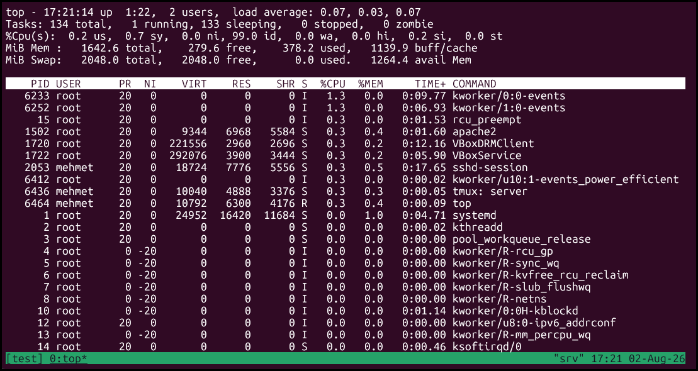

### **[بخش 04: سرفصل‌های کتاب](04-نصب_تی_ماکس_به_روش_های_مختلف.md)**


### اجرا کردن tmux

اجرا کردن tmux به همین سادگی است که در یک پنجره‌ی ترمینال بنویسید:


``` bash
$ tmux
```


چیزی شبیه به آنچه در شکل زیر، «نشست جدید tmux»، دیده می‌شود، روی صفحه ظاهر می‌شود. این یک «نشست» tmux است، و دقیقاً مانند نشست عادی ترمینال کار می‌کند. می‌توانید هر دستور ترمینالی که بخواهید اجرا کنید و همه‌چیز همان‌طور که انتظار دارید عمل می‌کند.


برای بستن نشست tmux، کافی است این را بنویسید:

``` bash
$ exit
```

در همان نشست. این کار tmux را می‌بندد و شما را به ترمینال معمولی (حالت عادی) بازمی‌گرداند.

این بهترین روش برای کار کردن با نشست‌ها در tmux نیست. می‌توان «نشست‌های اسم‌دار» ساخت که بعداً بتوان به آن‌ها وصل شد و آنها را شناسایی کرد.

### ساختن نشست‌های اسم‌دار

در واقع می‌توان چندین نشست را هم‌زمان روی یک کامپیوتر داشت، و لازم است بتوان آن‌ها را منظم نگه داشت. این کار با دادن یک اسم منحصربه‌فرد به هر نشستی که ساخته می‌شود انجام می‌گیرد. بیایید همین حالا یک نشست اسم‌دار به نام ```basic``` بسازیم:


### `$ tmux new-session -s basic`

می‌توان این دستور را کوتاه‌تر کرد به:

### `$ tmux new -s basic`

ما در ادامه کتاب  معمولا از فرم ساده‌شده آن استفاده می‌کنیم.

وقتی این دستور را وارد کنید، به یک نشست کاملاً جدید tmux وارد می‌شوید، اما چیز خاص یا متفاوتی نسبت به حالت عادی احساس نمی‌کنید. اگر exit را بزنید، دقیقاً به همان ترمینال بازمی‌گردید.

معمولا شورتکات‌های tmux با ```Ctrl+B``` شروع می‌شوند.
از آن‌جا که برنامه‌های ما درون tmux در حال اجرا هستند، به راهی نیاز داریم تا به tmux بگوییم دستوری که وارد می‌کنیم مخصوص خود tmux است، نه برنامه‌ی زیرین. ترکیب ```Ctrl+B```  دقیقاً همین کار را انجام می‌دهد.

## کار با TMUX
در tmux نشست جدیدی به نام test ایجاد می‌کنیم.
### `$ tmux new -s test`
درون tmux باز شده برنامه‌ای به نام top را اجرا می‌کنیم که مصرف حافظه و پردازنده را نشان می‌دهد:

### `$ top`

اکنون چیزی شبیه به شکل زیر، «دستور top در حال اجرا در tmux»، در ترمینال در حال اجراست. حالا می‌توانیم با فشار دادن ```Ctrl+B```  و سپس ```d```، از نشست tmux جدا شویم (detach). این کار ما را به همان خط فرمان عادی ترمینال بازمی‌گرداند. کمی بعد یاد می‌گیریم چگونه دوباره به آن نشست بازگردیم.



### پیشوند فرمان


وقتی خواستیم از نشست tmux جدا شویم، ابتدا ```Ctrl+B``` را فشار دادیم، و سپس ```d``` را برای «detach» (جدا شدن). لازم است هر دستور tmux را با همین ترکیب کلید آغاز کنیم، و مهم است بدانیم این کلیدها را با هم پایین نگه نمی‌داریم، بلکه ابتدا ```Ctrl``` و ```B``` را هم‌زمان فشار می‌دهیم، رهایشان می‌کنیم، و سپس بلافاصله کلید مربوط به دستوری که می‌خواهیم به tmux بفرستیم را فشار می‌دهیم.


حالا بیایید یاد بگیریم چگونه به آن نشست tmux که رهایش کردیم بازگردیم. اما پیش از آن، پنجره‌ی ترمینال خود را ببندید.

### بازگشت به نشست‌های موجود

یک نشست tmux راه‌اندازی کردیم، یک برنامه در آن اجرا کردیم، از آن جدا شدیم، و پنجره‌ی ترمینال خود را بستیم، اما نشست tmux همچنان در حال کار است، همراه با برنامه‌ی top که اجرا کرده بودیم.

می‌توان فهرست نشست‌های موجود tmux را با این دستور مشاهده کرد:

### `$ tmux list-sessions`

در یک پنجره‌ی ترمینال جدید. می‌توان این دستور را کوتاه‌تر کرد به:

### `$ tmux ls`

این دستور نشان می‌دهد که در حال حاضر یک نشست در حال اجرا داریم:

```
test: 1 windows (created Sun Aug  2 17:20:40 2026)
```


### از بین بردن نشست‌ها

می‌توان در یک نشست exit را زد تا نابود شود، اما می‌توان با دستور kill-session هم نشست‌ها را بست.

### `$ tmux kill-session -t test`


این کار برای مواقعی که یک برنامه در نشستی هنگ کرده است، مفید است.

اگر دوباره فهرست نشست‌ها را بگیریم، این پیام را دریافت می‌کنیم:

### `$ tmux ls`

```
no server running on /tmp/tmux-1000/default
```

از آن‌جا که هیچ نشست tmux ای در حال اجرا نیست، خود tmux هم اجرا نمی‌شود، پس نمی‌تواند به این درخواست پاسخ دهد.

اکنون که با اصول ساختن و کار کردن با نشست‌ها آشنا شدید، بیایید ببینیم چگونه می‌توان با چند برنامه درون یک نشست کار کرد.

### اتصال به نشست‌های از پیش درست شده

اگر دستور ```tmux ls``` را زدیم شماره نشستی به ما در خروجی باز گرداند، می‌توان به آن نشست متصل شد، با دستور 
### ```$ tmux attach -t <number>```

مثال:

```bash
$ tmux ls
0: 2 windows (created Sun Aug  2 18:26:58 2026)
$ tmux attach -t 0
```
یا حتی اگر هنگام شروع نامی برای نشست خود داده باشید به جای number می‌توانید اسم نشست تان را وارد کنید. یعنی:

```bash
$ tmux new -s test
[detached (from session test)]
$ tmux ls
test: 1 windows (created Sun Aug  2 18:47:42 2026)
$ tmux attach -t test
```

#### کاربرد فوق العاده این مورد

یکی از کاربرد‌های خوب وصل شدن به یک نشست، mirror کردن کار‌ها بین چند نفر است، سناریویی در نظر بگیرید که می‌خواهید به 3 نفر به صورت لایو نشان دهید که در ترمینال برای کانفیگ کردن سرویس (یا هر چیز دیگری) چه‌کار می‌کنید. برای این‌کار یک نشست درست می‌کنید، به آن 3 نفر می‌گویید به سرور از طریق ```SSH``` یا هر پروتکل دیگری متصل شوند و به نشست شما attach شوند، حال هر دستوری که یکی از 4 نفر در آن نشست وارد کنند، برای 3 نفر دیگر هم mirror می‌شود.

نکته: فقط برای این مورد حواستان به یکسان بودن رزلوشن‌های کامپیوتر (ابعاد صفحه ترمینال‌)تان باشد.

### کار کردن با پنجره‌ها

اجرای چندین دستور به‌طور هم‌زمان درون یک نشست tmux، هم ممکن است و هم بسیار رایج. می‌توان این‌ها را با پنجره‌ها (window) منظم نگه داشت، که شبیه به تب‌ها در ترمینال‌امولاتورهای گرافیکی مدرن یا مرورگرهای وب هستند.

وقتی نشست جدیدی از tmux ساخته می‌شود، محیط یک پنجره‌ی اولیه برای ما آماده می‌کند. می‌توان هر تعداد پنجره که خواسته شود ساخت، و وقتی از نشست جدا شده و دوباره متصل شویم، همه‌ی آن‌ها سر جای خود باقی می‌مانند.

بیایید نشست جدیدی بسازیم که دو پنجره داشته باشد. پنجره‌ی اول همان خط فرمان معمولی را دارد، و پنجره‌ی دوم دستور top را اجرا می‌کند. یک نشست اسم‌دار به نام «windows» می‌سازیم، به این شکل:

### `$ tmux new -s windows -n shell`

با استفاده از فلگ -n، به tmux می‌گوییم اسمی برای پنجره‌ی اول در نظر بگیرد تا شناسایی آن آسان‌تر شود.

حالا بیایید یک پنجره به این نشست اضافه کنیم.

### ساختن و اسم‌گذاری پنجره‌ها

برای ساختن پنجره‌ای در نشست فعلی، کافی است ```Ctrl+B```  و ```c``` را فشار دهیم. این کار به‌طور خودکار فوکوس را به پنجره‌ی جدید منتقل می‌کند. از این‌جا می‌توان برنامه‌ی دیگری را اجرا کرد. بیایید top را در این پنجره‌ی جدید اجرا کنیم.

### `$ top`

پنجره‌ی اول ما اسمی که خودمان تعیین کرده‌ایم، یعنی «shell»، را دارد، اما پنجره‌ی دوم اکنون اسمش «bash» شده است. اسم این پنجره بر اساس برنامه‌ای که هم‌اکنون در حال اجراست تغییر می‌کند، زیرا هنگام ساختن آن، اسم پیش‌فرضی برایش تعیین نشده بود. بیایید اسم مناسبی روی آن بگذاریم.

برای تغییر اسم پنجره‌ای، ```Ctrl+B``` را می‌زنیم و سپس , (کاما یا ویرگول)، و نوار وضعیت (status bar) تغییر می‌کند و به رنگ نارنجی در می‌آید و می‌توان اسم پنجره‌ی فعلی را عوض کرد. حالا اسم این پنجره را به «Processes» تغییر دهید.

می‌توان هر تعداد پنجره که خواسته شود درون یک نشست tmux ساخت. اما وقتی بیش از یک پنجره داشته باشیم، لازم است بتوان بین آن‌ها جابه‌جا شد.

### جابه‌جایی بین پنجره‌ها

دو پنجره در محیط خود ساختیم، و می‌توان به چند روش بین پنجره‌ها جابه‌جا شد. وقتی فقط دو پنجره داریم، می‌توان به‌سرعت با ```Ctrl+B``` و n، بین آن‌ها جابه‌جا شد. این کار به‌سادگی بین پنجره‌های باز می‌چرخد. چون در حال حاضر فقط دو پنجره داریم، این کار صرفاً بین آن‌ها سوییچ می‌کند.

می‌توان از ```Ctrl+B``` و p نیز استفاده کرد تا به پنجره‌ی قبلی رفت.
پس ```Ctrl+B``` و n به بنچره بعدی می‌رود و ```Ctrl+B``` و p به پنجره قبلی می‌رود.

#### جابه‌جایی بین پنجره‌ها با شماره آنها
به‌طور پیش‌فرض، پنجره‌های tmux هر کدام شماره‌ای دارند که از ۰ آغاز می‌شود. می‌توان به‌سرعت با ```Ctrl+B``` و  0 به پنجره‌ی اول رفت، و با ```Ctrl+B``` و  1 به پنجره‌ی دوم.

اگر بیش از نه پنجره داشته باشیم، می‌توان به‌سادگی از ```Ctrl+B``` و  f برای یافتن پنجره‌ای با اسمش استفاده کرد (اگر اسم‌گذاری شده باشند)، یا از ```Ctrl+B``` و  w برای نمایش فهرستی تصویری از پنجره‌ها تا هر کدام که خواستیم انتخاب شود. ```Ctrl+B``` و s هم همینکار را می‌کند.

از این‌جا، می‌توان به ساختن پنجره‌های جدید و اجرا کردن برنامه‌ها ادامه داد. وقتی از نشست جدا شده و بعداً دوباره متصل شویم، همه‌ی پنجره‌ها دقیقاً همان‌جایی هستند که رها شده بودند.

برای بستن پنجره‌ای، می‌توان یا «exit» را در خط فرمان همان پنجره وارد کرد، یا از ```Ctrl+B``` و & استفاده کرد، که پیام تأییدی در نوار وضعیت نشان می‌دهد پیش از آن‌که پنجره بسته شود. اگر تأیید کنیم، پنجره‌ی قبلی به فوکوس بازمی‌گردد. برای بستن کامل یک نشست tmux، باید همه‌ی پنجره‌های آن بسته شوند.

ساختن پنجره کار خوبی است، اما می‌توان tmux را با تقسیم کردن یک پنجره به چند پنل، حتی مفیدتر هم کرد.

### ۱.۵ کار کردن با پنل‌ها

داشتن برنامه‌ها در پنجره‌های جدا برای مواردی که اهمیت چندانی ندارند از جلوی چشم دور باشند، خوب است. اما با tmux، می‌توان یک نشست را به چند پنل (pane) تقسیم کرد.

بیایید نشست جدیدی از tmux به نام «panes» بسازیم تا با نحوه‌ی کار کردن پنل‌ها آشنا شویم.

### `$ tmux new -s panes`

می‌توان پنجره‌ها را به‌صورت عمودی یا افقی تقسیم کرد. 
در نشست  ```Ctrl+B``` و  % را فشار دهید، و پنجره از وسط نصف می‌شود و نشست دومی در پنل جدید آغاز می‌شود. علاوه بر این، فوکوس نیز به این پنل جدید منتقل می‌شود. با فشردن ```Ctrl+B``` و  " (علامت نقل‌قول دوتایی)، این پنل جدید به‌صورت افقی نیز نصف می‌شود. به‌طور پیش‌فرض، پنل‌های جدید، پنل موجود را به‌طور مساوی نصف می‌کنند.

برای چرخیدن بین پنل‌ها، ```Ctrl+B``` و  o را فشار دهید. همچنین می‌توان از ```Ctrl+B``` و سپس کلیدهای بالا، پایین، چپ یا راست نیز برای جابه‌جایی بین پنل‌ها استفاده کرد.

با تنها چند کلید، پنجره‌ای را به محیط کاری‌ای با چند پنل تبدیل کردیم. بیایید ببینیم چگونه می‌توان این پنل‌ها را با استفاده از چیدمان‌ها (layout) دوباره مرتب کرد.

### چیدمان پنل‌ها

اگر بخواهید ابعاد پنل‌ها را نسبت به یکدیگر تغییر دهید، می‌توان از کلید‌های ```Ctrl+B``` و ```Ctrl+arrow``` استفاده کنید که ```arrow``` یکی از کلید‌های بالا، پایین، چپ یا راست است.

### زوم کردن روی پنل خاص

اگر در پنجره‌ای چند پنل دارید و هنگام کار با آن پنل به خصوص، احساس کمبود فضا (!) کردید، می‌توانید با ```Ctrl+B``` و ```z``` آن پنل خاص خود را زوم کنید و به صورت تمام صفحه از فقط آن پنل استفاده کنید.
برای بازگشت به حالت قبل مجدد کلید ```Ctrl+B``` و ```z``` را فشار دهید.


### فایل‌های بزرگ

برای دیدن فایل‌های بزرگ در tmux دیگر نمی‌توانید  با موس (یا هر روش دیگری که قبلا استفاده می‌کردید!) اسکرول کنید، بلکه باید شورتکات ```Ctrl+B``` و سپس با کلیدهای ```page up``` و ```page down``` به ترتیب به بالا و پایین اسکرول کنید.

در همان مد اگر کلید‌های ```Ctrl+s``` را بفشارید می‌توانید دنبال الگویی خاص سرچ کنید.
### کار کردن با حالت فرمان (Command Mode)

تا این‌جا، از ترکیب کلیدها برای ساختن پنجره و پنل استفاده کردیم، اما این کلیدهای میان‌بر در واقع تنها راه‌های کوتاه‌شده‌ای برای دستورات tmux هستند که مجموعه‌ای از تنظیمات از پیش تعیین‌شده دارند. می‌توان دستورات tmux را به دو روش اجرا کرد: از خود ترمینال، یا از «ناحیه‌ی فرمان» در نوار وضعیت tmux.

برای ورود به حالت فرمان، از درون یک نشست فعال  ```Ctrl+B``` و  : (دونقطه) را فشار دهید. رنگ نوار وضعیت تغییر می‌کند و خط فرمانی نشان داده می‌شود که می‌توان دستور را در آن تایپ کرد. بیایید با استفاده از دستور new-window پنجره‌ی جدیدی بسازیم، به این شکل:

### new-window

می‌توان با فلگ -n نامی هم برای پنجره جدید انتخاب کنید.
### new-window -n console

بیایید یک قدم فراتر برویم و پنجره‌ای جدید باز کنیم که برنامه‌ی top را اجرا می‌کند. برای این کار، وارد حالت فرمان می‌شویم و این دستور را وارد می‌کنیم:

### new-window -n processes "top"

وقتی ENTER را فشار می‌دهیم، پنجره‌ی جدیدمان ظاهر می‌شود و برنامه‌ی top را می‌بینیم که در حال اجراست و پردازش‌های در حال اجرا را نشان می‌دهد.

مشخص کردن یک دستور اولیه برای پنجره‌ای، برای کارهای کوتاه‌مدت بسیار به‌کار می‌آید، اما اگر از برنامه‌ی top با فشردن q خارج شویم، پنجره‌ی tmux ای که ساخته‌ایم نیز بسته می‌شود. می‌توان از تنظیمات پیکربندی برای دور زدن این مشکل استفاده کرد، اما اگر بخواهیم پنجره باز بماند، کافی است بدون مشخص کردن دستور اولیه بسازیمش، و سپس خودمان دستور موردنظر را در پنجره‌ی جدید اجرا کنیم.

می‌توان از حالت فرمان برای ساختن پنجره‌های جدید، پنل‌های جدید، یا نشست‌های جدید استفاده کرد، یا حتی تنظیمات محیطی دیگری را نیز تعیین کرد. در فصل ۲، «پیکربندی tmux»، چند میان‌بر سفارشی می‌سازیم تا استفاده از این دستورات ساده‌تر شود.


در این فصل، استفاده‌ی بسیار پایه‌ای از نشست‌ها، پنل‌ها، پنجره‌ها و دستورات tmux را پوشش دادیم، اما چیزهای بسیار دیگری هم هست که می‌توان بررسی کرد.

با فشردن  ```Ctrl+B``` و ?، می‌توانید فهرست همه‌ی کلیدهای میان‌بر از پیش تعریف‌شده‌ی tmux و دستوراتی که باعث اجرای آن‌ها می‌شوند را مشاهده کنید.

هنگام کار با tmux، به این فکر کنید که چگونه می‌توان محیط‌های متفاوتی برای کارتان ساخت. اگر در حال پایش سرورها هستید، می‌توانید از پنل‌های tmux برای ساختن داشبوردی استفاده کنید که اسکریپت‌های پایش و فایل‌های لاگ گوناگونتان را نشان دهد.

اکنون که با اصول اولیه آشنا شدیم، بیایید پیکربندی سفارشی‌ای بسازیم که در ادامه‌ی کار خود از آن استفاده کنیم.

## خلاصه  

### ساختن نشست‌ها

| دستور | توضیح |
|---|---|
| tmux new-session | نشست جدیدی بدون اسم می‌سازد. می‌توان آن را کوتاه‌تر کرد به tmux new یا فقط tmux. |
| tmux new -s development | نشستی به اسم «development» می‌سازد. |
| tmux new -s development -n editor | نشستی به اسم «development» می‌سازد و پنجره‌ی اول آن را «editor» نام‌گذاری می‌کند. |
| tmux attach -t development | به نشستی به اسم «development» متصل می‌شود. |

### دستورات پیش‌فرض برای نشست‌ها، پنجره‌ها و پنل‌ها

| دستور | توضیح |
|---|---|
|  ```Ctrl+B``` و d | از نشست جدا می‌شود، درحالی‌که نشست در پس‌زمینه به کار خود ادامه می‌دهد. |
| ```Ctrl+B``` و  : | وارد حالت فرمان می‌شود. |
| ```Ctrl+B``` و  c | از درون نشست فعال tmux پنجره‌ای جدید می‌سازد. میان‌بر دستور new-window. |
| ```Ctrl+B``` و  0…9 | پنجره‌ها را با شماره انتخاب می‌کند. |
| ```Ctrl+B``` و  w | فهرستی قابل‌انتخاب از پنجره‌های نشست فعلی نشان می‌دهد. |
| ```Ctrl+B``` و  t | در پنل فعلی زمان را نشان می‌دهد. پس از زدن هر کلید می‌رود |
| ```Ctrl+B``` و  z | فقط پنل فعلی را زوم می‌کند و به شما نشان می‌دهد، اگر دوباره بزنید از زوم خارج می‌شود.|
| ```Ctrl+B``` و  , | خط فرمانی برای تغییر اسم پنجره نشان می‌دهد. |
| ```Ctrl+B``` و  & | پنجره‌ی فعلی را پس از تأیید می‌بندد. |
| ```Ctrl+B``` و  % | پنجره‌ی فعلی را به‌صورت عمودی نصف می‌کند. |
| ```Ctrl+B``` و  " | پنجره‌ی فعلی را به‌صورت افقی نصف می‌کند. |
| ```Ctrl+B``` و  o | بین پنل‌های باز می‌چرخد. |
| ```Ctrl+B``` و  q | برای لحظه‌ای شماره‌ی هر پنل را نشان می‌دهد. |
| ```Ctrl+B``` و  x | پنل فعلی را پس از تأیید می‌بندد. |
| ```Ctrl+B``` و  SPACE | بین چیدمان‌های مختلف پنل می‌چرخد. |


#
# پایان
# Mehmet Lotfi
